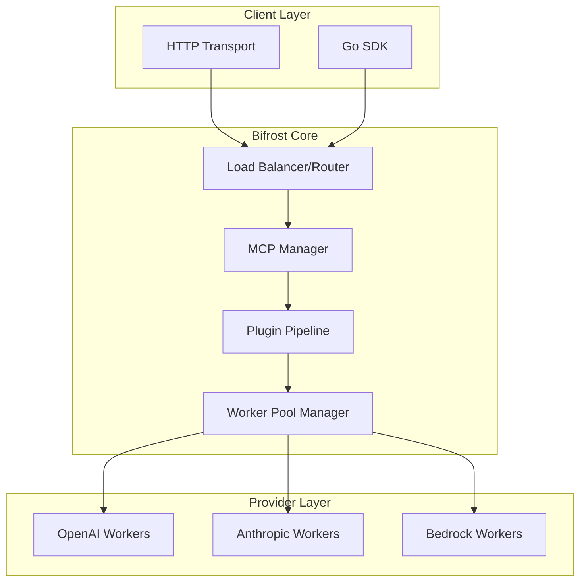

# 🏗️ Bifrost Architecture

Comprehensive documentation of Bifrost's system architecture, designed for **10,000+ RPS** throughput with advanced concurrency management and memory optimization.

## 📑 Quick Navigation

| Document                                    | Description                                 | Key Topics                                              |
| ------------------------------------------- | ------------------------------------------- | ------------------------------------------------------- |
| **[System Overview](system-overview.md)**   | High-level architecture & design principles | Core components, request flow, plugin system            |
| **[Request Flow](request-flow.md)**         | Request processing pipeline                 | Worker pools, memory management, error handling         |
| **[Performance](performance.md)**           | Benchmarks & optimization strategies        | Throughput metrics, latency optimization, scalability   |
| **[Concurrency](concurrency.md)**           | Worker pools & threading model              | Channel management, goroutine pools, resource isolation |
| **[Design Decisions](design-decisions.md)** | Architecture rationale & trade-offs         | Why we built it this way, alternatives considered       |

---

## 🚀 Quick Start

### For System Administrators

- Start with **[System Overview](system-overview.md)** for deployment architecture
- Review **[Performance](performance.md)** for scaling considerations
- Check **[Concurrency](concurrency.md)** for tuning parameters

### For Developers

- Read **[Request Flow](request-flow.md)** to understand processing pipeline
- Study **[Design Decisions](design-decisions.md)** for implementation rationale
- Reference **[System Overview](system-overview.md)** for component interactions

### For Platform Engineers

- Begin with **[Performance](performance.md)** for capacity planning
- Review **[Concurrency](concurrency.md)** for resource allocation
- Check **[System Overview](system-overview.md)** for integration points

---

## 🏗️ Architecture Highlights

### **High-Performance Design**

- **Asynchronous request processing** with channel-based worker pools
- **Memory pool management** to minimize garbage collection
- **Provider isolation** with dedicated resource management

### **Scalability Features**

- **Horizontal scaling** with stateless architecture
- **Connection pooling** for optimal resource utilization
- **Request queuing** with configurable buffer sizes

### **Reliability Patterns**

- **Circuit breaker** patterns for provider failures
- **Fallback systems** across multiple providers
- **Graceful degradation** under high load

---

## 📋 Architecture Quick Reference

### **Core Components**

### **Key Performance Metrics**

- **Throughput**: 10,000+ RPS sustained
- **Latency**: Sub-100ms P95 processing overhead
- **Memory**: Optimized object pooling with minimal GC pressure
- **Concurrency**: Configurable worker pools per provider

---

## 🔗 Related Documentation

- **[Configuration Guide](../configuration/README.md)** - System configuration options
- **[Features Overview](../features/README.md)** - All available features
- **[API Reference](../usage/README.md)** - Complete API documentation
- **[Performance Tuning](../guides/tutorials/production-setup.md)** - Production optimization guide

---

**⚡ Ready to dive deeper?** Start with [System Overview](system-overview.md) for the complete architectural picture.
