# Concurrency Architecture

Bifrost's concurrency model is designed for high-throughput scenarios with intelligent resource management, featuring isolated worker pools per provider and sophisticated memory pooling strategies.

## 🏗️ Concurrency Overview

**Core Concurrency Features:**

- 🔄 **Isolated Worker Pools** per AI provider
- ⚡ **Object Pooling** for memory efficiency
- 🎯 **Configurable Concurrency** levels
- 📊 **Intelligent Queue Management**
- 🛡️ **Resource Isolation** between providers
- 🔧 **Dynamic Scaling** capabilities

---

## 🔧 Worker Pool Architecture

### Provider Isolation Model

Each AI provider operates with its own isolated worker pool system to ensure one provider's performance doesn't impact others:


### Worker Pool Characteristics

| Component        | Purpose                     | Default         | Configurable |
| ---------------- | --------------------------- | --------------- | ------------ |
| **Worker Count** | Parallel request processors | 10 per provider | ✅ Yes       |
| **Queue Buffer** | Request buffering capacity  | 100 requests    | ✅ Yes       |
| **Channel Size** | Internal communication      | 1000 messages   | ✅ Yes       |
| **Isolation**    | Provider independence       | Always enabled  | ❌ No        |

---

## 🧠 Memory Management & Object Pooling

### Object Pooling Strategy

Bifrost uses sophisticated object pooling to minimize garbage collection impact:


### Pool Configuration Impact

| Pool Size        | Memory Usage | Allocation Rate | GC Pressure | Best For    |
| ---------------- | ------------ | --------------- | ----------- | ----------- |
| **Small (1K)**   | Low          | High            | High        | Development |
| **Medium (10K)** | Medium       | Medium          | Medium      | Production  |
| **Large (25K)**  | High         | Low             | Low         | High-load   |

---

## ⚙️ Concurrency Configuration

### Provider-Level Concurrency

<details>
<summary><strong>🔧 Go Package Usage</strong></summary>

#### Basic Concurrency Configuration

```go
package main

import (
    "github.com/maximhq/bifrost/core"
    "github.com/maximhq/bifrost/core/schemas"
)

func configureConcurrency() {
    config := schemas.BifrostConfig{
        Account: &myAccount,

        // Global memory settings
        InitialPoolSize:    10000,  // Object pool size
        DropExcessRequests: false,  // Queue vs. drop strategy

        Providers: map[string]schemas.ProviderConfig{
            "openai": {
                Keys: []schemas.Key{{
                    Value:  "your-openai-key",
                    Models: []string{"gpt-4o-mini"},
                    Weight: 1.0,
                }},
                // Provider-specific concurrency
                ConcurrencyAndBufferSize: &schemas.ConcurrencyAndBufferSize{
                    Concurrency: 15,   // 15 workers for OpenAI
                    BufferSize:  200,   // 200 request buffer
                },
            },
            "anthropic": {
                Keys: []schemas.Key{{
                    Value:  "your-anthropic-key",
                    Models: []string{"claude-3-sonnet-20240229"},
                    Weight: 1.0,
                }},
                ConcurrencyAndBufferSize: &schemas.ConcurrencyAndBufferSize{
                    Concurrency: 10,   // 10 workers for Anthropic
                    BufferSize:  150,   // 150 request buffer
                },
            },
        },
    }

    client, err := bifrost.Init(config)
    if err != nil {
        panic(err)
    }
    defer client.Cleanup()
}
```

#### High-Concurrency Setup

```go
func highConcurrencySetup() {
    config := schemas.BifrostConfig{
        Account: &myAccount,

        // Optimize for high concurrency
        InitialPoolSize:    25000,  // Large object pool
        DropExcessRequests: false,  // Queue all requests

        Providers: map[string]schemas.ProviderConfig{
            "openai": {
                Keys: []schemas.Key{
                    {Value: "key-1", Models: []string{"gpt-4o-mini"}, Weight: 0.6},
                    {Value: "key-2", Models: []string{"gpt-4o-mini"}, Weight: 0.4},
                },
                ConcurrencyAndBufferSize: &schemas.ConcurrencyAndBufferSize{
                    Concurrency: 25,   // High worker count
                    BufferSize:  500,   // Large buffer
                },
                NetworkConfig: &schemas.NetworkConfig{
                    Timeout: 30000,     // Shorter timeout
                    Retries: 2,         // Fewer retries
                },
            },
        },
    }

    client, _ := bifrost.Init(config)

    // Handle high concurrency requests
    handleConcurrentRequests(client)
}

func handleConcurrentRequests(client *bifrost.Client) {
    // Example: Process 100 concurrent requests
    const numRequests = 100
    results := make(chan schemas.ChatCompletionResponse, numRequests)
    errors := make(chan error, numRequests)

    for i := 0; i < numRequests; i++ {
        go func(requestID int) {
            response, err := client.ChatCompletion(schemas.ChatCompletionRequest{
                Provider: "openai",
                Model:    "gpt-4o-mini",
                Messages: []schemas.Message{{
                    Role:    "user",
                    Content: fmt.Sprintf("Request %d", requestID),
                }},
            })

            if err != nil {
                errors <- err
            } else {
                results <- response
            }
        }(i)
    }

    // Collect results
    for i := 0; i < numRequests; i++ {
        select {
        case result := <-results:
            log.Printf("Success: %s", result.Data.Choices[0].Message.Content)
        case err := <-errors:
            log.Printf("Error: %v", err)
        }
    }
}
```

</details>

<details>
<summary><strong>🌐 HTTP Transport Usage</strong></summary>

#### High-Concurrency Server Configuration

```json
{
  "providers": {
    "openai": {
      "keys": [
        {
          "value": "env.OPENAI_API_KEY_1",
          "models": ["gpt-4o-mini"],
          "weight": 0.6
        },
        {
          "value": "env.OPENAI_API_KEY_2",
          "models": ["gpt-4o-mini"],
          "weight": 0.4
        }
      ],
      "concurrency_and_buffer_size": {
        "concurrency": 25,
        "buffer_size": 500
      },
      "network_config": {
        "timeout": 30000,
        "retries": 2
      }
    },
    "anthropic": {
      "keys": [
        {
          "value": "env.ANTHROPIC_API_KEY",
          "models": ["claude-3-sonnet-20240229"],
          "weight": 1.0
        }
      ],
      "concurrency_and_buffer_size": {
        "concurrency": 20,
        "buffer_size": 400
      }
    }
  },
  "initial_pool_size": 25000,
  "drop_excess_requests": false
}
```

#### Server Startup with Concurrency Tuning

```bash
# High-concurrency server
bifrost-http \
  -config high-concurrency-config.json \
  -port 8080 \
  -pool-size 30000 \
  -drop-excess-requests=false

# Resource-constrained server
bifrost-http \
  -config efficient-config.json \
  -port 8080 \
  -pool-size 5000 \
  -drop-excess-requests=true
```

</details>

---

## 📊 Concurrency Patterns & Best Practices

### Request Queuing Strategies

| Strategy                                       | When to Use   | Pros            | Cons           |
| ---------------------------------------------- | ------------- | --------------- | -------------- |
| **Queue All** (`drop_excess_requests: false`)  | Stable load   | No request loss | Memory growth  |
| **Drop Excess** (`drop_excess_requests: true`) | Spiky load    | Memory bounded  | Request loss   |
| **Hybrid**                                     | Variable load | Adaptive        | Complex config |

### Worker Pool Sizing Guidelines

```mermaid
graph LR
    subgraph "Sizing Factors"
        RL[Rate Limits] --> |Constraint| Workers[Worker Count]
        CPU[CPU Cores] --> |Resource| Workers
        Memory[Available Memory] --> |Resource| Workers
        Latency[Target Latency] --> |Requirement| Workers
    end

    subgraph "Recommendations"
        Workers --> |Provider Rate Limit ÷ 2| Conservative[Conservative]
        Workers --> |CPU Cores × 2-4| Balanced[Balanced]
        Workers --> |Rate Limit × 0.8| Aggressive[Aggressive]
    end
```



---

_For related topics, see [Performance Optimization](performance.md) and [Memory Management](../features/memory-management.md)._
