# Design Decisions & Architecture Rationale

This document explains the key architectural decisions behind Bifrost's design, the rationale for these choices, and the trade-offs considered during development.

## 🎯 Core Design Principles

**Guiding Principles:**

- 🔄 **Provider Agnostic**: Uniform interface across all AI providers
- ⚡ **Performance First**: Minimal overhead with maximum throughput
- 🛡️ **Reliability**: Built-in fallbacks and error recovery
- 🔧 **Simplicity**: Easy integration with existing applications
- 📊 **Observability**: Comprehensive monitoring and metrics
- 🚀 **Scalability**: Linear scaling with hardware resources

---

## 🏗️ Architectural Decisions

### 1. Provider Isolation Architecture

**Decision**: Each AI provider operates with isolated worker pools and queues.

**Rationale:**

- **Performance Isolation**: One provider's issues don't affect others
- **Resource Control**: Independent rate limiting and concurrency control
- **Configuration Flexibility**: Provider-specific optimizations
- **Failure Isolation**: Provider failures remain contained

**Alternative Considered**: Shared worker pool across providers
**Why Rejected**: Would create resource contention and cascade failures

```mermaid
graph TB
    subgraph "Chosen: Isolated Pools"
        P1[Provider 1<br/>Pool & Queue]
        P2[Provider 2<br/>Pool & Queue]
        P3[Provider 3<br/>Pool & Queue]
    end

    subgraph "Rejected: Shared Pool"
        SP[Shared Pool]
        Q1[Queue 1]
        Q2[Queue 2]
        Q3[Queue 3]
    end

    P1 -.->|✅ Independent| API1[API 1]
    P2 -.->|✅ Independent| API2[API 2]
    P3 -.->|✅ Independent| API3[API 3]

    SP -.->|❌ Contention| Q1
    SP -.->|❌ Contention| Q2
    SP -.->|❌ Contention| Q3
```



### 2. Object Pooling Strategy

**Decision**: Aggressive object pooling for channels, messages, and responses.

**Rationale:**

- **GC Pressure Reduction**: Minimizes garbage collection impact
- **Memory Efficiency**: Reuses allocated objects
- **Predictable Performance**: Consistent latency characteristics
- **High Throughput**: Reduces allocation overhead

**Trade-offs:**

- ✅ **Pro**: Dramatic performance improvement (81% overhead reduction)
- ⚠️ **Con**: Higher baseline memory usage
- ⚠️ **Con**: More complex memory management

```go
// Chosen approach: Object pooling
type ObjectPool struct {
    channelPool  sync.Pool
    messagePool  sync.Pool
    responsePool sync.Pool
}

// Alternative: Direct allocation (rejected)
// Higher latency, more GC pressure
```

### 3. Fallback Chain Design

**Decision**: Sequential fallback execution with independent configuration.

**Rationale:**

- **Predictable Behavior**: Clear fallback order and logic
- **Configuration Simplicity**: Each fallback has independent settings
- **Error Transparency**: Detailed error reporting from each attempt
- **Flexibility**: Different models/providers per fallback step

**Alternative Considered**: Parallel fallback execution
**Why Rejected**: Would waste API calls and increase costs


### 4. Unified Request/Response Schema

**Decision**: Single schema supporting all provider features with optional fields.

**Rationale:**

- **Developer Experience**: Consistent interface across providers
- **Feature Parity**: Access to all provider capabilities
- **Migration Ease**: Switch providers without code changes
- **Type Safety**: Strong typing for better error catching

**Trade-offs:**

- ✅ **Pro**: Excellent developer experience
- ✅ **Pro**: Provider-agnostic application code
- ⚠️ **Con**: Some provider-specific features require optional fields

```go
// Unified schema approach
type ChatCompletionRequest struct {
    Provider string         `json:"provider"`
    Model    string         `json:"model"`
    Messages []Message      `json:"messages"`

    // Optional provider-specific features
    Params        map[string]interface{} `json:"params,omitempty"`
    ProviderMeta  map[string]interface{} `json:"provider_meta,omitempty"`
    Fallbacks     []FallbackConfig       `json:"fallbacks,omitempty"`
}
```

### 5. Configuration-First Approach

**Decision**: JSON configuration files with environment variable support.

**Rationale:**

- **Security**: Keep API keys out of code
- **Environment Flexibility**: Different configs per deployment
- **Operational Control**: Non-developers can manage keys
- **Version Control Safety**: Exclude sensitive data from repos

**Implementation Details:**

```json
{
  "providers": {
    "openai": {
      "keys": [{ "value": "env.OPENAI_API_KEY", "weight": 1.0 }]
    }
  }
}
```

### 6. HTTP Transport vs. Go Package Dual Architecture

**Decision**: Maintain both HTTP transport and Go package interfaces.

**Rationale:**

- **Language Flexibility**: Support non-Go applications via HTTP
- **Deployment Options**: Standalone service or embedded library
- **Performance Optimization**: Go package for maximum performance
- **Integration Ease**: HTTP for quick API-compatible integration

**Implementation Strategy:**

- Shared core logic between both interfaces
- HTTP transport wraps Go package functionality
- Consistent configuration and behavior

---

## ⚖️ Trade-off Analysis

### Performance vs. Memory

| Aspect           | High Performance | Memory Efficient | Chosen Approach             |
| ---------------- | ---------------- | ---------------- | --------------------------- |
| **Pool Size**    | Large (25K+)     | Small (1K)       | Configurable (default: 10K) |
| **Memory Usage** | High baseline    | Low baseline     | Medium baseline             |
| **Latency**      | Ultra-low        | Higher           | Low                         |
| **Throughput**   | Maximum          | Limited          | High                        |

**Decision**: Configurable with sensible defaults, allowing optimization for specific use cases.

### Reliability vs. Complexity

| Feature              | Reliability Gain | Complexity Cost | Decision   |
| -------------------- | ---------------- | --------------- | ---------- |
| **Fallbacks**        | High             | Medium          | ✅ Include |
| **Retries**          | Medium           | Low             | ✅ Include |
| **Circuit Breakers** | High             | High            | ❌ Future  |
| **Health Checks**    | Medium           | Medium          | ✅ Include |

### Feature Completeness vs. Simplicity

**Chosen**: Comprehensive feature set with simple configuration

- ✅ **All Provider Features**: Support full provider capabilities
- ✅ **Simple Defaults**: Work out-of-the-box with minimal config
- ✅ **Advanced Tuning**: Power users can optimize extensively
- ✅ **Progressive Disclosure**: Basic → Advanced configuration layers

---

## 🔧 Implementation Decisions

### 1. Error Handling Strategy

**Decision**: Structured error types with detailed context.

```go
type BifrostError struct {
    Type         string                 `json:"type"`
    Code         string                 `json:"code"`
    Message      string                 `json:"message"`
    Details      map[string]interface{} `json:"details,omitempty"`
    ProviderInfo *ProviderErrorInfo     `json:"provider_info,omitempty"`
}
```

**Benefits:**

- **Debugging**: Rich error context for troubleshooting
- **Monitoring**: Structured errors for alerting
- **Recovery**: Error details enable intelligent retry logic

### 2. Key Management Design

**Decision**: Weighted key distribution with model-specific assignment.

**Rationale:**

- **Load Balancing**: Distribute load across multiple keys
- **Model Access**: Different keys for different models
- **Flexibility**: Adjust weights for capacity differences
- **Reliability**: Automatic failover to working keys

```go
type Key struct {
    Value  string   `json:"value"`
    Models []string `json:"models"`
    Weight float64  `json:"weight"`
}
```

### 3. Plugin Architecture

**Decision**: Pre/Post hook system with short-circuit capability.

**Benefits:**

- **Extensibility**: Custom logic injection points
- **Caching**: Short-circuit for cached responses
- **Monitoring**: Custom metrics and logging
- **Transformation**: Request/response modification

**Symmetric Execution**: PostHooks run in reverse order of PreHooks for proper cleanup.

### 4. MCP Integration Strategy

**Decision**: Client-side tool execution with server-side tool discovery.

**Rationale:**

- **Security**: Client controls tool execution
- **Flexibility**: Client can validate/modify tool calls
- **Performance**: Avoid server-side tool execution overhead
- **Compliance**: Client can implement authorization policies

---

## 🚀 Future-Proofing Decisions

### 1. Schema Extensibility

**Decision**: Use `interface{}` for provider-specific parameters.

**Benefits:**

- **New Features**: Support future provider capabilities
- **Backward Compatibility**: Existing code continues working
- **Provider Innovation**: Don't limit provider evolution

### 2. Transport Agnostic Core

**Decision**: Separate core logic from transport mechanisms.

**Benefits:**

- **Multiple Transports**: HTTP, gRPC, message queues
- **Testing**: Easy to unit test core logic
- **Reusability**: Core logic reused across transports

### 3. Metrics and Observability

**Decision**: Prometheus-first observability with extensible metrics.

**Benefits:**

- **Industry Standard**: Prometheus is widely adopted
- **Rich Metrics**: Comprehensive performance insights
- **Alerting**: Built-in support for monitoring systems
- **Custom Labels**: Application-specific metric dimensions

---

## 📊 Alternative Architectures Considered

### 1. Event-Driven Architecture

**Considered**: Message queue-based request processing

**Pros:**

- Horizontal scaling
- Durability
- Decoupling

**Cons:**

- Added complexity
- Latency overhead
- Infrastructure dependencies

**Decision**: **Rejected** - Synchronous model better for chat applications

### 2. Microservices Architecture

**Considered**: Separate service per provider

**Pros:**

- Provider isolation
- Independent scaling
- Technology diversity

**Cons:**

- Network overhead
- Configuration complexity
- Operational burden

**Decision**: **Rejected** - Single binary simplifies deployment

### 3. Plugin-Only Architecture

**Considered**: Everything as plugins, minimal core

**Pros:**

- Maximum flexibility
- Small core
- Community contributions

**Cons:**

- Configuration complexity
- Performance overhead
- Reliability concerns

**Decision**: **Rejected** - Core features should be built-in

---

## 🎯 Success Metrics

### Performance Targets (Achieved)

- ✅ **Sub-100μs Overhead**: 11-59μs achieved
- ✅ **5000+ RPS**: Sustained without failures
- ✅ **100% Success Rate**: Under high load
- ✅ **Linear Scaling**: With hardware resources

### Developer Experience Goals

- ✅ **5-Minute Setup**: From zero to working integration
- ✅ **Drop-in Replacement**: For existing provider SDKs
- ✅ **Rich Documentation**: Comprehensive guides and examples
- ✅ **Clear Error Messages**: Actionable error information

### Operational Excellence

- ✅ **Zero-Downtime Deployments**: Configuration hot-reload
- ✅ **Comprehensive Monitoring**: Built-in Prometheus metrics
- ✅ **Failure Recovery**: Automatic fallbacks and retries
- ✅ **Security First**: API key management and rotation

---

_These design decisions reflect careful consideration of real-world usage patterns, performance requirements, and operational needs. Each decision balances multiple factors to create a robust, performant, and developer-friendly AI gateway._
