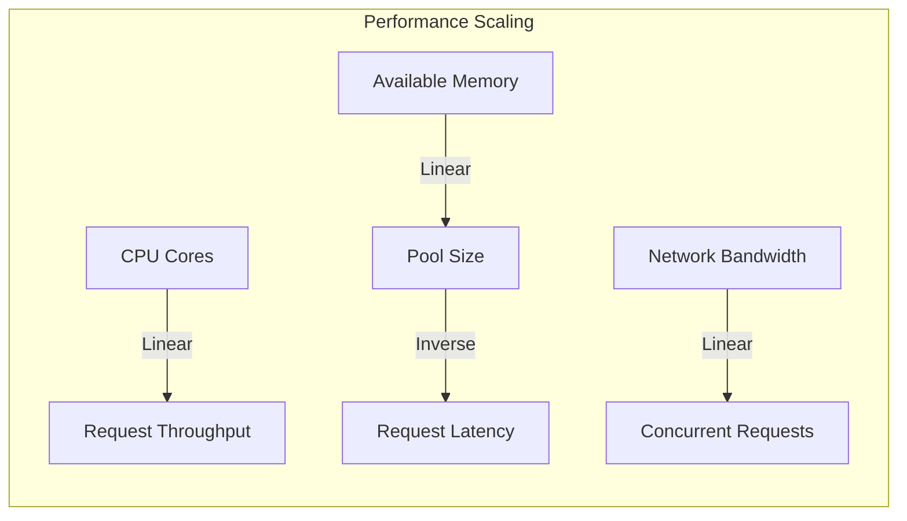

# Performance & Optimization

Bifrost delivers exceptional performance with minimal overhead, adding only **11-59μs per request** while providing enterprise-grade features like fallbacks, key rotation, and observability.

## 📊 Performance Overview

**Key Performance Highlights:**

- ✅ **100% Success Rate** under 5000 RPS sustained load
- ⚡ **Sub-microsecond overhead** on modern hardware
- 🔄 **Automatic optimization** through intelligent memory pooling
- 📈 **Linear scaling** with hardware resources
- 🎯 **Minimal latency addition** compared to direct provider calls

---

## 🧪 Benchmark Results

### Test Environment

| Environment   | Specifications    | Configuration                   |
| ------------- | ----------------- | ------------------------------- |
| **t3.medium** | 2 vCPUs, 4GB RAM  | Buffer: 15,000<br/>Pool: 10,000 |
| **t3.xlarge** | 4 vCPUs, 16GB RAM | Buffer: 20,000<br/>Pool: 15,000 |

**Test Conditions:**

- **Load:** 5,000 requests per second (RPS)
- **Duration:** Extended load test
- **Provider:** OpenAI GPT models
- **Network:** AWS EC2 with standard networking

### Performance Metrics

| Metric                    | t3.medium  | t3.xlarge  | Improvement    |
| ------------------------- | ---------- | ---------- | -------------- |
| **Success Rate**          | 100.00%    | 100.00%    | Maintained     |
| **Average Latency**       | 2.12s      | 1.61s      | 24% faster     |
| **Peak Memory Usage**     | 1312.79 MB | 3340.44 MB | -              |
| **Queue Wait Time**       | 47.13 µs   | 1.67 µs    | 96% faster     |
| **Key Selection Time**    | 16 ns      | 10 ns      | 37% faster     |
| **Message Formatting**    | 2.19 µs    | 2.11 µs    | 4% faster      |
| **JSON Marshaling**       | 63.47 µs   | 26.80 µs   | 58% faster     |
| **HTTP Request**          | 1.56s      | 1.50s      | 4% faster      |
| **Response Parsing**      | 11.30 ms   | 2.11 ms    | 81% faster     |
| **🎯 Bifrost's Overhead** | **59 µs**  | **11 µs**  | **81% faster** |

> **Note:** Bifrost's overhead excludes JSON marshalling and HTTP calls to LLM providers, which are required in any implementation.

---

## ⚡ Optimization Strategies

### Memory vs. Speed Tradeoff

Bifrost allows you to optimize the **memory vs. speed tradeoff**:

| Configuration Type   | Memory Usage | Processing Speed | Best For              |
| -------------------- | ------------ | ---------------- | --------------------- |
| **High Performance** | Higher       | Faster           | Production, high-load |
| **Memory Efficient** | Lower        | Slightly slower  | Resource-constrained  |
| **Balanced**         | Medium       | Good             | Most applications     |

### Configuration Recommendations

<details>
<summary><strong>🔧 Go Package Usage</strong></summary>

#### High-Performance Configuration

```go
package main

import (
    "github.com/maximhq/bifrost/core"
    "github.com/maximhq/bifrost/core/schemas"
)

func optimizedSetup() {
    // High-performance configuration
    config := schemas.BifrostConfig{
        Account: &myAccount,

        // Optimize for speed
        InitialPoolSize:    20000,  // Large pool for pre-allocation
        DropExcessRequests: false,  // Queue requests vs. drop

        // Provider-specific optimizations
        Providers: map[string]schemas.ProviderConfig{
            "openai": {
                Keys: []schemas.Key{{
                    Value:  "your-api-key",
                    Models: []string{"gpt-4o-mini"},
                    Weight: 1.0,
                }},
                ConcurrencyAndBufferSize: &schemas.ConcurrencyAndBufferSize{
                    Concurrency: 25,   // High concurrency
                    BufferSize:  300,   // Large buffer
                },
                NetworkConfig: &schemas.NetworkConfig{
                    Timeout: 60000,     // 60s timeout
                    Retries: 3,
                },
            },
        },
    }

    client, err := bifrost.Init(config)
    if err != nil {
        panic(err)
    }
    defer client.Cleanup()
}
```

#### Memory-Efficient Configuration

```go
func memoryEfficientSetup() {
    config := schemas.BifrostConfig{
        Account: &myAccount,

        // Optimize for memory
        InitialPoolSize:    1000,   // Smaller pool
        DropExcessRequests: true,   // Drop vs. queue

        // Conservative provider settings
        Providers: map[string]schemas.ProviderConfig{
            "openai": {
                Keys: []schemas.Key{{
                    Value:  "your-api-key",
                    Models: []string{"gpt-4o-mini"},
                    Weight: 1.0,
                }},
                ConcurrencyAndBufferSize: &schemas.ConcurrencyAndBufferSize{
                    Concurrency: 10,    // Conservative concurrency
                    BufferSize:  50,    // Smaller buffer
                },
            },
        },
    }

    client, err := bifrost.Init(config)
    // Handle configuration...
}
```

#### Performance Monitoring

```go
func monitorPerformance() {
    // Custom performance tracking
    type PerformanceMetrics struct {
        RequestCount    int64
        TotalLatency    time.Duration
        PoolUtilization float64
    }

    metrics := &PerformanceMetrics{}

    // Track request performance
    start := time.Now()
    response, err := client.ChatCompletion(schemas.ChatCompletionRequest{
        Provider: "openai",
        Model:    "gpt-4o-mini",
        Messages: []schemas.Message{{
            Role:    "user",
            Content: "Hello!",
        }},
    })
    latency := time.Since(start)

    // Update metrics
    atomic.AddInt64(&metrics.RequestCount, 1)
    metrics.TotalLatency += latency

    log.Printf("Request latency: %v", latency)
}
```

</details>

<details>
<summary><strong>🌐 HTTP Transport Usage</strong></summary>

#### High-Performance Server Configuration

```json
{
  "providers": {
    "openai": {
      "keys": [
        {
          "value": "env.OPENAI_API_KEY",
          "models": ["gpt-4o-mini", "gpt-4o"],
          "weight": 1.0
        }
      ],
      "concurrency_and_buffer_size": {
        "concurrency": 25,
        "buffer_size": 300
      },
      "network_config": {
        "timeout": 60000,
        "retries": 3
      }
    }
  },
  "initial_pool_size": 20000,
  "drop_excess_requests": false
}
```

#### Server Runtime Configuration

```bash
# High-performance server startup
bifrost-http \
  -config config.json \
  -port 8080 \
  -pool-size 25000 \
  -drop-excess-requests=false \
  -prometheus-labels team-id,service-id
```

#### Memory-Efficient Server

```json
{
  "providers": {
    "openai": {
      "keys": [
        {
          "value": "env.OPENAI_API_KEY",
          "models": ["gpt-4o-mini"],
          "weight": 1.0
        }
      ],
      "concurrency_and_buffer_size": {
        "concurrency": 10,
        "buffer_size": 50
      }
    }
  },
  "initial_pool_size": 1000,
  "drop_excess_requests": true
}
```

#### Performance Monitoring via HTTP

```bash
# Monitor Prometheus metrics
curl http://localhost:8080/metrics | grep bifrost

# Check health endpoint
curl http://localhost:8080/health

# Monitor specific metrics
curl -s http://localhost:8080/metrics | grep -E "(bifrost_upstream_requests_total|bifrost_upstream_latency_seconds)"
```

#### Load Testing

```bash
# High-load testing with wrk
wrk -t12 -c400 -d30s -s script.lua http://localhost:8080/v1/chat/completions

# script.lua content:
wrk.method = "POST"
wrk.body = '{"provider":"openai","model":"gpt-4o-mini","messages":[{"role":"user","content":"Hello!"}]}'
wrk.headers["Content-Type"] = "application/json"
```

</details>

---

## 🏗️ Hardware Recommendations

### Instance Sizing Guide

| Expected Load     | Recommended Instance | Buffer Size | Pool Size | Memory Usage |
| ----------------- | -------------------- | ----------- | --------- | ------------ |
| **< 1000 RPS**    | t3.medium            | 5,000       | 1,000     | ~2GB         |
| **1000-3000 RPS** | t3.large             | 10,000      | 5,000     | ~4GB         |
| **3000-5000 RPS** | t3.xlarge            | 20,000      | 15,000    | ~8GB         |
| **> 5000 RPS**    | c5.2xlarge+          | 30,000+     | 25,000+   | ~16GB+       |

### Resource Scaling Characteristics



---

## 📈 Performance Comparison

### Bifrost vs. Alternatives

| Solution            | Overhead    | Features    | Fallbacks   | Observability |
| ------------------- | ----------- | ----------- | ----------- | ------------- |
| **Bifrost**         | **11-59μs** | ✅ Complete | ✅ Advanced | ✅ Built-in   |
| **LiteLLM**         | ~2-5ms      | ✅ Good     | ✅ Basic    | ⚠️ Limited    |
| **Custom Gateway**  | Variable    | ⚠️ Manual   | ⚠️ Manual   | ⚠️ Manual     |
| **Direct Provider** | 0μs         | ❌ Single   | ❌ None     | ❌ None       |

### Performance Benefits

1. **Minimal Overhead**: Adds only microseconds while providing enterprise features
2. **Automatic Optimization**: Self-tuning memory pools and connection management
3. **Horizontal Scaling**: Linear performance improvement with hardware resources
4. **Built-in Monitoring**: Comprehensive metrics without external dependencies

---

## 🔍 Performance Monitoring

### Key Metrics to Track

<details>
<summary><strong>🔧 Go Package Metrics</strong></summary>

```go
package main

import (
    "context"
    "sync/atomic"
    "time"
)

type PerformanceTracker struct {
    requestCount     int64
    totalLatency     int64
    errorCount       int64
    poolUtilization  int64
}

func (p *PerformanceTracker) TrackRequest(latency time.Duration, err error) {
    atomic.AddInt64(&p.requestCount, 1)
    atomic.AddInt64(&p.totalLatency, latency.Nanoseconds())

    if err != nil {
        atomic.AddInt64(&p.errorCount, 1)
    }
}

func (p *PerformanceTracker) GetMetrics() map[string]interface{} {
    requests := atomic.LoadInt64(&p.requestCount)
    totalLat := atomic.LoadInt64(&p.totalLatency)
    errors := atomic.LoadInt64(&p.errorCount)

    avgLatency := time.Duration(0)
    if requests > 0 {
        avgLatency = time.Duration(totalLat / requests)
    }

    return map[string]interface{}{
        "total_requests":    requests,
        "average_latency":   avgLatency,
        "error_rate":        float64(errors) / float64(requests),
        "success_rate":      float64(requests-errors) / float64(requests),
    }
}
```

</details>

<details>
<summary><strong>🌐 HTTP Transport Metrics</strong></summary>

#### Prometheus Metrics Available

```bash
# Request metrics
curl -s http://localhost:8080/metrics | grep http_requests_total

# Bifrost-specific metrics
curl -s http://localhost:8080/metrics | grep bifrost_upstream

# Custom labeled metrics
curl -s http://localhost:8080/metrics | grep 'team_id="backend"'
```

#### Sample Prometheus Queries

```promql
# Average request latency
rate(bifrost_upstream_latency_seconds_sum[5m]) / rate(bifrost_upstream_latency_seconds_count[5m])

# Error rate by provider
rate(bifrost_upstream_requests_total{status="error"}[5m]) / rate(bifrost_upstream_requests_total[5m])

# Request throughput
rate(http_requests_total{endpoint="/v1/chat/completions"}[1m])
```

#### Grafana Dashboard Queries

```json
{
  "targets": [
    {
      "expr": "rate(bifrost_upstream_requests_total[5m])",
      "legendFormat": "{{provider}} - {{model}}"
    },
    {
      "expr": "histogram_quantile(0.95, rate(bifrost_upstream_latency_seconds_bucket[5m]))",
      "legendFormat": "95th percentile"
    }
  ]
}
```

</details>

---

## 🎯 Performance Tuning Guide

### 1. Identify Bottlenecks

```bash
# CPU profiling
go tool pprof http://localhost:8080/debug/pprof/profile

# Memory profiling
go tool pprof http://localhost:8080/debug/pprof/heap

# Check queue wait times
curl -s http://localhost:8080/metrics | grep queue_wait_time
```

### 2. Optimization Strategies

| Bottleneck           | Solution              | Configuration                 |
| -------------------- | --------------------- | ----------------------------- |
| **High Queue Wait**  | Increase concurrency  | `concurrency: 25+`            |
| **Memory Pressure**  | Reduce pool size      | `initial_pool_size: 5000`     |
| **Network Timeouts** | Optimize timeouts     | `timeout: 30000`              |
| **GC Pressure**      | Enable object pooling | `drop_excess_requests: false` |

### 3. Load Testing Recommendations

```bash
# Gradual load increase
for rps in 100 500 1000 2000 5000; do
  echo "Testing $rps RPS..."
  wrk -t12 -c$((rps/10)) -d60s --latency http://localhost:8080/v1/chat/completions
  sleep 30
done
```

---

## 🚀 Best Practices

### Performance Optimization Checklist

- ✅ **Set appropriate pool sizes** based on expected load
- ✅ **Configure provider concurrency** to match rate limits
- ✅ **Enable connection pooling** for better throughput
- ✅ **Monitor key metrics** continuously
- ✅ **Load test** under realistic conditions
- ✅ **Profile memory usage** to identify leaks
- ✅ **Optimize network timeouts** for your use case
- ✅ **Use hardware appropriate** for your load

### Common Performance Pitfalls

| Issue                     | Impact                    | Solution                     |
| ------------------------- | ------------------------- | ---------------------------- |
| **Small pool sizes**      | High allocation overhead  | Increase `initial_pool_size` |
| **Excessive concurrency** | Resource exhaustion       | Match provider rate limits   |
| **Long timeouts**         | Resource blocking         | Optimize timeout values      |
| **No monitoring**         | Hidden performance issues | Enable Prometheus metrics    |

---

_For implementation details, see [Memory Management](../features/memory-management.md) and [Networking Configuration](../features/networking.md)._
