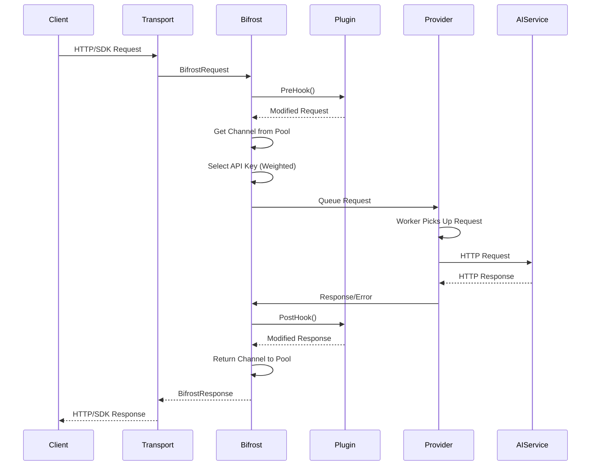
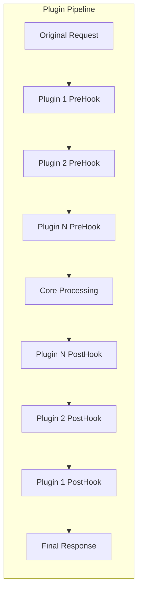
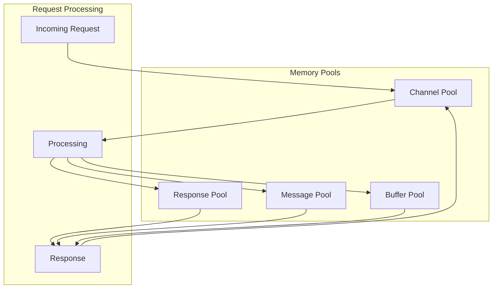
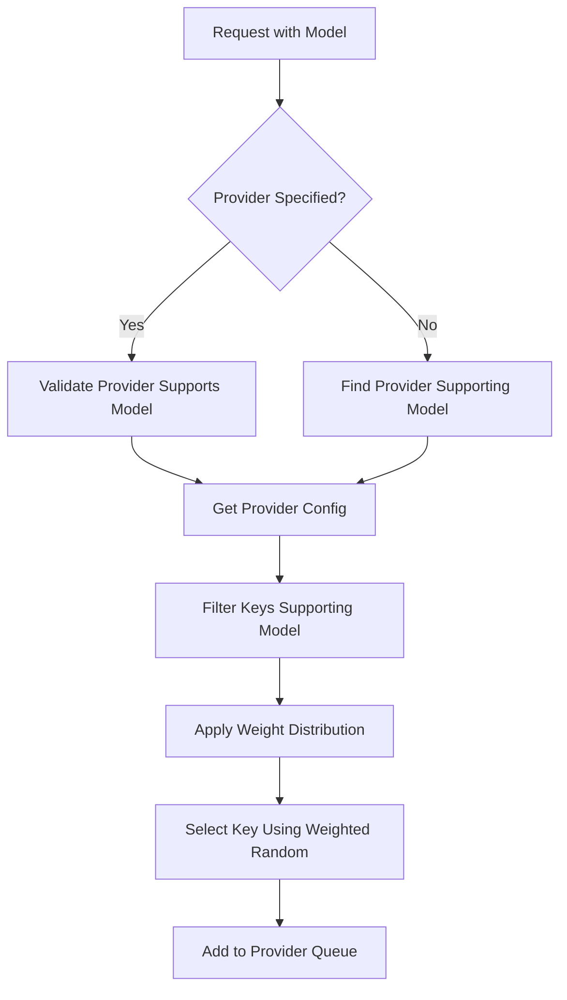
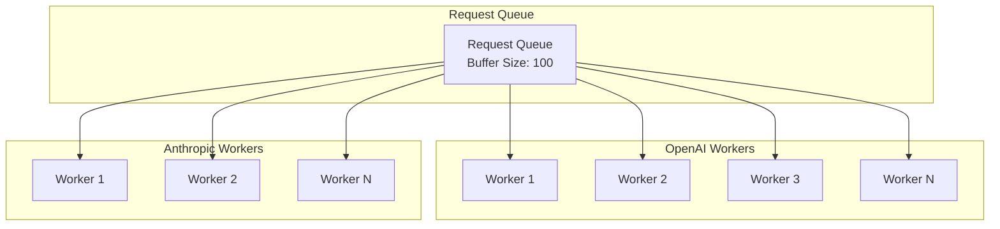
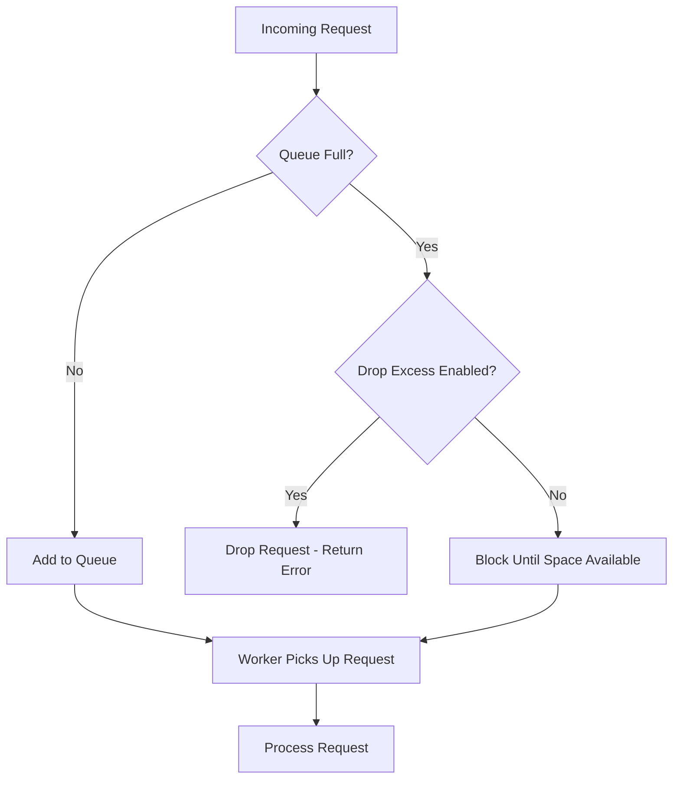
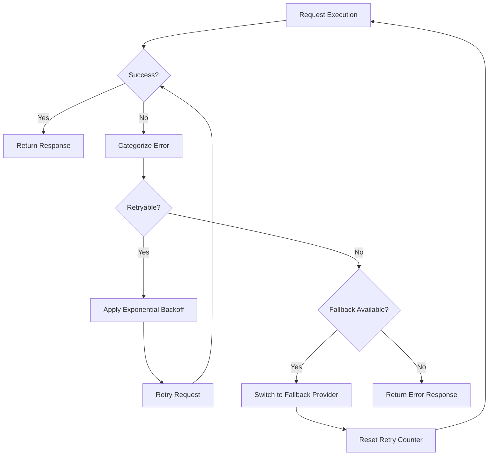
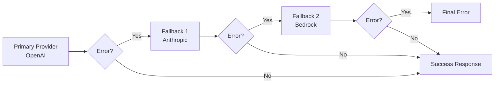

# 🔄 Request Flow Architecture

Detailed documentation of Bifrost's request processing pipeline, designed for high-throughput, low-latency AI model interactions with automatic fallbacks and intelligent routing.

## 📋 Request Processing Overview

Bifrost processes every request through a sophisticated pipeline that ensures optimal performance, reliability, and resource utilization.

### **High-Level Flow**



---

## 🏗️ Detailed Request Processing

### **1. Request Ingestion**

<details>
<summary><strong>🔧 Go Package Flow</strong></summary>

```go
// Client creates request
request := &schemas.ChatCompletionRequest{
    Provider: "openai",
    Model:    "gpt-4o",
    Messages: []schemas.Message{
        {Role: "user", Content: "Hello, world!"},
    },
    Fallbacks: []schemas.FallbackConfig{
        {Provider: "anthropic", Model: "claude-3-sonnet-20240229"},
    },
}

// Bifrost processes through pipeline
response, err := client.CreateChatCompletion(request)
```

**Internal Processing:**

1. **Request Validation**: Validates required fields and parameters
2. **Provider Resolution**: Resolves provider from configuration
3. **Model Validation**: Ensures model is supported by provider
4. **Parameter Normalization**: Converts parameters to provider format

</details>

<details>
<summary><strong>🌐 HTTP Transport Flow</strong></summary>

```bash
# Client sends HTTP request
curl -X POST http://localhost:8080/v1/chat/completions \
  -H "Content-Type: application/json" \
  -d '{
    "provider": "openai",
    "model": "gpt-4o",
    "messages": [{"role": "user", "content": "Hello!"}],
    "fallbacks": [{"provider": "anthropic", "model": "claude-3-sonnet-20240229"}]
  }'
```

**Internal Processing:**

1. **HTTP Parsing**: Parses JSON request body
2. **Request Mapping**: Maps HTTP request to internal schemas
3. **Authentication**: Validates request (if configured)
4. **Rate Limiting**: Applies rate limits (if configured)

</details>

### **2. Plugin Pipeline**



**Plugin Execution:**

- **Pre-hooks**: Execute before provider call (request modification, logging, validation)
- **Post-hooks**: Execute after provider call (response modification, logging, metrics)
- **Short-circuit**: Plugins can return early responses to bypass provider calls

### **3. Memory Pool Management**



**Pool Management:**

- **Channel Pool**: Reuses communication channels between components
- **Response Pool**: Reuses response objects to minimize allocations
- **Message Pool**: Reuses message structures for chat completions
- **Buffer Pool**: Reuses byte buffers for HTTP operations

### **4. Provider Selection & Key Management**



**Key Selection Logic:**

1. **Model Filtering**: Only keys supporting the requested model are considered
2. **Weight Normalization**: Weights are normalized to sum to 1.0
3. **Weighted Random Selection**: Keys are selected based on weight distribution
4. **Health Checking**: Unhealthy keys are temporarily excluded

---

## ⚡ Worker Pool Architecture

### **Provider Worker Pools**

Each provider maintains its own isolated worker pool:



**Worker Configuration:**

- **Concurrency**: Configurable number of workers per provider
- **Buffer Size**: Maximum queued requests per provider
- **Isolation**: Each provider operates independently
- **Scaling**: Workers can be dynamically adjusted based on load

### **Request Queueing Strategy**



**Queue Management:**

- **FIFO Ordering**: Requests processed in first-in-first-out order
- **Backpressure**: Configurable behavior when queues are full
- **Priority**: Support for priority queuing (future enhancement)

---

## 🔄 Error Handling & Fallbacks

### **Error Processing Flow**



**Error Categories:**

- **Network Errors**: Connection timeouts, DNS failures
- **Rate Limit Errors**: Provider rate limiting
- **Authentication Errors**: Invalid API keys
- **Provider Errors**: Service unavailable, model not found
- **Client Errors**: Invalid request format

### **Fallback Chain Processing**



**Fallback Logic:**

- **Automatic Triggering**: Fallbacks triggered on specific error types
- **Chain Processing**: Multiple fallback providers can be configured
- **State Preservation**: Request context maintained across fallbacks
- **Error Aggregation**: Collects errors from all attempted providers

---

## 📊 Performance Characteristics

### **Latency Breakdown**

| Component               | Typical Latency | Description                        |
| ----------------------- | --------------- | ---------------------------------- |
| **Request Parsing**     | < 1ms           | JSON parsing and validation        |
| **Plugin Pipeline**     | < 5ms           | Pre/post hook execution            |
| **Pool Operations**     | < 0.1ms         | Channel and object pool operations |
| **Provider Selection**  | < 0.5ms         | Key selection and routing          |
| **Queue Operations**    | < 0.1ms         | Adding to worker queue             |
| **Provider Call**       | 500-3000ms      | Actual AI provider API call        |
| **Response Processing** | < 5ms           | Response formatting and plugins    |

**Total Overhead**: < 15ms (excluding provider API call)

### **Throughput Metrics**

- **Sustained Throughput**: 10,000+ RPS
- **Burst Capacity**: 50,000+ RPS (short duration)
- **Memory Efficiency**: < 50MB RAM per 1000 RPS
- **CPU Utilization**: < 5% per 1000 RPS

---

## 🔧 Configuration Impact on Flow

### **Concurrency Settings**

```go
// High concurrency configuration
ConcurrencyAndBufferSize: schemas.ConcurrencyAndBufferSize{
    Concurrency: 50,  // 50 workers per provider
    BufferSize:  500, // 500 request buffer
}
```

**Impact:**

- **Higher Concurrency**: Better throughput, more resource usage
- **Larger Buffer**: Better burst handling, more memory usage
- **Provider Isolation**: Errors in one provider don't affect others

### **Network Configuration**

```go
// Optimized network settings
NetworkConfig: schemas.NetworkConfig{
    DefaultRequestTimeoutInSeconds: 30,
    MaxRetries:                     3,
    RetryBackoffInitial:           100 * time.Millisecond,
    RetryBackoffMax:               5 * time.Second,
}
```

**Impact:**

- **Timeout Settings**: Balance between reliability and latency
- **Retry Configuration**: Automatic recovery from transient failures
- **Backoff Strategy**: Prevents overwhelming failing providers

---

## 🔗 Related Documentation

- **[System Overview](system-overview.md)** - High-level architecture
- **[Performance Benchmarks](performance.md)** - Detailed performance metrics
- **[Concurrency Model](concurrency.md)** - Worker pool and threading details
- **[Error Handling](../usage/errors.md)** - Complete error reference

---

**⚡ Next Steps:** Explore [Performance Optimization](performance.md) for tuning these flows for maximum throughput.
