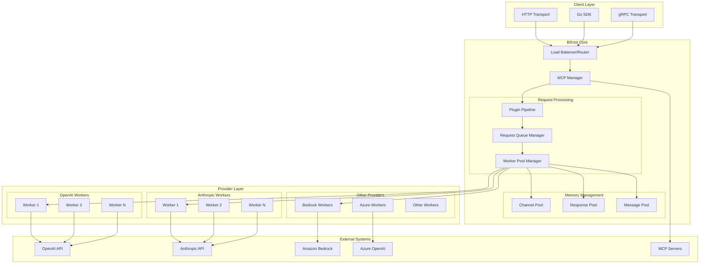
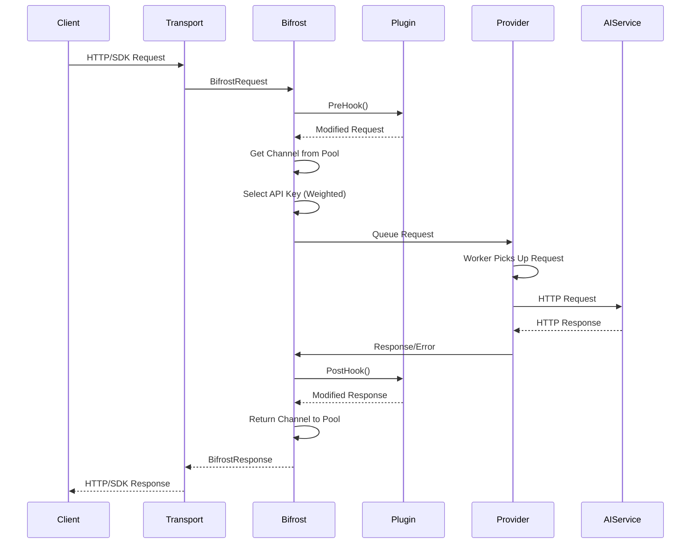

# Bifrost System Architecture

Bifrost is a **high-performance**, **horizontally scalable** middleware that acts as a unified gateway to multiple AI model providers. Optimized to handle **10,000+ requests per second (RPS)** through sophisticated concurrency management, memory optimization, and connection pooling.

## 🎯 Architecture Principles

| Principle                      | Description                                  | Benefit                              |
| ------------------------------ | -------------------------------------------- | ------------------------------------ |
| **🔄 Asynchronous Processing** | Channel-based worker pools per provider      | High concurrency, no blocking        |
| **💾 Memory Pool Management**  | Object pooling minimizes GC pressure         | Sustained high throughput            |
| **🏗️ Provider Isolation**      | Dedicated workers and resources per provider | Fault tolerance, independent scaling |
| **🔌 Plugin-First Design**     | Extensible middleware without core changes   | Custom business logic injection      |
| **⚡ Connection Optimization** | HTTP/2, keep-alive, connection pooling       | Reduced latency, higher efficiency   |

---

## 🏗️ High-Level Architecture



**Key Components:**

- **🔗 Transport Layer**: HTTP REST API, Go SDK, future gRPC
- **🎣 Plugin Pipeline**: Pre/post-hooks for custom logic
- **💾 Memory Pools**: Object reuse for zero-allocation processing
- **⚙️ Worker Pools**: Provider-specific concurrent processors
- **🔑 Key Management**: Weighted API key distribution
- **🛠️ MCP Integration**: External tool discovery and execution

---

## 🔄 Request Processing Flow



**Processing Stages:**

1. **🚪 Transport Layer**: HTTP → `schemas.BifrostRequest`
2. **🎣 Plugin PreHooks**: Request modification, auth, rate limiting
3. **💾 Memory Pool**: Get reusable channel object
4. **🔑 Key Selection**: Weighted random API key selection
5. **⚙️ Worker Queue**: Provider-specific request queuing
6. **🌐 HTTP Call**: Actual AI provider API request
7. **🎣 Plugin PostHooks**: Response modification, caching, logging
8. **♻️ Pool Return**: Release channel object for reuse

---

## ⚙️ Core Components

### Memory Management

From `/core/schemas/bifrost.go`:

```go
type BifrostConfig struct {
    Account            Account           `json:"account"`
    Plugins            []Plugin          `json:"plugins,omitempty"`
    InitialPoolSize    int              `json:"initial_pool_size,omitempty"`    // Default: 100
    DropExcessRequests bool             `json:"drop_excess_requests,omitempty"` // Default: false
    MCPConfig          *MCPConfig       `json:"mcp_config,omitempty"`
    Logger             Logger           `json:"logger,omitempty"`
}
```

**Pool Configuration Guidelines:**

- `InitialPoolSize: 100` - Standard (< 1k RPS)
- `InitialPoolSize: 1000` - High throughput (1k-5k RPS)
- `InitialPoolSize: 20000` - Ultra high throughput (10k+ RPS)

### Provider Worker Pools

From `/core/schemas/provider.go`:

```go
type ProviderConfig struct {
    NetworkConfig            NetworkConfig            `json:"network_config,omitempty"`
    ConcurrencyAndBufferSize ConcurrencyAndBufferSize `json:"concurrency_and_buffer_size,omitempty"`
    ProxyConfig              *ProxyConfig             `json:"proxy_config,omitempty"`
    MetaConfig               interface{}              `json:"meta_config,omitempty"`
    Logger                   Logger                   `json:"logger,omitempty"`
}

type ConcurrencyAndBufferSize struct {
    Concurrency int `json:"concurrency,omitempty"` // Default: 10
    BufferSize  int `json:"buffer_size,omitempty"` // Default: 100
}
```

### API Key Management

From `/core/schemas/account.go`:

```go
type Key struct {
    Value  string   `json:"value"`  // The actual API key value
    Models []string `json:"models"` // List of models this key can access
    Weight float64  `json:"weight"` // Weight for load balancing (0.0-1.0)
}
```

---

## 📊 Performance Characteristics

### Benchmark Results (5000 RPS Test)

| Instance Type | Success Rate | Avg Latency | Peak Memory | Bifrost Overhead |
| ------------- | ------------ | ----------- | ----------- | ---------------- |
| t3.medium     | 100.00%      | 2.12s       | 1312.79 MB  | **59 µs**        |
| t3.xlarge     | 100.00%      | 1.61s       | 3340.44 MB  | **11 µs**        |

**Key Performance Metrics:**

- **📊 Queue Wait Time**: 1.67 µs (t3.xlarge)
- **🔑 Key Selection**: 10 ns (t3.xlarge)
- **📋 Message Formatting**: 2.11 µs (t3.xlarge)
- **📦 JSON Marshaling**: 26.80 µs (t3.xlarge)

---

## 🎯 Next Steps

Ready to implement Bifrost in your architecture? Choose your deployment path:

| **Deployment**            | **Documentation**                                         | **Time Investment** |
| ------------------------- | --------------------------------------------------------- | ------------------- |
| **🔧 Go Package**         | [Go Integration Guide](../quick-start/go-package.md)      | 5 minutes           |
| **🌐 HTTP Transport**     | [HTTP Deployment Guide](../quick-start/http-transport.md) | 10 minutes          |
| **🛠️ Production Setup**   | [Production Configuration](../configuration/)             | 30 minutes          |
| **📊 Performance Tuning** | [Benchmarks & Optimization](../benchmarks.md)             | 20 minutes          |
| **🔌 Custom Extensions**  | [Plugin Development](../features/plugins.md)              | 45 minutes          |

### 📖 Complete Reference

- **[🏗️ Feature Documentation](../features/)** - All Bifrost capabilities
- **[⚙️ Configuration Reference](../configuration/)** - Complete setup guides
- **[📋 API Documentation](../usage/)** - HTTP and Go SDK references
- **[🔧 Development Guides](../guides/)** - Tutorials and best practices

---

**🚀 Ready to deploy?** Start with our [📖 Quick Start Guides](../quick-start/) to get Bifrost running in under 2 minutes.
