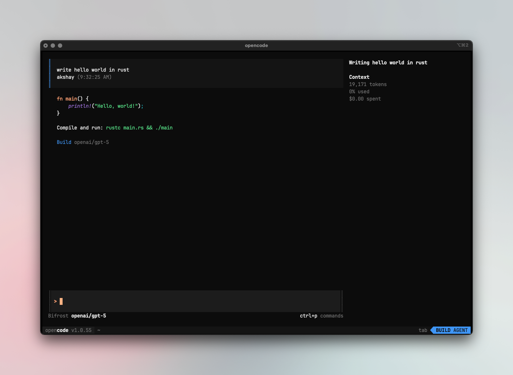
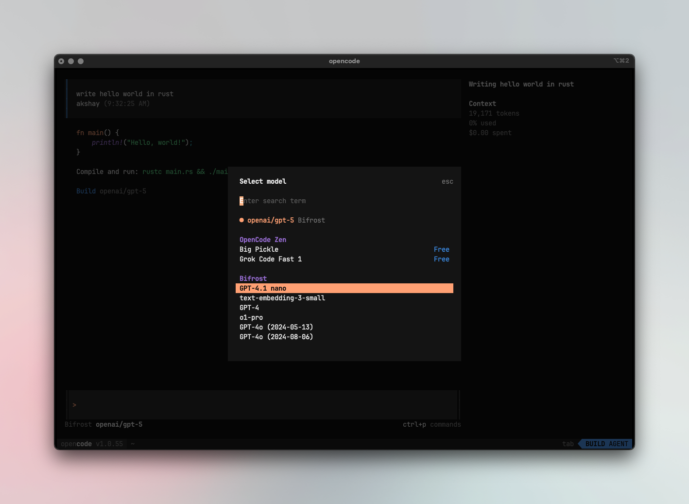

[OpenCode](https://github.com/anomalyco/opencode) is an AI-powered coding application with a [desktop GUI](https://opencode.ai/download), a terminal UI, and IDE extensions. It supports OpenAI-compatible APIs. By pointing it at Bifrost, you get access to any provider/model in your Bifrost configuration, plus governance features like virtual keys, built-in observability, and per-model options for reasoning effort, thinking budget, and more.

OpenCode's clients use the same backend and provider configuration. They also send the same `opencode/<version>` User-Agent, so Bifrost reports their traffic under the shared **OpenCode** app label.



<Note>
If your Allowed Headers are already set to `*`, you can skip this note. If not and you face issues integrating Bifrost with OpenCode, try switching to `*` or adding the specific headers required by your client. By default, Bifrost whitelists: `Content-Type`, `Authorization`, `X-Requested-With`, `X-Stainless-Timeout`, and `X-Api-Key`.
</Note>

## Setup

### OpenCode Desktop (GUI)

The [OpenCode Desktop app](https://opencode.ai/download) can point at Bifrost as a custom OpenAI-compatible provider. No JSON editing is required for this setup.

1. Open OpenCode Desktop and go to **Settings** (gear icon) → **Providers**.
2. Scroll to **Custom provider** and click **Connect**.
3. Fill in the provider details:

   | Field | Value |
   |-------|-------|
   | **Provider ID** | `bifrost` (lowercase letters, numbers, hyphens, or underscores) |
   | **Display name** | `Bifrost` |
   | **Base URL** | `http://localhost:8080/openai` (or your deployed host, e.g. `https://bifrost.example.com/openai`) |
   | **API key** | Your Bifrost virtual key |
   | **Models** | Add each Bifrost model ID you plan to select, including any `small_model`; for example, `openai/gpt-5` / `GPT-5` and `anthropic/claude-haiku-4-5` / `Claude Haiku 4.5` |

4. Click **Submit**, then pick a Bifrost-routed model in the chat and send a test message.

The custom provider uses OpenCode's OpenAI-compatible adapter. Bifrost still routes model IDs such as `anthropic/...`, `gemini/...`, and `bedrock/...` to their native providers.

### Config file (TUI and shared config)

OpenCode supports both `opencode.json` and `opencode.jsonc`. Put a user-wide configuration at `~/.config/opencode/opencode.json` (including on Windows), or put `opencode.json` in a project root for project-specific settings.

### Using Bifrost's OpenAI-compatible endpoint

Define a custom `bifrost` provider. The outer `bifrost/` in the default model is OpenCode's provider ID; the remainder is the model ID Bifrost receives and routes:

```jsonc
{
  "$schema": "https://opencode.ai/config.json",
  "provider": {
    "bifrost": {
      "npm": "@ai-sdk/openai-compatible",
      "name": "Bifrost",
      "options": {
        "baseURL": "http://localhost:8080/openai",
        "apiKey": "your-bifrost-key"
      },
      "models": {
        "openai/gpt-5": {},
        "anthropic/claude-sonnet-4-5-20250929": {},
        "anthropic/claude-haiku-4-5": {},
        "gemini/gemini-2.5-pro": {}
      }
    }
  },
  "model": "bifrost/openai/gpt-5"
}
```

<Tip>
You can also use the `/connect` command in the OpenCode TUI to configure credentials interactively, then update the `baseURL` in your config file.
</Tip>

## Virtual Keys

When Bifrost has [virtual key authentication](/features/governance/virtual-keys) enabled, set `apiKey` in your provider options to your virtual key:

```jsonc
"options": {
  "baseURL": "http://localhost:8080/openai",
  "apiKey": "bf-your-virtual-key-here"
}
```

This lets you enforce usage limits, budgets, and access control per user or environment. For team deployments, create a separate virtual key for each team - each key can have its own rate limits, budgets, and provider access rules configured in the Bifrost dashboard.

## Model Selection

Set your default models in `opencode.json`:

```jsonc
{
  "model": "bifrost/openai/gpt-5",
  "small_model": "bifrost/anthropic/claude-haiku-4-5"
}
```

Switch models with `/models` in the TUI (or <key>ctrl</key>+<key>x</key>, then <key>m</key> with the default keybindings).



- Use powerful models like `openai/gpt-5` or `anthropic/claude-sonnet-4-5-20250929` for complex coding tasks
- Use fast models like `groq/llama-3.3-70b-versatile` for quick completions
- Set `small_model` to a lighter model for faster, lower-cost operations

## Using Multiple Providers

Bifrost routes requests based on its model ID. In OpenCode, select `bifrost/<bifrost-model-id>`; OpenCode removes its `bifrost/` provider prefix before sending the request. For example:

```
bifrost/anthropic/claude-sonnet-4-5-20250929
bifrost/openai/gpt-5
bifrost/gemini/gemini-2.5-pro
bifrost/mistral/mistral-large-latest
```

You can configure models from different providers with per-model options:

```jsonc
{
  "$schema": "https://opencode.ai/config.json",
  "provider": {
    "bifrost": {
      "npm": "@ai-sdk/openai-compatible",
      "name": "Bifrost",
      "options": {
        "baseURL": "http://localhost:8080/openai",
        "apiKey": "your-bifrost-key"
      },
      "models": {
        "openai/gpt-5": {
          "options": {
            "reasoningEffort": "high",
            "textVerbosity": "low",
            "reasoningSummary": "auto",
            "include": [
              "reasoning.encrypted_content"
            ]
          }
        },
        "anthropic/claude-sonnet-4-5-20250929": {
          "options": {
            "thinking": {
              "type": "enabled",
              "budgetTokens": 16000
            }
          }
        }
      }
    }
  }
}
```

### Supported Providers

Bifrost supports the following providers with the `provider/model-name` format:

`openai`, `azure`, `gemini`, `vertex`, `bedrock`, `mistral`, `groq`, `cerebras`, `deepseek`, `cohere`, `perplexity`, `xai`, `ollama`, `openrouter`, `huggingface`, `nebius`, `parasail`, `replicate`, `vllm`, `sgl`

<Warning>
Non-native models **must support tool use** for OpenCode to work properly. OpenCode relies on tool calling for file operations, terminal commands, and code editing. Models without tool use support will fail on most operations.
</Warning>

<Note>
OpenCode connects to Bifrost via a single endpoint. Bifrost handles routing to the correct provider based on the model name - no per-provider configuration needed.
</Note>

## Observability

All OpenCode traffic through Bifrost is logged. Monitor it at `http://localhost:8080/logs` - filter by provider, model, or search through conversation content to track usage.

## Next Steps

- [Provider Configuration](/quickstart/gateway/provider-configuration) - Configure AI providers in Bifrost
- [Virtual Keys](/features/governance/virtual-keys) - Set up usage limits and access control
