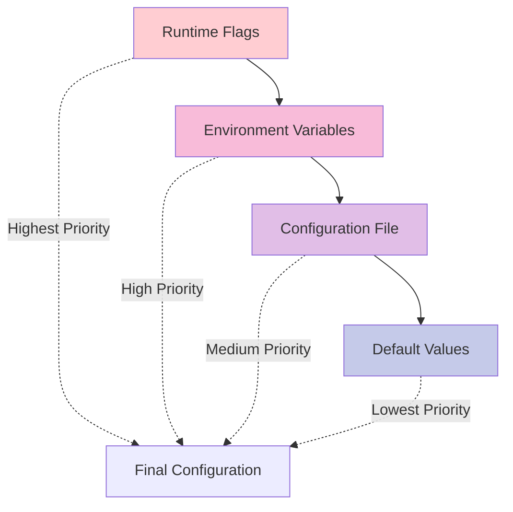

# ⚙️ Configuration & Deployment

Comprehensive configuration guides for production-ready Bifrost deployments with security, performance, and scalability best practices.

## 📋 Configuration Overview

| Configuration Type | Best For                  | Documentation                                          |
| ------------------ | ------------------------- | ------------------------------------------------------ |
| **🔧 Core Config** | Go package integration    | [📖 Core Configuration →](core-config.md)              |
| **🌐 HTTP Config** | HTTP transport deployment | [📖 HTTP Configuration →](http-config.md)              |
| **🌍 Environment** | All deployment scenarios  | [📖 Environment Variables →](environment-variables.md) |
| **🔒 Security**    | Production security       | [📖 Security Guide →](security.md)                     |
| **🚀 Deployment**  | Production deployment     | [📖 Deployment Guide →](deployment/)                   |

---

## ⚡ Quick Start Configuration

### Go Package Configuration

<details open>
<summary><strong>🔧 Minimal Go Setup</strong></summary>

```go
package main

import (
    "os"
    "github.com/maximhq/bifrost/core"
    "github.com/maximhq/bifrost/core/schemas"
)

// 📖 [Complete Account Implementation →](../usage/examples.md#basic-account-implementation)


func main() {
    client, err := bifrost.Init(schemas.BifrostConfig{
        Account:         &MyAccount{},
        InitialPoolSize: 100,
        Logger:          bifrost.NewDefaultLogger(schemas.LogLevelInfo),
    })
    if err != nil {
        panic(err)
    }
    defer client.Cleanup()

    // Use client for requests...
}
```

**[📖 Complete Go Configuration Guide →](core-config.md)**

</details>

<details>
<summary><strong>🌐 Minimal HTTP Setup</strong></summary>

**1. Create configuration file (`config.json`):**

```json
{
  "providers": {
    "openai": {
      "keys": [
        {
          "value": "env.OPENAI_API_KEY",
          "models": ["gpt-4o-mini", "gpt-4o"],
          "weight": 1.0
        }
      ]
    }
  }
}
```

**2. Set environment variables:**

```bash
export OPENAI_API_KEY="sk-..."
```

**3. Start Bifrost:**

```bash
# Docker
docker run -p 8080:8080 \
  -v $(pwd)/config.json:/app/config/config.json \
  -e OPENAI_API_KEY \
  maximhq/bifrost

# Binary
bifrost-http -config config.json -port 8080
```

**[📖 Complete HTTP Configuration Guide →](http-config.md)**

</details>

---

## 🎯 Configuration Categories

### 🔧 Core Configuration (Go Package)

Direct integration configuration for Go applications.

- **[Account Interface](core-config.md#account-interface)** - Provider and key management
- **[BifrostConfig](core-config.md#bifrost-config)** - Client initialization options
- **[Provider Settings](core-config.md#provider-configuration)** - Per-provider configuration
- **[Plugin System](core-config.md#plugin-configuration)** - Middleware and extensions
- **[Memory Management](core-config.md#memory-configuration)** - Performance tuning

```go
// Advanced Go configuration example
client, err := bifrost.Init(schemas.BifrostConfig{
    Account:            account,
    Plugins:            []schemas.Plugin{customPlugin},
    Logger:             customLogger,
    InitialPoolSize:    500,
    DropExcessRequests: true,
    MCPConfig:          mcpConfig,
})
```

### 🌐 HTTP Configuration (Transport)

HTTP server configuration for language-agnostic deployments.

- **[JSON Configuration](http-config.md#json-configuration)** - Provider and server settings
- **[Environment Variables](http-config.md#environment-variables)** - Runtime configuration
- **[Server Options](http-config.md#server-options)** - Port, pooling, and performance
- **[MCP Integration](http-config.md#mcp-configuration)** - Tool integration setup
- **[Observability](http-config.md#observability-configuration)** - Metrics and monitoring

```json
{
  "providers": {
    "openai": {"keys": [...]},
    "anthropic": {"keys": [...]}
  },
  "mcp": {
    "client_configs": [...]
  }
}
```

### 🌍 Environment Variables

Comprehensive environment variable reference for all deployment scenarios.

- **[Provider Keys](environment-variables.md#provider-keys)** - API key management
- **[Server Configuration](environment-variables.md#server-configuration)** - Runtime settings
- **[Logging Configuration](environment-variables.md#logging-configuration)** - Log levels and formats
- **[MCP Configuration](environment-variables.md#mcp-configuration)** - Tool integration vars
- **[Security Settings](environment-variables.md#security-settings)** - Security configurations

### 🔒 Security Configuration

Production security best practices and configuration.

- **[API Key Security](security.md#api-key-security)** - Secure key management
- **[Network Security](security.md#network-security)** - HTTPS, proxies, and firewalls
- **[Access Control](security.md#access-control)** - Authentication and authorization
- **[Data Protection](security.md#data-protection)** - Encryption and privacy
- **[Audit Logging](security.md#audit-logging)** - Security event tracking

### 🚀 Deployment Configuration

Production deployment guides and configurations.

- **[Docker Deployment](deployment/docker.md)** - Container-based deployment
- **[Kubernetes Deployment](deployment/kubernetes.md)** - Orchestrated deployment
- **[Production Setup](deployment/production.md)** - Production considerations
- **[Scaling Configuration](deployment/scaling.md)** - High-load optimization

---

## 🎛️ Configuration Hierarchy

### Configuration Priority

Understanding how Bifrost resolves configuration from multiple sources:



**Priority Order (highest to lowest):**

1. **Runtime Flags** - Command line arguments (HTTP transport only)
2. **Environment Variables** - OS environment variables
3. **Configuration File** - JSON config file (HTTP transport) or Account interface (Go package)
4. **Default Values** - Built-in defaults

### Example Configuration Resolution

<details>
<summary><strong>🌐 HTTP Transport - Configuration Resolution</strong></summary>

**Command line flags:**

```bash
bifrost-http -config config.json -port 9090 -log-level debug
```

**Environment variables:**

```bash
export APP_PORT=8080
export LOG_LEVEL=info
export OPENAI_API_KEY="sk-..."
```

**Configuration file (`config.json`):**

```json
{
  "providers": {
    "openai": {
      "keys": [{ "value": "env.OPENAI_API_KEY", "models": ["gpt-4o-mini"] }]
    }
  }
}
```

**Final resolved configuration:**

- Port: `9090` (from flag, highest priority)
- Log Level: `debug` (from flag, overrides environment)
- OpenAI Key: `sk-...` (from environment, resolved from config reference)

</details>

<details>
<summary><strong>🔧 Go Package - Configuration Resolution</strong></summary>

```go
// Account interface provides base configuration
func (a *MyAccount) GetConfigForProvider(provider schemas.ModelProvider) (*schemas.ProviderConfig, error) {
    config := &schemas.ProviderConfig{
        NetworkConfig: schemas.NetworkConfig{
            DefaultRequestTimeoutInSeconds: 30,  // Base timeout
        },
    }

    // Override with environment-specific settings
    if os.Getenv("ENV") == "production" {
        config.NetworkConfig.DefaultRequestTimeoutInSeconds = 60  // Longer timeout for prod
        config.ConcurrencyAndBufferSize.Concurrency = 20         // Higher concurrency
    }

    return config, nil
}

// BifrostConfig overrides account defaults
client, err := bifrost.Init(schemas.BifrostConfig{
    Account:            account,
    InitialPoolSize:    200,  // Override default pool size
    DropExcessRequests: true, // Enable request dropping
})
```

</details>

---

## 🔄 Multi-Environment Configuration

### Environment-Based Configuration

<details>
<summary><strong>🔧 Go Package - Multi-Environment Setup</strong></summary>

```go
type EnvironmentAwareAccount struct {
    environment string
}

func NewAccount() *EnvironmentAwareAccount {
    env := os.Getenv("ENV")
    if env == "" {
        env = "development"
    }
    return &EnvironmentAwareAccount{environment: env}
}

func (a *EnvironmentAwareAccount) GetKeysForProvider(provider schemas.ModelProvider) ([]schemas.Key, error) {
    switch a.environment {
    case "production":
        return []schemas.Key{
            {Value: os.Getenv("OPENAI_PROD_KEY"), Models: []string{"gpt-4o"}, Weight: 1.0},
        }, nil
    case "staging":
        return []schemas.Key{
            {Value: os.Getenv("OPENAI_STAGING_KEY"), Models: []string{"gpt-4o-mini"}, Weight: 1.0},
        }, nil
    default: // development
        return []schemas.Key{
            {Value: os.Getenv("OPENAI_DEV_KEY"), Models: []string{"gpt-4o-mini"}, Weight: 1.0},
        }, nil
    }
}

func (a *EnvironmentAwareAccount) GetConfigForProvider(provider schemas.ModelProvider) (*schemas.ProviderConfig, error) {
    baseConfig := &schemas.ProviderConfig{
        NetworkConfig:            schemas.DefaultNetworkConfig,
        ConcurrencyAndBufferSize: schemas.DefaultConcurrencyAndBufferSize,
    }

    // Environment-specific overrides
    switch a.environment {
    case "production":
        baseConfig.NetworkConfig.DefaultRequestTimeoutInSeconds = 60
        baseConfig.ConcurrencyAndBufferSize.Concurrency = 50
        baseConfig.ConcurrencyAndBufferSize.BufferSize = 500
    case "staging":
        baseConfig.NetworkConfig.DefaultRequestTimeoutInSeconds = 45
        baseConfig.ConcurrencyAndBufferSize.Concurrency = 20
    }

    return baseConfig, nil
}
```

</details>

<details>
<summary><strong>🌐 HTTP Transport - Multi-Environment Setup</strong></summary>

**Production config (`config.prod.json`):**

```json
{
  "providers": {
    "openai": {
      "keys": [
        {
          "value": "env.OPENAI_PROD_KEY_1",
          "models": ["gpt-4o"],
          "weight": 0.7
        },
        {
          "value": "env.OPENAI_PROD_KEY_2",
          "models": ["gpt-4o"],
          "weight": 0.3
        }
      ]
    },
    "anthropic": {
      "keys": [
        {
          "value": "env.ANTHROPIC_PROD_KEY",
          "models": ["claude-3-5-sonnet-20241022"],
          "weight": 1.0
        }
      ]
    }
  }
}
```

**Staging config (`config.staging.json`):**

```json
{
  "providers": {
    "openai": {
      "keys": [
        {
          "value": "env.OPENAI_STAGING_KEY",
          "models": ["gpt-4o-mini"],
          "weight": 1.0
        }
      ]
    }
  }
}
```

**Environment-specific deployment:**

```bash
# Production
export ENV=production
export OPENAI_PROD_KEY_1="sk-prod1-..."
export OPENAI_PROD_KEY_2="sk-prod2-..."
export ANTHROPIC_PROD_KEY="sk-ant-prod-..."

docker run -p 8080:8080 \
  -v $(pwd)/config.prod.json:/app/config/config.json \
  -e ENV -e OPENAI_PROD_KEY_1 -e OPENAI_PROD_KEY_2 -e ANTHROPIC_PROD_KEY \
  maximhq/bifrost

# Staging
export ENV=staging
export OPENAI_STAGING_KEY="sk-staging-..."

docker run -p 8080:8080 \
  -v $(pwd)/config.staging.json:/app/config/config.json \
  -e ENV -e OPENAI_STAGING_KEY \
  maximhq/bifrost
```

</details>

---

## 🔍 Configuration Validation

### Validation Tools

<details>
<summary><strong>🔧 Go Package - Configuration Validation</strong></summary>

```go
func ValidateAccount(account schemas.Account) error {
    providers, err := account.GetConfiguredProviders()
    if err != nil {
        return fmt.Errorf("failed to get providers: %w", err)
    }

    if len(providers) == 0 {
        return fmt.Errorf("no providers configured")
    }

    for _, provider := range providers {
        keys, err := account.GetKeysForProvider(provider)
        if err != nil {
            return fmt.Errorf("failed to get keys for %s: %w", provider, err)
        }

        if len(keys) == 0 {
            return fmt.Errorf("no keys configured for provider %s", provider)
        }

        for i, key := range keys {
            if key.Value == "" {
                return fmt.Errorf("empty key value for provider %s, key %d", provider, i)
            }
            if len(key.Models) == 0 {
                return fmt.Errorf("no models specified for provider %s, key %d", provider, i)
            }
        }

        config, err := account.GetConfigForProvider(provider)
        if err != nil {
            return fmt.Errorf("failed to get config for %s: %w", provider, err)
        }

        if config.ConcurrencyAndBufferSize.Concurrency <= 0 {
            return fmt.Errorf("invalid concurrency for provider %s", provider)
        }
    }

    return nil
}

func main() {
    account := &MyAccount{}

    if err := ValidateAccount(account); err != nil {
        log.Fatalf("Account validation failed: %v", err)
    }

    client, err := bifrost.Init(schemas.BifrostConfig{
        Account: account,
    })
}
```

</details>

<details>
<summary><strong>🌐 HTTP Transport - Configuration Validation</strong></summary>

**Built-in validation on startup:**

```bash
# Bifrost validates configuration on startup
docker run -p 8080:8080 \
  -v $(pwd)/config.json:/app/config/config.json \
  maximhq/bifrost

# Example validation error output:
# ERROR: Configuration validation failed
# - Provider 'openai': No API keys configured
# - Provider 'anthropic': Environment variable 'ANTHROPIC_API_KEY' not found
# - MCP client 'filesystem': Invalid stdio command path
```

**Configuration test endpoint:**

```bash
# Test configuration without starting server
curl -X GET http://localhost:8080/v1/config/validate

# Response:
{
  "valid": true,
  "providers": {
    "openai": {"status": "ok", "keys": 2, "models": 4},
    "anthropic": {"status": "ok", "keys": 1, "models": 2}
  },
  "mcp": {
    "clients": 2,
    "tools": 15
  }
}
```

</details>

---

## 📚 Next Steps

### Learning Path

1. **[🚀 Quick Start](../quick-start/)** - Get up and running quickly
2. **Choose your configuration approach:**
   - **[🔧 Go Package Configuration](core-config.md)** for direct integration
   - **[🌐 HTTP Configuration](http-config.md)** for service deployment
3. **[🌍 Environment Variables](environment-variables.md)** - Complete variable reference
4. **[🔒 Security Configuration](security.md)** - Secure your deployment
5. **[🚀 Production Deployment](deployment/)** - Deploy to production

### Advanced Topics

- **[📊 Performance Tuning](deployment/scaling.md)** - Optimize for high load
- **[🔍 Monitoring Setup](../features/observability.md)** - Set up comprehensive monitoring
- **[🔧 Troubleshooting](../guides/troubleshooting.md)** - Debug configuration issues
- **[🤝 Contributing](../contributing/)** - Contribute to Bifrost

---

**Need help?** Check our [❓ FAQ](../guides/faq.md) or [🔧 Troubleshooting Guide](../guides/troubleshooting.md).
