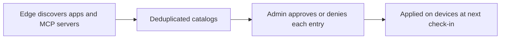

Edge discovers the AI apps and MCP servers configured on each machine and collects them into two catalogs: one for apps and one for MCP servers. The Approvals dashboard is where you review those catalogs and decide what is allowed.

<Frame>
  
</Frame>

## Statuses

Every app and MCP server has one of three statuses:

| Status | Meaning |
| --- | --- |
| Pending | Discovered and awaiting review. It keeps working in the meantime. |
| Approved | Explicitly allowed. |
| Denied | Blocked. Edge stops it on the device. |

A newly discovered app or MCP server is pending by default and continues to work until you deny it. Only a denied item is blocked.

## Deduplicated catalogs

The catalogs are deduplicated across the fleet, so the same MCP server configured on many machines appears once. You approve or deny it once and the decision applies wherever it appears. Decisions take effect on each device at its next check-in.

## AI apps

The app catalog lists every AI app seen across the fleet. For each app you can see its name, status, who last changed it, and an optional note.

<Frame>
  
</Frame>

## MCP servers

The MCP server catalog lists every server discovered across the fleet, with its name, how it connects (local command or remote URL), and the tools it exposes. Each entry has a status, the user who last changed it, and an optional note.

<Frame>
  
</Frame>

## Approving and denying

You can approve or deny a single entry and add a note, or act on many entries at once, including everything in a given status (for example, denying all pending MCP servers).

---

## Next steps

- See which machines have a given app or server in [Devices](/edge/admin-devices).
- Review the end-user behavior in [Govern AI apps](/edge/app-governance) and [Govern MCP servers](/edge/mcp-governance).
