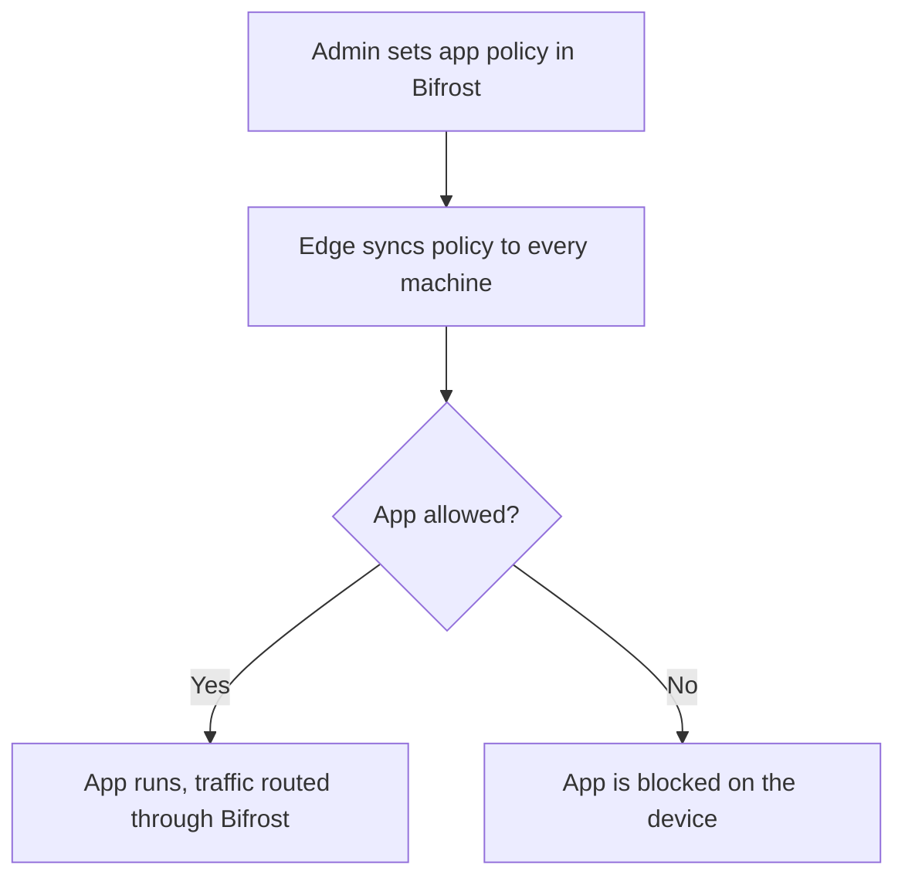

Not every AI app belongs on every machine. Bifrost Edge lets administrators decide which AI applications are permitted across the organization and enforces that decision on each device. Allowed apps run normally, fully governed through Bifrost. Disallowed apps are blocked before any data leaves the machine.

## Set policy once, enforce everywhere

Administrators manage AI app policy centrally in Bifrost. Edge picks up changes automatically on each machine, so allowing or blocking an app takes effect across the fleet without touching individual devices or asking users to do anything.

<Frame>
  
</Frame>

<CardGroup cols={2}>
  <Card title="Allow what you trust" icon="circle-check">
    Permit the AI apps your organization has approved. They run normally, with every request governed through Bifrost.
  </Card>
  <Card title="Block the rest" icon="ban">
    Keep unapproved AI apps off company machines so sensitive data never reaches an ungoverned tool.
  </Card>
</CardGroup>

## Approval workflow

If Bifrost edge detects a new app or MCP server, it will automatically request approval from the admin console. In the settings, you can configure if apps or MCP servers should be allowed or blocked when they are in pending state.

## What users see

When an app is allowed, the experience is seamless: people use it exactly as before, and Edge governs the traffic in the background. When an app is blocked, the user gets a clear signal that it is not permitted on a company machine, so there is no confusion about why something is unavailable.

<Frame>
  
</Frame>

<Note>
App policy is centrally managed, so updates roll out to the whole organization at once. There is no need to revisit individual machines when your approved-app list changes.
</Note>

---

## Next steps

- Extend the same control to tools inside apps in [Govern MCP servers](/edge/mcp-governance).
- See which apps Edge can govern in [Supported applications](/edge/supported-applications).
- Plan your rollout in [Deploy with MDM](/edge/deployment-mdm).
