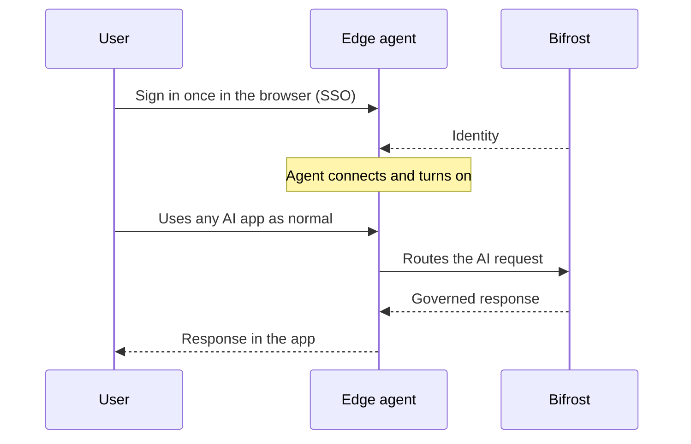

Bifrost Edge is designed to be invisible. After a one-time sign-in, users keep using the AI tools they already have - Claude Desktop, ChatGPT, Cursor, coding agents in the terminal - and Edge quietly routes that traffic through your Bifrost in the background. There is no proxy to configure, no base URL to change, and nothing to remember.

## One sign-in

The first time Edge runs, the user signs in through their browser using your organization's existing single sign-on. That sign-in links the machine to the user and syncs all policies assigned to them. No API keys are copied or pasted, and nothing sensitive lives in the app itself.

## An always-on menu-bar agent

Once signed in, Edge lives in the menu bar (macOS) or system tray (Windows and Linux). From there a user can see whether they are connected, which key is active, and turn routing on or off. Most people set it once and never think about it again.

<Frame>
  
</Frame>

<CardGroup cols={2}>
  <Card title="Connection status" icon="signal">
    A clear indicator shows when AI traffic is being governed, and surfaces a warning if something needs attention.
  </Card>
  <Card title="Key selection" icon="key">
    Users with more than one virtual key can pick which one to use, with budget visible at a glance.
  </Card>
</CardGroup>

## Every app, automatically

Because Edge routes traffic at the machine level, it covers the AI surfaces people actually use without any per-app setup:

<CardGroup cols={3}>
  <Card title="Desktop apps" icon="display">
    Claude Desktop, the ChatGPT app, Cursor, and other desktop AI clients.
  </Card>
  <Card title="AI in the browser" icon="globe">
    ChatGPT on the web and other browser-based AI surfaces.
  </Card>
  <Card title="Coding agents" icon="terminal">
    Claude Code, Codex, and similar agents in the terminal and IDE.
  </Card>
</CardGroup>

The result is that governance follows the user instead of waiting for them to opt in. See the full list on the [Supported applications](/edge/supported-applications) page.

<Frame>
  
</Frame>

---

## Next steps

- Control which apps are allowed in [Govern AI apps](/edge/app-governance).
- Control MCP servers in [Govern MCP servers](/edge/mcp-governance).
- Roll Edge out to your fleet in [Deploy with MDM](/edge/deployment-mdm).
