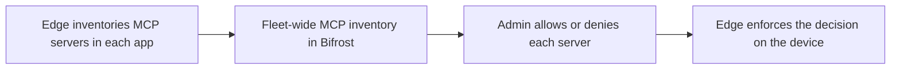

AI apps increasingly connect to MCP servers - external tools that can read files, call APIs, and take actions on a user's behalf. That power is useful, but it is also a blind spot: most organizations have no idea which MCP servers their users have wired into their AI tools. Bifrost Edge closes that gap. It discovers the MCP servers configured in each AI app, reports them back to you, and enforces an allow or deny decision on the machine itself.

## See what is actually connected

Edge reads the MCP configuration of supported AI apps on each machine and builds a live inventory: which servers are configured, where, and across how many devices. For the first time you can answer "what MCP servers are running on our fleet?" with real data instead of guesswork.

<Frame>
  
</Frame>

<CardGroup cols={2}>
  <Card title="Full visibility" icon="binoculars">
    Discover every MCP server users have configured across supported AI apps, with no manual reporting.
  </Card>
  <Card title="Per-server decisions" icon="list-check">
    Allow the MCP servers your organization trusts and deny the ones it does not, server by server.
  </Card>
</CardGroup>

## Approval workflow

If Bifrost edge detects a new app or MCP server, it will automatically request approval from the admin console. In the settings, you can configure if apps or MCP servers should be allowed or blocked when they are in pending state.

## Enforced on the device

Allowing or denying an MCP server is not just advisory. When you deny a server, Edge enforces that decision directly on each machine so the disallowed tool cannot be used, even by an app that had it configured before the policy existed.

<Frame>
  
</Frame>

<Note>
MCP discovery covers the major AI apps that support MCP today, including Claude Code, Claude Desktop, Gemini CLI, OpenCode, Codex, and Cursor. See [Supported applications](/edge/supported-applications) for the current list.
</Note>

---

## Next steps

- Control whole apps, not just their tools, in [Govern AI apps](/edge/app-governance).
- Review coverage in [Supported applications](/edge/supported-applications).
- Roll Edge out to every machine in [Deploy with MDM](/edge/deployment-mdm).
