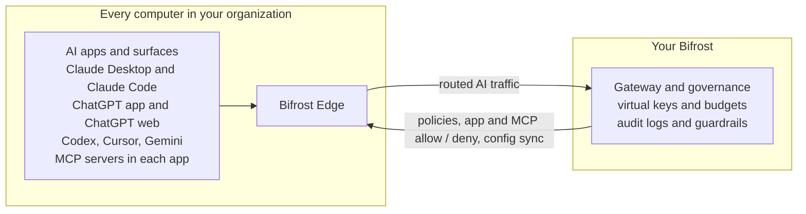

<Frame>

</Frame>

<Tip>
**Bifrost Edge is in alpha.** Be among the first to bring AI on every computer of your organization under governance. Register below and our team will reach out to onboard you.

<button
  data-tally-open="aQzaGb"
  data-tally-layout="modal"
  data-tally-width="700"
  data-tally-hide-title="1"
  data-tally-transparent-background="1"
  className="not-prose mt-2 inline-flex cursor-pointer items-center gap-2 rounded-lg border-0 bg-[rgb(var(--primary-dark))] px-5 py-2.5 text-sm font-semibold text-white no-underline transition-opacity hover:opacity-90"
>
  Register for Alpha
  <svg width="14" height="14" viewBox="0 0 16 16" fill="none" xmlns="http://www.w3.org/2000/svg" aria-hidden="true">
    <path d="M3 8h10M9 4l4 4-4 4" stroke="currentColor" strokeWidth="1.5" strokeLinecap="round" strokeLinejoin="round" />
  </svg>
</button>
</Tip>

---

Bifrost Edge extends your AI gateway all the way to the endpoint. Instead of relying on every user to point their tools at Bifrost, Edge runs quietly on each machine and brings **all** AI traffic under governance automatically: desktop chat apps, AI in the browser, coding agents in the terminal and IDE, and the MCP servers those tools connect to. Your existing virtual keys, budgets, audit logs, and guardrails now apply to the AI people actually use, not just the traffic that happened to be configured.

<Note>
Bifrost Edge runs natively on  **macOS**,  **Windows**, and  **Linux**.
</Note>

## Why Edge

<CardGroup cols={3}>
  <Card title="End shadow AI" icon="eye-slash">
    Bring the AI tools users already use under governance, without asking anyone to reconfigure their apps.
  </Card>
  <Card title="Zero per-app setup" icon="wand-magic-sparkles">
    No base URLs to change, no SDKs to swap. Edge routes traffic transparently the moment it is installed.
  </Card>
  <Card title="Compliance everywhere" icon="shield-check">
    Every request inherits your audit logging, budgets, and guardrails - on the laptop, not just in the data center.
  </Card>
</CardGroup>

---

## What you can do with Edge

<CardGroup cols={2}>
  <Card title="How it works" icon="route" href="/edge/how-it-works">
    The user experience: one browser sign-in, a menu-bar agent, and every AI request routed through Bifrost.
  </Card>
  <Card title="Govern AI apps" icon="shield-halved" href="/edge/app-governance">
    Decide which AI applications are allowed on company machines, and what happens when one is blocked.
  </Card>
  <Card title="Govern MCP servers" icon="grid-2" href="/edge/mcp-governance">
    See every MCP server configured across your fleet and allow or deny each one, enforced on the device.
  </Card>
  <Card title="Security & guardrails" icon="road-barrier" href="/edge/security">
    Your guardrails - PII, secrets, content safety, and more - apply to AI traffic from every app, out of the box.
  </Card>
  <Card title="Admin controls" icon="sliders" href="/edge/admin-devices">
    Manage your fleet from one dashboard: devices, app and MCP approvals, and central configuration.
  </Card>
  <Card title="Deploy with MDM" icon="cloud-arrow-up" href="/edge/deployment-mdm">
    Roll Edge out silently to every machine through Jamf, Intune, or Kandji with a managed configuration.
  </Card>
  <Card title="Supported applications" icon="list" href="/edge/supported-applications">
    The full list of AI apps and surfaces Edge governs today, plus how to request a new one.
  </Card>
</CardGroup>

---

## How it fits with Bifrost

Edge is the endpoint layer of the same platform that powers the [Bifrost gateway](/overview) and [Bifrost Enterprise](/enterprise/overview). The governance you already configure - virtual keys, budgets, rate limits, guardrails, and audit logs - is exactly what Edge enforces on each machine. There is nothing new to learn on the policy side: Edge simply extends the reach of the controls you already trust to the AI running on every desk.

---

## Next steps

- See the day-to-day experience in [How it works](/edge/how-it-works).
- Apply your guardrails everywhere in [Security & guardrails](/edge/security).
- Plan a rollout in [Deploy with MDM](/edge/deployment-mdm).
- Check coverage in [Supported applications](/edge/supported-applications).
- Want in? Use the alpha CTA at the top of this page.
