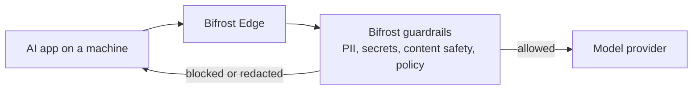

Because Bifrost Edge routes AI traffic through your Bifrost, every [guardrail](/enterprise/guardrails) you have configured applies automatically to the AI people use on their machines. There is nothing extra to set up on the endpoint: the same rules and profiles that protect your gateway traffic now protect prompts and responses from desktop apps, browser AI, and coding agents. Configure once, and it works across every supported app.

## Guardrails that apply out of the box

Your existing guardrail profiles cover Edge traffic with no additional configuration. Set them up once in [Guardrails](/enterprise/guardrails) and they take effect across the fleet.

<CardGroup cols={2}>
  <Card title="Secrets Detection" icon="key" href="/enterprise/guardrails/secrets-detection">
    Built-in Gitleaks-backed detection for leaked API keys, tokens, private keys, and credentials.
  </Card>
  <Card title="Custom Regex" icon="code" href="/enterprise/guardrails/custom-regex">
    In-process regex guardrails, including the built-in PII Detection template.
  </Card>
  <Card title="AWS Bedrock Guardrails" icon="aws" href="/integrations/guardrails/aws-bedrock">
    Enterprise content filtering, PII detection, and prompt attack prevention.
  </Card>
  <Card title="Azure Content Safety" icon="microsoft" href="/integrations/guardrails/azure-content-safety">
    Multi-modal content moderation with severity-based filtering.
  </Card>
  <Card title="Google Model Armor" icon="/media/google-model-armor-card.svg" href="/integrations/guardrails/google-model-armor">
    Policy enforcement for prompt injection, content safety, malicious URLs, and Sensitive Data Protection.
  </Card>
  <Card title="CrowdStrike AIDR" icon="/media/crowdstrike-card.svg" href="/integrations/guardrails/crowdstrike-aidr">
    Inline AI threat detection, policy enforcement, redaction, and AIDR audit visibility.
  </Card>
  <Card title="Gray Swan Cygnal" icon="/media/grayswan-logo-card.svg" href="/integrations/guardrails/grayswan">
    AI safety monitoring with natural language rule definitions.
  </Card>
  <Card title="Patronus AI" icon="/media/patronus-logo-card.svg" href="/integrations/guardrails/patronus-ai">
    LLM security, hallucination detection, and safety evaluation.
  </Card>
  <Card title="Lakera Guard" icon="/media/lakera-logo-card-v5.svg" href="/integrations/guardrails/lakera">
    Threat detection for LLM conversations, including prompt injection and sensitive data exposure.
  </Card>
</CardGroup>

<Note>
Guardrails are configured in Bifrost using reusable **profiles** and **rules**. Edge does not change any of that - it simply brings more traffic under the same protection. To set up or adjust guardrails, go to [Guardrails configuration](/enterprise/guardrails).
</Note>

## The same protection across every app

Whatever AI tool someone uses, the guardrail is applied before the prompt reaches a model and before the response comes back. Here is what that looks like across a few common surfaces.

### ChatGPT web

A prompt typed into ChatGPT in the browser is routed through Edge and evaluated against your guardrails. Sensitive content such as secrets or PII is caught before it leaves the machine.

<Frame>
  
</Frame>

### Claude Cowork

AI activity in CoWork is governed by the same rules and profiles, keeping protection consistent across the tools your teams use day to day.

<Frame>
  
</Frame>

---

## Next steps

- Configure or review your rules in [Guardrails](/enterprise/guardrails).
- Control which apps and tools are allowed in [Govern AI apps](/edge/app-governance) and [Govern MCP servers](/edge/mcp-governance).
- Roll Edge out to your fleet in [Deploy with MDM](/edge/deployment-mdm).
