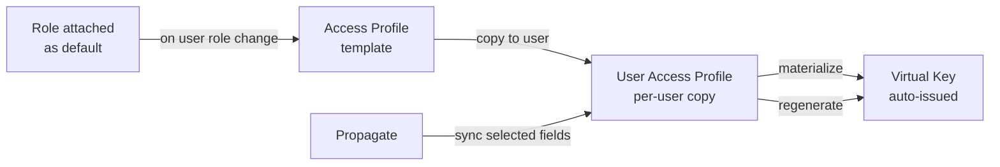

## Overview

An **Access Profile** is a reusable policy template that describes what a user,team or business unit is allowed to do once they are granted access. When you assign a profile to an entity (directly or by attaching it to a role they hold), Bifrost Enterprise creates a per-user copy of the policy and automatically issues a virtual key for them. The virtual key carries the policy's provider list, model whitelist, budgets, rate limits, and MCP tool access. Users never need to be handed raw keys, and operators never need to write keys by hand.

<Info>
  For rest of the article we will focus on access profiles for users. But the same principles apply
  to access profiles for teams and business units.
</Info>

**Key benefits:**

- **Reusable policy** - Define a profile once (for example, "Engineering") and apply it to every user in a role.
- **Per-user enforcement** - Each user gets an independent copy with isolated budget and rate-limit counters.
- **Role-default auto-assignment** - Mark a profile as a role's default and new users in that role are provisioned automatically.
- **Safe propagation** - Edit the template, then push selected fields (budgets only, MCP only, and so on) to every user copy in one call.
- **Managed virtual keys** - Auto-issued keys are write-protected so a user cannot weaken their own policy by editing the key directly.
- **Audit and versioning** - Every change to a profile is recorded with a full snapshot history.

<Info>
  For the full API contract (every endpoint, request and response shape, error codes), see the
  **Access Profiles** section of the [API Reference](/api-reference).
</Info>

<Note>
  We are also adding access-profile support for teams and business units in upcoming releases.
</Note>

---

## How it works

### Template, user copy, virtual key



1. **Template** - The Access Profile is the policy you author. Each policy lives once in the workspace.
2. **User copy** - When a user becomes eligible for a profile, Bifrost clones the template into a per-user copy with fresh budget and rate-limit counters. Each user accumulates usage independently.
3. **Virtual key** - Bifrost issues a virtual key whose provider configs, budgets, rate limit, and MCP configs are built from the user copy. The key is marked profile-managed so it cannot be edited around the policy.

### Role-default auto-assignment

When an Access Profile is attached to a role and marked as the default for that role, two flows kick in:

- **Existing users in that role** - Optionally provisioned at attach time.
- **Users gaining the role later** - Automatically provisioned the moment their role changes.

Role changes only replace assignments that came from a role default. Profiles assigned directly to a user (not via a role default) are preserved across role changes.

### Managed virtual keys

Virtual keys issued by an Access Profile are tagged as profile-managed. Direct edits to the key are blocked, except for cosmetic fields like name and description. To change what a managed key allows, edit the template and propagate. This prevents a user with key-edit permission from circumventing the profile.

---

## Configuration (Web UI)

### Browse and create profiles

1. Navigate to **Workspace** -> **Governance & Access Control** -> **Access Profiles**.

<Frame>
  
</Frame>

The table shows **Name**, **Description**, **Providers**, **Budgets**, **Rate Limit** and per-row actions.

2. Use **Search** or the active/inactive filter to narrow the list. Page size is 25.
3. Click **Create Profile**. The create sheet opens.

### Fill in the basics

<Frame>
  
</Frame>

- **Name** - Required, unique, trimmed. Max 255 characters.
- **Description** - Optional, shown in the list view.

### Configure provider access

In the **Allowed Providers** accordion, add providers from the multi-select. For each provider:

<Frame>
  
</Frame>

- **Allowed Models** - Toggle **All Models** to allow every model, or pick specific models from the search-filtered list. An empty selection denies every model from that provider.
- **Provider Budget** - Add one or more budget lines. Each line has a **max limit** and a **reset duration** (`1h`, `1d`, `1w`, `1M`, `1Y`). You can stack multiple lines with different durations (for example, a hard hourly cap plus a softer monthly cap).
- **Maximum Tokens** - Per-provider token rate limit.
- **Maximum Requests** - Per-provider request rate limit.

### Configure global budget and rate limits

Below the provider section, add **Global Budget Configuration** lines (these apply across all providers). Then set global rate limits for tokens and requests using the same number-plus-duration pattern.

### Toggle calendar alignment

Flip **Align to calendar cycle** to reset budgets and rate limits at the start of each calendar period (1st of the month, beginning of the week, midnight UTC for daily) instead of rolling from the creation time. This only applies to durations of one day or longer.

### Configure MCP tool access

<Frame>
  
</Frame>

- **Tool Groups** - Multi-select existing [MCP Tool Groups](/enterprise/mcp-tool-groups) to grant. Selected groups appear as removable badges.
- **MCP Servers** - Multi-select MCP servers. Granting a server means "all tools from this server".
- **Individual Tool Overrides** - Add specific tools with either `include` or `exclude` action. Use this for surgical adjustments that the group + server selection does not express.

<Warning>
  If you grant a whole MCP server (allow-all on that client) and then add an `exclude` override
  targeting the same client, the form shows a conflict alert and saving is rejected. A virtual key
  can only carry positive allowlists per client; "all minus X" cannot be represented.
</Warning>

### Save and assign

Click **Create**. To make the profile take effect for users, attach it to one or more roles from the Roles page:

<Frame>
  
</Frame>

For each attachment you can:

- **Set as default for new users** - Auto-assign the profile when users gain this role.
- **Apply to existing users with this role** - Provision the profile to everyone who already holds the role.

### Propagate changes

When you edit an existing profile, the action bar shows **Save** (template-only edit) and **Save and Propagate** (template edit plus immediate propagation to all user copies). The propagate dialog lets you choose exactly which fields to push:

<Frame>
  
</Frame>

- Check the fields to propagate: **Provider Configurations**, **Budgets**, **Rate Limit**, **MCP
  Tool Groups**, **MCP Servers**, **MCP Tool Overrides**. - Click **Propagate** to apply. The response
  reports how many users were updated, failed, or skipped.

By default, propagation **preserves usage**: existing users keep their accumulated budget and rate-limit counters where the reset durations match.

### Extend individual budgets for a user

Access profile budgets apply uniformly to everyone assigned the template. When you need a one-off override for a specific user — without touching the template for the rest of the role — you can attach an additional per-model budget or rate limit directly to that user via [Model Limits](/features/governance/model-limits).

For example, if Alice is on the Engineering profile but you want to add a separate $20/month cap on Claude Opus just for her, you can create a user-scoped model limit for Alice without changing what the Engineering profile gives everyone else. These limits stack independently alongside the profile budget; both must pass for a request to be allowed, and they are not affected by profile propagation. See [Give one user an individual per-model budget](#give-one-user-an-individual-per-model-budget) for steps for the above.

### Edit, duplicate, delete

Each row action exposes:

<Frame>
  
</Frame>

- **Edit** - Opens the same form in edit mode.
- **Duplicate** - Opens the form pre-populated with the original; budgets and rate limits get fresh identifiers on save.
- **Delete** - Asks to confirm. Blocked if any users still hold a copy; detach role attachments or remove user assignments first.

For programmatic configuration (every endpoint, body shape, and error code), see the **Access Profiles** section of the [API Reference](/api-reference).

---

## What you can configure

A profile carries the following pieces of policy. Use the UI walkthrough above for guidance and see the [API Reference](/api-reference) for exact field shapes.

- **Provider access** - For each LLM provider: an allow-all toggle or an explicit model allowlist, plus optional per-provider budgets and rate limits.
- **Global budgets** - Workspace-wide spend caps with reset durations of `1h`, `1d`, `1w`, `1M`, or `1Y`. Multiple budget lines can stack so you can combine a hard short-window cap with a softer long-window cap.
- **Global rate limits** - Token and request caps with the same reset durations.
- **Calendar alignment** - When on, budgets and rate limits reset at the start of each calendar period (midnight UTC, week start, month start) instead of rolling from creation time. Applies to durations of one day or longer.
- **MCP tool access** - Reference [MCP Tool Groups](/enterprise/mcp-tool-groups), grant entire MCP servers, or override individual tools with include/exclude actions.
- **Tags** - Up to 50 free-form tags for filtering and grouping in the UI.
- **Active flag** - Activate or deactivate without deleting; deactivated profiles are hidden from selection but user copies stay intact.

Profiles can be cloned into new templates, propagated to user copies one field set at a time, and inspected through a version history and an audit log.

---

## Examples

### Auto-assign Engineering profile to the Engineer role

1. Create the profile through the UI or API with the desired provider configs, budgets, and MCP access.
2. From the Engineer role, attach the profile and mark it default for new users. Toggle "Apply to existing users" to backfill current members.
3. Bifrost issues a virtual key for every member of the Engineer role and continues to auto-issue for any user who later gains the role.

### Raise the monthly budget without resetting accumulated usage

1. Edit the template and set the new monthly budget.
2. Open the propagate dialog. Check only **Budgets**.
3. Click **Propagate**. The new budget is pushed to every assigned user; each user's current month-to-date usage is preserved (default behavior).

### Tighten MCP access only

1. Edit the template and replace the MCP tool group reference.
2. Open the propagate dialog. Check **MCP Tool Groups**, **MCP Servers**, and **MCP Tool Overrides**. Leave budgets and rate limits unchecked.
3. Click **Propagate**. Budgets and rate limits are not touched; only MCP access changes flow through.

### Give one user an individual per-model budget

1. Navigate to **Budget & Limits → Model Limits** and click **Add Model Limit**.
2. Select a **Provider** and **Model Name**, set **Scope** to `User`, and pick the target user.
3. Add one or more budget lines and any rate limits. Click **Create Limit**.

Or via the API:

```bash
curl -X POST "http://localhost:8080/api/governance/model-configs" \
  -H "Content-Type: application/json" \
  -d '{
    "model_name": "claude-opus-4-8",
    "provider": "anthropic",
    "scope": "user",
    "scope_id": "<user-id>",
    "budgets": [
      { "max_limit": 20.00, "reset_duration": "1M" }
    ]
  }'
```

---

## Next steps

- **[Data Access Control](/enterprise/data-access-control)** - Scope which profiles each operator can see.
- **[RBAC](/enterprise/rbac)** - Define the roles that profiles auto-attach to.
- **[Virtual Keys](/features/governance/virtual-keys)** - Understand the underlying virtual key concept.
- **[MCP Tool Groups](/enterprise/mcp-tool-groups)** - Bundle MCP tools for reuse inside profiles.
- **[Audit Logs](/enterprise/audit-logs)** - Cross-reference profile changes with downstream impact.