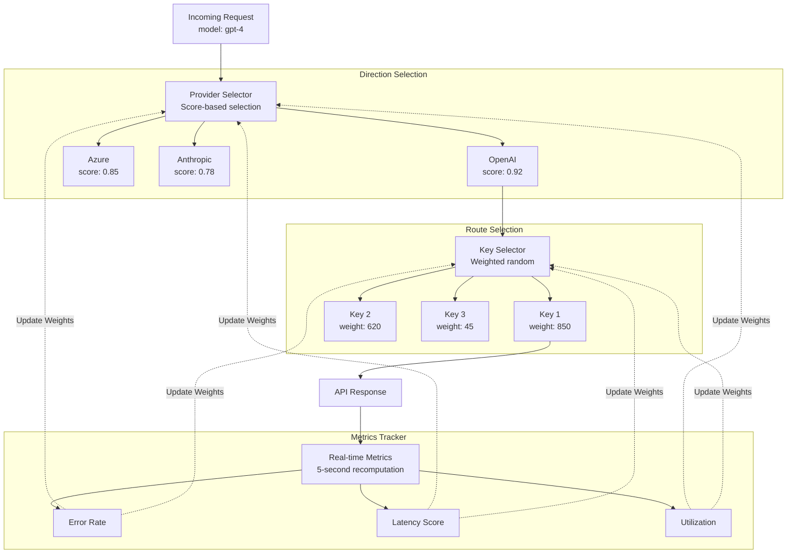
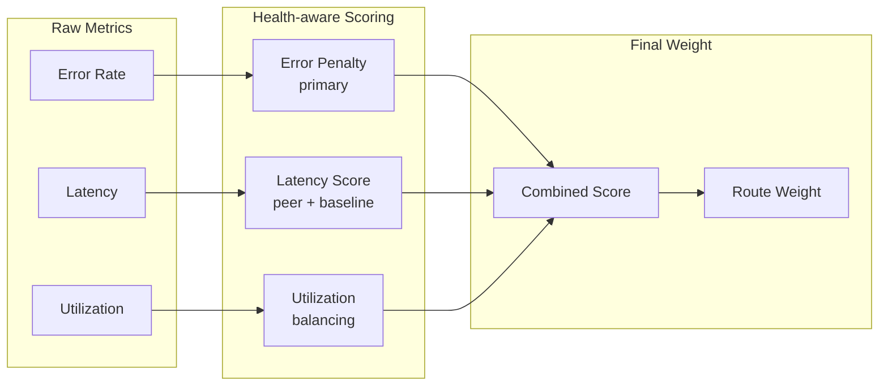

<Info>
**Looking for comprehensive provider routing documentation?**

For a detailed guide covering how adaptive load balancing works with governance routing, the two-level architecture (provider + key selection), Model Catalog integration, and example scenarios, see the [**Provider Routing Guide**](/providers/provider-routing).

This page focuses on the technical implementation and performance characteristics of adaptive load balancing.
</Info>

## Overview

<Frame>
  
</Frame>

**Adaptive Load Balancing** in Bifrost Enterprise automatically optimizes traffic distribution across providers and keys based on real-time performance metrics. The system operates at **two levels** - provider selection (direction) and key selection (route) - continuously monitoring error rates, latency, and throughput to dynamically adjust weights, ensuring optimal performance and reliability.

| Feature | Description |
|---------|-------------|
| **Dynamic Weight Adjustment** | Automatically adjusts key weights based on performance metrics |
| **Real-time Performance Monitoring** | Tracks error rates, latency, and success rates per model-key combination |
| **Cross-Node Coordination** | Nodes share rate-limit (TPM) signals so an overloaded key is backed off fleet-wide within a region |
| **Circuit Breaker Integration** | Temporarily removes poorly performing keys from rotation |
| **Fast Recovery** | Recovering routes are favored so they climb back quickly after transient failures |

<Tip>
**Zero-overhead design**: All route selection logic adds less than **10 microseconds** to hot path latency. Weight calculations happen asynchronously every 5 seconds, so request routing uses pre-computed weights with minimal overhead.
</Tip>

---

## Architecture

The load balancing system operates at two levels:

- **Direction-level** (provider + model): Decides which provider to use for a given model
- **Route-level** (provider + model + key): Decides which API key to use within a provider

This two-tier approach enables both macro-level provider selection and micro-level key optimization.



---

## How Weight Calculation Works

Every 5 seconds, the system recalculates a weight for each route from its recent
performance. Three signals drive the score, in priority order:

| Factor | Role | Purpose |
|--------|------|---------|
| **Error Penalty** | Primary | Penalizes routes with high error rates |
| **Latency Score** | Secondary | Penalizes routes that are slow relative to their peers and to their own baseline |
| **Utilization** | Tuning | Discourages overloading any single high-performing route |

Which signals apply depends on the route's health: healthy routes are scored mainly
on errors and latency, while routes that are actively recovering are scored on latency
and recovery progress so they aren't held back by stale error history. The combined
score maps to a weight on a fixed scale - lower penalties mean higher weight, which
means more traffic - with a floor so no route is ever fully starved while it has a
chance to recover.



---

## Key Capabilities

1. **Automatic Route Health Management**: Routes automatically transition between 4 states (Healthy, Degraded, Failed, Recovering) based on error rates and latency. No manual intervention required when a route fails or recovers.

2. **Fair Traffic Distribution**: The system prevents any single route from being overloaded while still favoring better performers. Low-weight routes always get minimum traffic to prove recovery.

3. **Real-time Dashboard**: Provides visibility into weight distribution, performance metrics (error rates, latency), state transitions, and actual vs expected traffic per route.

<Frame>
  
</Frame>

4. **Multi-Factor Scoring**: Routes are scored from error rate (the primary, time-decayed signal), a token-aware latency score (comparing a route both to its peers and to its own recent baseline), and fair-share utilization. Recovering routes are scored to favor quick, safe recovery.

5. **Smart Key Selection**: Traffic is distributed probabilistically - higher-weight keys get proportionally more requests, but lower-weight keys keep a small share so potentially-recovered routes are continually re-probed instead of always picking the single best route.

6. **Performance Thresholds**: Pre-tuned error-rate and latency triggers drive state transitions - a route is marked Degraded at the first signs of trouble, Failed on sustained errors or a rate-limit hit, and promoted back to Healthy only after it has proven itself on live traffic.

<Tip>
The system is designed to be self-healing: it penalizes failing routes quickly, but also decays those penalties rapidly once issues are fixed, so a recovered route returns to full traffic within seconds.
</Tip>

---

## Configuration

Adaptive load balancing ships **pre-tuned** - the scoring weights, thresholds, and recovery timings are not user-configurable by design. The operator controls are five switches:

| Setting | Default | Effect |
|---------|---------|--------|
| **Provider selection** (`direction_selection_enabled`) | On | Whether the system picks the provider (Level 1). A request that already carries a provider keeps it as the primary. Off ⇒ Level 1 leaves the request's provider and fallback list untouched (key selection is toggled separately). |
| **Key selection** (`route_selection_enabled`) | On | Whether per-key (Level 2) selection is adaptive. Off ⇒ keys are chosen by static weighted-random (metrics are still tracked). |
| **Append fallbacks to pinned requests** (`append_fallbacks_to_pinned`) | Off | A request that already carries a provider still gets the healthy providers eligible for its model appended as fallbacks behind any it configured (with pruning and model normalization applied). Off ⇒ a pinned request passes through untouched, apart from re-routing below. |
| **Re-route failed providers** (`reroute_failed_directions`) | Off | If a pinned provider's direction is circuit-broken, re-route the request to a healthy provider for the same model. When no healthier provider exists, the pinned provider is kept. |
| **Prune failed fallbacks** (`prune_failed_fallbacks`) | Off | Drop circuit-broken providers from a request's configured fallback list. |

The two selection switches default **on**; the three pinned/failed-direction behaviors are **opt-in**. All five take effect live (no restart) and propagate across the cluster.

All five switches can be changed from the dashboard, via the API, or in `config.json`.

<Tabs>
<Tab title="Web UI">

The load balancer settings page exposes the five switches; changes apply immediately across the cluster.

<Frame>
  
</Frame>

</Tab>
<Tab title="API">

Read and update the settings through `/api/load-balancer-config`:

```bash
# Read the current settings
curl http://localhost:8080/api/load-balancer-config

# Update the settings - always send all five fields
curl -X PUT http://localhost:8080/api/load-balancer-config \
  -H "Content-Type: application/json" \
  -d '{
    "direction_selection_enabled": true,
    "route_selection_enabled": true,
    "append_fallbacks_to_pinned": false,
    "reroute_failed_directions": true,
    "prune_failed_fallbacks": false
  }'
```

The update is persisted, applied to the running nodes immediately, and broadcast to cluster peers.

<Warning>
The `PUT` body is a full replacement, not a patch: any field omitted from the request body is set to `false`. Always send all five fields - sending only the field you want to change silently turns off the others (including the default-on selection switches).
</Warning>

</Tab>
<Tab title="config.json">

Add a top-level `load_balancer_config` block:

```json
{
  "load_balancer_config": {
    "direction_selection_enabled": true,
    "route_selection_enabled": true,
    "append_fallbacks_to_pinned": false,
    "reroute_failed_directions": true,
    "prune_failed_fallbacks": false
  }
}
```

Unlike the API, this block is presence-aware: omitted fields keep their current values, so you only need to list the switches you want to change. Settings saved through the dashboard or the API take precedence over `config.json` values.

</Tab>
</Tabs>

## Scope & Limitations

- **Pinned requests can still get fallbacks**: With provider selection on and the append-fallbacks-to-pinned switch enabled, a request that pins a provider — even one that configures no fallbacks of its own — receives the healthy providers eligible for its model as a fallback chain, so a failing primary fails over instead of failing fast. With the switch off (its default), a pinned request's provider and fallback list are left untouched.
- **Per-node weights**: Each node load-balances on its own observed metrics. The only signal shared across nodes is a rate-limit (TPM) backoff, and only within the same region - there is no global weight consensus or cross-region coordination. This is deliberate: latency and error profiles differ per region, so importing another region's metrics would pollute a node's view of route health.
- **~5-second adaptation**: Weight and state changes lag live traffic by up to one recompute cycle. Immediate per-request resilience (key rotation and fallback failover) is handled separately and is not subject to this delay.
- **Optimistic cold start**: A brand-new key or provider enters at full weight and competes at roughly fair share before it has been measured, then self-corrects within a cycle or two.
- **Relative, not absolute**: Routes are ranked against their peers, not against a fixed latency or cost target. The system is not cost-, org-, or session-aware, and does not accept manual per-key weights for the adaptive path - those concerns are handled by [governance routing](/providers/provider-routing).

---

## Next Steps

- **[Provider Routing](/providers/provider-routing)** - How adaptive load balancing composes with governance rules and the Model Catalog
- **[Circuit Breaker](./circuit-breaker)** - Header-signal-driven failover to a backup provider when a primary endpoint degrades
- **[Clustering](./clustering)** - Multi-node deployments and the gossip layer behind cross-node load balancer signals
