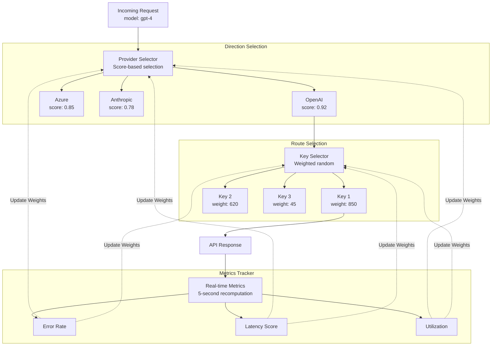
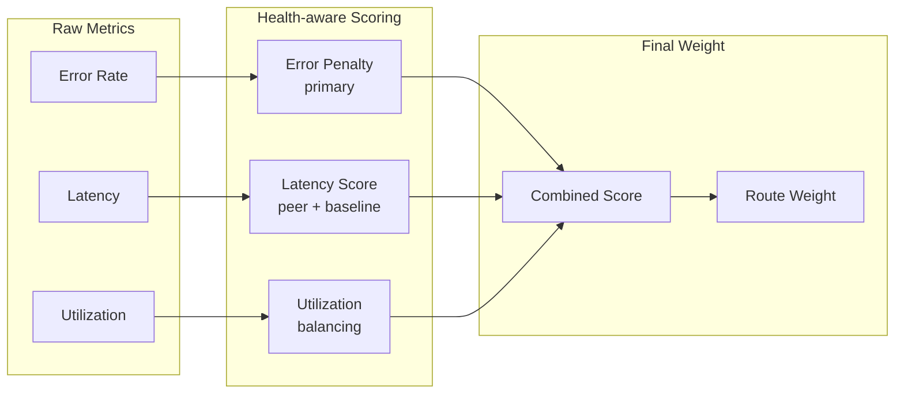

<Info>
**Looking for comprehensive provider routing documentation?**

For a detailed guide covering how adaptive load balancing works with governance routing, the two-level architecture (provider + key selection), Model Catalog integration, and example scenarios, see the [**Provider Routing Guide**](/providers/provider-routing).

This page focuses on the technical implementation and performance characteristics of adaptive load balancing.
</Info>

## Overview

**Adaptive Load Balancing** in Bifrost Enterprise automatically optimizes traffic distribution across providers and keys based on real-time performance metrics. The system operates at **two levels** - provider selection (direction) and key selection (route) - continuously monitoring error rates, latency, and throughput to dynamically adjust weights, ensuring optimal performance and reliability.

### Key Features

| Feature | Description |
|---------|-------------|
| **Dynamic Weight Adjustment** | Automatically adjusts key weights based on performance metrics |
| **Real-time Performance Monitoring** | Tracks error rates, latency, and success rates per model-key combination |
| **Cross-Node Coordination** | Cluster nodes share circuit-breaker signals so an overloaded key is backed off fleet-wide |
| **Circuit Breaker Integration** | Temporarily removes poorly performing keys from rotation |
| **Fast Recovery** | Recovering routes are favored so they climb back quickly after transient failures |

<Tip>
**Zero-overhead design**: All route selection logic adds less than **10 microseconds** to hot path latency. Weight calculations happen asynchronously every 5 seconds, so request routing uses pre-computed weights with minimal overhead.
</Tip>

---

## Architecture

The load balancing system operates at two levels:

- **Direction-level** (provider + model): Decides which provider to use for a given model
- **Route-level** (provider + model + key): Decides which API key to use within a provider

This two-tier approach enables both macro-level provider selection and micro-level key optimization.

---

## How Weight Calculation Works

Every 5 seconds, the system recalculates a weight for each route from its recent
performance. Three signals drive the score, in priority order:

| Factor | Role | Purpose |
|--------|------|---------|
| **Error Penalty** | Primary | Penalizes routes with high error rates |
| **Latency Score** | Secondary | Penalizes routes that are slow relative to their peers and to their own baseline |
| **Utilization** | Tuning | Discourages overloading any single high-performing route |

Which signals apply depends on the route's health: healthy routes are scored mainly
on errors and latency, while routes that are actively recovering are scored on latency
and recovery progress so they aren't held back by stale error history. The combined
score maps to a weight on a fixed scale — lower penalties mean higher weight, which
means more traffic — with a floor so no route is ever fully starved while it has a
chance to recover.

---

## Key Capabilities

1. **Automatic Route Health Management**: Routes automatically transition between 4 states (Healthy, Degraded, Failed, Recovering) based on error rates and latency. No manual intervention required when a route fails or recovers.

2. **Fair Traffic Distribution**: The system prevents any single route from being overloaded while still favoring better performers. Low-weight routes always get minimum traffic to prove recovery.

3. **Real-time Dashboard**: Provides visibility into weight distribution, performance metrics (error rates, latency), state transitions, and actual vs expected traffic per route.

<Frame>
  
</Frame>

4. **Multi-Factor Scoring**: Routes are scored from error rate (the primary, time-decayed signal), a token-aware latency score (comparing a route both to its peers and to its own recent baseline), and fair-share utilization. Recovering routes are scored to favor quick, safe recovery.

5. **Smart Key Selection**: Traffic is distributed probabilistically — higher-weight keys get proportionally more requests, but lower-weight keys keep a small share so potentially-recovered routes are continually re-probed instead of always picking the single best route.

6. **Performance Thresholds**: Specific triggers drive state transitions -&gt; 2% error rate triggers Degraded, &gt;5% error rate or TPM hit triggers Failed, &lt;2% error with 50%+ expected traffic triggers Healthy.

<Tip>
The system is designed to be self-healing: it penalizes failing routes quickly, but also decays those penalties rapidly once issues are fixed, so a recovered route returns to full traffic within seconds.
</Tip>

---

## Next Steps

<Steps>
  <Step title="Enable Adaptive Load Balancing">
    Contact your Bifrost Enterprise representative to enable adaptive load balancing for your deployment
  </Step>
  <Step title="Monitor Weight Distribution">
    Use the dashboard to observe how weights adapt to real traffic patterns
  </Step>
  <Step title="Analyze Performance">
    Review route state transitions and weight adjustments to understand system behavior
  </Step>
</Steps>
