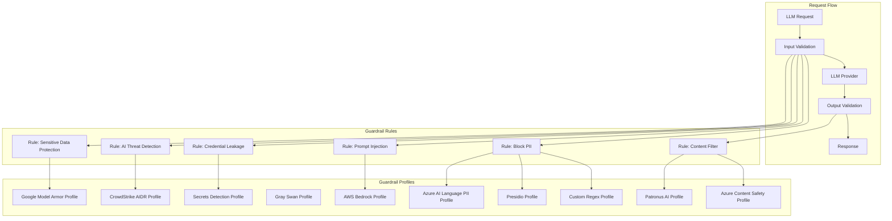

## Overview

**Guardrails** in Bifrost provide enterprise-grade content safety, security validation, and policy enforcement for LLM requests and responses. The system validates inputs and outputs in real-time against your specified policies, ensuring responsible AI deployment with protection against harmful content, prompt injection, PII leakage, credential leakage, and policy violations.

<Frame>
  
</Frame>

### Supported Providers

<CardGroup cols={2}>
  <Card title="Secrets Detection" icon="key" href="/enterprise/guardrails/secrets-detection">
    Built-in Gitleaks-backed detection for leaked API keys, tokens, private keys, and credentials.
  </Card>
  <Card title="Custom Regex" icon="code" href="/enterprise/guardrails/custom-regex">
    In-process regex guardrails, including the built-in PII Detection template.
  </Card>
  <Card title="Microsoft Presidio" icon="microsoft" href="/integrations/guardrails/presidio">
    Presidio Analyzer based PII detection, blocking, and redaction.
  </Card>
  <Card title="Azure AI Language PII" icon="microsoft" href="/integrations/guardrails/azure-language-pii">
    Azure Language PII entity recognition with configurable categories and redaction.
  </Card>
  <Card title="AWS Bedrock Guardrails" icon="aws" href="/integrations/guardrails/aws-bedrock">
    Enterprise content filtering, PII detection, and prompt attack prevention.
  </Card>
  <Card title="Azure Content Safety" icon="microsoft" href="/integrations/guardrails/azure-content-safety">
    Multi-modal content moderation with severity-based filtering.
  </Card>
  <Card title="Google Model Armor" icon="/media/google-model-armor-card.svg" href="/integrations/guardrails/google-model-armor">
    Google Cloud policy enforcement for prompt injection, content safety, malicious URLs, and Sensitive Data Protection.
  </Card>
  <Card title="CrowdStrike AIDR" icon="/media/crowdstrike-card.svg" href="/integrations/guardrails/crowdstrike-aidr">
    Inline AI threat detection, policy enforcement, redaction, and AIDR audit visibility.
  </Card>
  <Card title="Gray Swan Cygnal" icon="/media/grayswan-logo-card.svg" href="/integrations/guardrails/grayswan">
    AI safety monitoring with natural language rule definitions.
  </Card>
  <Card title="Patronus AI" icon="/media/patronus-logo-card.svg" href="/integrations/guardrails/patronus-ai">
    LLM security, hallucination detection, and safety evaluation.
  </Card>
</CardGroup>

### Core Concepts

Bifrost Guardrails are built around two core concepts that work together to provide flexible and powerful content protection:

| Concept | Description |
|---------|-------------|
| **Rules** | Custom policies defined using CEL (Common Expression Language) that determine what content to validate and when. Rules can apply to inputs, outputs, or both, and can be linked to one or more profiles for evaluation. |
| **Profiles** | Configurations for guardrail providers, including Bifrost-native providers (Custom Regex, Secrets Detection) and external providers (Presidio, Azure AI Language PII, AWS Bedrock, Azure Content Safety, Google Model Armor, CrowdStrike AIDR, Gray Swan, Patronus AI). Profiles are reusable and can be shared across multiple rules. |

**How They Work Together:**
- **Profiles** define *how* content is evaluated using native Bifrost checks or external provider capabilities
- **Rules** define *when* and *what* content gets evaluated using CEL expressions
- A single rule can use multiple profiles for layered protection
- Profiles can be reused across different rules for consistency

### Key Features

| Feature | Description |
|---------|-------------|
| **Multi-Provider Support** | Bifrost-native Custom Regex and Secrets Detection, plus Presidio, Azure AI Language PII, AWS Bedrock, Azure Content Safety, Google Model Armor, CrowdStrike AIDR, Gray Swan, and Patronus AI integrations |
| **Dual-Stage Validation** | Guard both inputs (prompts) and outputs (responses) |
| **Real-Time Processing** | Synchronous and asynchronous validation modes |
| **CEL-Based Rules** | Define custom policies using Common Expression Language |
| **Reusable Profiles** | Configure providers once, use across multiple rules |
| **Sampling Control** | Apply rules to a percentage of requests for performance tuning |
| **Automatic Remediation** | Detect, block, redact, or modify content based on policy |
| **Bifrost-Managed Redaction** | Redact runtime payloads, Bifrost logs, and trace-export connector content for supported providers |
| **Comprehensive Logging** | Detailed audit trails for compliance |

### Redaction

Supported providers can redact detected text instead of only detecting or blocking it. Bifrost supports three redaction modes:

- **Runtime** (`runtime`) redacts the live request or response and stores redacted values in logs.
- **Logs only** (`logs_only`) leaves runtime content raw but redacts Bifrost logs and trace-export connector content.
- **Runtime + reversible logs** (`runtime_reversible`) redacts runtime content and logs with reversible placeholders.

For the full behavior matrix, reveal permissions, and connector export caveats, see [Guardrail Redaction](/enterprise/guardrails/redaction).

### Navigating Guardrails in the UI

Access Guardrails from the Bifrost dashboard:

| Page | Path | Description |
|------|------|-------------|
| **Configuration** | Guardrails > Configuration | Manage guardrail rules and their settings |
| **Providers** | Guardrails > Providers | Configure and manage guardrail profiles |

### Architecture

The following diagram illustrates how Rules and Profiles work together to validate LLM requests:



**Flow Description:**
1. **Incoming Request** - LLM request arrives at Bifrost
2. **Input Validation** - Applicable rules evaluate the input using linked profiles
3. **LLM Processing** - If input passes, request is forwarded to the LLM provider
4. **Output Validation** - Response is evaluated by output rules using linked profiles
5. **Response** - Validated response is returned (or blocked/modified based on violations)

---

## Streaming Output Guardrails

When an output guardrail is used with a streaming response, Bifrost accumulates the response until the model is done generating it, then checks the full response. If the response passes, Bifrost sends it to the client. If a guardrail blocks or changes the response, Bifrost applies that result instead.

This adds time before the client receives output: Bifrost waits for response generation and guardrail evaluation to finish. The added wait depends on the model's generation time and the configured guardrail profiles.

Input guardrails check the request before Bifrost sends it to the LLM provider.

<Note>
  Gray Swan is a tool-call-specific exception. Text-only streams are delivered directly to the client and are not sent to Cygnal. See [Gray Swan Cygnal](/integrations/guardrails/grayswan#streaming-output-and-tool-calls) for the full behavior.
</Note>

<Note>
  If the same rule also uses another output guardrail profile, Bifrost waits for that profile to check the completed response. Gray Swan's text-only behavior only skips the Gray Swan call; it does not bypass the other profile.
</Note>

---

## Guardrail Rules

Guardrail Rules are custom policies that define when and how content validation occurs. Rules use CEL (Common Expression Language) expressions to evaluate requests and can be linked to one or more profiles for execution.

<Frame>
  
</Frame>

### Rule Properties

| Property | Type | Required | Description |
|----------|------|----------|-------------|
| `id` | integer | Yes | Unique identifier for the rule |
| `name` | string | Yes | Descriptive name for the rule |
| `description` | string | No | Explanation of what the rule does |
| `enabled` | boolean | Yes | Whether the rule is active |
| `cel_expression` | string | Yes | CEL expression for rule evaluation |
| `apply_to` | enum | Yes | When to apply: `input`, `output`, or `both` |
| `sampling_rate` | integer | No | Percentage of requests to evaluate (0-100) |
| `timeout` | integer | No | Execution timeout in seconds (default: 60) |
| `provider_config_ids` | array | No | IDs of profiles to use for evaluation |

### Creating Rules

<Tabs group="rules-config">
<Tab title="Web UI">
1. **Navigate to Rules**
   - Go to **Guardrails** > **Configuration**
   - Click **Add Rule**

<Frame>

</Frame>


2. **Configure Rule Settings**

**Basic Information:**
- **Name**: Enter a descriptive name (e.g., "Block PII in Prompts")
- **Description**: Explain the rule's purpose
- **Enabled**: Toggle to activate the rule

**Evaluation Settings:**
- **Apply To**: Select when to apply the rule
  - `input` - Validate incoming prompts only
  - `output` - Validate LLM responses only
  - `both` - Validate both inputs and outputs
- **CEL Expression**: Define the validation logic
- **Sampling Rate**: Set percentage of requests to evaluate (default: 100%)
- **Timeout**: Set maximum execution time in seconds (default: 60)

3. **Link Profiles**
   - Select one or more profiles to use for evaluation
   - Rules will execute all linked profiles in sequence

4. **Save and Test**
   - Click **Save Rule**
   - Use the **Test** button to validate with sample content

</Tab>
<Tab title="API">

The HTTP API uses camelCase field names (`celExpression`, `applyTo`, `samplingRate`, `selectedGuardrailProfiles`). Profiles are referenced as `"<provider-type>:<config-id>"` strings (for example, `"regex:1"`, `"patronus-ai:6"`).

**Create a Guardrail Rule:**
```bash
curl -X POST http://localhost:8080/api/guardrails/rules \
  -H "Content-Type: application/json" \
  -d '{
    "name": "Block PII in Prompts",
    "description": "Prevent PII from being sent to LLM providers",
    "enabled": true,
    "celExpression": "request.messages.exists(m, m.role == \"user\")",
    "applyTo": "input",
    "samplingRate": 100,
    "timeout": 5000,
    "selectedGuardrailProfiles": ["regex:1", "bedrock:2"]
  }'
```

**List All Rules:**
```bash
curl -X GET http://localhost:8080/api/guardrails/rules \
  -H "Content-Type: application/json"

# Response
{
  "count": 1,
  "limit": 1,
  "offset": 0,
  "rules": [
    {
      "id": 1,
      "name": "Block PII in Prompts",
      "description": "Prevent PII from being sent to LLM providers",
      "enabled": true,
      "celExpression": "request.messages.exists(m, m.role == \"user\")",
      "applyTo": "input",
      "samplingRate": 100,
      "timeout": 5000,
      "selectedGuardrailProfiles": ["regex:1", "bedrock:2"]
    }
  ]
}
```

**Update a Rule:**

`PUT` revalidates against the full rule schema. Send the complete rule body (same shape as `POST`), not a patch.
```bash
curl -X PUT http://localhost:8080/api/guardrails/rules/1 \
  -H "Content-Type: application/json" \
  -d '{
    "name": "Block PII in Prompts",
    "description": "Prevent PII from being sent to LLM providers",
    "enabled": false,
    "celExpression": "request.messages.exists(m, m.role == \"user\")",
    "applyTo": "input",
    "samplingRate": 50,
    "timeout": 5000,
    "selectedGuardrailProfiles": ["regex:1", "bedrock:2"]
  }'
```

**Delete a Rule:**
```bash
curl -X DELETE http://localhost:8080/api/guardrails/rules/1
```

</Tab>
<Tab title="config.json">

```json
{
  "guardrails_config": {
    "guardrail_rules": [
      {
        "id": 1,
        "name": "Block PII in Prompts",
        "description": "Prevent PII from being sent to LLM providers",
        "enabled": true,
        "cel_expression": "request.messages.exists(m, m.role == \"user\")",
        "apply_to": "input",
        "sampling_rate": 100,
        "timeout": 5000,
        "provider_config_ids": [1, 2]
      },
      {
        "id": 2,
        "name": "Content Filter for Responses",
        "description": "Filter harmful content from LLM responses",
        "enabled": true,
        "cel_expression": "true",
        "apply_to": "output",
        "sampling_rate": 100,
        "timeout": 3000,
        "provider_config_ids": [2]
      },
      {
        "id": 3,
        "name": "Prompt Injection Detection",
        "description": "Detect and block prompt injection attempts",
        "enabled": true,
        "cel_expression": "request.messages.size() > 0",
        "apply_to": "input",
        "sampling_rate": 100,
        "timeout": 2000,
        "provider_config_ids": [1]
      }
    ]
  }
}
```

</Tab>
<Tab title="Helm">

```yaml
guardrails_config:
  guardrail_rules:
    - id: 1
      name: "Block PII in Prompts"
      description: "Prevent PII from being sent to LLM providers"
      enabled: true
      cel_expression: "request.messages.exists(m, m.role == 'user')"
      apply_to: "input"
      sampling_rate: 100
      timeout: 5000
      provider_config_ids: [1, 2]
    - id: 2
      name: "Content Filter for Responses"
      description: "Filter harmful content from LLM responses"
      enabled: true
      cel_expression: "true"
      apply_to: "output"
      sampling_rate: 100
      timeout: 3000
      provider_config_ids: [2]
```

</Tab>
</Tabs>

### CEL Expression Examples

CEL (Common Expression Language) provides a powerful way to define rule conditions. Here are common patterns:

**Always Apply Rule:**
```cel
true
```

**Apply to User Messages Only:**
```cel
request.messages.exists(m, m.role == "user")
```

**Apply to Messages Containing Keywords:**
```cel
request.messages.exists(m, m.content.contains("confidential"))
```

**Apply Based on Model:**
```cel
request.model.startsWith("gpt-4")
```

**Apply to Long Prompts:**
```cel
request.messages.filter(m, m.role == "user").map(m, m.content.size()).sum() > 1000
```

**Combine Multiple Conditions:**
```cel
request.model.startsWith("gpt-4") && request.messages.exists(m, m.role == "user" && m.content.size() > 500)
```

### Linking Rules to Profiles

Rules can be linked to multiple profiles for comprehensive validation:

<Frame>
  
</Frame>

**Best Practices:**
- Link credential-leakage rules to [Secrets Detection](/enterprise/guardrails/secrets-detection)
- Link PII detection rules to profiles with PII capabilities (Custom Regex PII template, Presidio, Azure AI Language PII, Bedrock, Patronus)
- Link content filtering rules to profiles with content safety features (Azure, Bedrock, Gray Swan)
- Use Gray Swan for custom natural language rules when you need flexible, readable policies
- Use multiple profiles for defense-in-depth (e.g., Bedrock + Patronus for PII, Azure + Gray Swan for content)
- Set appropriate timeouts when using multiple profiles

---

## Managing Profiles

Profiles are reusable configurations for guardrail providers. External providers include credentials, endpoints, and detection thresholds. Bifrost-native providers such as Custom Regex and Secrets Detection run locally and do not require external service credentials.

<Frame>
  
</Frame>

### Profile Properties

| Property | Type | Required | Description |
|----------|------|----------|-------------|
| `id` | integer | Yes | Unique identifier for the profile |
| `provider_name` | string | Yes | Provider type: `regex`, `secrets`, `presidio`, `azure-pii`, `bedrock`, `azure`, `model-armor`, `crowdstrike-aidr`, `grayswan`, `patronus-ai` |
| `policy_name` | string | Yes | Descriptive name for the policy |
| `enabled` | boolean | Yes | Whether the profile is active |
| `config` | object | No | Provider-specific configuration |

### Creating Profiles

<Tabs group="profiles-config">
<Tab title="Web UI">

1. **Navigate to Providers**
   - Go to **Guardrails** > **Providers**
   - Click **Add Profile**

<Frame>
  
</Frame>

2. **Select Provider Type**
   - Choose from: Secrets Detection, Custom Regex, AWS Bedrock, Azure Content Safety, Google Model Armor, CrowdStrike AIDR, Gray Swan, or Patronus AI

3. **Configure Provider Settings**
   - Enter credentials and endpoint information for external providers, or local settings for native providers
   - Configure detection thresholds and actions
   - See provider-specific setup sections above for detailed configuration

4. **Save Profile**
   - Click **Save Profile**
   - The profile is now available for linking to rules

</Tab>
<Tab title="API">

Profiles are managed per provider type at `/api/guardrails/{provider}`, where `{provider}` is one of `secrets`, `regex`, `presidio`, `azure-pii`, `bedrock`, `azure`, `model-armor`, `crowdstrike-aidr`, `grayswan`, or `patronus-ai`. The API assigns the configuration ID after creation.

**Create a Profile:**
```bash
curl -X POST http://localhost:8080/api/guardrails/bedrock \
  -H "Content-Type: application/json" \
  -d '{
    "name": "PII Detection Profile",
    "enabled": true,
    "config": {
      "access_key": "env.AWS_ACCESS_KEY_ID",
      "secret_key": "env.AWS_SECRET_ACCESS_KEY",
      "guardrail_arn": "arn:aws:bedrock:us-east-1:123456789:guardrail/abc123",
      "guardrail_version": "1",
      "region": "us-east-1"
    }
  }'
```

**List All Profiles (grouped by provider):**
```bash
curl -X GET http://localhost:8080/api/guardrails \
  -H "Content-Type: application/json"

# Response
[
  {
    "name": "regex",
    "configs": [
      { "id": 1, "name": "PII Detection", "enabled": true, "patterns": [...] }
    ]
  },
  {
    "name": "bedrock",
    "configs": [
      { "id": 2, "name": "PII Detection Profile", "enabled": true, "guardrail_arn": "...", "region": "us-east-1" }
    ]
  }
]
```

To list only a single provider's profiles, hit the provider path directly: `GET /api/guardrails/bedrock`.

**Update a Profile:**
```bash
curl -X PUT http://localhost:8080/api/guardrails/bedrock \
  -H "Content-Type: application/json" \
  -d '{
    "id": 1,
    "name": "PII Detection Profile",
    "enabled": false
  }'
```

**Delete a Profile:**
```bash
curl -X DELETE http://localhost:8080/api/guardrails/bedrock \
  -H "Content-Type: application/json" \
  -d '{"id": 1}'
```

</Tab>
<Tab title="config.json">

```json
{
  "guardrails_config": {
    "guardrail_providers": [
        {
          "id": 1,
          "provider_name": "secrets",
          "policy_name": "Block Leaked Credentials",
          "enabled": true,
          "config": {
            "ignored_secret_keywords": ["example", "dummy"]
          }
        },
        {
          "id": 2,
          "provider_name": "regex",
          "policy_name": "PII Detection",
          "enabled": true,
          "config": {
            "patterns": [
              { "pattern": "\\b[A-Z0-9._%+-]+@[A-Z0-9.-]+\\.[A-Z]{2,}\\b", "description": "Email address", "flags": "i" },
              { "pattern": "\\b\\d{3}-\\d{2}-\\d{4}\\b", "description": "US Social Security Number" }
            ]
          }
        },
        {
          "id": 3,
          "provider_name": "bedrock",
          "policy_name": "PII Detection Profile",
          "enabled": true,
          "config": {
            "access_key": "env.AWS_ACCESS_KEY_ID",
            "secret_key": "env.AWS_SECRET_ACCESS_KEY",
            "guardrail_arn": "arn:aws:bedrock:us-east-1:123456789:guardrail/abc123",
            "guardrail_version": "1",
            "region": "us-east-1"
          }
        },
        {
          "id": 4,
          "provider_name": "azure",
          "policy_name": "Content Safety Profile",
          "enabled": true,
          "config": {
            "endpoint": "https://your-resource.cognitiveservices.azure.com/",
            "api_key": "env.AZURE_CONTENT_SAFETY_API_KEY",
            "analyze_enabled": true,
            "analyze_severity_threshold": "medium",
            "jailbreak_shield_enabled": true,
            "indirect_attack_shield_enabled": true
          }
        },
        {
          "id": 5,
          "provider_name": "model-armor",
          "policy_name": "Google Model Armor Production",
          "enabled": true,
          "timeout": 30,
          "config": {
            "auth_type": "default_credential",
            "project_id": "env.GCP_PROJECT_ID",
            "location": "env.GCP_LOCATION",
            "template_id": "env.GMA_TEMPLATE_ID"
          }
        },
        {
          "id": 6,
          "provider_name": "crowdstrike-aidr",
          "policy_name": "CrowdStrike AIDR Production",
          "enabled": true,
          "timeout": 30,
          "config": {
            "api_key": "env.CS_AIDR_TOKEN",
            "base_url": "env.CS_AIDR_BASE_URL",
            "app_id": "bifrost-production",
            "collector_instance_id": "prod-us-east-1"
          }
        },
        {
          "id": 7,
          "provider_name": "grayswan",
          "policy_name": "Custom Safety Rules",
          "enabled": true,
          "config": {
            "api_key": "env.GRAYSWAN_API_KEY",
            "violation_threshold": 0.5,
            "reasoning_mode": "hybrid",
            "rules": {
              "no_pii": "Do not allow personally identifiable information",
              "professional_tone": "Ensure responses maintain a professional tone"
            }
          }
        },
        {
          "id": 8,
          "provider_name": "patronus-ai",
          "policy_name": "Patronus Quality Checks",
          "enabled": true,
          "config": {
            "api_key": "env.PATRONUS_API_KEY",
            "base_url": "https://api.patronus.ai",
            "evaluators": [
              {
                "evaluator": "pii",
                "explain_strategy": "on-fail"
              },
              {
                "evaluator": "judge",
                "criteria": "patronus:is-concise",
                "explain_strategy": "on-fail"
              }
            ],
            "capture": "none"
          }
        }
      ]
    }
  }
```

</Tab>
<Tab title="Helm">

```yaml
guardrails_config:
  guardrail_providers:
    - id: 1
      provider_name: "secrets"
      policy_name: "Block Leaked Credentials"
      enabled: true
      config:
        ignored_secret_keywords:
          - "example"
          - "dummy"
    - id: 2
      provider_name: "regex"
      policy_name: "PII Detection"
      enabled: true
      config:
        patterns:
          - pattern: "\\b[A-Z0-9._%+-]+@[A-Z0-9.-]+\\.[A-Z]{2,}\\b"
            description: "Email address"
            flags: "i"
          - pattern: "\\b\\d{3}-\\d{2}-\\d{4}\\b"
            description: "US Social Security Number"
    - id: 3
      provider_name: "bedrock"
      policy_name: "PII Detection Profile"
      enabled: true
      config:
        guardrail_arn: "arn:aws:bedrock:us-east-1:123456789:guardrail/abc123"
        guardrail_version: "1"
        region: "us-east-1"
        # AWS Authentication (choose one method):
        # Option 1: Explicit credentials
        access_key: "env.AWS_ACCESS_KEY_ID"
        secret_key: "env.AWS_SECRET_ACCESS_KEY"
        # Option 2: IAM Role - omit access_key and secret_key
        # (Bifrost will use IAM credentials from the environment)
    - id: 4
      provider_name: "azure"
      policy_name: "Content Safety Profile"
      enabled: true
      config:
        endpoint: "https://your-resource.cognitiveservices.azure.com/"
        api_key: "env.AZURE_CONTENT_SAFETY_API_KEY"
        analyze_enabled: true
        analyze_severity_threshold: "medium"
        jailbreak_shield_enabled: true
    - id: 5
      provider_name: "model-armor"
      policy_name: "Google Model Armor Production"
      enabled: true
      timeout: 30
      config:
        auth_type: "default_credential"
        project_id: "env.GCP_PROJECT_ID"
        location: "env.GCP_LOCATION"
        template_id: "env.GMA_TEMPLATE_ID"
    - id: 6
      provider_name: "crowdstrike-aidr"
      policy_name: "CrowdStrike AIDR Production"
      enabled: true
      timeout: 30
      config:
        api_key: "env.CS_AIDR_TOKEN"
        base_url: "env.CS_AIDR_BASE_URL"
        app_id: "bifrost-production"
        collector_instance_id: "prod-us-east-1"
    - id: 7
      provider_name: "grayswan"
      policy_name: "Custom Safety Rules"
      enabled: true
      config:
        api_key: "env.GRAYSWAN_API_KEY"
        violation_threshold: 0.5
        reasoning_mode: "hybrid"
        rules:
          no_pii: "Do not allow personally identifiable information"
          professional_tone: "Ensure responses maintain a professional tone"
    - id: 8
      provider_name: "patronus-ai"
      policy_name: "Patronus Quality Checks"
      enabled: true
      config:
        api_key: "env.PATRONUS_API_KEY"
        base_url: "https://api.patronus.ai"
        evaluators:
          - evaluator: "pii"
            explain_strategy: "on-fail"
          - evaluator: "judge"
            criteria: "patronus:is-concise"
            explain_strategy: "on-fail"
        capture: "none"
```

</Tab>
</Tabs>

### Provider Capabilities

Third-party guardrail providers offer different capabilities. Bifrost-native providers are documented separately: [Secrets Detection](/enterprise/guardrails/secrets-detection) covers credential leakage, [Custom Regex](/enterprise/guardrails/custom-regex) covers deterministic pattern checks, and [Guardrail Redaction](/enterprise/guardrails/redaction) covers Bifrost-managed redaction modes.

| Capability | AWS Bedrock | Azure Content Safety | Google Model Armor | CrowdStrike AIDR | Gray Swan | Patronus AI | Azure AI Language PII | Presidio |
|------------|-------------|----------------------|--------------------|------------------|-----------|-------------|-----------------------|----------|
| PII Detection | Yes | No | Yes | Policy-dependent | No | Yes | Yes | Yes |
| Content Filtering | Yes | Yes | Yes | Policy-dependent | Yes | Yes | No | No |
| Prompt Injection | Yes | Yes | Yes | Policy-dependent | Yes | Yes | No | No |
| Hallucination Detection | No | No | No | No | No | Yes | No | No |
| Toxicity Screening | Yes | Yes | Yes | Policy-dependent | Yes | Yes | No | No |
| Custom Policies | Yes | Yes | Yes | Policy-dependent | Yes | Yes | Category filters | Entity filters |
| Custom Natural Language Rules | No | No | No | No | Yes | No | No | No |
| Image Support | Yes | No | No | No | No | No | No | No |
| IPI Detection | No | Yes | Yes | Policy-dependent | Yes | No | No | No |
| Mutation Detection | No | No | No | No | Yes | No | No | No |
| Bifrost-managed Redaction | No | No | No | No | No | No | Yes | Yes |
| Provider-managed Transformation | Yes | No | Yes | Policy-dependent | No | No | No | No |

<Note>
  CrowdStrike AIDR capabilities depend on the AIDR policy and detectors configured in CrowdStrike. Bifrost sends the request to AIDR, then enforces the returned `blocked` or `transformed` decision.
</Note>

<Warning>
  Do not configure provider-managed transformations and Bifrost-managed redaction to rewrite the same input or output phase. Bifrost fails closed when a phase produces both provider-managed transformed text and Bifrost-managed redaction findings, because there is no safe unambiguous way to merge two rewritten outputs. Detection-only and blocking guardrails can still run alongside redaction.
</Warning>

### Best Practices

**Profile Organization:**
- Create separate profiles for different use cases (PII, content filtering, etc.)
- Use descriptive policy names that indicate the profile's purpose
- Keep credentials secure using environment variables

**Performance Considerations:**
- Enable only the profiles you need to minimize latency
- Use sampling rates on rules for high-traffic endpoints
- Set appropriate timeouts to prevent slow requests

**Security:**
- Store API keys and credentials in environment variables or secrets managers
- Regularly rotate credentials
- Use least-privilege IAM roles for AWS Bedrock
- Use least-privilege Google IAM roles for Google Model Armor, such as `roles/modelarmor.user` or a higher Model Armor role

---

## Using Guardrails in Requests

### Attaching Guardrails to API Calls

Once configured, attach guardrails to your LLM requests using custom headers:

**Single Guardrail:**
```bash
curl -X POST http://localhost:8080/v1/chat/completions \
  -H "Content-Type: application/json" \
  -H "x-bf-guardrail-id: bedrock-prod-guardrail" \
  -d '{
    "model": "gpt-4o-mini",
    "messages": [
      {
        "role": "user",
        "content": "Help me with this task"
      }
    ]
  }'
```

**Multiple Guardrails (Sequential):**
```bash
curl -X POST http://localhost:8080/v1/chat/completions \
  -H "Content-Type: application/json" \
  -H "x-bf-guardrail-ids: bedrock-prod-guardrail,azure-content-safety-001" \
  -d '{
    "model": "gpt-4o-mini",
    "messages": [
      {
        "role": "user",
        "content": "Help me with this task"
      }
    ]
  }'
```

**Guardrail Configuration in Request:**
```bash
curl -X POST http://localhost:8080/v1/chat/completions \
  -H "Content-Type: application/json" \
  -d '{
    "model": "gpt-4o-mini",
    "messages": [
      {
        "role": "user",
        "content": "Help me with this task"
      }
    ],
    "bifrost_config": {
      "guardrails": {
        "input": ["bedrock-prod-guardrail"],
        "output": ["patronus-ai-001"],
        "async": false
      }
    }
  }'
```

### Guardrail Response Handling

**Successful Validation (200):**
```json
{
  "id": "chatcmpl-abc123",
  "object": "chat.completion",
  "created": 1699564800,
  "model": "gpt-4o-mini",
  "choices": [
    {
      "index": 0,
      "message": {
        "role": "assistant",
        "content": "I'd be happy to help you with your task..."
      },
      "finish_reason": "stop"
    }
  ],
  "extra_fields": {
    "guardrails": {
      "input_validation": {
        "guardrail_id": "bedrock-prod-guardrail",
        "status": "passed",
        "violations": [],
        "processing_time_ms": 245
      },
      "output_validation": {
        "guardrail_id": "patronus-ai-001",
        "status": "passed",
        "violations": [],
        "processing_time_ms": 312
      }
    }
  }
}
```

**Validation Failure - Blocked (446):**
```json
{
  "error": {
    "message": "Request blocked by guardrails",
    "type": "guardrail_violation",
    "code": 446,
    "details": {
      "guardrail_id": "bedrock-prod-guardrail",
      "validation_stage": "input",
      "violations": [
        {
          "type": "PII",
          "category": "SSN",
          "severity": "HIGH",
          "action": "block",
          "text_excerpt": "My SSN is ***-**-****"
        },
        {
          "type": "prompt_injection",
          "severity": "CRITICAL",
          "action": "block",
          "confidence": 0.95
        }
      ],
      "processing_time_ms": 198
    }
  }
}
```

**Validation Warning - Logged (246):**
```json
{
  "id": "chatcmpl-def456",
  "object": "chat.completion",
  "created": 1699564800,
  "model": "gpt-4o-mini",
  "choices": [
    {
      "index": 0,
      "message": {
        "role": "assistant",
        "content": "Response with redacted content..."
      },
      "finish_reason": "stop"
    }
  ],
  "bifrost_metadata": {
    "guardrails": {
      "output_validation": {
        "guardrail_id": "azure-content-safety-001",
        "status": "warning",
        "violations": [
          {
            "type": "profanity",
            "severity": "LOW",
            "action": "redact",
            "modifications": 2
          }
        ],
        "processing_time_ms": 187
      }
    }
  }
}
```
