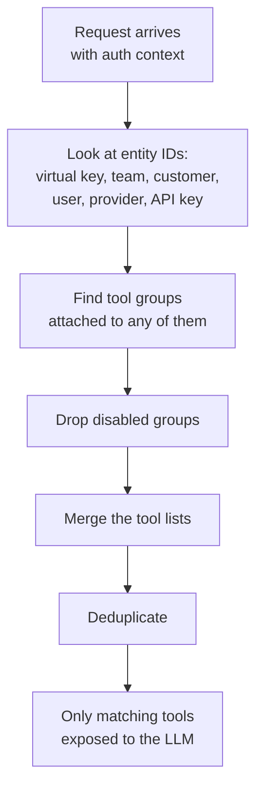

## Overview

A **Tool Group** is a named, reusable bundle of MCP tools drawn from one or more MCP servers. Rather than expose every MCP tool on every request, you define curated subsets and attach them to the entities that should see them. At request time, Bifrost Enterprise inspects the context (virtual key, team, customer, user, provider, API key) and exposes only the union of tools from matching groups.

**Key benefits:**

- **Curated tool subsets** - Build a "ticketing tools" group, an "internal search" group, a "data analysis" group, and grant each independently.
- **Six attachment dimensions** - Attach a group to virtual keys, teams, customers, users, LLM providers, or API keys.
- **Combinatorial resolution** - When multiple dimensions match (for example, a key is on a team that uses a specific provider), tools merge from all matching groups.
- **Granular tool selection** - Include all tools from a server, or just a named subset.
- **No extra request latency** - Matching happens against an in-process index, not via additional database lookups.
- **Master enable / disable** - Disable a group to temporarily revoke access without deleting attachments.

<Info>
  For the full API contract (every endpoint, request and response shape, error codes), see the **MCP
  Tool Groups** section of the [API Reference](/api-reference).
</Info>

---

## How it works

### Resolution at request time

When a request arrives, Bifrost reads whatever entity identifiers are on the request (the virtual key being used, the team or customer owning that key, the LLM provider being called, and so on). For each identifier it finds, it pulls the list of Tool Groups attached to that identifier. The lists are merged across dimensions, disabled groups are dropped, and the resulting union becomes the set of MCP tools available for that request.

If no group matches the request's context, the request falls through with **no** tool filter applied (all tools available). If at least one group matches, only the union of those groups' tools is exposed.

### Tool spec semantics

Each group lists one or more **tool specs**. A tool spec names an MCP client and optionally a subset of that client's tools:

- If the tool list is empty, every tool from that MCP client is included. This is the most permissive form.
- If the tool list is populated, only those specific tools are included.

A single group can list specs for multiple MCP clients, so a group can span servers.

### Multi-dimensional merging

Suppose a request arrives with:

- Virtual key `vk-alice-eng`
- Team `team-platform`
- Provider `openai`

If two groups exist:

- `notion-essentials` attached to `vk-alice-eng` (includes Notion's create + query tools)
- `team-shared` attached to `team-platform` (includes all GitHub tools)

The request sees both Notion's two tools and all GitHub tools. The union is taken and deduplicated.

### Lifecycle

After every create, update, or delete, Bifrost refreshes its internal index and notifies other nodes in a cluster, so the new attachment takes effect on the next request workspace-wide.

If an MCP client is removed from your deployment, references to that client are automatically stripped from every Tool Group that mentioned it, and the affected groups continue to operate with their remaining specs.

---

## Configuration (Web UI)

### Browse and create groups

1. Navigate to **Workspace** -> **MCP Tool Groups**.

<Frame>
  
</Frame>

Columns: **Name**, **Tools** (count badge), **Associations** (count badge), **Status** (toggle), **Actions** (edit / delete).

2. Use the search box to filter by name. Page size is 25.
3. Click **New Tool Group**. The create sheet opens.

### Fill in basic info

- **Name** - Required, unique. Trimmed before save.
- **Description** - Optional, two-row textarea. Shown beneath the name in the list view.
- **Enabled** - Toggle at the bottom of the form, default on in the UI. A disabled group contributes no tools at request time even if attached.

### Pick MCP servers (allow-all per server)

<Frame>
  
</Frame>

- **MCP Servers** - Search-and-select multiple servers. Adding a server here grants **every tool** from that server to the group.
- **Individual Tools** - Add specific tools from servers you did **not** add wholesale. The selector excludes tools from servers already added in the section above (no point listing them).

### Attach the group

Scroll to the **Associations** section.

<Frame>
  
</Frame>

- **Virtual Keys** - Multi-select. Tools apply when a request authenticates with one of these keys.
- **Teams** - Multi-select. Tools apply to all members of these teams.
- **Customers** - Multi-select. Tools apply to all users on any team linked to these customers.
- **Providers** - Multi-select. Tools apply only when the request targets these LLM providers (`openai`, `anthropic`, ...).
- **Users** - Supported by the API; the UI currently routes user-level attachments through Access Profiles. Use the API directly to attach by user ID.
- **API Keys** - Supported by the API; not yet exposed in the form.

A group with **no** associations does nothing at request time. You can attach it later from this sheet, from the [Access Profile](/enterprise/access-profiles) form (via the tool group reference field), or via the API.

### Save

Click **Create**. The group and its attachments are persisted together, and the workspace index refreshes immediately.

### Edit, toggle, delete

- The **Status** column in the list view exposes a switch that toggles enabled without opening the sheet.
- The **Actions** dropdown on each row provides **Edit** and **Delete** (subject to the user's RBAC permissions).
- Delete is confirmed via dialog. Attachments are removed automatically along with the group.

For programmatic configuration (every endpoint, body shape, and error code), see the **MCP Tool Groups** section of the [API Reference](/api-reference).

---

## Real-world patterns

### Pattern 1: Team-scoped tool catalog

Goal: Engineers see GitHub + Notion; Sales sees Salesforce + Notion.

Create one Tool Group for the engineering team containing all tools from GitHub and Notion, attached to the engineering team. Create a second group for sales containing Salesforce and a subset of Notion (read-only `query-database` for example), attached to the sales team. Any overlap is deduplicated for users who belong to both teams.

### Pattern 2: Provider-specific tools

Goal: When users go through OpenAI, expose only safe read-only tools; when they go through Anthropic, expose the full toolset.

Create a "read-only" group attached to the OpenAI provider, containing only the specific tool names you want. Create a "full" group attached to Anthropic, granting whole MCP servers. The request sees the union of whichever groups match the provider it is targeting.

### Pattern 3: Per-key exception

Goal: Alice gets an experimental tool not available to her team.

Create a group attached to Alice's virtual key with just the experimental tool. Alice's requests see this tool in addition to whatever her team's groups expose.

### Pattern 4: Bundle inside an Access Profile

Reference a Tool Group from an [Access Profile](/enterprise/access-profiles). Now every user in any role attached to that profile inherits the group's tools, without needing a direct attachment on the Tool Group itself.

---

## Next steps

- **[Access Profiles](/enterprise/access-profiles)** - Reference Tool Groups by ID inside a profile so role-default assignment grants them automatically.
- **[Virtual Keys](/features/governance/virtual-keys)** - The underlying credential that Tool Groups can attach to.
- **[MCP Gateway](/mcp/overview)** - The MCP infrastructure that Tool Groups filter.
- **[Data Access Control](/enterprise/data-access-control)** - Scope which Tool Groups each operator can see in the UI.