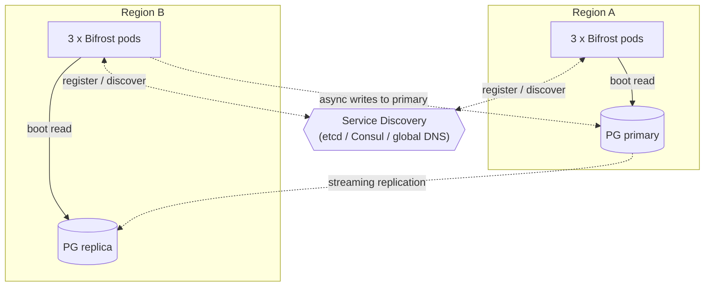
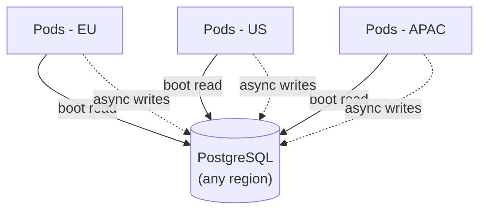

Bifrost is designed so that the database is **not** in the hot path of inference requests. This makes cross-region and multi-cloud deployments practical without taking a latency hit on every call.

## The DB is read once, then written asynchronously

On boot, each Bifrost pod loads its full config, governance state, virtual keys, and provider keys from PostgreSQL into memory. **After boot, the request path never reads from the database.** Routing, budgeting, rate limiting, key resolution, and provider dispatch all run against the in-memory snapshot, with cluster gossip and gRPC counter-sync keeping replicas coherent (see [Clustering](/enterprise/clustering)).

Writes back to PostgreSQL (log rows, counter checkpoints, config changes) go through asynchronous queues. They do not block the inference response.

The practical consequence: **you can run Bifrost pods in any region**, even far from the PostgreSQL primary, and inference latency is unaffected. The DB only matters during pod startup and on the async write path.

## Recommended topologies

### Active-active across regions

Each region serves its own client traffic. Region B pods boot from the local PG replica (read-only is fine for boot), and async writes route to the primary in Region A. RPO is bounded by your replication lag; cluster sync keeps governance counters convergent across regions over the gossip + gRPC transports.

### Geographically split clients, single PG

A single PostgreSQL primary serves all regions. Pod boot pulls config once across the WAN (acceptable because it is infrequent); steady-state inference traffic never crosses the WAN to hit the DB. Async writes do cross the WAN, which is fine as long as the write queue can absorb it.

## Service discovery is the critical piece

Cross-region clustering requires a discovery layer that pods can reach **from every region** to find their peers and join the gossip mesh. Single-region defaults like Kubernetes-scoped discovery, UDP broadcast, or mDNS cannot cross region boundaries - they're physically scoped to one cluster or one broadcast domain.

Bifrost ships [six discovery methods](/enterprise/clustering); for cross-region deployments only three of them work:

| Method | Why it fits cross-region |
|---|---|
| **etcd** | Strong consistency, globally reachable from every region, leases automatically reap dead nodes. Run a multi-region etcd cluster (or a single highly-available etcd) as the registry. See [etcd discovery](/enterprise/clustering#etcd-discovery). |
| **Consul** | HashiCorp Consul's multi-datacenter federation is a natural fit: each region registers against the local Consul, federation propagates membership across DCs. See [Consul discovery](/enterprise/clustering#consul-discovery). |
| **DNS** | Works if you publish a globally-resolvable SRV or A record covering all regions (e.g., Route 53 cross-region). Simpler than etcd/Consul but offers no health-check loop of its own; dead pods linger in DNS until TTL expires. |

<Warning>
Picking the wrong discovery method is the most common cross-region failure: pods boot, load their config, run inference correctly, but never join the cross-region cluster - so governance counters and config sync don't converge globally. If you see regions operating as independent clusters, check the discovery configuration first.
</Warning>

The discovery layer itself should be highly available and reachable from every region:

- **etcd**: 3 or 5 nodes spread across regions (an odd number for quorum). Treat it like any other consensus system.
- **Consul**: at least one Consul server per region, federated. Clients on each Bifrost host point to the local Consul agent.
- **DNS**: a managed global DNS service (Route 53, Cloud DNS, Azure DNS) with low TTLs on the discovery records.

## What still needs cross-region planning

- **Provider endpoints.** Choose providers and provider regions that match your pods' regions to keep upstream latency low.
- **Vector store and guardrails.** Both should be co-located with the pods that call them.
- **Cluster gossip / gRPC.** Memberlist (`10101/TCP+UDP`) and counter-sync (`10102/TCP`) must be reachable peer-to-peer across regions. Latency between cluster nodes affects convergence time, not request latency.
- **Discovery reachability.** The etcd / Consul / DNS endpoint must be resolvable and reachable from every region. Network ACLs that lock discovery to a single VPC will silently break cross-region joins.
- **Object storage region.** Place buckets close to your dashboard users or close to the pods doing the writes, depending on whether read or write throughput dominates.

See [Clustering](/enterprise/clustering) for the gRPC/gossip port layout and [Sizing](/enterprise/moving-from-oss/sizing) for per-region pod counts.
