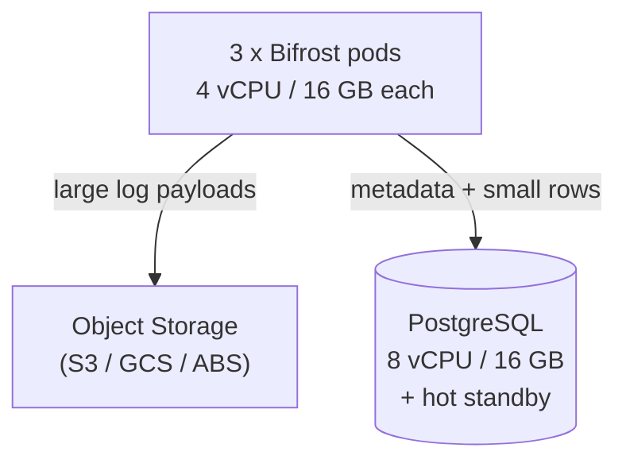

Bifrost Enterprise sizing has two independent axes you can use to start from: the **number of gateway instances** you want to run, or the **target RPS** you need to serve. Pick whichever you have a number for - the other can be derived once the cluster is live.

## Gateway pods

For production deployments, run at least **3 Bifrost instances** so that losing any one pod (rolling deploy, AZ failure, node eviction) still leaves quorum and active capacity.

| Setting       | Recommended baseline                                      |
|---------------|-----------------------------------------------------------|
| Pod count     | **3** (minimum for HA; scale horizontally from here)      |
| vCPU per pod  | **4**                                                     |
| RAM per pod   | **16 GB**                                                 |
| Topology      | Spread pods across AZs or failure domains                 |

This baseline is sized for redundancy first, throughput second. If you know your target RPS instead of pod count, use the [benchmark tables](/benchmarking/getting-started) to convert RPS into pods. Three pods at this size comfortably absorb the loads we publish there.

<Note>
There is no Bifrost-specific reason to run fewer than 3 pods in production. Two-pod setups lose quorum during a single-node restart, and single-pod setups have no failure budget for rolling upgrades.
</Note>

## PostgreSQL

Any production-grade PostgreSQL distribution works: Amazon RDS, Aurora PostgreSQL, Google Cloud SQL, AlloyDB, Azure Database for PostgreSQL, Crunchy Bridge, or self-managed PG 16+. The right hardware depends on whether you offload large request/response payloads to object storage.

### Default sizing (PostgreSQL holds logs)

| Setting     | Recommended                              |
|-------------|------------------------------------------|
| vCPU        | **8**                                    |
| RAM         | **24 GB**                                |
| Storage     | SSD / gp3-class, sized for retention     |
| Replication | Hot standby in a second AZ               |

This is the right baseline when **all** request and response bodies live in PostgreSQL alongside config and governance state. It absorbs the write amplification from full-payload logging at typical Enterprise traffic levels.

### With object storage for large logs

| Setting     | Recommended                              |
|-------------|------------------------------------------|
| vCPU        | **8**                                    |
| RAM         | **16 GB**                                |
| Storage     | SSD / gp3-class, sized for retention     |
| Object store| S3, GCS, Azure Blob, or compatible       |

When you configure object storage (S3, GCS, or Azure Blob) as the target for large log payloads, PostgreSQL only stores metadata and small log rows. Write throughput drops sharply, index churn on multi-megabyte rows disappears, and PG RAM can be dialed down without affecting cache hit ratios.

Object storage also dramatically reduces dashboard log-read latency: large payloads are pulled from blob storage on demand, which is faster and cheaper than scanning a fat PG row.

See [Log Exports](/enterprise/log-exports) for object-store configuration.

## Putting it together

A standard Enterprise deployment with object storage:

If you start without object storage, bump PostgreSQL to **8 vCPU / 24 GB**; everything else stays the same.
