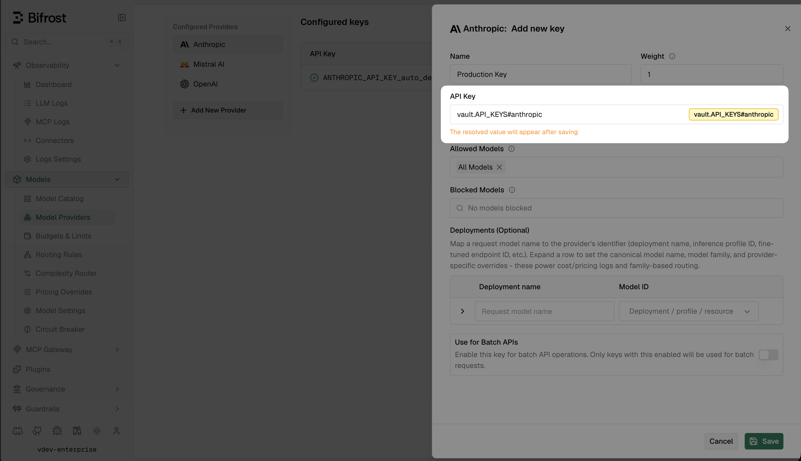

## Overview

By default, Bifrost stores provider API keys, virtual key values, and other credentials in its config database. Secret Management lets you keep those values in your own secret manager - Bifrost stores a reference and resolves the real value at runtime.

Once connected, any secret field in Bifrost (provider keys, virtual key values, MCP auth headers, etc.) accepts a `vault.<path>` reference alongside the existing `env.<VAR>` and plaintext options.

<Note>
Secret Management is an Enterprise-only feature and requires a PostgreSQL config store.
</Note>

---

## Access modes

Set `access_mode` to control how much Bifrost interacts with your vault:

| Mode | What Bifrost does |
|------|-------------------|
| `read_only` (default) | Resolves `vault.<path>` references. Never writes to or deletes from the backend. |
| `read_and_write` | Also auto-stores plaintext values you save via the dashboard or API, and deletes owned secrets when you remove an entity. |

Start with `read_only` if you want to manage secrets yourself. Use `read_and_write` if you want Bifrost to handle it - useful when migrating existing plaintext keys, since Bifrost pushes the value to the vault on the next save.

---

## Setup

Pick your backend and add a `vault_store` block inside your existing `config_store` in `config.json`.

<Tabs group="vault-backend">
<Tab title="AWS Secrets Manager">

<Tabs group="aws-auth">
<Tab title="IAM role (recommended)">

Attach an IAM role to your EC2 instance, ECS task, or EKS pod. No credentials needed in config - the SDK inherits the role automatically. For EKS with IRSA, annotate your service account with the role ARN and leave credentials unset.

```json
{
  "config_store": {
    ...
    "vault_store": {
      "enabled": true,
      "type": "aws-secrets-manager",
      "prefix": "bifrost",
      "access_mode": "read_only",
      "aws": {
        "region": "us-east-1"
      }
    }
  }
}
```

</Tab>
<Tab title="Static credentials">

Use static credentials when IAM roles are not available. `access_key_id` and `secret_access_key` must always be set together.

```json
{
  "config_store": {
    ...
    "vault_store": {
      "enabled": true,
      "type": "aws-secrets-manager",
      "prefix": "bifrost",
      "access_mode": "read_only",
      "aws": {
        "region": "us-east-1",
        "access_key_id": "env.AWS_ACCESS_KEY_ID",
        "secret_access_key": "env.AWS_SECRET_ACCESS_KEY"
      }
    }
  }
}
```

</Tab>
<Tab title="Role assumption">

Assume a cross-account or restricted IAM role on top of any existing credential source (instance profile, static credentials, or IRSA).

```json
{
  "config_store": {
    ...
    "vault_store": {
      "enabled": true,
      "type": "aws-secrets-manager",
      "prefix": "bifrost",
      "access_mode": "read_only",
      "aws": {
        "region": "us-east-1",
        "role_arn": "arn:aws:iam::123456789012:role/BifrostSecretsReader"
      }
    }
  }
}
```

</Tab>
</Tabs>

#### AWS fields

| Field | Required | Description |
|-------|----------|-------------|
| `region` | No | AWS region (e.g. `us-east-1`). Falls back to `AWS_DEFAULT_REGION` or instance metadata if unset. |
| `access_key_id` | No | Required when not using IAM roles. Must be set with `secret_access_key`. |
| `secret_access_key` | No | Must be set with `access_key_id`. |
| `session_token` | No | For STS-issued temporary credentials. |
| `role_arn` | No | IAM role to assume via STS. |
| `kms_key_id` | No | KMS key for encrypting new secrets (`read_and_write` only). |

**Minimum IAM policy** for `read_only`:

```json
{
  "Version": "2012-10-17",
  "Statement": [
    {
      "Effect": "Allow",
      "Action": "secretsmanager:GetSecretValue",
      "Resource": "arn:aws:secretsmanager:us-east-1:*:secret:bifrost/*"
    },
    {
      "Effect": "Allow",
      "Action": "secretsmanager:ListSecrets",
      "Resource": "*"
    }
  ]
}
```

Add `secretsmanager:CreateSecret`, `secretsmanager:PutSecretValue`, and `secretsmanager:DeleteSecret` for `read_and_write`.

</Tab>
<Tab title="GCP Secret Manager">

<Tabs group="gcp-auth">
<Tab title="Workload Identity (recommended)">

Bind a GCP service account to your GKE workload or attach one to your Compute Engine instance. No credentials file needed.

```json
{
  "config_store": {
    ...
    "vault_store": {
      "enabled": true,
      "type": "gcp-secret-manager",
      "prefix": "bifrost",
      "access_mode": "read_only",
      "gcp": {
        "project_id": "my-gcp-project"
      }
    }
  }
}
```

</Tab>
<Tab title="Service account key">

Pass the service account key as a JSON string (the full key file contents) or a path to a credentials file on disk. Using an environment variable is recommended.

```json
{
  "config_store": {
    ...
    "vault_store": {
      "enabled": true,
      "type": "gcp-secret-manager",
      "prefix": "bifrost",
      "access_mode": "read_only",
      "gcp": {
        "project_id": "my-gcp-project",
        "credentials_json": "env.GCP_CREDENTIALS_JSON"
      }
    }
  }
}
```

</Tab>
</Tabs>

#### GCP fields

| Field | Required | Description |
|-------|----------|-------------|
| `project_id` | Yes | GCP project containing your secrets. |
| `credentials_json` | No | Service account key JSON string or file path. If omitted, Application Default Credentials are used. |

**Required IAM role:** `roles/secretmanager.secretAccessor` for `read_only`. For `read_and_write`, also grant `roles/secretmanager.secretCreator`, `roles/secretmanager.secretVersionAdder`, and `roles/secretmanager.secretDeleter`.

</Tab>
<Tab title="HashiCorp Vault">

Bifrost uses the KV v2 secrets engine. Auth is resolved in order: explicit `token` → AppRole → ambient `VAULT_TOKEN` env var.

<Tabs group="hcp-auth">
<Tab title="Token">

```json
{
  "config_store": {
    ...
    "vault_store": {
      "enabled": true,
      "type": "hashicorp-vault",
      "prefix": "bifrost",
      "access_mode": "read_only",
      "hashicorp": {
        "address": "https://vault.internal:8200",
        "token": "env.VAULT_TOKEN"
      }
    }
  }
}
```

</Tab>
<Tab title="AppRole">

```json
{
  "config_store": {
    ...
    "vault_store": {
      "enabled": true,
      "type": "hashicorp-vault",
      "prefix": "bifrost",
      "access_mode": "read_only",
      "hashicorp": {
        "address": "https://vault.internal:8200",
        "role_id": "env.VAULT_ROLE_ID",
        "secret_id": "env.VAULT_SECRET_ID",
        "mount_path": "secret"
      }
    }
  }
}
```

</Tab>
<Tab title="Ambient token">

If `VAULT_TOKEN` is set in the environment and no `token` or AppRole is configured, Bifrost inherits it automatically. Useful with Vault Agent injection.

```json
{
  "config_store": {
    ...
    "vault_store": {
      "enabled": true,
      "type": "hashicorp-vault",
      "prefix": "bifrost",
      "access_mode": "read_only",
      "hashicorp": {
        "address": "https://vault.internal:8200"
      }
    }
  }
}
```

</Tab>
</Tabs>

#### HashiCorp fields

| Field | Required | Description |
|-------|----------|-------------|
| `address` | No | Vault server URL. Reads `VAULT_ADDR` env var if unset. |
| `token` | No | Vault token. |
| `namespace` | No | Vault namespace (HCP Vault / Vault Enterprise). |
| `mount_path` | No | KV v2 mount path. Defaults to `secret`. |
| `role_id` | No | AppRole role ID. Must be set together with `secret_id`. |
| `secret_id` | No | AppRole secret ID. Must be set together with `role_id`. |

**Minimum Vault policy** for `read_only`:

```hcl
path "secret/data/bifrost/*" {
  capabilities = ["read"]
}
path "secret/metadata/bifrost/*" {
  capabilities = ["list"]
}
```

Add `create`, `update`, and `delete` on both paths for `read_and_write`.

</Tab>
</Tabs>

---

## Using vault references

Any secret field in Bifrost that supports `env.<VAR>` also supports `vault.<path>`. This covers provider keys, virtual key values, MCP auth headers, plugin credentials, observability tokens, and more. Type the reference directly in the dashboard or set it in `config.json`.



For example, a provider key in `config.json`:

```json
{
  "providers": {
    "openai": {
      "keys": [
        {
          "models": ["gpt-4o", "gpt-4o-mini"],
          "value": "vault.bifrost/providers/openai/key"
        }
      ]
    }
  }
}
```

### Fragment references

If your secret manager holds a JSON object with multiple keys, use `vault.<path>#<key>` to extract a single field.

For example, if `prod/shared-keys` contains:

```json
{
  "openai_api_key": "sk-...",
  "anthropic_api_key": "sk-ant-..."
}
```

You can reference each key independently:

```
vault.prod/shared-keys#openai_api_key
vault.prod/shared-keys#anthropic_api_key
```

Both resolve to their respective values with a single backend fetch for the shared secret.

<Note>
Fragment references are never auto-deleted by Bifrost in `read_and_write` mode, because the secret is externally managed and may be shared with other services.
</Note>

---

## Rotating secrets

Update the value in your secret manager - no Bifrost restart needed. Bifrost checks for updated secrets every hour in the background and picks up the new value automatically.

To apply a rotation immediately, call `POST /api/vault/flush-cache`. The endpoint requires a management bearer token and, in a [clustered deployment](/enterprise/clustering), broadcasts the flush to all peers automatically.

Full details in the [API reference](/api-reference/vault/flush-vault-secret-cache).

---

## Troubleshooting

**Bifrost fails to start with "vault: ping failed"**

The backend is unreachable or credentials are invalid. Check network connectivity, verify the IAM role / token has read permissions on the configured prefix, and confirm the region / address / project ID are correct.

**Secret field is empty after save**

The reference was saved but the backend returned nothing. Verify the secret exists at that exact path and the credentials have `GetSecretValue` / `secretAccessor` / `read` permission on it.

**New values aren't being pushed to the vault**

`access_mode` must be `read_and_write`. The default `read_only` mode never writes to the backend.

**Old value still in use after rotation**

Flush the cache via `POST /api/vault/flush-cache`. If the issue persists, confirm the new version is active in the backend and not still pending.

**"vault: not enabled" from the flush-cache endpoint**

`vault_store.enabled` is `false` or the block is missing from `config.json`. Fix the config and restart.

---

## Next steps

- [Audit Logs](/enterprise/audit-logs) - use vault-backed keys for HMAC audit log signing
- [Clustering](/enterprise/clustering) - cache flushes broadcast to all cluster peers automatically
- [AWS deployment guide](/deployment-guides/enterprise/aws) - set up IRSA for keyless Secrets Manager access
- [GCP deployment guide](/deployment-guides/enterprise/gcp) - set up Workload Identity for keyless Secret Manager access
