# 🔄 Automatic Fallbacks

Ensure high availability and reliability with Bifrost's automatic fallback system. When your primary provider fails, Bifrost seamlessly switches to backup providers without interrupting your application.

## 🎯 Overview

Bifrost's fallback system provides **zero-downtime failover** across multiple AI providers:

- ✅ **Automatic Detection** - Instantly detects provider failures or rate limits
- ✅ **Seamless Switching** - Transparent failover to backup providers
- ✅ **Configurable Order** - Control fallback priority and routing
- ✅ **Independent Retry Logic** - Each provider uses its own retry settings
- ✅ **Cost Optimization** - Route to cheaper providers as fallbacks

---

## ⚡ Quick Start

**📖 [Go Package fallback example →](../usage/examples.md#request-with-fallbacks)**

**📖 [HTTP API fallback example →](../usage/examples.md#request-with-fallbacks)**

---

## 🔧 How Fallbacks Work

### Execution Flow

```mermaid
graph TD
    A[Request] --> B[Primary Provider<br/>OpenAI gpt-4o-mini]
    B --> C{Success?}
    C -->|✅ Success| D[Return Response]
    C -->|❌ Failed| E[Fallback 1<br/>Anthropic Claude]
    E --> F{Success?}
    F -->|✅ Success| D
    F -->|❌ Failed| G[Fallback 2<br/>Cohere Command]
    G --> H{Success?}
    H -->|✅ Success| D
    H -->|❌ Failed| I[Return Error]
```



### Automatic Triggers

Fallbacks are triggered when the primary provider encounters:

| Trigger               | Description                       | Example               |
| --------------------- | --------------------------------- | --------------------- |
| **Rate Limits**       | 429 status codes, quota exceeded  | `rate_limit_exceeded` |
| **Service Errors**    | 5xx status codes, timeouts        | `service_unavailable` |
| **Authentication**    | Invalid API keys, expired tokens  | `invalid_api_key`     |
| **Model Unavailable** | Model not found, deprecated       | `model_not_found`     |
| **Network Issues**    | Connection timeouts, DNS failures | `connection_timeout`  |

---

## 🛠️ Configuration Patterns

### Single Fallback

<details>
<summary><strong>🔧 Go Package - Basic Fallback</strong></summary>

```go
// OpenAI with Anthropic fallback
response, err := client.Request(context.Background(), &schemas.BifrostRequest{
    Provider: schemas.OpenAI,
    Model:    "gpt-4o-mini",
    Input: schemas.RequestInput{
        ChatCompletionInput: &messages,
    },
    Fallbacks: []schemas.Fallback{
        {
            Provider: schemas.Anthropic,
            Model:    "claude-3-sonnet-20240229",
        },
    },
})

if err != nil {
    // This error means both providers failed
    log.Printf("All providers failed: %v", err)
    return
}

// Success from either OpenAI or Anthropic
log.Printf("Response from %s: %s",
    response.Provider,
    *response.Choices[0].Message.Content.ContentStr)
```

</details>

<details>
<summary><strong>🌐 HTTP Transport - Basic Fallback</strong></summary>

```bash
curl -X POST http://localhost:8080/v1/chat/completions \
  -H "Content-Type: application/json" \
  -d '{
    "provider": "openai",
    "model": "gpt-4o-mini",
    "messages": [{"role": "user", "content": "Explain quantum computing"}],
    "fallbacks": [
      {
        "provider": "anthropic",
        "model": "claude-3-sonnet-20240229"
      }
    ]
  }'
```

**Response shows which provider was used:**

```json
{
  "choices": [{ "message": { "content": "Quantum computing..." } }],
  "extra_fields": {
    "provider": "anthropic",
    "model_used": "claude-3-sonnet-20240229",
    "fallback_used": true,
    "fallback_reason": "rate_limit_exceeded"
  }
}
```

</details>

### Multi-Tier Fallbacks

<details>
<summary><strong>🔧 Go Package - Tiered Strategy</strong></summary>

```go
// Tier 1: Premium models, Tier 2: Standard models, Tier 3: Budget models
response, err := client.Request(context.Background(), &schemas.BifrostRequest{
    Provider: schemas.OpenAI,
    Model:    "gpt-4o",
    Input: schemas.RequestInput{
        ChatCompletionInput: &messages,
    },
    Fallbacks: []schemas.Fallback{
        // Tier 1: Other premium options
        {Provider: schemas.Anthropic, Model: "claude-3-opus-20240229"},
        {Provider: schemas.OpenAI, Model: "gpt-4o-mini"},

        // Tier 2: Standard performance
        {Provider: schemas.Anthropic, Model: "claude-3-sonnet-20240229"},
        {Provider: schemas.Cohere, Model: "command"},

        // Tier 3: Budget options
        {Provider: schemas.OpenAI, Model: "gpt-3.5-turbo"},
        {Provider: schemas.Mistral, Model: "mistral-small-latest"},
    },
})
```

</details>

<details>
<summary><strong>🌐 HTTP Transport - Tiered Strategy</strong></summary>

```json
{
  "provider": "openai",
  "model": "gpt-4o",
  "messages": [{ "role": "user", "content": "Complex analysis task" }],
  "fallbacks": [
    { "provider": "anthropic", "model": "claude-3-opus-20240229" },
    { "provider": "openai", "model": "gpt-4o-mini" },
    { "provider": "anthropic", "model": "claude-3-sonnet-20240229" },
    { "provider": "cohere", "model": "command" },
    { "provider": "openai", "model": "gpt-3.5-turbo" },
    { "provider": "mistral", "model": "mistral-small-latest" }
  ]
}
```

</details>

### Geographic Fallbacks

<details>
<summary><strong>🔧 Go Package - Regional Distribution</strong></summary>

```go
// Primary: US region, Fallbacks: EU and Asia regions
response, err := client.Request(context.Background(), &schemas.BifrostRequest{
    Provider: schemas.OpenAI,
    Model:    "gpt-4o-mini",
    Input: schemas.RequestInput{
        ChatCompletionInput: &messages,
    },
    Fallbacks: []schemas.Fallback{
        // EU region (using Azure in Europe)
        {Provider: schemas.Azure, Model: "gpt-4o-mini"},

        // Asia region (using Vertex AI)
        {Provider: schemas.Vertex, Model: "gemini-pro"},

        // Alternative global providers
        {Provider: schemas.Anthropic, Model: "claude-3-sonnet-20240229"},
    },
})
```

</details>

<details>
<summary><strong>🌐 HTTP Transport - Regional Distribution</strong></summary>

```json
{
  "provider": "openai",
  "model": "gpt-4o-mini",
  "messages": [{ "role": "user", "content": "Global content generation" }],
  "fallbacks": [
    { "provider": "azure", "model": "gpt-4o-mini" },
    { "provider": "vertex", "model": "gemini-pro" },
    { "provider": "anthropic", "model": "claude-3-sonnet-20240229" }
  ]
}
```

</details>

---

## 📊 Advanced Configuration

### Fallback with Parameters

<details>
<summary><strong>🔧 Go Package - Custom Parameters per Provider</strong></summary>

```go
// Different parameters for primary vs fallback
response, err := client.Request(context.Background(), &schemas.BifrostRequest{
    Provider: schemas.OpenAI,
    Model:    "gpt-4o-mini",
    Input: schemas.RequestInput{
        ChatCompletionInput: &messages,
    },
    Params: &schemas.ModelParameters{
        Temperature: &[]float64{0.7}[0],
        MaxTokens:   &[]int{1000}[0],
    },
    Fallbacks: []schemas.Fallback{
        {
            Provider: schemas.Anthropic,
            Model:    "claude-3-sonnet-20240229",
            // Anthropic uses different parameter structure
        },
    },
})
```

</details>

<details>
<summary><strong>🌐 HTTP Transport - Custom Parameters</strong></summary>

```json
{
  "provider": "openai",
  "model": "gpt-4o-mini",
  "messages": [{ "role": "user", "content": "Creative writing task" }],
  "params": {
    "temperature": 0.9,
    "max_tokens": 1000
  },
  "fallbacks": [
    {
      "provider": "anthropic",
      "model": "claude-3-sonnet-20240229"
    }
  ]
}
```

</details>

### Cost-Optimized Fallbacks

<details>
<summary><strong>🔧 Go Package - Price-Based Strategy</strong></summary>

```go
// Primary: Most capable, Fallbacks: Progressively cheaper
response, err := client.Request(context.Background(), &schemas.BifrostRequest{
    Provider: schemas.OpenAI,
    Model:    "gpt-4o",              // $0.03/1K tokens (most expensive)
    Input: schemas.RequestInput{
        ChatCompletionInput: &messages,
    },
    Fallbacks: []schemas.Fallback{
        {Provider: schemas.OpenAI, Model: "gpt-4o-mini"},      // $0.00015/1K tokens
        {Provider: schemas.Anthropic, Model: "claude-3-haiku-20240307"}, // Cheaper option
        {Provider: schemas.Cohere, Model: "command"},           // Budget option
    },
})
```

</details>

<details>
<summary><strong>🌐 HTTP Transport - Price-Based Strategy</strong></summary>

```json
{
  "provider": "openai",
  "model": "gpt-4o",
  "messages": [{ "role": "user", "content": "Analysis task" }],
  "fallbacks": [
    { "provider": "openai", "model": "gpt-4o-mini" },
    { "provider": "anthropic", "model": "claude-3-haiku-20240307" },
    { "provider": "cohere", "model": "command" }
  ]
}
```

</details>

---

## 🎯 Best Practices

### 1. Provider Selection Strategy

```go
// ✅ Good: Different infrastructure providers
Fallbacks: []schemas.Fallback{
    {Provider: schemas.Anthropic, Model: "claude-3-sonnet-20240229"}, // Different company
    {Provider: schemas.Cohere, Model: "command"},                     // Different infrastructure
    {Provider: schemas.Mistral, Model: "mistral-large-latest"},       // Different region
}

// ❌ Avoid: Same provider, different models
Fallbacks: []schemas.Fallback{
    {Provider: schemas.OpenAI, Model: "gpt-4o"},
    {Provider: schemas.OpenAI, Model: "gpt-4o-mini"},  // Same infrastructure - if OpenAI is down, both fail
}
```

### 2. Model Capability Matching

```go
// ✅ Good: Similar capabilities
Primary:   schemas.OpenAI, "gpt-4o-mini"           // Function calling, JSON mode
Fallbacks: []schemas.Fallback{
    {Provider: schemas.Anthropic, Model: "claude-3-sonnet-20240229"}, // Function calling supported
    {Provider: schemas.Cohere, Model: "command"},                     // Function calling supported
}

// ❌ Avoid: Capability mismatches
Primary:   schemas.OpenAI, "gpt-4o-mini"           // Function calling enabled
Fallbacks: []schemas.Fallback{
    {Provider: schemas.SomeProvider, Model: "basic-model"}, // No function calling - will fail
}
```

### 3. Performance Considerations

| Factor          | Recommendation                    | Example                       |
| --------------- | --------------------------------- | ----------------------------- |
| **Latency**     | Order by typical response time    | OpenAI → Anthropic → Cohere   |
| **Reliability** | Put most reliable providers first | Anthropic → OpenAI → Others   |
| **Geographic**  | Match user location               | US-East → US-West → EU → Asia |
| **Cost**        | Balance cost vs performance       | Premium → Standard → Budget   |

### 4. Monitoring Fallback Usage

<details>
<summary><strong>🔧 Go Package - Track Fallback Metrics</strong></summary>

```go
response, err := client.Request(context.Background(), &schemas.BifrostRequest{
    Provider: schemas.OpenAI,
    Model:    "gpt-4o-mini",
    Input: schemas.RequestInput{
        ChatCompletionInput: &messages,
    },
    Fallbacks: []schemas.Fallback{
        {Provider: schemas.Anthropic, Model: "claude-3-sonnet-20240229"},
    },
})

if err == nil && response != nil {
    // Check which provider was actually used
    actualProvider := response.ExtraFields["provider"]
    fallbackUsed := response.ExtraFields["fallback_used"]

    if fallbackUsed == true {
        log.Printf("Fallback triggered! Used %s instead of OpenAI", actualProvider)
        // Send alert to monitoring system
        metrics.IncrementFallbackCounter(actualProvider.(string))
    }
}
```

</details>

<details>
<summary><strong>🌐 HTTP Transport - Monitor via Response Headers</strong></summary>

Check the response for fallback information:

```json
{
  "choices": [...],
  "extra_fields": {
    "provider": "anthropic",
    "fallback_used": true,
    "fallback_reason": "rate_limit_exceeded",
    "primary_provider": "openai",
    "fallback_index": 0,
    "latency": 1.234
  }
}
```

Set up monitoring alerts:

```bash
# Monitor fallback usage with jq
curl -s http://localhost:8080/v1/chat/completions \
  -H "Content-Type: application/json" \
  -d '{"provider":"openai","model":"gpt-4o-mini","messages":[...],"fallbacks":[...]}' \
  | jq '.extra_fields.fallback_used'
```

</details>

---

## 🚨 Error Handling

### Understanding Fallback Errors

```go
response, err := client.Request(context.Background(), &schemas.BifrostRequest{
    Provider: schemas.OpenAI,
    Model:    "gpt-4o-mini",
    Input: schemas.RequestInput{
        ChatCompletionInput: &messages,
    },
    Fallbacks: []schemas.Fallback{
        {Provider: schemas.Anthropic, Model: "claude-3-sonnet-20240229"},
        {Provider: schemas.Cohere, Model: "command"},
    },
})

if err != nil {
    bifrostErr := err.(*schemas.BifrostError)

    // Check if all providers failed
    if bifrostErr.ErrorType == schemas.BifrostErrorTypeFallbackExhausted {
        log.Printf("All providers failed:")
        log.Printf("Primary (OpenAI): %s", bifrostErr.Details["primary_error"])
        log.Printf("Fallback 1 (Anthropic): %s", bifrostErr.Details["fallback_0_error"])
        log.Printf("Fallback 2 (Cohere): %s", bifrostErr.Details["fallback_1_error"])
    }
}
```

### Common Fallback Scenarios

| Scenario                             | Response                | Action                     |
| ------------------------------------ | ----------------------- | -------------------------- |
| **Primary succeeds**                 | Use primary response    | No fallback needed         |
| **Primary fails, fallback succeeds** | Use fallback response   | Log fallback usage         |
| **All providers fail**               | Return aggregated error | Alert operations team      |
| **Configuration error**              | Return validation error | Fix provider configuration |

---

## 📈 Performance Impact

### Latency Considerations

| Scenario               | Typical Latency | Notes                            |
| ---------------------- | --------------- | -------------------------------- |
| **Primary success**    | Normal latency  | No overhead                      |
| **One fallback**       | +1-2 seconds    | Provider timeout + fallback call |
| **Multiple fallbacks** | +3-5 seconds    | Multiple timeouts + calls        |

### Optimization Strategies

1. **Fast Fail Configuration**

   ```go
   // Configure shorter timeouts for faster fallbacks
   providerConfig := &schemas.ProviderConfig{
       NetworkConfig: schemas.NetworkConfig{
           Timeout: 10 * time.Second, // Shorter timeout
           Retries: 1,                // Fewer retries
       },
   }
   ```

2. **Smart Ordering**

   - Put fastest providers first
   - Use geographic proximity
   - Consider historical reliability

3. **Monitoring and Adjustment**
   - Track fallback frequency by provider
   - Adjust order based on real performance
   - Remove consistently failing providers

---

## 📚 Learn More

| Topic              | Link                                          | Description                          |
| ------------------ | --------------------------------------------- | ------------------------------------ |
| **Provider Setup** | [Provider Configuration](providers/README.md) | Configure each provider properly     |
| **Error Handling** | [Error Reference](../usage/errors.md)         | Understand error types and handling  |
| **Monitoring**     | [Observability](observability.md)             | Track fallback usage and performance |
| **Load Balancing** | [Key Management](key-management.md)           | Distribute load across multiple keys |

---

**🎯 Next Step:** Set up [monitoring and alerting](observability.md) to track fallback usage and optimize your provider configuration!
