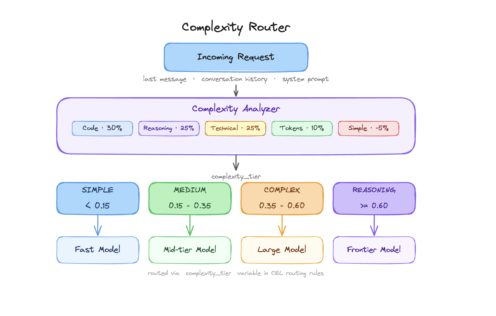
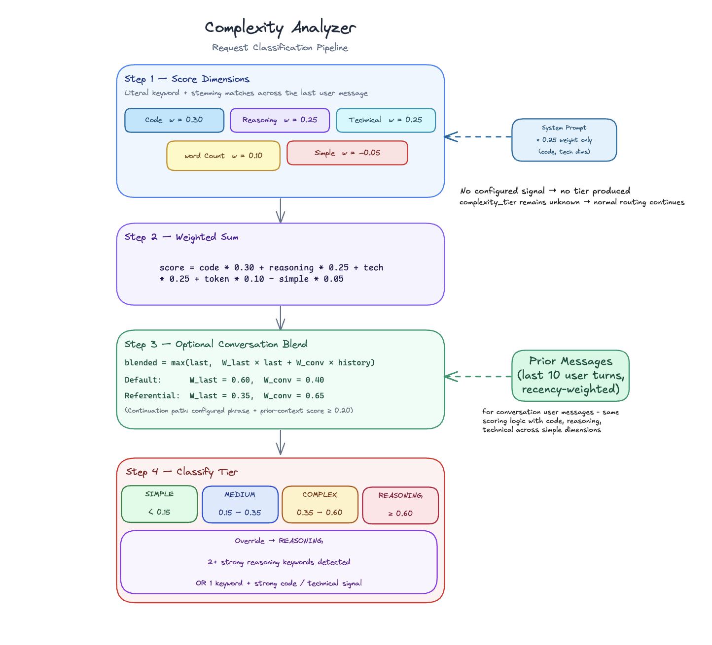
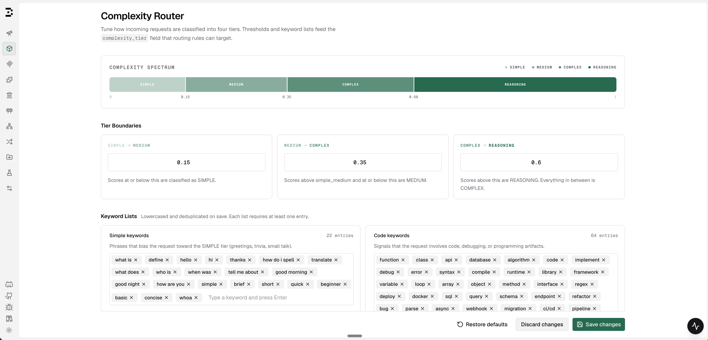
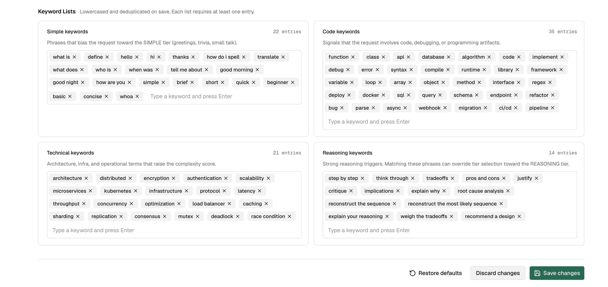

## Overview

The Complexity Router analyzes incoming requests and assigns a tier - **Simple**, **Medium**, or **Complex** - when the latest user message contains a clear complexity signal. The result is exposed as a flat string variable (`complexity_tier`) in Bifrost's CEL routing engine, so you can write routing rules like:

```cel
complexity_tier == "COMPLEX"
complexity_tier in ["MEDIUM", "COMPLEX"]
```

This lets you route simple greetings to a fast, cheap model and deep reasoning tasks to a frontier model — automatically, with no changes to your application code. When the latest user message does not match a configured signal, Bifrost leaves `complexity_tier` unknown and keeps the request on its existing routing path instead of guessing. The algorithm is fast and deterministic: it runs entirely in-process using pre-compiled literal and stemmed keyword matching, adds less than 1 ms to request latency, and makes zero external calls.



---

## How it works

### Scoring dimensions

Classified requests produce a score between 0.0 and 1.0. The analyzer starts with a weighted score across five dimensions detected by scanning the last user message:

| Dimension | Weight | What it measures |
|---|---|---|
| Code presence | 34% | Code, debugging, and programming artifacts |
| Reasoning markers | 28% | Analytical and multi-step reasoning language |
| Technical terms | 28% | Architecture, infra, and operational terminology |
| Word count | 10% | Prompt length measured by whitespace-delimited words, used only after a signal or continuation is detected |
| Simple indicators | -5% | Greetings, definitions, translation requests, and other straightforward asks |

Simple indicators are a small downward nudge, not an override. A simple-only request can classify as **Simple** with a `0.00` score, while a request that also has strong code, technical, or reasoning signals can still rise into a higher tier.

### System prompt contribution

When the latest user message already has a code, technical, or reasoning signal, the system prompt is scanned for code and technical signals. Its contribution is weighted at **25% of the user-message signal** for those dimensions. This provides soft lexical context — for example, a system prompt describing a coding assistant nudges code scores up — but it never creates a classification by itself.

### Conversation context blending

For multi-turn conversations, prior context is used only when the latest user message has its own code, technical, or reasoning signal, or when the latest message reads as a continuation of the conversation and the prior-context score is at least 0.20. A message counts as a continuation when it is a configured continuation phrase such as "do it", "try again", "continue", or "go ahead", **or** when it is 12 words or fewer with no simple-keyword match — brevity itself is the signal in follow-ups like "yes but make it faster". Conversation closers like "thanks!" match a simple keyword, so they still classify as Simple instead of inheriting the conversation's complexity.

In those cases, the score blends the current message with history from up to the last 10 user turns (recency-weighted: earlier turns count less):

- **Default blend:** 60% last message + 40% conversation history
- **Continuation blend:** 35% last message + 65% conversation history
- **Continuation with no signal of its own** ("why?", "fix it"): 100% conversation history — the follow-up adds no content, so the conversation score is inherited as-is

A low-signal latest message that is not a continuation does not inherit old context; `complexity_tier` remains unknown and routing falls through to the original model.

The final score is `max(last_message_score, weighted_blend)` — the current message always sets a floor.

### Reasoning override

When two or more **reasoning keywords** are detected in the last user message, the tier is promoted to **Complex** regardless of the numeric score. The same override applies when one strong reasoning keyword appears alongside strong code or technical signals.

This handles prompts like "step by step, explain why the authentication flow fails" that would score moderately on each individual dimension but clearly deserve the strongest model.

### Tier classification

The final score maps to a tier using configurable boundaries (defaults shown):

| Tier | Score range (defaults) | Typical requests |
|---|---|---|
| Simple | < 0.20 | Greetings, definitions, simple lookups |
| Medium | 0.20 – 0.40 | General questions, short explanations |
| Complex | ≥ 0.40 (or override) | Technical questions, code help, analysis, root-cause investigation |

<Note>
Earlier Bifrost versions had a fourth tier, **REASONING**, above Complex. It has been merged into **COMPLEX**: the `complex_reasoning` boundary no longer exists, and the reasoning-keyword override now promotes to Complex. Historical log rows keep their recorded `REASONING` tier and stay reachable through the logs filter as a legacy value, but the CEL builder no longer offers it — update any routing rules that match on `"REASONING"`.
</Note>



---

## Configuration

### Tier boundaries

Adjust where the score thresholds fall to match your traffic and model lineup.

<Tabs group="complexity-config">
<Tab title="Web UI">

Navigate to **Complexity Router** in the sidebar.

The **Complexity Spectrum** bar updates live as you type boundary values, so you can see how your traffic would be distributed before saving.



1. Enter a value between 0 and 1 for each boundary.
2. Boundaries must be strictly increasing: `simple_medium` < `medium_complex`.
3. Click **Save changes** to apply immediately (hot-reloaded, no restart required).
4. Click **Restore defaults** to reset all boundaries and keyword lists to factory values.

</Tab>
<Tab title="API">

```bash
# Get current configuration
curl http://localhost:8080/api/governance/complexity-analyzer-config

# Update tier boundaries
curl -X PUT http://localhost:8080/api/governance/complexity-analyzer-config \
  -H "Content-Type: application/json" \
  -d '{
    "tier_boundaries": {
      "simple_medium": 0.20,
      "medium_complex": 0.40
    },
    "keywords": {
      "code_keywords": ["function", "class", "api", "debug"],
      "reasoning_keywords": ["step by step", "explain why", "tradeoffs"],
      "technical_keywords": ["architecture", "kubernetes", "latency"],
      "simple_keywords": ["hello", "hi", "thanks", "what is"]
    }
  }'

# Reset to factory defaults
curl -X POST http://localhost:8080/api/governance/complexity-analyzer-config/reset
```

**Response (GET / PUT):**
```json
{
  "tier_boundaries": {
    "simple_medium": 0.20,
    "medium_complex": 0.40
  },
  "keywords": {
    "code_keywords": ["function", "class", "..."],
    "reasoning_keywords": ["step by step", "..."],
    "technical_keywords": ["architecture", "..."],
    "simple_keywords": ["hello", "hi", "..."]
  }
}
```

</Tab>
<Tab title="config.json">

```json
{
  "governance": {
    "complexity_analyzer_config": {
      "tier_boundaries": {
        "simple_medium": 0.20,
        "medium_complex": 0.40
      },
      "keywords": {
        "code_keywords": ["function", "class", "api", "debug", "deploy"],
        "reasoning_keywords": ["step by step", "explain why", "tradeoffs", "root cause analysis"],
        "technical_keywords": ["architecture", "kubernetes", "latency", "authentication"],
        "simple_keywords": ["hello", "hi", "thanks", "what is", "define"]
      }
    }
  }
}
```

| Field | Type | Required | Default | Description |
|---|---|---|---|---|
| `tier_boundaries.simple_medium` | number | Yes | 0.20 | Score threshold between Simple and Medium (exclusive: 0 < value < 1) |
| `tier_boundaries.medium_complex` | number | Yes | 0.40 | Score threshold between Medium and Complex; scores at or above are Complex |
| `keywords.code_keywords` | string[] | Yes | built-in defaults | Signals for code/debugging/programming requests |
| `keywords.reasoning_keywords` | string[] | Yes | built-in defaults | Strong reasoning triggers — matches can promote the request to the Complex tier |
| `keywords.technical_keywords` | string[] | Yes | built-in defaults | Architecture/infra/operations signals |
| `keywords.simple_keywords` | string[] | Yes | built-in defaults | Phrases that slightly reduce complexity and classify straightforward requests |

<Note>
Each keyword list requires at least one entry. Keywords are normalized to lowercase and deduplicated on save. Changes are hot-reloaded with no restart required.
</Note>

<Warning>
When `governance.complexity_analyzer_config` is present in `config.json`, the default split mode preserves UI and API edits across restarts while the matching file section is unchanged. When a section changes, tier boundaries are replaced from `config.json`, while keyword lists are merged additively with stored runtime keywords (union with duplicates removed). Set top-level `source_of_truth` to `"config.json"` in `config.json`, or `bifrost.governance.sourceOfTruth: config.json` in Helm values, only when the file should replace the stored analyzer config.
</Warning>

</Tab>
</Tabs>

### Keyword lists

Each list controls a different part of the scoring signal. Understanding what they do helps you tune routing for your domain.

<Note>
The default keyword lists are tuned for common request patterns and are a good starting point for most deployments. For domain-specific traffic, add or remove keywords based on the prompts your users actually send so the tiers match your routing strategy. Bifrost stores and displays the exact keywords you configure; internally, normal word-based keywords and phrases also match common word forms, such as `debug`, `debugging`, and `debugged`. Punctuation-heavy terms such as `ci/cd` still use literal matching.
</Note>

<Tabs group="complexity-keywords">
<Tab title="Web UI">



Type a keyword or phrase and press **Enter** to add it. Click the × on any tag to remove it. The entry count is shown next to each list label.

</Tab>
<Tab title="About each list">

| List | Effect | When to customize |
|---|---|---|
| **Code keywords** | Each match contributes to the Code dimension (34% weight) | Add domain-specific tooling, frameworks, or file types your users frequently mention |
| **Reasoning keywords** | Strong triggers — two or more matches, or one match alongside strong code/technical signals, promotes the request to the Complex tier regardless of score | Narrow this list to the phrases that truly demand your most capable model. The default list is intentionally conservative. |
| **Technical keywords** | Each match contributes to the Technical dimension (28% weight) | Add industry-specific jargon (e.g. "SOC 2", "HIPAA", "proration") relevant to your product |
| **Simple keywords** | Each match slightly reduces the score and can classify straightforward requests as Simple | Add domain-specific phrases that signal trivial intent in your app context |

<Warning>
The **reasoning keywords** list gates the tier-override path, not just scoring. Adding broad terms like "explain" or "analyze" will push many requests to Complex. Prefer specific multi-word phrases like "step by step" or "root cause analysis".
</Warning>

</Tab>
</Tabs>

---

## Routing with `complexity_tier`

Once the analyzer is configured, use `complexity_tier` as a variable in any CEL routing rule expression. Bifrost evaluates it as a plain string.

`complexity_tier` is not a special standalone rule type. In the Routing Rules builder, it behaves like any other field, so you can combine it with headers, request type, team/customer scope, budgets, and other predicates in the same rule or nested rule group.

<Note>
Complexity Router only exposes `complexity_tier`; it does not create rules automatically. Add rules for the tiers you want to route. For deterministic three-tier routing, create rules for Simple, Medium, and Complex.
</Note>

### Available operators

| Operator | CEL syntax | Example |
|---|---|---|
| Equal | `==` | `complexity_tier == "COMPLEX"` |
| Not equal | `!=` | `complexity_tier != "SIMPLE"` |
| In list | `in` | `complexity_tier in ["MEDIUM", "COMPLEX"]` |
| Not in list | `!(x in [...])` | `!(complexity_tier in ["SIMPLE", "MEDIUM"])` |


### Combining with other rule conditions

You can mix complexity with any other routing condition the CEL builder supports:

```cel
headers["x-tier"] == "premium" && complexity_tier == "COMPLEX"
headers["x-region"] == "us-east" && complexity_tier in ["MEDIUM", "COMPLEX"]
request_type == "chat_completion" && complexity_tier != "SIMPLE"
team_name == "ml-research" && headers["x-env"] == "prod" && complexity_tier == "COMPLEX"
```

### Setting up a complexity-based routing rule

The best first rollout is usually a single **Complex** rule. It is easy to validate, has the smallest blast radius, and leaves Simple and Medium traffic on your existing routing path.

1. Go to **Routing Rules** in the sidebar.
2. Create a new rule and open the CEL builder.
3. Add a condition: field = **Complexity Tier**, operator = **=**, value = **Complex**.
4. Set the target provider and model to your strongest model.
5. Save and enable the rule.

Once you are happy with the classifications, add complementary rules for Simple and Medium if you want a full tier-based routing ladder. An example is shown below.


### Use case examples

#### Start with a Complex carve-out

Route only frontier-worthy requests to your strongest model and let everything else keep using your existing routing:

```json
{
  "id": "complexity-complex",
  "name": "Complex → Frontier model",
  "enabled": true,
  "cel_expression": "complexity_tier == \"COMPLEX\"",
  "targets": [{ "provider": "anthropic", "model": "claude-opus-4-5", "weight": 1 }],
  "scope": "global",
  "priority": 0
}
```

#### Full three-tier ladder

Route every tier explicitly when you want deterministic model selection across the full spectrum:

```json
[
  {
    "id": "complexity-simple",
    "name": "Simple → Fast model",
    "enabled": true,
    "cel_expression": "complexity_tier == \"SIMPLE\"",
    "targets": [{ "provider": "groq", "model": "llama-3.1-8b-instant", "weight": 1 }],
    "scope": "global",
    "priority": 0
  },
  {
    "id": "complexity-medium",
    "name": "Medium → Balanced model",
    "enabled": true,
    "cel_expression": "complexity_tier == \"MEDIUM\"",
    "targets": [{ "provider": "openai", "model": "gpt-4o-mini", "weight": 1 }],
    "scope": "global",
    "priority": 1
  },
  {
    "id": "complexity-complex",
    "name": "Complex → Frontier model",
    "enabled": true,
    "cel_expression": "complexity_tier == \"COMPLEX\"",
    "targets": [{ "provider": "anthropic", "model": "claude-opus-4-5", "weight": 1 }],
    "scope": "global",
    "priority": 2
  }
]
```

#### Roll out to one team first

Test complexity routing with a single team before enabling it globally:

```json
{
  "id": "team-complex-pilot",
  "name": "Team pilot — complex route",
  "enabled": true,
  "cel_expression": "complexity_tier == \"COMPLEX\"",
  "targets": [{ "provider": "anthropic", "model": "claude-opus-4-5", "weight": 1 }],
  "scope": "team",
  "scope_id": "team-uuid-456",
  "priority": 0
}
```

---

## Observability

When a routing rule references `complexity_tier`, the classification outcome is recorded as structured fields on the request log:

| Field | Values | Meaning |
|---|---|---|
| `complexity_tier` | `SIMPLE`, `MEDIUM`, `COMPLEX` | The tier the request was classified into |
| `complexity_mechanism` | `lexical`, `skipped` | How the tier was produced. `lexical` is the keyword analyzer; `skipped` means a rule demanded a tier but classification produced none (unsupported input, no signal, or the analyzer is disabled) |
| `complexity_score` | 0.0 – 1.0 | The raw score behind the tier |

These fields are only set when a routing rule actually referenced `complexity_tier` — requests that never touched a complexity rule carry no complexity fields.

### In the log explorer

The log detail view shows **Complexity Tier** (as a colored badge), **Complexity Mechanism**, and **Complexity Score** in the request overview. The **Routing Decision Logs** section still carries the full prose trail (`Complexity: tier=COMPLEX score=0.38 words=25`) alongside the structured fields.


The logs filter sidebar can filter by **Complexity Tier** and **Complexity Mechanism**, so you can audit how traffic is being distributed and spot mis-classifications to tune thresholds or keyword lists. The same filters are available on the logs API as comma-separated query parameters:

```bash
curl "http://localhost:8080/api/logs?complexity_tiers=COMPLEX&complexity_mechanisms=lexical"
```

<Note>
The raw `complexity_score` is displayed but not filterable — tier and mechanism are the supported filter dimensions. Log rows written before the tier merge keep their recorded `REASONING` tier; the tier filter offers it as a legacy value so those rows stay reachable.
</Note>

### In telemetry

The tier and mechanism are also emitted as the span attributes `bifrost.complexity_tier` and `bifrost.complexity_mechanism`, and as low-cardinality labels on Prometheus metrics. The raw score is deliberately excluded from metrics (unbounded cardinality) — it lives only in the request logs. See [Telemetry](../telemetry) and [Prometheus](../observability/prometheus) for the full attribute and label reference.

---

## Troubleshooting

### Rule not matching when complexity_tier is set

If the routing rule uses `complexity_tier` and the request is not matching, make sure the latest user message contains analyzable user text and at least one configured signal. A system prompt by itself is not enough — the analyzer needs a text-bearing user prompt to classify.

If analysis is unavailable (for example the body could not be parsed, the user content is not text-only, or no configured complexity signal matches the latest user message), the complexity-dependent rule does not match and evaluation falls through to the next rule. This is intentional: complexity rules silently degrade rather than blocking requests.

### Which request types are supported

Complexity routing currently runs only for **text-bearing** request families. Supported inputs include:

- Chat Completions and other messages-style requests with text-only user content
- Text Completions requests using `prompt`
- Responses API requests using text-only `input`
- Anthropic Messages, Bedrock Converse, and Gemini `contents` / `systemInstruction` shapes when they carry text-only user input

It does **not** run for:

- Image generation, embeddings, rerank, OCR, audio/speech/transcription, video, or count-tokens requests
- Chat or Responses requests where user content mixes text with image, file, or audio blocks
- Requests that contain only system or developer text and no user text

### All traffic classified as Complex

The **reasoning keywords** list is the most common cause. Check if any broad single-word terms were added (e.g. "explain", "analyze"). The override gate fires when two or more strong reasoning keywords match — a broad list will trigger it on most prompts. Replace single-word terms with specific multi-word phrases.

### Want to test threshold changes without affecting live traffic

Use the **Discard changes** button to revert unsaved edits, or **Restore defaults** to return to factory settings. Changes only take effect on save.

---

## Next Steps

<CardGroup cols={2}>
  <Card title="Routing Rules" icon="chart-diagram" href="/providers/routing-rules">
    Full reference for CEL expressions, scope hierarchy, and rule chaining
  </Card>
  <Card title="Virtual Keys" icon="key" href="/features/governance/virtual-keys">
    Scope complexity routing rules to specific teams, customers, or virtual keys
  </Card>
  <Card title="Budget & Limits" icon="gauge" href="/features/governance/budget-and-limits">
    Combine complexity routing with budget limits for cost-optimal routing
  </Card>
  <Card title="Provider Routing" icon="route" href="/providers/provider-routing">
    Understand how complexity routing fits into the full request routing pipeline
  </Card>
</CardGroup>
