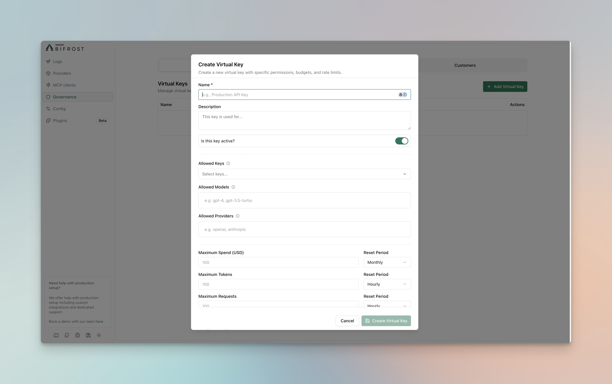
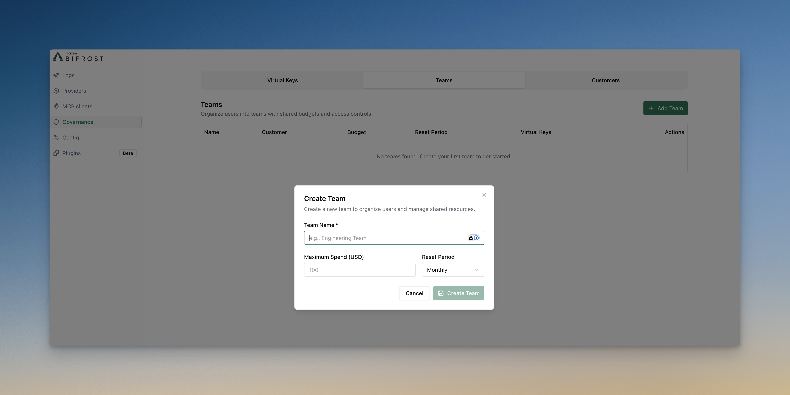
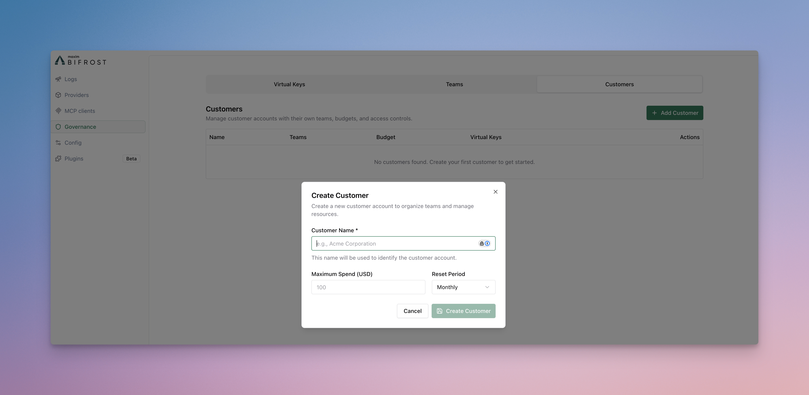
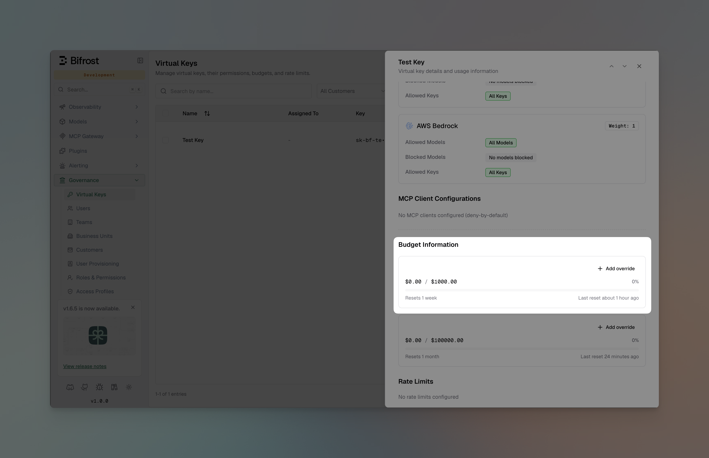
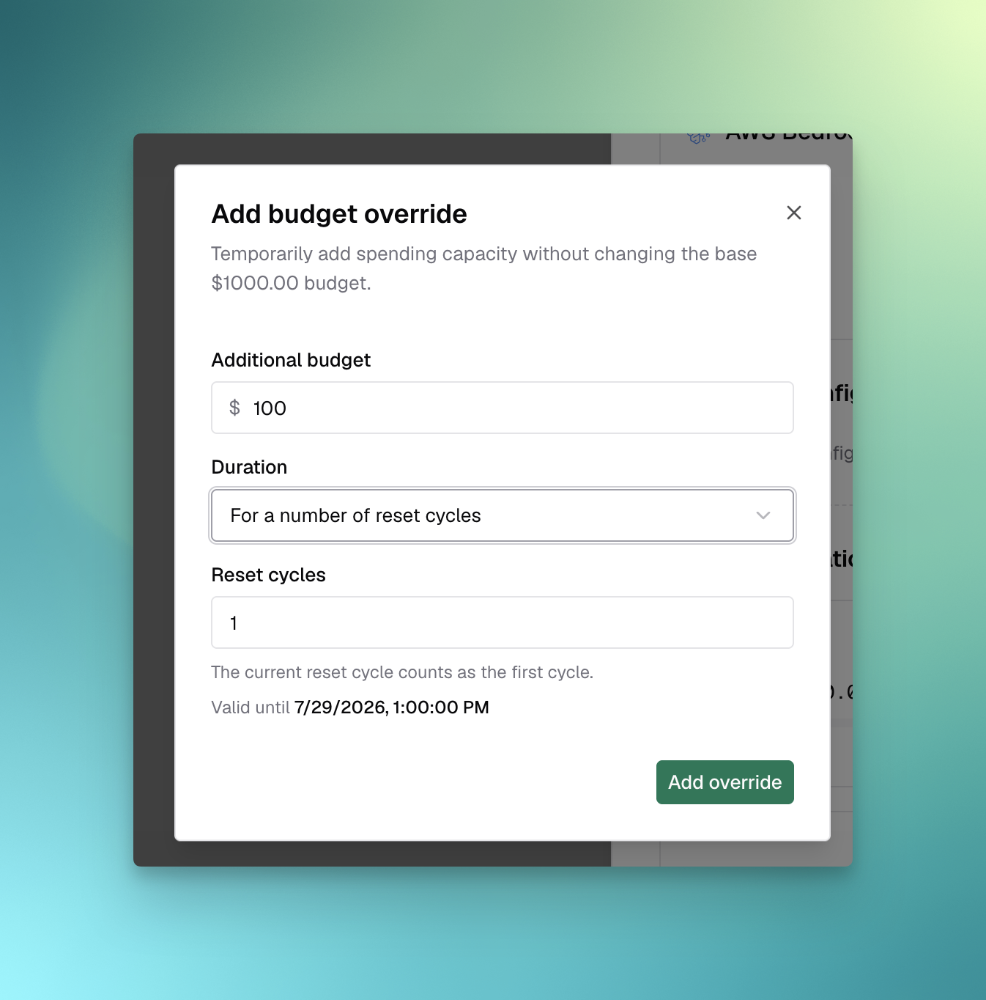
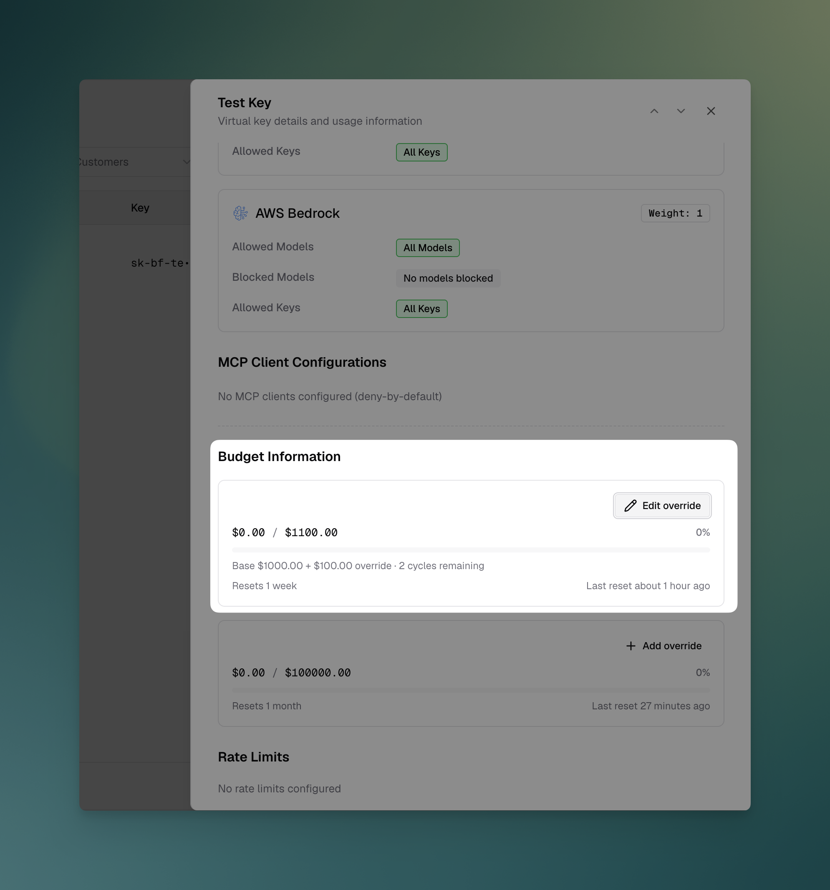
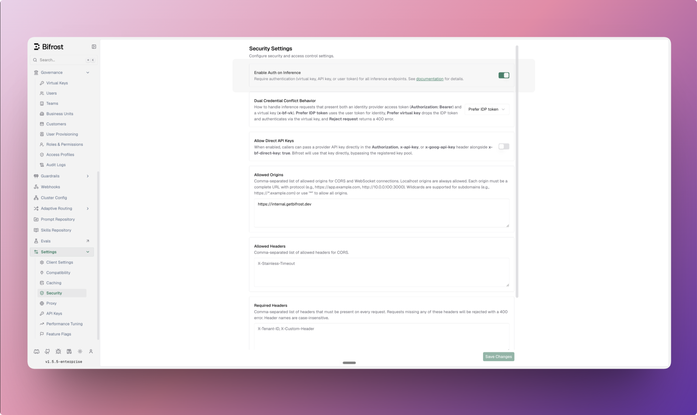
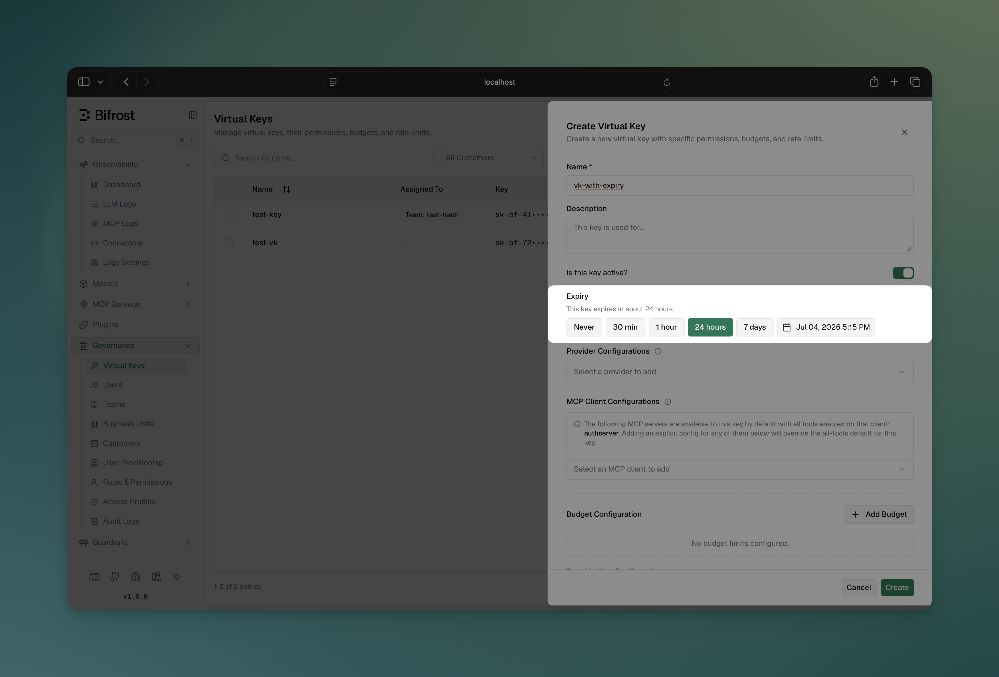
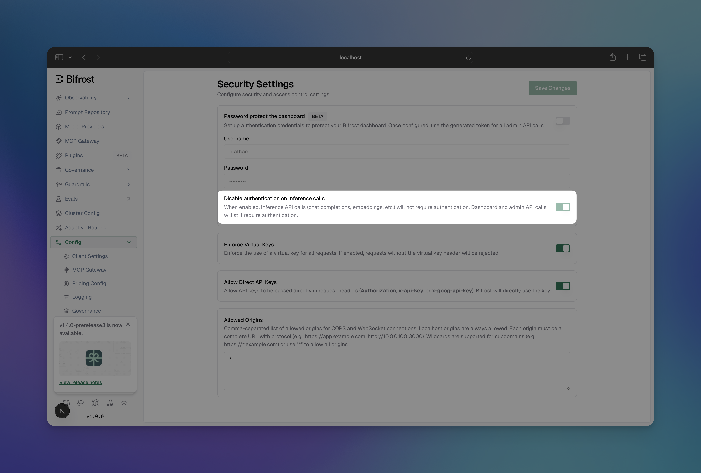

## Overview

Virtual Keys are the primary governance entity in Bifrost. Users and applications authenticate using the given headers to access virtual keys and get specific access permissions, budgets, and rate limits.

**Allowed Headers:**
- `x-bf-vk` - Virtual key header, eg. `sk-bf-*`
- `Authorization` - Authorization header, eg. `Bearer sk-bf-*` (OpenAI style)
- `x-api-key` - API key header, eg. `sk-bf-*` (Anthropic style)
- `x-goog-api-key` - API key header, eg. `sk-bf-*` (Google Gemini style)
- `api-key` - API key header, eg. `sk-bf-*` (Azure OpenAI style)

<Note>Old virtual keys(without `sk-bf-*` prefix) are only supported by `x-bf-vk` header.</Note>

**Key Features:**
- **Access Control** - Model and provider filtering
- **Cost Management** - Independent budgets (checked along with team/customer budgets if attached)
- **Budget Overrides** - Temporarily add spending capacity without changing the base budget
- **Rate Limiting** - Token and request-based throttling (VK-level only)
- **Key Restrictions** - Limit VK to specific provider API keys (if configured, VK can only use those keys)
- **Exclusive Attachment** - Belongs to either one team OR one customer OR neither (mutually exclusive)
- **Active/Inactive Status** - Enable/disable access instantly

## Configuration

<Tabs group="config-method">
<Tab title="Web UI">

1. Go to **Virtual Keys**
2. Click on **Add Virtual Key** button



**Budget Settings:**
- **Max Limit**: Dollar amount (e.g., `10.50`)
- **Reset Duration**: `1m`, `1h`, `1d`, `1w`, `1M`, `1Y`
- **Calendar aligned** (optional): When enabled, the budget resets at calendar boundaries in UTC (day/week/month/year) instead of on a rolling window. Only applies to day/week/month/year periods. See [Budget and Limits](./budget-and-limits#calendar-aligned-budgets).

**Rate Limits:**
- **Token Limit**: Max tokens per period
- **Request Limit**: Max requests per period
- **Reset Duration**: Reset frequency for each limit

**Associations:**
- **Team**: Assign to existing team (mutually exclusive with customer)
- **Customer**: Assign to existing customer (mutually exclusive with team)

**Expiry** (optional): Pick **Never**, a preset (30 min to 7 days), or a custom date and time. See [Key Expiry](#key-expiry).

3. Click **Create Virtual Key**

</Tab>
<Tab title="API">

**Create Virtual Key (attached to team):**
```bash
curl -X POST http://localhost:8080/api/governance/virtual-keys \
  -H "Content-Type: application/json" \
  -d '{
    "name": "Engineering Team API",
    "description": "Main API key for engineering team",
    "provider_configs": [
      {
        "provider": "openai",
        "weight": 0.5,
        "allowed_models": ["gpt-4o-mini"]
      },
      {
        "provider": "anthropic",
        "weight": 0.5,
        "allowed_models": ["claude-3-sonnet-20240229"]
      }
    ],
    "team_id": "team-eng-001",
    "budget": {
      "max_limit": 100.00,
      "reset_duration": "1M"
    },
    "rate_limit": {
      "token_max_limit": 10000,
      "token_reset_duration": "1h",
      "request_max_limit": 100,
      "request_reset_duration": "1m"
    },
    "key_ids": ["8c52039e-38c6-48b2-8016-0bd884b7befb"],
    "is_active": true
  }'
```

**Create Virtual Key (directly attached to customer):**
```bash
curl -X POST http://localhost:8080/api/governance/virtual-keys \
  -H "Content-Type: application/json" \
  -d '{
    "name": "Executive API Key",
    "description": "Direct customer-level API access",
    "provider_configs": [
      {
        "provider": "openai",
        "weight": 0.5,
        "allowed_models": ["gpt-4o"]
      },
      {
        "provider": "anthropic",
        "weight": 0.5,
        "allowed_models": ["claude-3-opus-20240229"]
      }
    ],
    "customer_id": "customer-acme-corp",
    "budget": {
      "max_limit": 500.00,
      "reset_duration": "1M"
    },
    "is_active": true
  }'
```

> **Note**: 
> - `team_id` and `customer_id` are mutually exclusive - a VK can only belong to one team OR one customer, not both.
> - `key_ids` restricts the VK to only use those specific provider API keys. Use `["*"]` to allow access to all available keys. An empty array `[]` or omitting the field entirely denies all keys.

**Update Virtual Key:**
```bash
curl -X PUT http://localhost:8080/api/governance/virtual-keys/{vk_id} \
  -H "Content-Type: application/json" \
  -d '{
    "description": "Updated description",
    "budget": {
      "max_limit": 150.00,
      "reset_duration": "1M"
    }
  }'
```

**Get Virtual Keys:**
```bash
# List all virtual keys
curl http://localhost:8080/api/governance/virtual-keys

# Get specific virtual key
curl http://localhost:8080/api/governance/virtual-keys/{vk_id}
```

**Delete Virtual Key:**
```bash
curl -X DELETE http://localhost:8080/api/governance/virtual-keys/{vk_id}
```

</Tab>
<Tab title="config.json">

```json
{
  "client": {
    "enforce_auth_on_inference": true
  },
  "governance": {
    "virtual_keys": [
      {
        "id": "vk-001",
        "name": "Engineering Team API",
        "value": "sk-bf-*",
        "description": "Main API key for engineering team",
        "is_active": true,
        "provider_configs": [
          {
            "provider": "openai",
            "weight": 0.5,
            "allowed_models": ["gpt-4o-mini"],
            "key_ids": ["openai-primary"]
          },
          {
            "provider": "anthropic",
            "weight": 0.5,
            "allowed_models": ["claude-3-sonnet-20240229"]
          }
        ],
        "team_id": "team-eng-001",
        "rate_limit_id": "rate-limit-eng-vk"
      },
      {
        "id": "vk-002",
        "name": "Executive API Key", 
        "value": "vk-executive-direct",
        "description": "Direct customer-level API access",
        "is_active": true,
        "provider_configs": [
          {
            "provider": "openai",
            "weight": 0.5,
            "allowed_models": ["gpt-4o"]
          },
          {
            "provider": "anthropic",
            "weight": 0.5,
            "allowed_models": ["claude-3-opus-20240229"]
          }
        ],
        "customer_id": "customer-acme-corp"
      }
    ],
    "budgets": [
      {
        "id": "budget-eng-vk",
        "virtual_key_id": "vk-001",
        "max_limit": 100.00,
        "reset_duration": "1M",
        "current_usage": 0.0,
        "last_reset": "2025-01-01T00:00:00Z"
      },
      {
        "id": "budget-exec-vk",
        "virtual_key_id": "vk-002",
        "max_limit": 500.00,
        "reset_duration": "1M",
        "current_usage": 0.0,
        "last_reset": "2025-01-01T00:00:00Z"
      }
    ],
    "rate_limits": [
      {
        "id": "rate-limit-eng-vk", 
        "token_max_limit": 10000,
        "token_reset_duration": "1h",
        "token_current_usage": 0,
        "token_last_reset": "2025-01-01T00:00:00Z",
        "request_max_limit": 100,
        "request_reset_duration": "1m",
        "request_current_usage": 0,
        "request_last_reset": "2025-01-01T00:00:00Z"
      }
    ]
  }
}
```

</Tab>
</Tabs>

## User Groups

### Teams

Teams provide organizational grouping for virtual keys with department-level budget management. Teams can belong to one customer and have their own independent budget allocation.

**Key Features:**
- **Organizational Structure** - Group multiple virtual keys
- **Independent Budgets** - Department-level cost control (separate from customer budgets)
- **Customer Association** - Can belong to one customer (optional)
- **No Rate Limits** - Teams cannot have rate limits (VK-level only)

**Configuration**

<Tabs group="config-method">
<Tab title="Web UI">

1. Go to **Users & Groups** → **Teams**

2. Click on **Add Team** button



Fill the form and click on **Create Team** button

3. **Assign Virtual Keys to Team**
   - Go to **Virtual Keys** page
   - Edit the virtual key and assign it to the team
   - Click on **Save** button

</Tab>
<Tab title="API">

**Create Team:**
```bash
curl -X POST http://localhost:8080/api/governance/teams \
  -H "Content-Type: application/json" \
  -d '{
    "name": "Engineering Team",
    "customer_id": "customer-acme-corp",
    "budgets": [
      {
        "max_limit": 500.00,
        "reset_duration": "1M"
      }
    ]
  }'
```

**Update Team:**
```bash
curl -X PUT http://localhost:8080/api/governance/teams/{team_id} \
  -H "Content-Type: application/json" \
  -d '{
    "name": "Updated Engineering Team",
    "budgets": [
      {
        "max_limit": 750.00,
        "reset_duration": "1M"
      }
    ]
  }'
```

**Get Teams:**
```bash
# List all teams
curl http://localhost:8080/api/governance/teams

# Get specific team
curl http://localhost:8080/api/governance/teams/{team_id}
```

**Delete Team:**
```bash
curl -X DELETE http://localhost:8080/api/governance/teams/{team_id}
```

</Tab>
<Tab title="config.json">

```json
{
  "governance": {
    "teams": [
      {
        "id": "team-eng-001",
        "name": "Engineering Team",
        "customer_id": "customer-acme-corp"
      },
      {
        "id": "team-sales-001", 
        "name": "Sales Team",
        "customer_id": "customer-acme-corp"
      }
    ],
    "budgets": [
      {
        "id": "budget-team-eng",
        "max_limit": 500.00,
        "reset_duration": "1M",
        "current_usage": 0.0,
        "last_reset": "2025-01-01T00:00:00Z",
        "team_id": "team-eng-001"
      },
      {
        "id": "budget-team-sales",
        "max_limit": 250.00,
        "reset_duration": "1M", 
        "current_usage": 0.0,
        "last_reset": "2025-01-01T00:00:00Z",
        "team_id": "team-sales-001"
      }
    ]
  }
}
```

Team budgets are owned from the budget side: set `team_id` on each entry in `governance.budgets`. Do not add `budget_id` to a team. A team can own multiple budgets as long as their reset durations are unique.

</Tab>
</Tabs>

### Customers

Customers represent the highest level in the governance hierarchy, typically corresponding to organizations or major business units. They provide top-level budget control and organizational structure.

**Key Features:**
- **Top-Level Organization** - Highest hierarchy level
- **Independent Budgets** - Organization-wide cost control (separate from team/VK budgets)
- **Team Management** - Contains multiple teams and direct VKs
- **No Rate Limits** - Customers cannot have rate limits (VK-level only)

**Configuration**

<Tabs group="config-method">
<Tab title="Web UI">

1. Go to **Users & Groups** → **Customers**

2. Click on **Add Customer** button



Fill the form and click on **Create Customer** button

3. **Assign Teams to Customer**
   - Go to **Teams** page
   - Edit the team and assign it to the customer
   - Click on **Save** button

4. **Assign Virtual Keys to Customer**
   - Go to **Virtual Keys** page
   - Edit the virtual key and assign it to the customer
   - Click on **Save** button

</Tab>
<Tab title="API">

**Create Customer:**
```bash
curl -X POST http://localhost:8080/api/governance/customers \
  -H "Content-Type: application/json" \
  -d '{
    "name": "Acme Corporation",
    "budget": {
      "max_limit": 2000.00,
      "reset_duration": "1M"
    }
  }'
```

**Update Customer:**
```bash
curl -X PUT http://localhost:8080/api/governance/customers/{customer_id} \
  -H "Content-Type: application/json" \
  -d '{
    "name": "Acme Corp (Updated)",
    "budget": {
      "max_limit": 2500.00,
      "reset_duration": "1M"
    }
  }'
```

**Get Customers:**
```bash
# List all customers
curl http://localhost:8080/api/governance/customers

# Get specific customer
curl http://localhost:8080/api/governance/customers/{customer_id}
```

**Delete Customer:**
```bash
curl -X DELETE http://localhost:8080/api/governance/customers/{customer_id}
```

</Tab>
<Tab title="config.json">

```json
{
  "governance": {
    "customers": [
      {
        "id": "customer-acme-corp",
        "name": "Acme Corporation",
        "budget_id": "budget-customer-acme"
      },
      {
        "id": "customer-beta-inc",
        "name": "Beta Inc",
        "budget_id": "budget-customer-beta"
      }
    ],
    "budgets": [
      {
        "id": "budget-customer-acme",
        "max_limit": 2000.00,
        "reset_duration": "1M",
        "current_usage": 0.0,
        "last_reset": "2025-01-01T00:00:00Z"
      },
      {
        "id": "budget-customer-beta",
        "max_limit": 1500.00,
        "reset_duration": "1M",
        "current_usage": 0.0,
        "last_reset": "2025-01-01T00:00:00Z"
      }
    ]
  }
}
```

</Tab>
</Tabs>

## Features

- **[Budget and Limits](./budget-and-limits)** - Enterprise-grade budget management and cost control and rate limiting using virtual keys
- **[Routing](./routing)** - Route requests to the appropriate providers/models and restrict api keys using virtual keys
- **[MCP Tool Filtering](./mcp-tools)** - Manage MCP clients/tools for virtual keys


## Usage

### Budget Overrides

Budget overrides add temporary spending capacity to an existing virtual-key budget without changing its base limit, current usage, or reset schedule. While an override is active, Bifrost calculates the effective limit as:

```text
Effective limit = Base budget + Override amount
```

For example, adding a `$100` override to a `$1,000` budget raises its effective limit to `$1,100`.

1. Go to **Virtual Keys**, open a virtual key, and scroll to **Budget Information**.
2. Click **Add override** on the budget you want to increase.



3. Enter the **Additional budget**, then choose a duration:
   - **For a number of reset cycles**: Enter one or more cycles. The current cycle counts as the first cycle, and the dialog shows the date and time until which the override is expected to remain valid.
   - **Until removed**: Keep the override active across resets until it is removed manually.



4. Click **Add override**. The budget card displays the effective limit, its base and override amounts, and either the remaining reset cycles or **until removed**.



To change or remove an active override, click **Edit override** on the budget card. For programmatic configuration, see the **Virtual Keys** section of the [API Reference](/api-reference).

<Note>
Overrides are available after a budget has been created. Budgets inherited from an enterprise [access profile](/enterprise/access-profiles) must be overridden from that access profile instead of from the virtual key.
</Note>

### Making Virtual Keys Mandatory

All governance-enabled requests must include the virtual key header:

```bash
curl -X POST http://localhost:8080/v1/chat/completions \
  -H "Content-Type: application/json" \
  -H "x-bf-vk: sk-bf-*" \
  -d '{
    "model": "gpt-4o-mini",
    "messages": [{"role": "user", "content": "Hello!"}]
  }'
```

By default governance is optional, meaning that if the virtual key header is not present, the request will be allowed but without any governance checks/routing. But you can make it mandatory by enforcing the virtual key header.

<Tabs group="enforce-governance-header">
<Tab title="Web UI">

1. Go to **Settings** → **Security**.
2. Turn on **Enable Auth on Inference**. In OSS, this toggle is labeled **Enforce Virtual Keys on Inference**.
3. Click **Save Changes**.



</Tab>
<Tab title="API">
```bash
curl -X PUT http://localhost:8080/api/config \
  -H "Content-Type: application/json" \
  -d '{
    "client_config": {
      "enforce_auth_on_inference": true
    }
  }'
```

</Tab>
<Tab title="config.json">

```json
{
  "client": {
    "enforce_auth_on_inference": true
  }
}
```

</Tab>
</Tabs>

In OSS, enabling this setting makes a valid virtual key mandatory for every inference request. Requests without one are rejected.

### Key Expiry

Virtual keys can optionally carry an expiry timestamp. Once the expiry passes, requests using the key are rejected with a `403` and the reason `Virtual key has expired` — the key is not deleted or deactivated, so it stays visible for auditing and can be restored at any time.

- **No expiry by default** — keys without `expires_at` never expire.
- **Fail closed** — both LLM inference and MCP tool execution are blocked once the key expires.
- **Inactive wins** — a key that is both inactive and expired is rejected as inactive.
- **Restore anytime** — extend the expiry to a future timestamp or clear it; access resumes immediately.

<Tabs group="config-method">
<Tab title="Web UI">

1. Go to **Virtual Keys** and create or edit a key
2. In the **Expiry** section, pick **Never**, a preset (**30 min**, **1 hour**, **24 hours**, **7 days**), or choose a custom date and time from the calendar



Expired keys show an **Expired** badge in the virtual keys table.

</Tab>
<Tab title="API">

**Create with expiry:**
```bash
curl -X POST http://localhost:8080/api/governance/virtual-keys \
  -H "Content-Type: application/json" \
  -d '{
    "name": "Contractor API Key",
    "provider_configs": [
      {
        "provider": "openai",
        "allowed_models": ["gpt-4o-mini"],
        "key_ids": ["*"]
      }
    ],
    "expires_at": "2026-08-01T00:00:00Z"
  }'
```

**Set or extend expiry on an existing key:**
```bash
curl -X PUT http://localhost:8080/api/governance/virtual-keys/{vk_id} \
  -H "Content-Type: application/json" \
  -d '{"expires_at": "2026-09-01T00:00:00Z"}'
```

**Clear expiry (key never expires again):**
```bash
curl -X PUT http://localhost:8080/api/governance/virtual-keys/{vk_id} \
  -H "Content-Type: application/json" \
  -d '{"expires_at": ""}'
```

Timestamps must be RFC3339 and in the future; otherwise the API returns `400`. On update, omitting `expires_at` leaves the current expiry unchanged.

**Expired key rejection:**
```json
{
  "type": "virtual_key_blocked",
  "status_code": 403,
  "error": {
    "message": "Virtual key has expired"
  }
}
```

</Tab>
<Tab title="config.json">

```json
{
  "governance": {
    "virtual_keys": [
      {
        "id": "vk-contractor",
        "name": "Contractor API Key",
        "value": "sk-bf-*",
        "provider_configs": [
          {
            "provider": "openai",
            "allowed_models": ["gpt-4o-mini"],
            "key_ids": ["*"]
          }
        ],
        "expires_at": "2026-08-01T00:00:00Z"
      }
    ]
  }
}
```

<Note>
For config-managed virtual keys the file is the source of truth: removing `expires_at` from the file clears the expiry on the next sync.
</Note>

</Tab>
</Tabs>

### Authentication and Virtual Keys

Virtual keys and HTTP authentication are **independent layers** that can work together:

| Layer | Purpose | Headers |
|-------|---------|---------|
| **Authentication** | Validates user identity | `Authorization: Basic/Bearer <credentials>` |
| **Virtual Keys** | Request routing and governance | `x-bf-vk`, `Authorization`[^1], `x-api-key`, `x-goog-api-key` |

[^1]: Authorization can carry virtual keys only when auth is disabled (`disable_auth_on_inference: true`). When auth is enabled, Authorization is consumed by authentication and cannot be used for virtual keys.

**When `disable_auth_on_inference: true` (auth disabled):**

Virtual keys can be passed via any supported header without additional authentication:

```bash
# Using x-bf-vk header
curl -X POST http://localhost:8080/v1/chat/completions \
  -H "x-bf-vk: <VIRTUAL_KEY>" \
  -H "Content-Type: application/json" \
  -d '{"model": "gpt-4o-mini", "messages": [...]}'

# Using Authorization header (OpenAI style)
curl -X POST http://localhost:8080/v1/chat/completions \
  -H "Authorization: Bearer <VIRTUAL_KEY>" \
  -H "Content-Type: application/json" \
  -d '{"model": "gpt-4o-mini", "messages": [...]}'
```

### Listing models with a virtual key

When you call `GET /v1/models` with a virtual key, Bifrost **only lists (and only queries) providers that are allowed by that virtual key**. This avoids unnecessary “provider not allowed” errors in logs and keeps error-rate metrics meaningful.

```bash
# Lists models across providers allowed by the virtual key
curl -sS "http://localhost:8080/v1/models" \
  -H "x-bf-vk: <VIRTUAL_KEY>"
```

If you specify a provider explicitly via `?provider=...`, that provider must still be allowed by the virtual key or the request will be rejected:

```bash
# If "anthropic" is not configured/allowed on this virtual key, this returns 403
curl -sS "http://localhost:8080/v1/models?provider=anthropic" \
  -H "x-bf-vk: <VIRTUAL_KEY>"
```

**When `disable_auth_on_inference: false` (auth enabled):**

You must provide both authentication credentials AND the virtual key. Use `x-bf-vk` for the virtual key since the `Authorization` header is used for authentication:

```bash
curl -X POST http://localhost:8080/v1/chat/completions \
  -H "Authorization: Basic <base64-credentials>" \
  -H "x-bf-vk: <VIRTUAL_KEY>" \
  -H "Content-Type: application/json" \
  -d '{"model": "gpt-4o-mini", "messages": [...]}'
```

**Configuring `disable_auth_on_inference`:**

<Tabs group="config-method">
<Tab title="Web UI">

1. Go to **Config** → **Security**
2. Toggle **Disable Auth on Inference** to enable/disable



</Tab>
<Tab title="API">

```bash
curl -X PUT http://localhost:8080/api/config \
  -H "Content-Type: application/json" \
  -d '{
    "auth_config": {
      "disable_auth_on_inference": true
    }
  }'
```

</Tab>
<Tab title="config.json">

```json
{
  "auth_config": {
    "is_enabled": true,
    "disable_auth_on_inference": true
  }
}
```

</Tab>
</Tabs>

### Error Responses

- Virtual Key Not Found (400)
```json
{
  "error": {
    "type": "virtual_key_required",
    "message": "virtual key is missing in headers"
  }
}
```

- Virtual Key Blocked (403)
```json
{
  "error": {
    "type": "virtual_key_blocked", 
    "message": "Virtual key is inactive"
  }
}
```

- Rate Limit Exceeded (429)
```json
{
  "error": {
    "type": "rate_limited",
    "message": "Rate limits exceeded: [token limit exceeded (1500/1000, resets every 1h)]"
  }
}
```

- Token Limit Exceeded (429)
```json
{
  "error": {
    "type": "token_limited",
    "message": "Rate limits exceeded: [token limit exceeded (1500/1000, resets every 1h)]"
  }
}
```

- Request Limit Exceeded (429)
```json
{
  "error": {
    "type": "request_limited", 
    "message": "Rate limits exceeded: [request limit exceeded (101/100, resets every 1m)]"
  }
}
```

- Budget Exceeded (402)
```json
{
  "error": {
    "type": "budget_exceeded",
    "message": "Budget exceeded: VK budget exceeded: 105.50 > 100.00 dollars"
  }
}
```

- Model Not Allowed (403)
```json
{
  "error": {
    "type": "model_blocked",
    "message": "Model 'gpt-4o' is not allowed for this virtual key"
  }
}
```

- Provider Not Allowed (403)
```json
{
  "error": {
    "type": "provider_blocked",
    "message": "Provider 'anthropic' is not allowed for this virtual key"
  }
}
```
