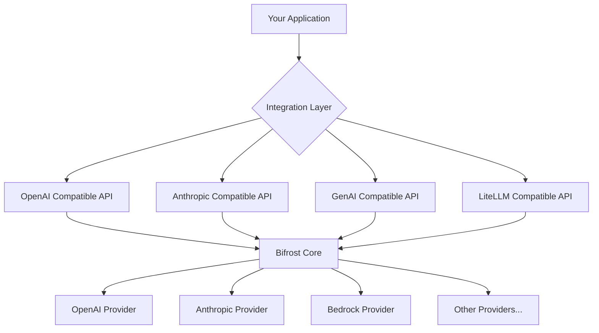

# 🔄 Drop-in API Integrations

Bifrost provides drop-in compatibility with popular AI service APIs, allowing you to replace existing integrations without changing your code.

## 📑 Available Integrations

| Integration                       | Status        | Compatibility   | Use Case                    |
| --------------------------------- | ------------- | --------------- | --------------------------- |
| **[OpenAI API](openai.md)**       | ✅ Production | 100% Compatible | Replace OpenAI API calls    |
| **[Anthropic API](anthropic.md)** | ✅ Production | 100% Compatible | Replace Anthropic API calls |
| **[Google GenAI](genai.md)**      | ✅ Production | 100% Compatible | Replace Google AI API calls |
| **[LiteLLM](litellm.md)**         | ✅ Production | 100% Compatible | Replace LiteLLM proxy       |

---

## 🚀 Quick Start

### Zero-Code Migration

Replace your existing API endpoint with Bifrost's HTTP transport:

**Before (OpenAI):**

```python
import openai
client = openai.OpenAI(base_url="https://api.openai.com/v1")
```

**After (Bifrost):**

```python
import openai
client = openai.OpenAI(base_url="http://localhost:8080/openai/v1")
```

That's it! No other code changes needed.

### Supported Features

All integrations support:

- ✅ **Chat Completions** - Text conversations
- ✅ **Streaming** - Real-time response streaming
- ✅ **Tool Calling** - Function calling capabilities
- ✅ **Vision** - Image analysis (where supported)
- ✅ **Error Handling** - Compatible error responses
- ✅ **Rate Limiting** - Proper HTTP status codes

---

## 🏗️ Architecture

### How Drop-in Compatibility Works



### Request Flow

1. **Your app** makes standard API call (e.g., OpenAI format)
2. **Integration layer** translates to Bifrost format
3. **Bifrost core** processes with fallbacks, load balancing
4. **Provider** handles actual AI request
5. **Response** translated back to original API format

---

## 📚 Integration Guides

### [🤖 OpenAI API Compatibility](openai.md)

Perfect drop-in replacement for OpenAI API:

```bash
# Original OpenAI endpoint
curl https://api.openai.com/v1/chat/completions

# Bifrost replacement
curl http://localhost:8080/openai/v1/chat/completions
```

**Key Features:**

- 100% OpenAI API compatibility
- Automatic provider fallbacks
- Multiple API key support
- Enhanced error handling

---

### [🧠 Anthropic API Compatibility](anthropic.md)

Seamless Claude API integration:

```bash
# Original Anthropic endpoint
curl https://api.anthropic.com/v1/messages

# Bifrost replacement
curl http://localhost:8080/anthropic/v1/messages
```

**Key Features:**

- Full Claude API compatibility
- Streaming support
- Tool calling capabilities
- Advanced prompt caching

---

### [🌟 Google GenAI Compatibility](genai.md)

Google AI API integration:

```bash
# Original Google AI endpoint
curl https://generativelanguage.googleapis.com/v1beta/models/gemini-pro:generateContent

# Bifrost replacement
curl http://localhost:8080/genai/v1beta/models/gemini-pro:generateContent
```

**Key Features:**

- Gemini model support
- Multi-modal capabilities
- Safety settings
- Content filtering

---

### [⚡ LiteLLM Compatibility](litellm.md)

LiteLLM proxy replacement:

```bash
# Original LiteLLM endpoint
curl http://localhost:4000/chat/completions

# Bifrost replacement
curl http://localhost:8080/litellm/chat/completions
```

**Key Features:**

- Multi-provider routing
- Cost tracking
- Rate limiting
- Model aliasing

---

## 🔧 Configuration

### Basic Setup

```json
{
  "providers": {
    "openai": {
      "keys": [
        {
          "value": "env.OPENAI_API_KEY",
          "models": ["gpt-4o-mini"],
          "weight": 1.0
        }
      ]
    },
    "anthropic": {
      "keys": [
        {
          "value": "env.ANTHROPIC_API_KEY",
          "models": ["claude-3-sonnet-20240229"],
          "weight": 1.0
        }
      ]
    }
  }
}
```

### Advanced Integration Configuration

```json
{
  "integrations": {
    "openai": {
      "enabled": true,
      "default_model": "gpt-4o-mini",
      "fallback_providers": ["anthropic", "bedrock"]
    },
    "anthropic": {
      "enabled": true,
      "default_model": "claude-3-sonnet-20240229",
      "streaming": true
    },
    "genai": {
      "enabled": true,
      "safety_settings": "block_few"
    }
  }
}
```

---

## 🛠️ Migration Guide

### Step 1: Install Bifrost

```bash
# Docker deployment
docker pull maximhq/bifrost
docker run -p 8080:8080 -v $(pwd)/config.json:/app/config/config.json maximhq/bifrost
```

### Step 2: Update Endpoints

Update your application's base URL:

| Integration   | Original Endpoint                                  | Bifrost Endpoint                     |
| ------------- | -------------------------------------------------- | ------------------------------------ |
| **OpenAI**    | `https://api.openai.com/v1`                        | `http://localhost:8080/openai/v1`    |
| **Anthropic** | `https://api.anthropic.com/v1`                     | `http://localhost:8080/anthropic/v1` |
| **GenAI**     | `https://generativelanguage.googleapis.com/v1beta` | `http://localhost:8080/genai/v1beta` |
| **LiteLLM**   | `http://localhost:4000`                            | `http://localhost:8080/litellm`      |

### Step 3: Test Compatibility

```bash
# Test each integration
curl http://localhost:8080/openai/v1/models
curl http://localhost:8080/anthropic/v1/models
curl http://localhost:8080/genai/v1beta/models
curl http://localhost:8080/litellm/models
```

### Step 4: Deploy

No code changes needed! Your existing application will work seamlessly.

---

## 🔍 Debugging Integration Issues

### Common Issues

| Issue                         | Cause                | Solution                             |
| ----------------------------- | -------------------- | ------------------------------------ |
| **404 Not Found**             | Wrong endpoint path  | Check integration endpoint URLs      |
| **401 Unauthorized**          | API key issues       | Verify keys in Bifrost config        |
| **Different response format** | API version mismatch | Update to latest integration version |
| **Missing features**          | Unsupported endpoint | Check feature compatibility matrix   |

### Debug Mode

Enable debug logging to see integration request/response translation:

```bash
# Docker with debug logging
docker run -p 8080:8080 \
  -e LOG_LEVEL=debug \
  -v $(pwd)/config.json:/app/config/config.json \
  maximhq/bifrost
```

### Health Checks

Test integration health:

```bash
# Check integration status
curl http://localhost:8080/health/integrations

# Check specific integration
curl http://localhost:8080/health/integrations/openai
```

---

## 📊 Benefits of Using Bifrost Integrations

### Cost Optimization

- **Multi-provider routing** - Use cheapest available model
- **Automatic fallbacks** - Avoid downtime costs
- **Load balancing** - Distribute costs across keys

### Reliability

- **99.9% uptime** - Provider failover
- **Rate limit handling** - Automatic retry with backoff
- **Error recovery** - Intelligent fallback strategies

### Enhanced Features

- **Unified logging** - Single source of truth
- **Advanced metrics** - Performance monitoring
- **Security** - Centralized key management
- **Compliance** - Audit trails and controls

---

## 🤝 Contributing

Want to add a new integration? Check our [Contributing Guide](../../contributing/README.md) for:

- Integration development standards
- Testing requirements
- Documentation templates
- Community guidelines

---

**Ready to migrate?** Choose your integration and follow the specific guide for seamless migration!
