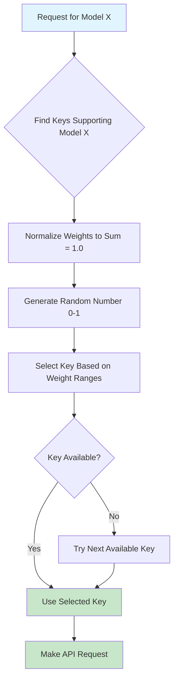

# 🔑 API Key Management

Bifrost provides sophisticated API key management with weighted distribution, automatic rotation, and model-specific assignments across all supported providers.

## 📋 Overview

**Key Management Features:**

- ✅ **Multiple Keys per Provider** - Distribute load across multiple API keys
- ✅ **Weighted Distribution** - Control traffic distribution with custom weights
- ✅ **Model-Specific Keys** - Assign keys to specific models only
- ✅ **Automatic Rotation** - Seamless failover when keys are rate-limited
- ✅ **Load Balancing** - Intelligent request distribution
- ✅ **Cost Optimization** - Use different keys for different cost tiers

**Benefits:**

- 🛡️ **Higher Rate Limits** - Combine multiple keys for increased throughput
- ⚡ **Improved Reliability** - Automatic failover prevents service interruption
- 💰 **Cost Control** - Route traffic based on budget and usage patterns
- 🔧 **Zero Downtime** - Hot-swap keys without service interruption

---

## ⚡ Quick Examples

<details open>
<summary><strong>🔧 Go Package Usage</strong></summary>

```go
func (a *MyAccount) GetKeysForProvider(provider schemas.ModelProvider) ([]schemas.Key, error) {
    switch provider {
    case schemas.OpenAI:
        return []schemas.Key{
            {
                Value:  os.Getenv("OPENAI_API_KEY_1"),
                Models: []string{"gpt-4o-mini", "gpt-4o"},
                Weight: 0.7,  // 70% of traffic
            },
            {
                Value:  os.Getenv("OPENAI_API_KEY_2"),
                Models: []string{"gpt-4o"},
                Weight: 0.3,  // 30% of traffic (premium key for GPT-4o only)
            },
        }, nil
    }
    return nil, fmt.Errorf("provider not configured")
}
```

**[📖 Complete Go Package Guide →](../usage/go-package/)**

</details>

<details>
<summary><strong>🌐 HTTP Transport Usage</strong></summary>

**Configuration file (`config.json`):**

```json
{
  "providers": {
    "openai": {
      "keys": [
        {
          "value": "env.OPENAI_API_KEY_1",
          "models": ["gpt-4o-mini", "gpt-4o"],
          "weight": 0.7
        },
        {
          "value": "env.OPENAI_API_KEY_2",
          "models": ["gpt-4o"],
          "weight": 0.3
        }
      ]
    }
  }
}
```

**Environment variables:**

```bash
export OPENAI_API_KEY_1="sk-..."
export OPENAI_API_KEY_2="sk-..."
```

**[📖 Complete HTTP Transport Guide →](../usage/http-api/)**

</details>

---

## 🎯 Key Distribution Strategies

### 1. Load Balancing

Distribute requests evenly across multiple keys to maximize throughput:

<details>
<summary><strong>🔧 Go Package - Equal Distribution</strong></summary>

```go
func (a *MyAccount) GetKeysForProvider(provider schemas.ModelProvider) ([]schemas.Key, error) {
    if provider == schemas.OpenAI {
        return []schemas.Key{
            {
                Value:  os.Getenv("OPENAI_KEY_1"),
                Models: []string{"gpt-4o-mini", "gpt-4o"},
                Weight: 0.25,  // 25% each
            },
            {
                Value:  os.Getenv("OPENAI_KEY_2"),
                Models: []string{"gpt-4o-mini", "gpt-4o"},
                Weight: 0.25,
            },
            {
                Value:  os.Getenv("OPENAI_KEY_3"),
                Models: []string{"gpt-4o-mini", "gpt-4o"},
                Weight: 0.25,
            },
            {
                Value:  os.Getenv("OPENAI_KEY_4"),
                Models: []string{"gpt-4o-mini", "gpt-4o"},
                Weight: 0.25,
            },
        }, nil
    }
    return nil, fmt.Errorf("provider not configured")
}
```

**Result:** 4x throughput increase with automatic failover

</details>

<details>
<summary><strong>🌐 HTTP Transport - Equal Distribution</strong></summary>

```json
{
  "providers": {
    "openai": {
      "keys": [
        {
          "value": "env.OPENAI_KEY_1",
          "models": ["gpt-4o-mini", "gpt-4o"],
          "weight": 0.25
        },
        {
          "value": "env.OPENAI_KEY_2",
          "models": ["gpt-4o-mini", "gpt-4o"],
          "weight": 0.25
        },
        {
          "value": "env.OPENAI_KEY_3",
          "models": ["gpt-4o-mini", "gpt-4o"],
          "weight": 0.25
        },
        {
          "value": "env.OPENAI_KEY_4",
          "models": ["gpt-4o-mini", "gpt-4o"],
          "weight": 0.25
        }
      ]
    }
  }
}
```

</details>

### 2. Tiered Access

Use premium keys for expensive models, standard keys for cheaper models:

<details>
<summary><strong>🔧 Go Package - Tiered Strategy</strong></summary>

```go
func (a *MyAccount) GetKeysForProvider(provider schemas.ModelProvider) ([]schemas.Key, error) {
    if provider == schemas.OpenAI {
        return []schemas.Key{
            // Standard keys for cheap models
            {
                Value:  os.Getenv("OPENAI_STANDARD_KEY_1"),
                Models: []string{"gpt-4o-mini"},  // Cheap model only
                Weight: 0.4,
            },
            {
                Value:  os.Getenv("OPENAI_STANDARD_KEY_2"),
                Models: []string{"gpt-4o-mini"},
                Weight: 0.3,
            },
            // Premium keys for expensive models
            {
                Value:  os.Getenv("OPENAI_PREMIUM_KEY_1"),
                Models: []string{"gpt-4o", "gpt-4o-mini"},  // All models
                Weight: 0.2,
            },
            {
                Value:  os.Getenv("OPENAI_PREMIUM_KEY_2"),
                Models: []string{"gpt-4o"},  // Premium model only
                Weight: 0.1,
            },
        }, nil
    }
    return nil, fmt.Errorf("provider not configured")
}
```

**Result:** Cost optimization with automatic model routing

</details>

<details>
<summary><strong>🌐 HTTP Transport - Tiered Strategy</strong></summary>

```json
{
  "providers": {
    "openai": {
      "keys": [
        {
          "value": "env.OPENAI_STANDARD_KEY_1",
          "models": ["gpt-4o-mini"],
          "weight": 0.4
        },
        {
          "value": "env.OPENAI_STANDARD_KEY_2",
          "models": ["gpt-4o-mini"],
          "weight": 0.3
        },
        {
          "value": "env.OPENAI_PREMIUM_KEY_1",
          "models": ["gpt-4o", "gpt-4o-mini"],
          "weight": 0.2
        },
        {
          "value": "env.OPENAI_PREMIUM_KEY_2",
          "models": ["gpt-4o"],
          "weight": 0.1
        }
      ]
    }
  }
}
```

</details>

### 3. Multi-Provider Redundancy

Combine key management with fallback providers for maximum reliability:

<details>
<summary><strong>🔧 Go Package - Multi-Provider Keys</strong></summary>

```go
func (a *MyAccount) GetConfiguredProviders() ([]schemas.ModelProvider, error) {
    return []schemas.ModelProvider{
        schemas.OpenAI,
        schemas.Anthropic,
        schemas.Bedrock,
    }, nil
}

func (a *MyAccount) GetKeysForProvider(provider schemas.ModelProvider) ([]schemas.Key, error) {
    switch provider {
    case schemas.OpenAI:
        return []schemas.Key{
            {Value: os.Getenv("OPENAI_KEY_1"), Models: []string{"gpt-4o"}, Weight: 0.6},
            {Value: os.Getenv("OPENAI_KEY_2"), Models: []string{"gpt-4o"}, Weight: 0.4},
        }, nil
    case schemas.Anthropic:
        return []schemas.Key{
            {Value: os.Getenv("ANTHROPIC_KEY_1"), Models: []string{"claude-3-5-sonnet-20241022"}, Weight: 1.0},
        }, nil
    case schemas.Bedrock:
        return []schemas.Key{
            {Value: os.Getenv("AWS_ACCESS_KEY"), Models: []string{"anthropic.claude-3-5-sonnet-20241022-v2:0"}, Weight: 1.0},
        }, nil
    }
    return nil, fmt.Errorf("provider not configured")
}

// Use with fallbacks
result, err := client.ChatCompletion(ctx, schemas.BifrostRequest{
    Provider: schemas.OpenAI,
    Model:    "gpt-4o",
    Input:    input,
    Fallbacks: []schemas.Fallback{
        {Provider: schemas.Anthropic, Model: "claude-3-5-sonnet-20241022"},
        {Provider: schemas.Bedrock, Model: "anthropic.claude-3-5-sonnet-20241022-v2:0"},
    },
})
```

</details>

<details>
<summary><strong>🌐 HTTP Transport - Multi-Provider Keys</strong></summary>

```json
{
  "providers": {
    "openai": {
      "keys": [
        {
          "value": "env.OPENAI_KEY_1",
          "models": ["gpt-4o"],
          "weight": 0.6
        },
        {
          "value": "env.OPENAI_KEY_2",
          "models": ["gpt-4o"],
          "weight": 0.4
        }
      ]
    },
    "anthropic": {
      "keys": [
        {
          "value": "env.ANTHROPIC_KEY_1",
          "models": ["claude-3-5-sonnet-20241022"],
          "weight": 1.0
        }
      ]
    },
    "bedrock": {
      "keys": [
        {
          "value": "env.AWS_ACCESS_KEY",
          "models": ["anthropic.claude-3-5-sonnet-20241022-v2:0"],
          "weight": 1.0
        }
      ],
      "meta_config": {
        "region": "us-east-1",
        "secret_access_key": "env.AWS_SECRET_ACCESS_KEY"
      }
    }
  }
}
```

**Use with fallbacks:**

```bash
curl -X POST http://localhost:8080/v1/chat/completions \
  -H "Content-Type: application/json" \
  -d '{
    "provider": "openai",
    "model": "gpt-4o",
    "messages": [...],
    "fallbacks": [
      {"provider": "anthropic", "model": "claude-3-5-sonnet-20241022"},
      {"provider": "bedrock", "model": "anthropic.claude-3-5-sonnet-20241022-v2:0"}
    ]
  }'
```

</details>

---

## 🔍 Key Selection Algorithm

### How Bifrost Selects Keys

Bifrost uses a weighted random selection algorithm:



### Weight Calculation Example

Given these keys:

```json
[
  { "weight": 0.6, "models": ["gpt-4o"] },
  { "weight": 0.3, "models": ["gpt-4o"] },
  { "weight": 0.1, "models": ["gpt-4o"] }
]
```

**Selection ranges:**

- Key 1: 0.0 - 0.6 (60% chance)
- Key 2: 0.6 - 0.9 (30% chance)
- Key 3: 0.9 - 1.0 (10% chance)

### Fallback Behavior

When the selected key fails:

1. **Mark key as temporarily unavailable**
2. **Select next available key** for the same provider
3. **If no keys available**, proceed to fallback providers
4. **Retry failed keys** after backoff period

---

## 🔒 Security Best Practices

### Environment Variable Management

<details>
<summary><strong>🔧 Go Package - Secure Key Loading</strong></summary>

```go
import (
    "os"
    "fmt"
    "log"
)

func loadAPIKey(keyName string) string {
    key := os.Getenv(keyName)
    if key == "" {
        log.Fatalf("Required environment variable %s not set", keyName)
    }
    // Validate key format
    if len(key) < 10 {
        log.Fatalf("Invalid API key format for %s", keyName)
    }
    return key
}

func (a *MyAccount) GetKeysForProvider(provider schemas.ModelProvider) ([]schemas.Key, error) {
    switch provider {
    case schemas.OpenAI:
        return []schemas.Key{
            {
                Value:  loadAPIKey("OPENAI_KEY_1"),
                Models: []string{"gpt-4o-mini"},
                Weight: 1.0,
            },
        }, nil
    }
    return nil, fmt.Errorf("provider not configured")
}
```

</details>

<details>
<summary><strong>🌐 HTTP Transport - Secure Configuration</strong></summary>

**Use environment variables instead of hardcoded keys:**

```json
{
  "providers": {
    "openai": {
      "keys": [
        {
          "value": "env.OPENAI_KEY_1",
          "models": ["gpt-4o-mini"],
          "weight": 1.0
        }
      ]
    }
  }
}
```

**Environment file (`.env`):**

```bash
# Production keys
OPENAI_KEY_1=sk-proj-...
ANTHROPIC_KEY_1=sk-ant-...

# Development keys
OPENAI_DEV_KEY=sk-proj-...
ANTHROPIC_DEV_KEY=sk-ant-...
```

</details>

### Key Rotation Strategy

**1. Zero-Downtime Rotation:**

- Add new key with small weight
- Gradually increase new key weight
- Gradually decrease old key weight
- Remove old key when weight reaches 0

**2. Emergency Rotation:**

- Add new key immediately with full weight
- Remove compromised key immediately
- Monitor for any issues

**3. Scheduled Rotation:**

- Rotate keys monthly/quarterly
- Use monitoring to track key usage
- Automate rotation with CI/CD

### Access Control

**Environment-Based Separation:**

```bash
# Production
export OPENAI_PROD_KEY_1="sk-prod-..."
export OPENAI_PROD_KEY_2="sk-prod-..."

# Staging
export OPENAI_STAGING_KEY="sk-staging-..."

# Development
export OPENAI_DEV_KEY="sk-dev-..."
```

**Role-Based Key Assignment:**

```bash
# Customer-facing services
export OPENAI_CUSTOMER_KEY="sk-customer-..."

# Internal tools
export OPENAI_INTERNAL_KEY="sk-internal-..."

# Analytics/reporting
export OPENAI_ANALYTICS_KEY="sk-analytics-..."
```

---

## 📊 Monitoring & Observability

### Key Usage Metrics

Track key performance with built-in metrics:

**Prometheus Metrics Available:**

- `bifrost_key_requests_total{provider, key_id, model}` - Total requests per key
- `bifrost_key_errors_total{provider, key_id, error_type}` - Error counts per key
- `bifrost_key_latency_seconds{provider, key_id}` - Response latency per key

### Custom Monitoring

<details>
<summary><strong>🔧 Go Package - Key Usage Tracking</strong></summary>

```go
type MonitoredAccount struct {
    keyUsage map[string]int64
    mutex    sync.RWMutex
}

func (a *MonitoredAccount) GetKeysForProvider(provider schemas.ModelProvider) ([]schemas.Key, error) {
    keys := []schemas.Key{
        {Value: os.Getenv("OPENAI_KEY_1"), Models: []string{"gpt-4o"}, Weight: 0.7},
        {Value: os.Getenv("OPENAI_KEY_2"), Models: []string{"gpt-4o"}, Weight: 0.3},
    }

    // Track key requests
    a.mutex.Lock()
    for _, key := range keys {
        a.keyUsage[key.Value]++
    }
    a.mutex.Unlock()

    return keys, nil
}

func (a *MonitoredAccount) GetKeyUsageStats() map[string]int64 {
    a.mutex.RLock()
    defer a.mutex.RUnlock()

    stats := make(map[string]int64)
    for key, count := range a.keyUsage {
        // Mask key for security (show last 4 chars only)
        maskedKey := "sk-..." + key[len(key)-4:]
        stats[maskedKey] = count
    }
    return stats
}
```

</details>

<details>
<summary><strong>🌐 HTTP Transport - Prometheus Labels</strong></summary>

**Start Bifrost with key tracking:**

```bash
bifrost-http -config config.json -prometheus-labels key-id,model
```

**Query key metrics:**

```bash
# Total requests per key
curl -s http://localhost:8080/metrics | grep bifrost_key_requests_total

# Key error rates
curl -s http://localhost:8080/metrics | grep bifrost_key_errors_total

# Key latency percentiles
curl -s http://localhost:8080/metrics | grep bifrost_key_latency
```

</details>

---

## 🔧 Advanced Configurations

### Dynamic Key Management

Update keys without restart (Go package only):

```go
type DynamicAccount struct {
    keys    map[schemas.ModelProvider][]schemas.Key
    mutex   sync.RWMutex
}

func (a *DynamicAccount) UpdateKeys(provider schemas.ModelProvider, newKeys []schemas.Key) {
    a.mutex.Lock()
    defer a.mutex.Unlock()
    a.keys[provider] = newKeys
}

func (a *DynamicAccount) GetKeysForProvider(provider schemas.ModelProvider) ([]schemas.Key, error) {
    a.mutex.RLock()
    defer a.mutex.RUnlock()

    if keys, exists := a.keys[provider]; exists {
        return keys, nil
    }
    return nil, fmt.Errorf("no keys configured for provider %s", provider)
}
```

### Cost-Based Key Selection

Route traffic based on cost considerations:

```go
func (a *CostOptimizedAccount) GetKeysForProvider(provider schemas.ModelProvider) ([]schemas.Key, error) {
    if provider == schemas.OpenAI {
        return []schemas.Key{
            {
                Value:  os.Getenv("OPENAI_CHEAP_KEY"),    // Lower rate limits, cheaper
                Models: []string{"gpt-4o-mini"},
                Weight: 0.8,  // Use for most traffic
            },
            {
                Value:  os.Getenv("OPENAI_PREMIUM_KEY"),  // Higher rate limits, more expensive
                Models: []string{"gpt-4o", "gpt-4o-mini"},
                Weight: 0.2,  // Use for overflow and premium models
            },
        }, nil
    }
    return nil, fmt.Errorf("provider not configured")
}
```

---

## 📚 Related Documentation

- **[🔄 Fallback Systems](fallbacks.md)** - Combine key management with fallbacks
- **[🔗 Provider Configurations](providers.md)** - Provider-specific settings
- **[📊 Observability](observability.md)** - Monitor key performance
- **[🔒 Security](../configuration/security.md)** - Security best practices

---

**Need help?** Check our [❓ FAQ](../guides/faq.md) or [🔧 Troubleshooting Guide](../guides/troubleshooting.md).
