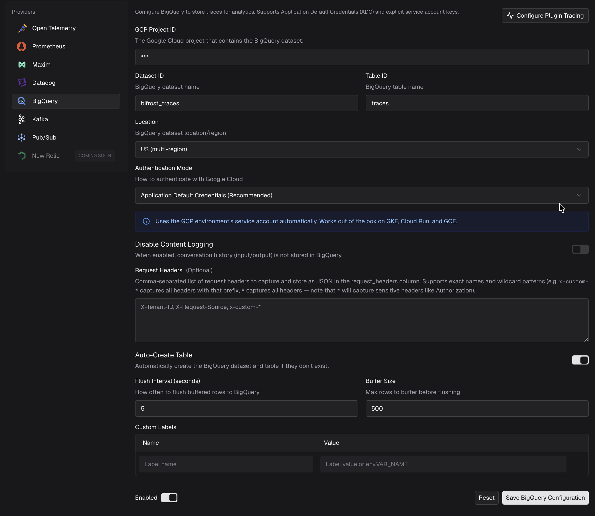

## Overview

The **BigQuery plugin** stores a structured record of every request that flows through Bifrost in a Google BigQuery table. Each completed trace becomes a single row — provider, model, token usage, cost, latency breakdown, governance attribution, and (optionally) the full conversation — so you can run SQL analytics, build dashboards, and retain history for as long as your BigQuery dataset keeps it.

Unlike the [OTel](/features/observability/otel) and [Datadog](/enterprise/datadog-connector) connectors, which stream spans to a tracing backend, the BigQuery plugin writes a flat, query-optimized table. It is ideal when you want to own the data, join it against your warehouse, or report on cost and usage with plain SQL.

<Note>
The BigQuery plugin is a **Bifrost Enterprise** feature.
</Note>

**Key benefits:**

- **SQL-native analytics** — Query traces directly, or join them against the rest of your warehouse.
- **One row per request** — A wide, denormalized table that is easy to aggregate, with no span-tree traversal.
- **Cost & token attribution** — Per-request cost plus fine-grained token breakdowns, attributable to teams, customers, virtual keys, and users.
- **Long-term retention** — Keep history far beyond what a logs database or APM retention window allows.
- **Zero request-latency impact** — Traces are buffered and flushed asynchronously in the background.

---

## Authentication

The plugin supports two ways to authenticate with Google Cloud:

| Mode | When to use | How |
|------|-------------|-----|
| **Application Default Credentials (ADC)** | Recommended. Works out of the box on GKE, Cloud Run, and GCE using the workload's attached service account. | Omit `service_account_key`. |
| **Service Account Key** | Running outside GCP, or when you need an explicit key. | Set `service_account_key` to the service account JSON, typically via an `env.VAR_NAME` reference. |

<Warning>
When you provide a `service_account_key`, pass it as an `env.VAR_NAME` reference rather than pasting the raw JSON into stored configuration. The referenced environment variable should contain the **unescaped** service account JSON (for example `'{"project_number": ...}'`). The resolved value is never persisted, and API responses redact it.
</Warning>

The service account (whether from ADC or an explicit key) needs permission to read/write the target table and, if `create_table_if_not_exists` is enabled, to create datasets and tables — for example the `roles/bigquery.dataEditor` role on the dataset (plus `roles/bigquery.user` on the project for job execution).

---

## Configuration

<Tabs group="config-method">
<Tab title="Web UI">

1. Open the **Observability** page in the Bifrost dashboard.
2. Select the **BigQuery** connector.
3. Fill in the configuration fields:
   - **GCP Project ID** — the project that contains your dataset (required).
   - **Dataset ID** and **Table ID** — defaults are `bifrost_traces` and `traces`.
   - **Location** — the dataset region (e.g. `US`, `EU`, `us-central1`).
   - **Authentication Mode** — **Application Default Credentials** (recommended) or **Service Account Key**.
   - **Disable Content Logging**, **Auto-Create Table**, **Request Headers**, **Flush Interval**, **Buffer Size**, and **Custom Labels** as needed.
4. Toggle **Enabled** on and click **Save BigQuery Configuration**.



<Tip>
If you turn **Auto-Create Table** off, the form exposes a **View table schema** dialog with a ready-to-run `CREATE TABLE` statement (including partitioning and clustering) that you can copy and run in BigQuery yourself. See [Table Schema](#table-schema) below.
</Tip>

</Tab>
<Tab title="config.json">

### Minimal (ADC)

```json
{
  "plugins": [
    {
      "enabled": true,
      "name": "bigquery",
      "config": {
        "project_id": "my-gcp-project"
      }
    }
  ]
}
```

### Full configuration

```json
{
  "plugins": [
    {
      "enabled": true,
      "name": "bigquery",
      "config": {
        "project_id": "my-gcp-project",
        "dataset_id": "bifrost_traces",
        "table_id": "traces",
        "location": "US",
        "service_account_key": "env.GCP_SERVICE_ACCOUNT_KEY",
        "create_table_if_not_exists": true,
        "flush_interval_seconds": 5,
        "buffer_size": 500,
        "disable_content_logging": false,
        "request_headers": ["X-Tenant-ID", "x-custom-*"],
        "custom_labels": {
          "environment": "production",
          "region": "env.DEPLOY_REGION"
        }
      }
    }
  ]
}
```

When using a service account key, set the environment variable to the unescaped JSON:

```bash
export GCP_SERVICE_ACCOUNT_KEY='{"type":"service_account","project_id":"...", ...}'
```

### Field reference

| Field | Type | Required | Default | Description |
|-------|------|----------|---------|-------------|
| `project_id` | `string` | ✅ Yes | — | GCP project that contains the dataset. |
| `dataset_id` | `string` | No | `bifrost_traces` | BigQuery dataset name. |
| `table_id` | `string` | No | `traces` | BigQuery table name. |
| `location` | `string` | No | `US` | Dataset location/region. |
| `service_account_key` | `string \| EnvVar` | No | — | Service account JSON for auth. Omit to use ADC. Supports `env.VAR_NAME`. |
| `create_table_if_not_exists` | `boolean` | No | `true` | Auto-create the dataset and table if missing. |
| `flush_interval_seconds` | `integer` | No | `5` | Interval between buffer flushes, in seconds. Must be `> 0`. |
| `buffer_size` | `integer` | No | `500` | Max rows to buffer before forcing a flush. Must be `> 0`. |
| `disable_content_logging` | `boolean` | No | `false` | When `true`, conversation content columns (`input_history`, `output_message`) are omitted. |
| `request_headers` | `string[]` | No | — | Request-header name patterns to capture into the `request_headers` column. Supports exact names and wildcards (`x-custom-*`, `*`). |
| `custom_labels` | `object` | No | — | Arbitrary key-value pairs stored as JSON in the `labels` column. Values support `env.VAR_NAME`. |
| `plugin_span_filter` | `object` | No | — | Controls which plugin spans contribute to the stored row. See [Plugin Span Filtering](#plugin-span-filtering). |

</Tab>
</Tabs>

---

## Table Schema

The traces table is **partitioned by `DATE(timestamp)`** and **clustered by `provider`, `model`, `virtual_key_id`**. Partitioning keeps time-range queries cheap (BigQuery prunes partitions), and clustering speeds up filtering by provider, model, or virtual key.

Each row corresponds to one trace — one full LLM request lifecycle. The columns you will reach for most are `timestamp`, `provider`, `model`, `status`, `latency_ms`, `total_tokens`, and `cost`, plus the governance columns (`team_name`, `customer_name`, `virtual_key_name`) for attribution. Expand a category below for the full column list.

<AccordionGroup>

<Accordion title="Core identifiers (10 columns)">

| Column | Type | Description |
|--------|------|-------------|
| `trace_id` | `STRING` | Unique trace identifier (required). |
| `request_id` | `STRING` | Bifrost request ID. |
| `timestamp` | `TIMESTAMP` | Trace start time (partition key, required). |
| `request_type` | `STRING` | `chat.completion`, `text.completion`, `embedding`, `speech`, `transcription`, or `responses`. |
| `provider` | `STRING` | LLM provider name. |
| `model` | `STRING` | Requested model name. |
| `response_model` | `STRING` | Actual model used in the response. |
| `status` | `STRING` | `success` or `error`. |
| `stream` | `BOOL` | Whether this was a streaming request. |
| `latency_ms` | `FLOAT64` | Total trace latency in milliseconds. |

</Accordion>

<Accordion title="Token usage & cost (4 columns)">

| Column | Type | Description |
|--------|------|-------------|
| `prompt_tokens` | `INT64` | Prompt/input tokens. |
| `completion_tokens` | `INT64` | Completion/output tokens. |
| `total_tokens` | `INT64` | Total token count. |
| `cost` | `FLOAT64` | Request cost in USD. |

</Accordion>

<Accordion title="Token detail breakdowns (15 columns)">

| Column | Type | Description |
|--------|------|-------------|
| `cached_read_tokens` | `INT64` | Prompt tokens served from the provider prompt cache. |
| `cached_write_tokens` | `INT64` | Prompt tokens written to the provider prompt cache. |
| `cached_write_tokens_5m` | `INT64` | Prompt tokens written to the 5m cache tier (Anthropic). |
| `cached_write_tokens_1h` | `INT64` | Prompt tokens written to the 1h cache tier (Anthropic). |
| `input_text_tokens` | `INT64` | Text-modality input tokens. |
| `input_audio_tokens` | `INT64` | Audio-modality input tokens. |
| `input_image_tokens` | `INT64` | Image-modality input tokens. |
| `reasoning_tokens` | `INT64` | Reasoning tokens (OpenAI o-series, Claude extended thinking). |
| `accepted_prediction_tokens` | `INT64` | Tokens matched against predicted output. |
| `rejected_prediction_tokens` | `INT64` | Tokens rejected from predicted output. |
| `citation_tokens` | `INT64` | Citation tokens (grounded models). |
| `num_search_queries` | `INT64` | Number of search queries performed. |
| `output_text_tokens` | `INT64` | Text-modality output tokens. |
| `output_audio_tokens` | `INT64` | Audio-modality output tokens. |
| `output_image_tokens` | `INT64` | Image-modality output tokens. |

</Accordion>

<Accordion title="Conversation content — JSON strings (4 columns)">

| Column | Type | Description |
|--------|------|-------------|
| `input_history` | `STRING` | JSON of input messages. Omitted when `disable_content_logging` is `true`. |
| `output_message` | `STRING` | JSON of output messages. Omitted when `disable_content_logging` is `true`. |
| `params` | `STRING` | JSON of request parameters. **Written regardless of `disable_content_logging`.** |
| `tools` | `STRING` | JSON of tool definitions, including tool names, descriptions, and parameter schemas. **Written regardless of `disable_content_logging`.** |

<Warning>
`disable_content_logging` gates `input_history` and `output_message` only. `params` and `tools` are always written. Tool definitions frequently describe internal APIs and business logic. If that is sensitive in your deployment, do not rely on this flag alone.
</Warning>

</Accordion>

<Accordion title="Error info (4 columns)">

| Column | Type | Description |
|--------|------|-------------|
| `error_type` | `STRING` | Error type classification. |
| `error_code` | `STRING` | Error code. |
| `error_message` | `STRING` | Error message details. |
| `finish_reason` | `STRING` | LLM finish reason. |

</Accordion>

<Accordion title="Response metadata (6 columns)">

| Column | Type | Description |
|--------|------|-------------|
| `response_id` | `STRING` | Provider's response ID. |
| `response_object` | `STRING` | Provider's response object type. |
| `response_created` | `STRING` | Provider's response created timestamp/id. |
| `system_fingerprint` | `STRING` | Provider's system fingerprint. |
| `service_tier` | `STRING` | Provider service tier (e.g. `default`, `scale`, `priority`). |
| `total_chunks` | `INT64` | Total streaming chunks received. |

</Accordion>

<Accordion title="Governance attribution (14 columns)">

| Column | Type | Description |
|--------|------|-------------|
| `selected_key_id` / `selected_key_name` | `STRING` | Selected API key. |
| `virtual_key_id` / `virtual_key_name` | `STRING` | Virtual key. |
| `routing_rule_id` / `routing_rule_name` | `STRING` | Routing rule. |
| `team_id` / `team_name` | `STRING` | Team. |
| `customer_id` / `customer_name` | `STRING` | Customer. |
| `business_unit_id` / `business_unit_name` | `STRING` | Business unit. |
| `user_id` / `user_name` | `STRING` | User. |

</Accordion>

<Accordion title="Routing & retry (2 columns)">

| Column | Type | Description |
|--------|------|-------------|
| `num_retries` | `INT64` | Number of retries. |
| `fallback_index` | `INT64` | Fallback provider index. |

</Accordion>

<Accordion title="Latency breakdown (5 columns)">

| Column | Type | Description |
|--------|------|-------------|
| `llm_latency_ms` | `FLOAT64` | LLM call span latency. |
| `http_latency_ms` | `FLOAT64` | HTTP request span latency. |
| `plugin_pre_latency_ms` | `FLOAT64` | Sum of pre-hook plugin span durations. |
| `plugin_post_latency_ms` | `FLOAT64` | Sum of post-hook plugin span durations. |
| `time_to_first_token_ms` | `FLOAT64` | Time to first token (streaming). |

</Accordion>

<Accordion title="Session & trace context (3 columns)">

| Column | Type | Description |
|--------|------|-------------|
| `session_id` | `STRING` | Session ID from the `x-bf-session-id` header. |
| `parent_trace_id` | `STRING` | Parent trace ID from a W3C `traceparent`. |
| `num_spans` | `INT64` | Number of spans in the trace. |

</Accordion>

<Accordion title="Custom & bookkeeping (4 columns)">

| Column | Type | Description |
|--------|------|-------------|
| `dimensions` | `STRING` | JSON of request dimensions from `x-bf-dim-*` headers. |
| `labels` | `STRING` | JSON of custom labels from config. |
| `request_headers` | `STRING` | JSON of captured request headers matching configured patterns. |
| `inserted_at` | `TIMESTAMP` | Time the row was inserted into BigQuery. |

</Accordion>

<Accordion title="CREATE TABLE statement (manual setup)" id="create-table-statement">

If you prefer to manage the table yourself (with `create_table_if_not_exists` set to `false`), create the dataset and table before enabling the plugin. The UI's **View table schema** dialog generates the complete statement for your exact project/dataset/table/location. The outline below shows the structure — expand the accordions above for the full column list:

```sql
-- Step 1: Create the dataset (if it doesn't exist)
CREATE SCHEMA IF NOT EXISTS `my-gcp-project.bifrost_traces`
OPTIONS (
  location = 'US'
);

-- Step 2: Create the traces table with partitioning and clustering
CREATE TABLE IF NOT EXISTS `my-gcp-project.bifrost_traces.traces`
(
  trace_id STRING NOT NULL,
  timestamp TIMESTAMP NOT NULL,
  request_type STRING,
  provider STRING,
  model STRING,
  virtual_key_id STRING,
  -- ... remaining columns from the categories above ...
  labels STRING,
  inserted_at TIMESTAMP
)
PARTITION BY DATE(timestamp)
CLUSTER BY provider, model, virtual_key_id;
```

</Accordion>

</AccordionGroup>

<Note>
Letting the plugin auto-create the table (the default) guarantees the schema stays in sync as new columns are added across Bifrost releases. If you manage the table manually, you may need to add new columns after an upgrade.
</Note>

---

## Content & Header Capture

The plugin lets you control how much request detail lands in BigQuery:

- **`disable_content_logging`** — Set to `true` to omit conversation content. The `input_history` and `output_message` columns are left empty, while all metadata (tokens, cost, latency, attribution) is still recorded. Use this for privacy-sensitive workloads.
- **`request_headers`** — A list of header-name patterns whose values are captured into the `request_headers` column as a JSON map. Supports exact names (`X-Tenant-ID`) and wildcards (`x-custom-*`, or `*` for all headers).

  <Warning>
  Using `*` captures **all** request headers, including sensitive ones like `Authorization`. Prefer explicit names or scoped wildcards.
  </Warning>

- **`custom_labels`** — Static key-value pairs attached to every row in the `labels` column (JSON). Values support `env.VAR_NAME`, which is handy for environment or region tags.
- **`dimensions`** — Per-request dimensions sent via `x-bf-dim-*` headers are captured automatically into the `dimensions` column (JSON). No configuration required.

---

## Example Queries

Because each trace is a single row, common analytics are plain SQL aggregations. Replace `my-gcp-project.bifrost_traces.traces` with your project, dataset, and table.

**Total cost by team over the last 7 days:**

```sql
SELECT
  team_name,
  ROUND(SUM(cost), 4) AS total_cost_usd,
  COUNT(*) AS requests
FROM `my-gcp-project.bifrost_traces.traces`
WHERE DATE(timestamp) >= DATE_SUB(CURRENT_DATE(), INTERVAL 7 DAY)
  AND status = 'success'
GROUP BY team_name
ORDER BY total_cost_usd DESC;
```

**p95 latency by model (today):**

```sql
SELECT
  model,
  APPROX_QUANTILES(latency_ms, 100)[OFFSET(95)] AS p95_latency_ms,
  COUNT(*) AS requests
FROM `my-gcp-project.bifrost_traces.traces`
WHERE DATE(timestamp) = CURRENT_DATE()
GROUP BY model
ORDER BY requests DESC;
```

**Error rate by provider (last 24 hours):**

```sql
SELECT
  provider,
  COUNTIF(status = 'error') AS errors,
  COUNT(*) AS total,
  ROUND(SAFE_DIVIDE(COUNTIF(status = 'error'), COUNT(*)) * 100, 2) AS error_rate_pct
FROM `my-gcp-project.bifrost_traces.traces`
WHERE timestamp >= TIMESTAMP_SUB(CURRENT_TIMESTAMP(), INTERVAL 24 HOUR)
GROUP BY provider
ORDER BY error_rate_pct DESC;
```

**Daily token usage trend:**

```sql
SELECT
  DATE(timestamp) AS day,
  SUM(prompt_tokens) AS input_tokens,
  SUM(completion_tokens) AS output_tokens,
  SUM(total_tokens) AS total_tokens
FROM `my-gcp-project.bifrost_traces.traces`
WHERE DATE(timestamp) >= DATE_SUB(CURRENT_DATE(), INTERVAL 30 DAY)
GROUP BY day
ORDER BY day;
```

<Tip>
Always filter on `timestamp` (the partition key) to prune partitions and keep query costs low.
</Tip>

---

## Plugin Span Filtering

By default every plugin's pre- and post-hook execution contributes its latency to the stored row. Use `plugin_span_filter` inside the BigQuery plugin config to control which plugin spans count toward the flattened latency columns (`plugin_pre_latency_ms` / `plugin_post_latency_ms`).

**Via config.json** (inside the BigQuery plugin config):

```json
{
  "plugins": [
    {
      "name": "bigquery",
      "enabled": true,
      "config": {
        "project_id": "my-gcp-project",
        "plugin_span_filter": {
          "mode": "exclude",
          "plugins": ["logging", "compat", "telemetry"]
        }
      }
    }
  ]
}
```

**Via the UI:** Open the **Observability** page, select the **BigQuery** connector, and click **Configure Plugin Tracing**. Toggle individual plugins on or off and save.

**Filter modes:**

| Mode | Behaviour |
|------|-----------|
| `exclude` | Count all plugins **except** those listed. |
| `include` | Count **only** the listed plugins. |

**Plugin names:** list each plugin using the exact name shown in the **Configure Plugin Tracing** sheet. Note that some plugins are registered under a different name than their config key — for example the enterprise prompts and governance plugins appear as `enterprise-prompts` and `enterprise-governance`. Common names include `telemetry`, `logging`, `otel`, `semantic_cache`, `compat`, `maxim`, `enterprise-prompts`, `enterprise-governance`, `datadog`, `bigquery`, and `guardrails`.

<Note>
Unlike the OTEL and Datadog connectors, BigQuery has no span tree — a filtered plugin span's latency is simply omitted from the flattened row, and no re-parenting occurs. Each observability connector has its own independent `plugin_span_filter`. It follows the standard plugin config precedence rules; to make a config.json value override UI-saved DB settings on restart, set a higher `version` on the BigQuery plugin entry (e.g. `"version": 2`). See [Plugin Versioning](/deployment-guides/config-json/plugins) for details.
</Note>

---

## Troubleshooting

### Table or dataset not found

**Symptom:** Errors about a missing dataset or table on startup.
**Cause:** `create_table_if_not_exists` is `false` and the table does not exist, or the service account lacks create permissions.
**Fix:** Either enable auto-creation, or run the [CREATE TABLE statement](#create-table-statement) manually and grant the service account `roles/bigquery.dataEditor`.

### Authentication failures

**Symptom:** `failed to create BigQuery client` errors at startup.
**Cause:** ADC is not available in the environment, or `service_account_key` is set but empty/invalid.
**Fix:** On GCP, confirm the workload's service account is attached. Off GCP, set `service_account_key` to an `env.VAR_NAME` whose value is the **unescaped** service account JSON, and verify the variable is populated:

```bash
echo "$GCP_SERVICE_ACCOUNT_KEY" | head -c 40
```

### No rows appearing

**Symptom:** The plugin is enabled but the table stays empty.
**Cause:** Rows are written in batches, so very low traffic can delay the first write. The service account may also lack write permission.
**Fix:** Send some traffic and wait at least `flush_interval_seconds`, then confirm the service account has `roles/bigquery.dataEditor` on the dataset. Enable debug logging to surface any write errors:

```bash
bifrost-http --log-level debug
```

### Missing conversation content

**Symptom:** `input_history` and `output_message` are empty.
**Cause:** `disable_content_logging` is `true`.
**Fix:** Set it to `false` if you want conversation content stored.

---

## Next Steps

- **[OpenTelemetry (OTel)](/features/observability/otel)** — Stream traces to any OTLP-compatible backend.
- **[Datadog](/enterprise/datadog-connector)** — Native Datadog APM and LLM Observability integration.
- **[Built-in Observability](/features/observability/default)** — Local logging for development and simple deployments.
- **[Telemetry](/features/telemetry)** — Prometheus metrics and dashboards.
