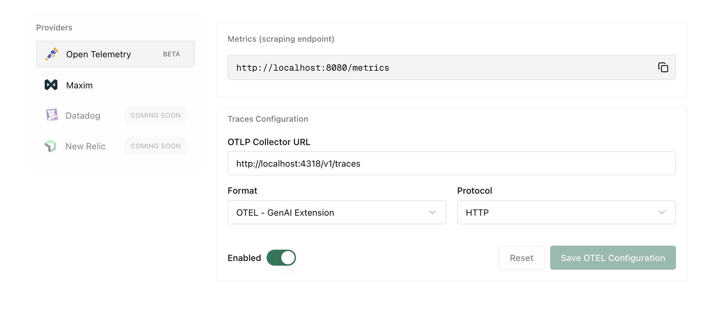

## Overview

<Frame>
  
</Frame>

The **OTel plugin** enables seamless integration with OpenTelemetry Protocol (OTLP) collectors, allowing you to send LLM traces to your existing observability infrastructure. Connect Bifrost to platforms like Grafana Cloud, Datadog, New Relic, Honeycomb, or self-hosted collectors.

All traces follow OpenTelemetry semantic conventions, making it easy to correlate LLM operations with your broader application telemetry.

---

## Supported Trace Formats

The plugin supports multiple trace formats to match your observability platform:

| Format | Description | Use Case | Status |
|--------|-------------|----------|----------|
| `genai_extension` | OpenTelemetry GenAI semantic conventions | **Recommended** - Standard OTel format with rich LLM metadata | ✅ Released |
| `vercel` | Vercel AI SDK format | For Vercel AI SDK compatibility | 🔄 Coming soon |
| `open_inference` | Arize OpenInference format | For Arize Phoenix and OpenInference tools | 🔄 Coming soon | 

---

## Configuration

### Required Fields

| Field | Type | Required | Description |
|-------|------|----------|-------------|
| `service_name` | `string` | ❌ No | Service name to be used for tracing, defaults to `bifrost` |
| `collector_url` | `string \| EnvVar` | ✅ Yes | OTLP collector endpoint URL — supports `env.VAR_NAME` |
| `trace_type` | `string` | ✅ Yes | One of: `genai_extension`, `vercel`, `open_inference` |
| `protocol` | `string` | ✅ Yes | Transport protocol: `http` or `grpc` |
| `headers` | `object` | ❌ No | Custom headers for authentication — values support `env.VAR_NAME` |
| `tls_ca_cert` | `string` | ❌ No | File path to client CA certificate for TLS. Optional. Works with both gRPC and HTTP protocol |
| `group_traces_by_session` | `boolean` | ❌ No | Group requests sharing the same `x-bf-session-id` into one trace (default: `false`). See [Grouping Traces by Session](#grouping-traces-by-session) |

### Environment Variable Substitution

`collector_url`, `metrics_endpoint`, and individual header values all support the `env.` prefix to read from environment variables at runtime. This keeps sensitive URLs and credentials out of stored configuration.

```json
{
  "collector_url": "env.OTEL_COLLECTOR_URL",
  "headers": {
    "Authorization": "env.OTEL_API_KEY",
    "X-Custom-Header": "env.CUSTOM_VALUE"
  }
}
```

### Resource Attributes

The plugin supports the standard `OTEL_RESOURCE_ATTRIBUTES` environment variable. Any attributes defined in this variable will be automatically attached to every span emitted by the plugin.

```bash
export OTEL_RESOURCE_ATTRIBUTES="deployment.environment=production,service.version=1.2.3,team.name=platform"
```

These attributes appear as resource-level metadata on all traces:

```json
{
  "resource": {
    "attributes": {
      "service.name": "bifrost",
      "deployment.environment": "production",
      "service.version": "1.2.3",
      "team.name": "platform"
    }
  }
}
```

This is useful for:
- **Environment identification** - Distinguish between production, staging, and development traces
- **Service versioning** - Track which version of your service generated the trace
- **Team attribution** - Tag traces with team ownership for filtering and alerting
- **Custom metadata** - Add any key-value pairs relevant to your observability needs

### Session Tracking

Whenever a request carries the [`x-bf-session-id`](/providers/request-options) header, Bifrost tags the trace's root span with the OTEL-conventional `session.id` attribute. This happens **regardless** of the `group_traces_by_session` setting, so you can always filter and correlate traces by session in your backend even when each request remains its own trace.

### Grouping Traces by Session

By default, each request Bifrost handles becomes its own OTEL trace (still tagged with `session.id` as described above). Enable `group_traces_by_session` to instead group every request that carries the same `x-bf-session-id` header into a **single trace**, with each request's root span appearing as a top-level sibling under that trace. This is useful for viewing a multi-turn conversation or agent run as one trace in your backend.

```json
{
  "group_traces_by_session": true
}
```

When enabled, requests sharing a session ID adopt a deterministic trace ID derived from that session ID, so they land in the same trace regardless of which Bifrost node handled them.

<Note>
An inbound [W3C `traceparent`](https://www.w3.org/TR/trace-context/) always takes precedence: a request that arrives on a distributed trace stays on that trace and is **not** regrouped by session. Session grouping only applies to requests that have a session ID but no incoming trace context.

Because all requests in a session share one trace, very long-lived sessions produce large traces. Use a session scope that matches how you want to view activity in your backend.
</Note>

To send a session ID, pass the [`x-bf-session-id`](/providers/request-options) header on each request you want grouped together.

---

## Setup

<Tabs group="setup-method">
<Tab title="UI">

</Tab>
<Tab title="Go SDK">

```go
package main

import (
    "context"
    bifrost "github.com/maximhq/bifrost/core"
    "github.com/maximhq/bifrost/core/schemas"
    "github.com/maximhq/bifrost/framework/pricing"
    otel "github.com/maximhq/bifrost/plugins/otel"
)

func main() {
    ctx := context.Background()
    logger := schemas.NewLogger()
    
    // Initialize pricing manager (required for cost calculation)
    pricingManager := pricing.NewPricingManager(logger)
    
    // Initialize OTel plugin
    otelPlugin, err := otel.Init(ctx, &otel.Config{
        ServiceName:  "bifrost",
        CollectorURL: "http://localhost:4318/v1/traces",
        TraceType:    otel.TraceTypeGenAIExtension,
        Protocol:     otel.ProtocolHTTP,
        Headers: map[string]string{
            "Authorization": "env.OTEL_API_KEY",
        },
    }, logger, pricingManager)
    if err != nil {
        panic(err)
    }
    
    // Initialize Bifrost with the plugin
    client, err := bifrost.Init(ctx, schemas.BifrostConfig{
        Account: &yourAccount,
        LLMPlugins: []schemas.LLMPlugin{otelPlugin},
    })
    if err != nil {
        panic(err)
    }
    defer client.Shutdown()
    
    // All requests are now traced to OTel collector
}
```

</Tab>
<Tab title="config.json">

For Gateway mode, configure via `config.json`:

```json
{
  "plugins": [
    {
      "enabled": true,
      "name": "otel",
      "config": {
        "service_name": "bifrost",
        "collector_url": "http://localhost:4318/v1/traces",
        "trace_type": "genai_extension",
        "protocol": "http",
        "headers": {
          "Authorization": "env.OTEL_API_KEY"
        }
      }
    }
  ]
}
```

If you need to connect to an OTEL collector that requires TLS, configure `tls_ca_cert` and set insecure mode to `false`:

```json
{
  "plugins": [
    {
      "enabled": true,
      "name": "otel",
      "config": {
        "service_name": "bifrost",
        "collector_url": "localhost:4317",
        "trace_type": "genai_extension",
        "protocol": "grpc",
        "insecure": false,
        "tls_ca_cert": "/path/to/your/ca.cert",
        "headers": {
          "Authorization": "env.OTEL_API_KEY"
        }
      }
    }
  ]
}
```

</Tab>
<Tab title="config.json (v1.5.8+)">

For Gateway mode, configure via `config.json`:

```json
{
  "plugins": [
    {
      "enabled": true,
      "name": "otel",
      "config": {
        "profiles": [
          {
            "service_name": "bifrost",
            "enabled": true,
            "collector_url": "http://localhost:4318/v1/traces",
            "trace_type": "genai_extension",
            "protocol": "http",
            "headers": {
              "Authorization": "env.OTEL_API_KEY"
            }
          }
        ]
      }
    }
  ]
}
```

If you need to connect to an OTEL collector that requires TLS, configure `tls_ca_cert` and set insecure mode to `false`:

```json
{
  "plugins": [
    {
      "enabled": true,
      "name": "otel",
      "config": {
        "profiles": [
          {
            "service_name": "bifrost",
            "enabled": true,
            "collector_url": "localhost:4317",
            "trace_type": "genai_extension",
            "protocol": "grpc",
            "insecure": false,
            "tls_ca_cert": "/path/to/your/ca.cert",
            "headers": {
              "Authorization": "env.OTEL_API_KEY"
            }
          }
        ]
      }
    }
  ]
}
```
</Tab>

</Tabs>

---

## Quick Start with Docker

Get started quickly with a complete observability stack using the included Docker Compose configuration:

```yml
services:
  otel-collector:
    image: otel/opentelemetry-collector-contrib:latest
    container_name: otel-collector
    command: ["--config=/etc/otelcol/config.yaml"]
    configs:
      - source: otel-collector-config
        target: /etc/otelcol/config.yaml
    ports:
      - "4317:4317"   # OTLP gRPC
      - "4318:4318"   # OTLP HTTP
      - "8888:8888"   # Collector /metrics
      - "9464:9464"   # Prometheus scrape endpoint
      - "13133:13133" # Health check
      - "1777:1777"   # pprof
      - "55679:55679" # zpages
    restart: unless-stopped
    depends_on:
      - tempo

  tempo:
    image: grafana/tempo:latest
    container_name: tempo
    command: ["-target=all", "-config.file=/etc/tempo.yaml"]
    configs:
      - source: tempo-config
        target: /etc/tempo.yaml
    ports:
      - "3200:3200" # Tempo HTTP API
    expose:
      - "4317"        # OTLP gRPC (internal)
    volumes:
      - tempo-data:/var/tempo
    restart: unless-stopped

  prometheus:
    image: prom/prometheus:latest
    container_name: prometheus
    command:
      - "--config.file=/etc/prometheus/prometheus.yml"
      - "--storage.tsdb.path=/prometheus"
      - "--web.console.libraries=/usr/share/prometheus/console_libraries"
      - "--web.console.templates=/usr/share/prometheus/consoles"
      - "--web.enable-remote-write-receiver"
      - "--enable-feature=exemplar-storage"
      - "--enable-feature=native-histograms"
    ports:
      - "9090:9090"
    volumes:
      - prometheus-data:/prometheus
    configs:
      - source: prometheus-config
        target: /etc/prometheus/prometheus.yml
    depends_on:
      - otel-collector
    restart: unless-stopped

  grafana:
    image: grafana/grafana:latest
    container_name: grafana
    depends_on:
      - prometheus
      - tempo
    environment:
      GF_SECURITY_ADMIN_USER: admin
      GF_SECURITY_ADMIN_PASSWORD: admin
      GF_AUTH_ANONYMOUS_ENABLED: "true"
      GF_AUTH_ANONYMOUS_ORG_ROLE: Viewer
      GF_INSTALL_PLUGINS: ""
      GF_FEATURE_TOGGLES_ENABLE: traceqlEditor
    ports:
      - "4000:3000"
    volumes:
      - grafana-data:/var/lib/grafana
    configs:
      - source: grafana-datasources
        target: /etc/grafana/provisioning/datasources/datasources.yml
    restart: unless-stopped

configs:
  otel-collector-config:
    content: |
      receivers:
        otlp:
          protocols:
            grpc:
              endpoint: 0.0.0.0:4317
            http:
              endpoint: 0.0.0.0:4318

      processors:
        batch:

      exporters:
        prometheus:
          endpoint: 0.0.0.0:9464
          namespace: otel
          const_labels:
            source: otelcol

        otlp/tempo:
          endpoint: tempo:4317
          tls:
            insecure: true

        debug:
          verbosity: detailed

      extensions:
        health_check:
          endpoint: 0.0.0.0:13133
        pprof:
          endpoint: 0.0.0.0:1777
        zpages:
          endpoint: 0.0.0.0:55679

      service:
        extensions: [health_check, pprof, zpages]
        telemetry:
          logs:
            level: debug
          metrics:
            level: detailed
        pipelines:
          traces:
            receivers: [otlp]
            processors: [batch]
            exporters: [debug, otlp/tempo]
          metrics:
            receivers: [otlp]
            processors: [batch]
            exporters: [debug, prometheus]
          logs:
            receivers: [otlp]
            processors: [batch]
            exporters: [debug]

  tempo-config:
    content: |
      server:
        http_listen_port: 3200
        log_level: info

      distributor:
        receivers:
          otlp:
            protocols:
              grpc:
                endpoint: 0.0.0.0:4317
                
      ingester:
        max_block_duration: 5m
        trace_idle_period: 10s

      compactor:
        compaction:
          block_retention: 1h

      storage:
        trace:
          backend: local
          wal:
            path: /var/tempo/wal
          local:
            path: /var/tempo/blocks

      metrics_generator:
        registry:
          external_labels:
            source: tempo
        storage:
          path: /var/tempo/generator/wal
          remote_write:
            - url: http://prometheus:9090/api/v1/write

  prometheus-config:
    content: |
      global:
        scrape_interval: 15s
      scrape_configs:
        - job_name: "otelcol-internal"
          static_configs:
            - targets: ["otel-collector:8888"]
        - job_name: "otelcol-exporter"
          static_configs:
            - targets: ["otel-collector:9464"]
        - job_name: "tempo"
          static_configs:
            - targets: ["tempo:3200"]

  grafana-datasources:
    content: |
      apiVersion: 1
      datasources:
        - name: Prometheus
          uid: prometheus
          type: prometheus
          access: proxy
          orgId: 1
          url: http://prometheus:9090
          isDefault: true
          editable: true
        - name: Tempo
          uid: tempo
          type: tempo
          access: proxy
          orgId: 1
          url: http://tempo:3200
          editable: true
          jsonData:
            tracesToMetrics:
              datasourceUid: prometheus
            nodeGraph:
              enabled: true

volumes:
  prometheus-data:
  grafana-data:
  tempo-data:
```

This launches:
- **OTel Collector** - Receives traces on ports 4317 (gRPC) and 4318 (HTTP)
- **Tempo** - Distributed tracing backend
- **Prometheus** - Metrics collection
- **Grafana** - Visualization dashboard

Access Grafana at `http://localhost:3000` (default credentials: admin/admin)

<Frame>
  
</Frame>

---

## Popular Platform Integrations

<Tabs group="platforms">
<Tab title="Grafana Cloud">

```json
{
  "plugins": [
    {
      "enabled": true,
      "name": "otel",
      "config": {
        "service_name": "bifrost",
        "collector_url": "https://otlp-gateway-prod-us-central-0.grafana.net/otlp",
        "trace_type": "genai_extension",
        "protocol": "http",
        "headers": {
          "Authorization": "env.GRAFANA_CLOUD_API_KEY"
        }
      }
    }
  ]
}
```

Set environment variable:
```bash
export GRAFANA_CLOUD_API_KEY="Basic <your-base64-encoded-token>"
```

</Tab>
<Tab title="Datadog">

```json
{
  "plugins": [
    {
      "enabled": true,
      "name": "otel",
      "config": {
        "service_name": "bifrost",
        "collector_url": "https://trace.agent.datadoghq.com",
        "trace_type": "genai_extension",
        "protocol": "http",
        "headers": {
          "DD-API-KEY": "env.DATADOG_API_KEY"
        }
      }
    }
  ]
}
```

Set environment variable:
```bash
export DATADOG_API_KEY="your-datadog-api-key"
```

</Tab>
<Tab title="New Relic">

```json
{
  "plugins": [
    {
      "enabled": true,
      "name": "otel",
      "config": {
        "service_name": "bifrost",
        "collector_url": "https://otlp.nr-data.net:4318",
        "trace_type": "genai_extension",
        "protocol": "http",
        "headers": {
          "api-key": "env.NEW_RELIC_LICENSE_KEY"
        }
      }
    }
  ]
}
```

Set environment variable:
```bash
export NEW_RELIC_LICENSE_KEY="your-license-key"
```

</Tab>
<Tab title="Honeycomb">

```json
{
  "plugins": [
    {
      "enabled": true,
      "name": "otel",
      "config": {
        "service_name": "bifrost",
        "collector_url": "https://api.honeycomb.io",
        "trace_type": "genai_extension",
        "protocol": "http",
        "headers": {
          "x-honeycomb-team": "env.HONEYCOMB_API_KEY",
          "x-honeycomb-dataset": "bifrost-traces"
        }
      }
    }
  ]
}
```

Set environment variable:
```bash
export HONEYCOMB_API_KEY="your-api-key"
```

</Tab>
<Tab title="Langfuse">

[Langfuse](https://langfuse.com) is an open-source LLM observability platform that accepts OpenTelemetry traces via its OTLP endpoint.

<Tabs>
<Tab title="UI">

Configure the OTel plugin with the following settings:

| Field | Value |
|-------|-------|
| **Collector URL** | `https://cloud.langfuse.com/api/public/otel/v1/traces` (EU) or `https://us.cloud.langfuse.com/api/public/otel/v1/traces` (US) |
| **Trace Type** | `genai_extension` |
| **Protocol** | `http` (required - Langfuse does not support gRPC) |
| **Headers** | `Authorization`: `env.LANGFUSE_AUTH` |

</Tab>
<Tab title="config.json">

```json
{
  "plugins": [
    {
      "enabled": true,
      "name": "otel",
      "config": {
        "service_name": "bifrost",
        "collector_url": "https://cloud.langfuse.com/api/public/otel",
        "trace_type": "genai_extension",
        "protocol": "http",
        "headers": {
          "Authorization": "env.LANGFUSE_AUTH"
        }
      }
    }
  ]
}
```

For US region, use `https://us.cloud.langfuse.com/api/public/otel` instead.

</Tab>
</Tabs>

Set up the environment variable with your Langfuse API keys:

```bash
# Generate base64 auth string from your Langfuse API keys
export LANGFUSE_AUTH="Basic $(echo -n 'pk-lf-xxx:sk-lf-xxx' | base64)"
```

Replace `pk-lf-xxx` and `sk-lf-xxx` with your Langfuse public and secret keys from your project settings.

<Note>
Langfuse only supports HTTP protocol. Do not use gRPC.
</Note>

See the [Langfuse OpenTelemetry documentation](https://langfuse.com/integrations/native/opentelemetry) for more details.

</Tab>
<Tab title="Self-Hosted">

Use the included Docker Compose stack or point to your own collector:

```json
{
  "plugins": [
    {
      "enabled": true,
      "name": "otel",
      "config": {
        "service_name": "bifrost",
        "collector_url": "http://your-collector:4318",
        "trace_type": "genai_extension",
        "protocol": "http"
      }
    }
  ]
}
```

</Tab>
</Tabs>

---

## Captured Data

Each trace includes comprehensive LLM operation metadata following OpenTelemetry semantic conventions:

### Span Attributes

- **Span Name**: Based on request type (`gen_ai.chat`, `gen_ai.text`, `gen_ai.embedding`, etc.)
- **Service Info**: `service.name=bifrost`, `service.version`
- **Provider & Model**: `gen_ai.provider.name`, `gen_ai.request.model`
- **Session**: `session.id` on the root span when the request carries an `x-bf-session-id` header (see [Session Tracking](#session-tracking))

### Request Parameters

- Temperature, max_tokens, top_p, stop sequences
- Presence/frequency penalties
- Tool configurations and parallel tool calls
- Custom parameters via `ExtraParams`

### Input/Output Data

- Complete chat history with role-based messages
- Prompt text for completions
- Response content with role attribution
- Tool calls and results

### Performance Metrics

- Token usage (prompt, completion, total)
- Cost calculations in dollars
- Latency and timing (start/end timestamps)
- Error details with status codes

### Caller-Supplied Headers

Headers Bifrost forwards to the upstream provider — both `x-bf-eh-*` prefixed headers and headers matched by the [direct allowlist](/deployment-guides/config-json/client#header-filtering) — are also surfaced on the `llm.call` span as `gen_ai.request.extra_header.<name>` attributes. This makes it easy to filter or correlate traces by caller context (session ID, tenant ID, correlation IDs) without standing up extra plumbing.

For example, sending `x-bf-eh-session-id: sess-abc-123` produces the span attribute `gen_ai.request.extra_header.session-id = "sess-abc-123"`. See [Extra Headers](/providers/request-options#extra-headers-x-bf-eh) for the full request format.

### Example Span

```json
{
  "name": "gen_ai.chat",
  "attributes": {
    "gen_ai.provider.name": "openai",
    "gen_ai.request.model": "gpt-4",
    "gen_ai.request.temperature": 0.7,
    "gen_ai.request.max_tokens": 1000,
    "gen_ai.usage.prompt_tokens": 45,
    "gen_ai.usage.completion_tokens": 128,
    "gen_ai.usage.total_tokens": 173,
    "gen_ai.usage.cost": 0.0052
  }
}
```

<Frame>
  
</Frame>

---

## Supported Request Types

The OTel plugin captures all Bifrost request types:

- **Chat Completion** (streaming and non-streaming) → `gen_ai.chat`
- **Text Completion** (streaming and non-streaming) → `gen_ai.text`
- **Embeddings** → `gen_ai.embedding`
- **Speech Generation** (streaming and non-streaming) → `gen_ai.speech`
- **Transcription** (streaming and non-streaming) → `gen_ai.transcription`
- **Responses API** → `gen_ai.responses`

---

## Protocol Support

### HTTP (OTLP/HTTP)

Uses HTTP/1.1 or HTTP/2 with JSON or Protobuf encoding:

```json
{
  "collector_url": "http://localhost:4318/v1/traces",
  "protocol": "http"
}
```

Default port: **4318**

### gRPC (OTLP/gRPC)

Uses gRPC with Protobuf encoding for lower latency:

```json
{
  "collector_url": "localhost:4317",
  "protocol": "grpc"
}
```

Default port: **4317**

---

## Metrics Push (Cluster Mode)

<Note>
**Multi-node deployments**: If you are running multiple Bifrost nodes, use push-based metrics for accurate aggregation. Pull-based `/metrics` scraping may miss nodes behind a load balancer.
</Note>

The OTel plugin supports **push-based metrics export** via OTLP, which is essential for multi-node cluster deployments. Instead of relying on Prometheus scraping each node's `/metrics` endpoint (which can miss nodes behind a load balancer), all nodes actively push metrics to a central OTEL Collector.

### Configuration

| Field | Type | Required | Description |
|-------|------|----------|-------------|
| `metrics_enabled` | `boolean` | ❌ No | Enable push-based metrics export (default: `false`) |
| `metrics_endpoint` | `string \| EnvVar` | ✅ Yes (if enabled) | OTLP metrics endpoint URL — supports `env.VAR_NAME` |
| `metrics_push_interval` | `integer` | ❌ No | Push interval in seconds (default: `15`, range: 1-300) |

### Example Configuration

<Tabs group="metrics-config">
<Tab title="HTTP Protocol">

```json
{
  "plugins": [
    {
      "enabled": true,
      "name": "otel",
      "config": {
        "service_name": "bifrost",
        "collector_url": "http://otel-collector:4318/v1/traces",
        "trace_type": "genai_extension",
        "protocol": "http",
        "metrics_enabled": true,
        "metrics_endpoint": "http://otel-collector:4318/v1/metrics",
        "metrics_push_interval": 15
      }
    }
  ]
}
```
</Tab>

<Tab title="HTTP Protocol (v1.5+)">

```json
{
  "plugins": [
    {
      "enabled": true,
      "name": "otel",
      "config": {
        "profiles": [
          {
            "service_name": "bifrost",
            "enabled": true,
            "collector_url": "http://otel-collector:4318/v1/traces",
            "trace_type": "genai_extension",
            "protocol": "http",
            "metrics_enabled": true,
            "metrics_endpoint": "http://otel-collector:4318/v1/metrics",
            "metrics_push_interval": 15
          }
        ]
      }
    }
  ]
}
```

</Tab>

<Tab title="gRPC Protocol">

```json
{
  "plugins": [
    {
      "enabled": true,
      "name": "otel",
      "config": {
        "service_name": "bifrost",
        "collector_url": "otel-collector:4317",
        "trace_type": "genai_extension",
        "protocol": "grpc",
        "metrics_enabled": true,
        "metrics_endpoint": "otel-collector:4317",
        "metrics_push_interval": 15
      }
    }
  ]
}
```
</Tab>

<Tab title="gRPC Protocol (v1.5+)">

```json
{
  "plugins": [
    {
      "enabled": true,
      "name": "otel",
      "config": {
        "profiles": [
          {
            "service_name": "bifrost",
            "enabled": true,
            "collector_url": "otel-collector:4317",
            "trace_type": "genai_extension",
            "protocol": "grpc",
            "metrics_enabled": true,
            "metrics_endpoint": "otel-collector:4317",
            "metrics_push_interval": 15
          }
        ]
      }
    }
  ]
}
```
</Tab>

</Tabs>

### Pushed Metrics

These are the same **Prometheus-style metrics** from the telemetry plugin, pushed via OTLP protocol to a central collector:

| Metric | Type | Description |
|--------|------|-------------|
| `bifrost_upstream_requests_total` | Counter | Total requests to upstream providers |
| `bifrost_success_requests_total` | Counter | Successful upstream requests |
| `bifrost_error_requests_total` | Counter | Error requests with status code labels |
| `bifrost_input_tokens_total` | Counter | Total input tokens |
| `bifrost_output_tokens_total` | Counter | Total output tokens |
| `bifrost_cache_hits_total` | Counter | Cache hits |
| `bifrost_cost_total` | Counter | Total cost in USD |
| `bifrost_upstream_latency_seconds` | Histogram | Upstream request latency |
| `bifrost_stream_first_token_latency_seconds` | Histogram | Time to first token |
| `bifrost_stream_inter_token_latency_seconds` | Histogram | Inter-token latency |
| `http_requests_total` | Counter | Total HTTP requests |
| `http_request_duration_seconds` | Histogram | HTTP request duration |
| `http_request_size_bytes` | Histogram | HTTP request body size |
| `http_response_size_bytes` | Histogram | HTTP response body size |

> **Note:** Size metrics are only recorded when the `Content-Length` header is present. Requests or responses without it (e.g., chunked transfer encoding, streaming responses) do not produce data points in these histograms.

### OTEL Collector Configuration

Configure your OTEL Collector to receive OTLP metrics and export to your preferred backend (Datadog, Prometheus, etc.):

```yaml
receivers:
  otlp:
    protocols:
      grpc:
        endpoint: 0.0.0.0:4317
      http:
        endpoint: 0.0.0.0:4318

processors:
  batch:
    timeout: 10s
    send_batch_size: 1000

exporters:
  # For Datadog
  datadog:
    api:
      key: ${DD_API_KEY}
  
  # Or for Prometheus remote write
  prometheusremotewrite:
    endpoint: "http://prometheus:9090/api/v1/write"

service:
  pipelines:
    metrics:
      receivers: [otlp]
      processors: [batch]
      exporters: [datadog]  # or prometheusremotewrite
```

### Why Push vs Pull?

| Aspect | Pull (`/metrics` scrape) | Push (OTEL metrics) |
|--------|--------------------------|---------------------|
| Load balancer | May miss nodes | All nodes push |
| Service discovery | Required | Not required |
| Scraper configuration | Per-node endpoints | Single collector |
| Cluster aggregation | Query-side `sum()` | Collector handles it |

For **single-node deployments**, pull-based `/metrics` scraping works well. For **multi-node clusters**, push-based metrics ensures all nodes are captured.

---

## Advanced Features

### Automatic Span Management

- Spans are tracked with a **20-minute TTL** using an efficient sync.Map implementation
- Automatic cleanup prevents memory leaks for long-running processes
- Handles streaming requests with accumulator for chunked responses

### Async Emission

All span emissions happen asynchronously in background goroutines:

```go
// Zero impact on request latency
go func() {
    p.client.Emit(ctx, spans)
}()
```

### Streaming Support

The plugin accumulates streaming chunks and emits a single complete span when the stream finishes, providing accurate token counts and costs.

### Environment Variable Security

Sensitive URLs and credentials never need to appear in stored configuration. The `collector_url`, `metrics_endpoint`, and header values all accept the `env.VAR_NAME` format:

```json
{
  "collector_url": "env.OTEL_COLLECTOR_URL",
  "metrics_endpoint": "env.OTEL_METRICS_ENDPOINT",
  "headers": {
    "Authorization": "env.OTEL_API_KEY"
  }
}
```

The plugin resolves each `env.VAR_NAME` reference from the process environment at runtime. Stored configuration (database or config file) retains the `env.VAR_NAME` string — the resolved value is never persisted. API responses return `EnvVar` objects with sensitive resolved values redacted.

### Filtering Plugin Spans

By default every plugin's pre- and post-hook execution generates a span, which can bloat traces when many plugins are active (e.g. 8 built-in plugins × 2 hooks = 16 plugin spans per request). Use `plugin_span_filter` inside the OTEL plugin config to control which plugin spans are exported.

**Via config.json** (inside the OTEL plugin config):

```json
{
  "plugins": [
    {
      "name": "otel",
      "enabled": true,
      "config": {
        "collector_url": "...",
        "trace_type": "genai_extension",
        "protocol": "http",
        "plugin_span_filter": {
          "mode": "exclude",
          "plugins": ["logging", "compat", "telemetry", "otel"]
        }
      }
    }
  ]
}
```

**Via the UI**: Open the **Observability** page, select the **Open Telemetry** connector, and click **Configure Plugin Tracing**. Toggle individual plugins on or off and save. UI-saved settings persist across restarts unless `plugin_span_filter` is set in config.json with a higher `version` value.

**Filter modes:**

| Mode | Behaviour |
|------|-----------|
| `exclude` | Export spans for all plugins **except** those listed |
| `include` | Export spans **only** for the listed plugins |

**Plugin names:** list each plugin using the exact name shown for it in the **Configure Plugin Tracing** sheet — this is the same name that appears in the span (`plugin.<name>.<stage>`), and it is what the filter matches against. The built-in OSS plugins are `telemetry`, `prompts`, `logging`, `governance`, `otel`, `semantic_cache`, `compat`, and `maxim`. In enterprise deployments some plugins are registered under a different name than their config key — for example the prompts and governance plugins appear as `enterprise-prompts` and `enterprise-governance` — so always copy the name from the tracing sheet rather than assuming the config key.

When a plugin span is filtered out, its children are automatically re-parented to the nearest exported ancestor so the trace hierarchy stays connected.

<Note>
  `plugin_span_filter` follows the standard plugin config precedence rules. To make a config.json value override UI-saved DB settings on restart, set a higher `version` on the OTEL plugin entry (e.g. `"version": 2`). See [Plugin Versioning](/deployment-guides/config-json/plugins) for details.
</Note>

---

## When to Use

### OTel Plugin

Choose the OTel plugin when you:

- Have existing OpenTelemetry infrastructure
- Need to correlate LLM traces with application traces
- Require compliance with enterprise observability standards
- Want vendor flexibility (switch backends without code changes)
- Need multi-service distributed tracing

### vs. Built-in Observability

Use [Built-in Observability](./default) for:

- Local development and testing
- Simple self-hosted deployments
- No external dependencies
- Direct database access to logs

### vs. Maxim Plugin

Use the [Maxim Plugin](./maxim) for:

- Advanced LLM evaluation and testing
- Prompt engineering and experimentation
- Team collaboration and governance
- Production monitoring with alerts
- Dataset management and curation

---

## Troubleshooting

### Connection Issues

Verify collector is reachable:

```bash
# Test HTTP endpoint
curl -v http://localhost:4318/v1/traces

# Test gRPC endpoint (requires grpcurl)
grpcurl -plaintext localhost:4317 list
```

### Missing Traces

Check Bifrost logs for emission errors:

```bash
# Enable debug logging
bifrost-http --log-level debug
```

### Authentication Failures

Verify environment variables are set:

```bash
echo $OTEL_API_KEY
```

---

## Next Steps

- **[Built-in Observability](./default)** - Local logging for development
- **[Maxim Plugin](./maxim)** - Advanced LLM evaluation and monitoring
- **[Telemetry](../telemetry)** - Prometheus metrics and dashboards
