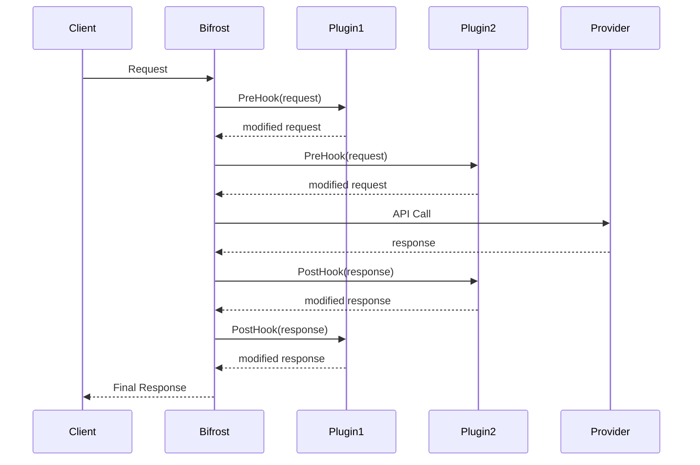
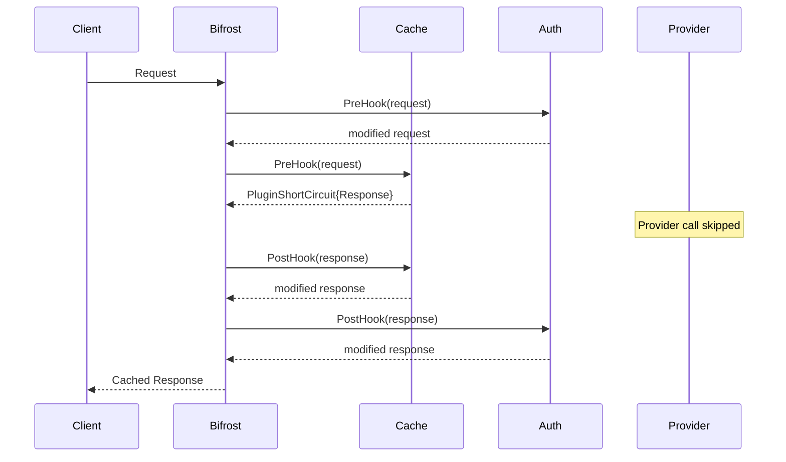

# Plugin System

Extend Bifrost's capabilities with a powerful plugin architecture. Build custom middleware for **rate limiting**, **caching**, **authentication**, **logging**, **monitoring**, and **business logic** without modifying core functionality.

## 🎯 Plugin Architecture

Bifrost plugins follow a **PreHook → Provider → PostHook** pattern with support for short-circuiting and fallback control.

### Key Concepts

| Concept                  | Description                                   | Use Cases                                        |
| ------------------------ | --------------------------------------------- | ------------------------------------------------ |
| **🎣 PreHook**           | Execute before provider call                  | Rate limiting, auth, request modification        |
| **🎣 PostHook**          | Execute after provider response               | Response caching, logging, result transformation |
| **⚡ Short-Circuit**     | Skip provider call with custom response/error | Cache hits, auth failures                        |
| **🔄 Fallback Control**  | Control whether fallback providers are tried  | Error recovery, selective failures               |
| **🔗 Pipeline Symmetry** | Every PreHook gets a PostHook call            | Guaranteed cleanup and state management          |

---

## ⚡ Quick Setup

<details open>
<summary><strong>🔧 Go Package Usage</strong></summary>

```go
package main

import (
    "context"
    "fmt"
    "time"
    "github.com/maximhq/bifrost/core"
    "github.com/maximhq/bifrost/core/schemas"
)

// 📖 [Complete LoggingPlugin Implementation →](../usage/examples.md#basic-logging-plugin)

func main() {
    // Create plugins
    plugins := []schemas.Plugin{
        &LoggingPlugin{name: "request-logger"},
    }

    // Initialize Bifrost with plugins
    bf, err := bifrost.Init(schemas.BifrostConfig{
        Account:         &MyAccount{},
        Plugins:         plugins,
        InitialPoolSize: 100,
        Logger:          bifrost.NewDefaultLogger(schemas.LogLevelInfo),
    })
    if err != nil {
        panic(err)
    }
    defer bf.Cleanup() // Calls plugin.Cleanup() for all plugins

    // Make requests - plugins automatically execute
    response, err := bf.ChatCompletion(context.Background(), schemas.BifrostRequest{
        Provider: schemas.OpenAI,
        Model:    "gpt-4o-mini",
        Input: schemas.RequestInput{
            ChatCompletionInput: &[]schemas.BifrostMessage{
                {
                    Role:    schemas.ModelChatMessageRoleUser,
                    Content: schemas.MessageContent{ContentStr: &[]string{"Hello!"}[0]},
                },
            },
        },
    })
}
```

**📖 [Complete Go Package Setup Guide →](../quick-start/go-package.md)**

</details>

<details>
<summary><strong>🌐 HTTP Transport Usage</strong></summary>

**1. Create plugin binary (`my-plugin.go`):**

```go
// Plugin for HTTP transport must be compiled as separate binary
package main

import (
    "context"
    "fmt"
    "time"
    "github.com/maximhq/bifrost/core/schemas"
)

type LoggingPlugin struct{}

func (p *LoggingPlugin) GetName() string {
    return "http-request-logger"
}

func (p *LoggingPlugin) PreHook(ctx *context.Context, req *schemas.BifrostRequest) (*schemas.BifrostRequest, *schemas.PluginShortCircuit, error) {
    fmt.Printf("[%s] HTTP PreHook: %s %s\n",
        time.Now().Format(time.RFC3339), req.Provider, req.Model)
    return req, nil, nil
}

func (p *LoggingPlugin) PostHook(ctx *context.Context, result *schemas.BifrostResponse, err *schemas.BifrostError) (*schemas.BifrostResponse, *schemas.BifrostError, error) {
    if err != nil {
        fmt.Printf("[%s] HTTP PostHook: Error: %s\n",
            time.Now().Format(time.RFC3339), err.Error.Message)
    } else {
        fmt.Printf("[%s] HTTP PostHook: Success\n", time.Now().Format(time.RFC3339))
    }
    return result, err, nil
}

func (p *LoggingPlugin) Cleanup() error {
    return nil
}

// Export plugin (required for HTTP transport)
func NewPlugin() schemas.Plugin {
    return &LoggingPlugin{}
}
```

**2. Start server with plugin:**

```bash
# Build plugin
go build -buildmode=plugin -o logging-plugin.so my-plugin.go

# Start with plugin
docker run -p 8080:8080 \
  -v $(pwd)/config.json:/app/config/config.json \
  -v $(pwd)/logging-plugin.so:/app/plugins/logging-plugin.so \
  -e OPENAI_API_KEY \
  -e APP_PLUGINS=logging-plugin.so \
  maximhq/bifrost
```

**3. Plugins execute automatically:**

```bash
curl -X POST http://localhost:8080/v1/chat/completions \
  -H "Content-Type: application/json" \
  -d '{
    "provider": "openai",
    "model": "gpt-4o-mini",
    "messages": [{"role": "user", "content": "Hello!"}]
  }'
```

**📖 [Complete HTTP Transport Setup Guide →](../quick-start/http-transport.md)**

</details>

---

## 🔧 Plugin Interface

### Core Plugin Structure

<details>
<summary><strong>📋 Plugin Interface Definition</strong></summary>

```go
// From /core/schemas/plugin.go
type Plugin interface {
    // GetName returns the name of the plugin
    GetName() string

    // PreHook is called before a request is processed by a provider
    // Can modify request, short-circuit with response, or short-circuit with error
    PreHook(ctx *context.Context, req *BifrostRequest) (*BifrostRequest, *PluginShortCircuit, error)

    // PostHook is called after a response or after PreHook short-circuit
    // Can modify response/error or recover from errors
    PostHook(ctx *context.Context, result *BifrostResponse, err *BifrostError) (*BifrostResponse, *BifrostError, error)

    // Cleanup is called on bifrost shutdown
    Cleanup() error
}

// Short-circuit mechanism
type PluginShortCircuit struct {
    Response *BifrostResponse // If set, skip provider and return this response
    Error    *BifrostError    // If set, skip provider and return this error
}
```

**Key Principles:**

- **Pipeline Symmetry**: Every PreHook execution gets a corresponding PostHook call
- **No Plugin Errors**: Plugin errors are logged as warnings, never returned to caller
- **Fallback Control**: Plugins can control whether fallback providers are tried
- **State Management**: Use context for passing state between PreHook and PostHook

</details>

---

## 🎨 Plugin Examples

### Rate Limiting Plugin

<details>
<summary><strong>🔧 Go Package Rate Limiter</strong></summary>

```go
package main

import (
    "context"
    "fmt"
    "sync"
    "time"
    "github.com/maximhq/bifrost/core/schemas"
)

type RateLimitPlugin struct {
    name        string
    maxRequests int
    window      time.Duration
    requests    map[string][]time.Time // provider -> timestamps
    mutex       sync.RWMutex
}

func NewRateLimitPlugin(maxRequests int, window time.Duration) *RateLimitPlugin {
    return &RateLimitPlugin{
        name:        "rate-limiter",
        maxRequests: maxRequests,
        window:      window,
        requests:    make(map[string][]time.Time),
    }
}

func (p *RateLimitPlugin) GetName() string {
    return p.name
}

func (p *RateLimitPlugin) PreHook(ctx *context.Context, req *schemas.BifrostRequest) (*schemas.BifrostRequest, *schemas.PluginShortCircuit, error) {
    p.mutex.Lock()
    defer p.mutex.Unlock()

    providerKey := string(req.Provider)
    now := time.Now()

    // Initialize provider tracking
    if p.requests[providerKey] == nil {
        p.requests[providerKey] = []time.Time{}
    }

    // Clean old requests outside window
    var validRequests []time.Time
    for _, timestamp := range p.requests[providerKey] {
        if now.Sub(timestamp) < p.window {
            validRequests = append(validRequests, timestamp)
        }
    }
    p.requests[providerKey] = validRequests

    // Check rate limit
    if len(p.requests[providerKey]) >= p.maxRequests {
        // Rate limit exceeded - short-circuit with error
        rateLimitError := &schemas.BifrostError{
            Type:           &[]string{"rate_limit_exceeded"}[0],
            IsBifrostError: true,
            StatusCode:     &[]int{429}[0],
            Error: schemas.ErrorField{
                Type:    &[]string{"rate_limit"}[0],
                Code:    &[]string{"too_many_requests"}[0],
                Message: fmt.Sprintf("Rate limit exceeded: %d requests per %v", p.maxRequests, p.window),
            },
            AllowFallbacks: &[]bool{false}[0], // Don't try fallbacks for rate limits
        }

        return req, &schemas.PluginShortCircuit{Error: rateLimitError}, nil
    }

    // Record this request
    p.requests[providerKey] = append(p.requests[providerKey], now)

    return req, nil, nil
}

func (p *RateLimitPlugin) PostHook(ctx *context.Context, result *schemas.BifrostResponse, err *schemas.BifrostError) (*schemas.BifrostResponse, *schemas.BifrostError, error) {
    // Rate limiter doesn't need post-processing
    return result, err, nil
}

func (p *RateLimitPlugin) Cleanup() error {
    p.mutex.Lock()
    defer p.mutex.Unlock()
    p.requests = make(map[string][]time.Time) // Clear tracking
    return nil
}

// Usage
func main() {
    plugins := []schemas.Plugin{
        NewRateLimitPlugin(10, time.Minute), // 10 requests per minute
    }

    bf, err := bifrost.Init(schemas.BifrostConfig{
        Account: &MyAccount{},
        Plugins: plugins,
    })
}
```

</details>

### Caching Plugin

<details>
<summary><strong>💾 Response Caching Plugin</strong></summary>

```go
package main

import (
    "context"
    "crypto/sha256"
    "encoding/json"
    "fmt"
    "sync"
    "time"
    "github.com/maximhq/bifrost/core/schemas"
)

type CachePlugin struct {
    name    string
    cache   map[string]*CacheEntry
    mutex   sync.RWMutex
    ttl     time.Duration
}

type CacheEntry struct {
    Response  *schemas.BifrostResponse
    Timestamp time.Time
}

func NewCachePlugin(ttl time.Duration) *CachePlugin {
    return &CachePlugin{
        name:  "response-cache",
        cache: make(map[string]*CacheEntry),
        ttl:   ttl,
    }
}

func (p *CachePlugin) GetName() string {
    return p.name
}

func (p *CachePlugin) generateCacheKey(req *schemas.BifrostRequest) string {
    // Create deterministic cache key from request
    data, _ := json.Marshal(map[string]interface{}{
        "provider": req.Provider,
        "model":    req.Model,
        "input":    req.Input,
        "params":   req.Params,
    })
    hash := sha256.Sum256(data)
    return fmt.Sprintf("%x", hash)
}

func (p *CachePlugin) PreHook(ctx *context.Context, req *schemas.BifrostRequest) (*schemas.BifrostRequest, *schemas.PluginShortCircuit, error) {
    cacheKey := p.generateCacheKey(req)

    p.mutex.RLock()
    entry, exists := p.cache[cacheKey]
    p.mutex.RUnlock()

    if exists && time.Since(entry.Timestamp) < p.ttl {
        // Cache hit - short-circuit with cached response
        fmt.Printf("Cache hit for key: %s\n", cacheKey[:8])

        // Clone response to avoid mutation
        cachedResponse := *entry.Response
        cachedResponse.ExtraFields.Provider = req.Provider // Update provider in response

        return req, &schemas.PluginShortCircuit{Response: &cachedResponse}, nil
    }

    // Cache miss - store key in context for PostHook
    newCtx := context.WithValue(*ctx, "cache_key", cacheKey)
    *ctx = newCtx

    return req, nil, nil
}

func (p *CachePlugin) PostHook(ctx *context.Context, result *schemas.BifrostResponse, err *schemas.BifrostError) (*schemas.BifrostResponse, *schemas.BifrostError, error) {
    // Only cache successful responses
    if err != nil || result == nil {
        return result, err, nil
    }

    // Retrieve cache key from context
    cacheKey, ok := (*ctx).Value("cache_key").(string)
    if !ok {
        return result, err, nil
    }

    // Store in cache
    p.mutex.Lock()
    p.cache[cacheKey] = &CacheEntry{
        Response:  result,
        Timestamp: time.Now(),
    }
    fmt.Printf("Cached response for key: %s\n", cacheKey[:8])
    p.mutex.Unlock()

    return result, err, nil
}

func (p *CachePlugin) Cleanup() error {
    p.mutex.Lock()
    defer p.mutex.Unlock()
    p.cache = make(map[string]*CacheEntry) // Clear cache
    return nil
}

// Usage
func main() {
    plugins := []schemas.Plugin{
        NewCachePlugin(5 * time.Minute), // 5-minute cache TTL
    }

    bf, err := bifrost.Init(schemas.BifrostConfig{
        Account: &MyAccount{},
        Plugins: plugins,
    })
}
```

</details>

### Authentication Plugin

<details>
<summary><strong>🔐 Request Authentication Plugin</strong></summary>

```go
package main

import (
    "context"
    "fmt"
    "strings"
    "github.com/maximhq/bifrost/core/schemas"
)

type AuthPlugin struct {
    name        string
    validTokens map[string]bool
}

func NewAuthPlugin(validTokens []string) *AuthPlugin {
    tokenMap := make(map[string]bool)
    for _, token := range validTokens {
        tokenMap[token] = true
    }

    return &AuthPlugin{
        name:        "request-auth",
        validTokens: tokenMap,
    }
}

func (p *AuthPlugin) GetName() string {
    return p.name
}

func (p *AuthPlugin) PreHook(ctx *context.Context, req *schemas.BifrostRequest) (*schemas.BifrostRequest, *schemas.PluginShortCircuit, error) {
    // Extract authorization from context (implementation-specific)
    authHeader := (*ctx).Value("authorization")
    if authHeader == nil {
        return p.unauthorizedError(req)
    }

    authStr, ok := authHeader.(string)
    if !ok || !strings.HasPrefix(authStr, "Bearer ") {
        return p.unauthorizedError(req)
    }

    token := strings.TrimPrefix(authStr, "Bearer ")
    if !p.validTokens[token] {
        return p.unauthorizedError(req)
    }

    // Authentication successful - add user info to context
    userCtx := context.WithValue(*ctx, "authenticated_user", token)
    *ctx = userCtx

    return req, nil, nil
}

func (p *AuthPlugin) unauthorizedError(req *schemas.BifrostRequest) (*schemas.BifrostRequest, *schemas.PluginShortCircuit, error) {
    authError := &schemas.BifrostError{
        Type:           &[]string{"authentication_failed"}[0],
        IsBifrostError: true,
        StatusCode:     &[]int{401}[0],
        Error: schemas.ErrorField{
            Type:    &[]string{"auth_error"}[0],
            Code:    &[]string{"unauthorized"}[0],
            Message: "Invalid or missing authentication token",
        },
        AllowFallbacks: &[]bool{false}[0], // Don't try fallbacks for auth failures
    }

    return req, &schemas.PluginShortCircuit{Error: authError}, nil
}

func (p *AuthPlugin) PostHook(ctx *context.Context, result *schemas.BifrostResponse, err *schemas.BifrostError) (*schemas.BifrostResponse, *schemas.BifrostError, error) {
    // Log successful authenticated requests
    if err == nil && result != nil {
        user := (*ctx).Value("authenticated_user")
        if user != nil {
            fmt.Printf("Successful request by user: %s\n", user)
        }
    }

    return result, err, nil
}

func (p *AuthPlugin) Cleanup() error {
    return nil
}

// Usage
func main() {
    plugins := []schemas.Plugin{
        NewAuthPlugin([]string{"token123", "token456", "admin-token"}),
    }

    bf, err := bifrost.Init(schemas.BifrostConfig{
        Account: &MyAccount{},
        Plugins: plugins,
    })
}
```

</details>

---

## 🔄 Plugin Execution Flow

### Normal Flow (No Short-Circuit)

<details>
<summary><strong>📊 Plugin Pipeline Diagram</strong></summary>



**Execution Order:**

1. **PreHooks**: Execute in registration order (1 → 2 → N)
2. **Provider Call**: If no short-circuit occurred
3. **PostHooks**: Execute in reverse order (N → 2 → 1)

</details>

### Short-Circuit Response Flow

<details>
<summary><strong>⚡ Cache Hit Short-Circuit</strong></summary>



**Short-Circuit Rules:**

- **Provider Skipped**: When plugin returns short-circuit response/error
- **PostHook Guarantee**: All executed PreHooks get corresponding PostHook calls
- **Reverse Order**: PostHooks execute in reverse order of PreHooks

</details>

### Error Recovery Flow

<details>
<summary><strong>🚀 Plugin Error Recovery</strong></summary>

```go
func (p *RecoveryPlugin) PostHook(ctx *context.Context, result *schemas.BifrostResponse, err *schemas.BifrostError) (*schemas.BifrostResponse, *schemas.BifrostError, error) {
    if err != nil && err.Error.Type != nil && *err.Error.Type == "rate_limit" {
        // Recover from rate limit errors with a friendly message
        recoveryResponse := &schemas.BifrostResponse{
            Choices: []schemas.BifrostResponseChoice{
                {
                    Index: 0,
                    Message: schemas.BifrostMessage{
                        Role:    schemas.ModelChatMessageRoleAssistant,
                        Content: schemas.MessageContent{ContentStr: &[]string{"I'm currently experiencing high demand. Please try again in a moment."}[0]},
                    },
                    FinishReason: &[]string{"recovery"}[0],
                },
            },
            Model:  "recovery-response",
            Usage:  schemas.LLMUsage{TotalTokens: 20},
        }

        // Return response and clear error to indicate recovery
        return recoveryResponse, nil, nil
    }

    return result, err, nil
}
```

</details>

---

## 🛡️ Advanced Plugin Patterns

### Multi-Plugin Coordination

<details>
<summary><strong>🔗 Plugin State Sharing</strong></summary>

```go
type MetricsPlugin struct {
    name string
}

func (p *MetricsPlugin) PreHook(ctx *context.Context, req *schemas.BifrostRequest) (*schemas.BifrostRequest, *schemas.PluginShortCircuit, error) {
    // Store start time for latency calculation
    startTime := time.Now()
    newCtx := context.WithValue(*ctx, "metrics_start_time", startTime)
    *ctx = newCtx

    return req, nil, nil
}

func (p *MetricsPlugin) PostHook(ctx *context.Context, result *schemas.BifrostResponse, err *schemas.BifrostError) (*schemas.BifrostResponse, *schemas.BifrostError, error) {
    // Calculate and log latency
    if startTime, ok := (*ctx).Value("metrics_start_time").(time.Time); ok {
        latency := time.Since(startTime)

        // Check if request was cached (set by cache plugin)
        cached := (*ctx).Value("cache_hit")
        status := "success"
        if err != nil {
            status = "error"
        } else if cached != nil {
            status = "cached"
        }

        fmt.Printf("Request metrics: provider=%s, latency=%v, status=%s\n",
            result.ExtraFields.Provider, latency, status)
    }

    return result, err, nil
}
```

**Context Usage Patterns:**

- **State Passing**: Use context to pass data between PreHook and PostHook
- **Plugin Communication**: Plugins can read context values set by other plugins
- **Request Metadata**: Store request timing, user info, feature flags, etc.

</details>

### Conditional Plugin Logic

<details>
<summary><strong>🎯 Smart Plugin Execution</strong></summary>

```go
type ConditionalPlugin struct {
    name string
}

func (p *ConditionalPlugin) PreHook(ctx *context.Context, req *schemas.BifrostRequest) (*schemas.BifrostRequest, *schemas.PluginShortCircuit, error) {
    // Only process requests to specific providers
    if req.Provider != schemas.OpenAI && req.Provider != schemas.Anthropic {
        return req, nil, nil // Skip processing
    }

    // Only process chat completions, not text completions
    if req.Input.ChatCompletionInput == nil {
        return req, nil, nil // Skip processing
    }

    // Check request size - short-circuit large requests
    if len(*req.Input.ChatCompletionInput) > 50 {
        limitError := &schemas.BifrostError{
            IsBifrostError: true,
            StatusCode:     &[]int{400}[0],
            Error: schemas.ErrorField{
                Message: "Request too large - maximum 50 messages allowed",
            },
            AllowFallbacks: &[]bool{false}[0],
        }

        return req, &schemas.PluginShortCircuit{Error: limitError}, nil
    }

    // Modify request for supported providers
    messages := *req.Input.ChatCompletionInput
    systemPrompt := schemas.BifrostMessage{
        Role:    schemas.ModelChatMessageRoleSystem,
        Content: schemas.MessageContent{ContentStr: &[]string{"You are a helpful assistant."}[0]},
    }

    // Prepend system message if not present
    if len(messages) == 0 || messages[0].Role != schemas.ModelChatMessageRoleSystem {
        modifiedMessages := append([]schemas.BifrostMessage{systemPrompt}, messages...)
        req.Input.ChatCompletionInput = &modifiedMessages
    }

    return req, nil, nil
}
```

</details>

---

## 📊 Plugin Monitoring & Debugging

### Plugin Observability

<details>
<summary><strong>📈 Plugin Performance Tracking</strong></summary>

```go
type ObservabilityPlugin struct {
    name    string
    metrics map[string]*PluginMetrics
    mutex   sync.RWMutex
}

type PluginMetrics struct {
    TotalRequests   int64
    SuccessRequests int64
    ErrorRequests   int64
    CacheHits       int64
    TotalLatency    time.Duration
    AverageLatency  time.Duration
}

func (p *ObservabilityPlugin) PreHook(ctx *context.Context, req *schemas.BifrostRequest) (*schemas.BifrostRequest, *schemas.PluginShortCircuit, error) {
    // Track request start
    providerKey := string(req.Provider)
    startTime := time.Now()

    newCtx := context.WithValue(*ctx, "obs_start_time", startTime)
    newCtx = context.WithValue(newCtx, "obs_provider", providerKey)
    *ctx = newCtx

    p.mutex.Lock()
    if p.metrics[providerKey] == nil {
        p.metrics[providerKey] = &PluginMetrics{}
    }
    p.metrics[providerKey].TotalRequests++
    p.mutex.Unlock()

    return req, nil, nil
}

func (p *ObservabilityPlugin) PostHook(ctx *context.Context, result *schemas.BifrostResponse, err *schemas.BifrostError) (*schemas.BifrostResponse, *schemas.BifrostError, error) {
    // Extract tracking data
    startTime, _ := (*ctx).Value("obs_start_time").(time.Time)
    providerKey, _ := (*ctx).Value("obs_provider").(string)

    if providerKey == "" {
        return result, err, nil
    }

    latency := time.Since(startTime)
    cached := (*ctx).Value("cache_hit") != nil

    p.mutex.Lock()
    metrics := p.metrics[providerKey]
    if err != nil {
        metrics.ErrorRequests++
    } else {
        metrics.SuccessRequests++
    }

    if cached {
        metrics.CacheHits++
    }

    metrics.TotalLatency += latency
    totalRequests := metrics.SuccessRequests + metrics.ErrorRequests
    if totalRequests > 0 {
        metrics.AverageLatency = metrics.TotalLatency / time.Duration(totalRequests)
    }
    p.mutex.Unlock()

    return result, err, nil
}

func (p *ObservabilityPlugin) GetMetrics() map[string]*PluginMetrics {
    p.mutex.RLock()
    defer p.mutex.RUnlock()

    // Return copy to avoid race conditions
    result := make(map[string]*PluginMetrics)
    for k, v := range p.metrics {
        result[k] = &PluginMetrics{
            TotalRequests:   v.TotalRequests,
            SuccessRequests: v.SuccessRequests,
            ErrorRequests:   v.ErrorRequests,
            CacheHits:       v.CacheHits,
            TotalLatency:    v.TotalLatency,
            AverageLatency:  v.AverageLatency,
        }
    }
    return result
}
```

</details>

### Plugin Testing

<details>
<summary><strong>🧪 Plugin Unit Testing</strong></summary>

```go
package main

import (
    "context"
    "testing"
    "time"
    "github.com/maximhq/bifrost/core/schemas"
)

func TestRateLimitPlugin(t *testing.T) {
    plugin := NewRateLimitPlugin(2, time.Minute) // 2 requests per minute

    // Create test request
    req := &schemas.BifrostRequest{
        Provider: schemas.OpenAI,
        Model:    "gpt-4o-mini",
        Input: schemas.RequestInput{
            ChatCompletionInput: &[]schemas.BifrostMessage{
                {
                    Role:    schemas.ModelChatMessageRoleUser,
                    Content: schemas.MessageContent{ContentStr: &[]string{"test"}[0]},
                },
            },
        },
    }

    ctx := context.Background()

    // First request should pass
    modifiedReq, shortCircuit, err := plugin.PreHook(&ctx, req)
    if err != nil {
        t.Fatalf("PreHook failed: %v", err)
    }
    if shortCircuit != nil {
        t.Fatalf("First request should not be rate limited")
    }

    // Second request should pass
    modifiedReq, shortCircuit, err = plugin.PreHook(&ctx, req)
    if err != nil {
        t.Fatalf("PreHook failed: %v", err)
    }
    if shortCircuit != nil {
        t.Fatalf("Second request should not be rate limited")
    }

    // Third request should be rate limited
    modifiedReq, shortCircuit, err = plugin.PreHook(&ctx, req)
    if err != nil {
        t.Fatalf("PreHook failed: %v", err)
    }
    if shortCircuit == nil || shortCircuit.Error == nil {
        t.Fatalf("Third request should be rate limited")
    }

    // Verify error details
    if *shortCircuit.Error.StatusCode != 429 {
        t.Fatalf("Expected status code 429, got %d", *shortCircuit.Error.StatusCode)
    }
    if *shortCircuit.Error.AllowFallbacks != false {
        t.Fatalf("Rate limit errors should not allow fallbacks")
    }
}

func TestCachePlugin(t *testing.T) {
    plugin := NewCachePlugin(time.Minute)

    req := &schemas.BifrostRequest{
        Provider: schemas.OpenAI,
        Model:    "gpt-4o-mini",
        Input: schemas.RequestInput{
            ChatCompletionInput: &[]schemas.BifrostMessage{
                {
                    Role:    schemas.ModelChatMessageRoleUser,
                    Content: schemas.MessageContent{ContentStr: &[]string{"test"}[0]},
                },
            },
        },
    }

    ctx := context.Background()

    // First request should miss cache
    modifiedReq, shortCircuit, err := plugin.PreHook(&ctx, req)
    if err != nil {
        t.Fatalf("PreHook failed: %v", err)
    }
    if shortCircuit != nil {
        t.Fatalf("First request should miss cache")
    }

    // Simulate response and cache it
    response := &schemas.BifrostResponse{
        Choices: []schemas.BifrostResponseChoice{
            {
                Index: 0,
                Message: schemas.BifrostMessage{
                    Role:    schemas.ModelChatMessageRoleAssistant,
                    Content: schemas.MessageContent{ContentStr: &[]string{"cached response"}[0]},
                },
            },
        },
    }

    plugin.PostHook(&ctx, response, nil)

    // Second identical request should hit cache
    newCtx := context.Background()
    modifiedReq, shortCircuit, err = plugin.PreHook(&newCtx, req)
    if err != nil {
        t.Fatalf("PreHook failed: %v", err)
    }
    if shortCircuit == nil || shortCircuit.Response == nil {
        t.Fatalf("Second request should hit cache")
    }

    // Verify cached response
    cachedContent := shortCircuit.Response.Choices[0].Message.Content.ContentStr
    if cachedContent == nil || *cachedContent != "cached response" {
        t.Fatalf("Cached response content mismatch")
    }
}
```

</details>

---

## 🎯 Production Best Practices

### Plugin Performance

<details>
<summary><strong>⚡ High-Performance Plugin Guidelines</strong></summary>

```go
// ✅ DO: Efficient plugin implementation
type EfficientPlugin struct {
    name string
    // Use appropriate data structures
    cache sync.Map // Better than map + mutex for read-heavy workloads
}

func (p *EfficientPlugin) PreHook(ctx *context.Context, req *schemas.BifrostRequest) (*schemas.BifrostRequest, *schemas.PluginShortCircuit, error) {
    // ✅ DO: Fast path for common cases
    if req.Provider == schemas.Ollama {
        return req, nil, nil // Skip processing for local models
    }

    // ✅ DO: Minimize allocations
    var keyBuffer [64]byte // Stack-allocated buffer
    key := generateKey(req, keyBuffer[:])

    // ✅ DO: Use efficient lookups
    if value, ok := p.cache.Load(key); ok {
        return req, &schemas.PluginShortCircuit{Response: value.(*schemas.BifrostResponse)}, nil
    }

    return req, nil, nil
}

func (p *EfficientPlugin) PostHook(ctx *context.Context, result *schemas.BifrostResponse, err *schemas.BifrostError) (*schemas.BifrostResponse, *schemas.BifrostError, error) {
    // ✅ DO: Quick exit for errors
    if err != nil {
        return result, err, nil
    }

    // ✅ DO: Async processing for non-critical operations
    go func() {
        p.updateMetrics(result)
    }()

    return result, err, nil
}

// ❌ DON'T: Expensive operations in plugin hooks
func (p *BadPlugin) PreHook(ctx *context.Context, req *schemas.BifrostRequest) (*schemas.BifrostRequest, *schemas.PluginShortCircuit, error) {
    // ❌ DON'T: Network calls in PreHook
    response, err := http.Get("https://slow-api.com/validate")

    // ❌ DON'T: Heavy computation on critical path
    for i := 0; i < 1000000; i++ {
        // Complex calculation
    }

    // ❌ DON'T: Blocking operations
    time.Sleep(100 * time.Millisecond)

    return req, nil, nil
}
```

**Performance Guidelines:**

- ⚡ **Fast PreHooks**: Keep PreHook execution under 1ms
- 📊 **Async PostHooks**: Use goroutines for non-critical PostHook operations
- 💾 **Memory Efficient**: Minimize allocations in hot paths
- 🔍 **Quick Exits**: Return early for requests that don't need processing
- 📈 **Benchmark**: Measure plugin overhead with realistic workloads

</details>

### Error Handling

<details>
<summary><strong>🛡️ Robust Plugin Error Handling</strong></summary>

```go
type RobustPlugin struct {
    name   string
    logger schemas.Logger
}

func (p *RobustPlugin) PreHook(ctx *context.Context, req *schemas.BifrostRequest) (*schemas.BifrostRequest, *schemas.PluginShortCircuit, error) {
    defer func() {
        // ✅ DO: Recover from panics to prevent system crashes
        if r := recover(); r != nil {
            p.logger.Error(fmt.Sprintf("Plugin %s panicked in PreHook: %v", p.name, r))
        }
    }()

    // ✅ DO: Validate inputs
    if req == nil {
        p.logger.Warn("Plugin received nil request")
        return req, nil, nil // Don't fail, just skip processing
    }

    // ✅ DO: Handle edge cases gracefully
    if req.Input.ChatCompletionInput == nil {
        p.logger.Debug("Plugin skipping text completion request")
        return req, nil, nil
    }

    // ✅ DO: Use timeouts for operations
    timeoutCtx, cancel := context.WithTimeout(*ctx, 50*time.Millisecond)
    defer cancel()

    select {
    case result := <-p.processRequest(req):
        return result, nil, nil
    case <-timeoutCtx.Done():
        p.logger.Warn("Plugin operation timed out")
        return req, nil, nil // Don't fail, just skip
    }
}

func (p *RobustPlugin) PostHook(ctx *context.Context, result *schemas.BifrostResponse, err *schemas.BifrostError) (*schemas.BifrostResponse, *schemas.BifrostError, error) {
    defer func() {
        if r := recover(); r != nil {
            p.logger.Error(fmt.Sprintf("Plugin %s panicked in PostHook: %v", p.name, r))
        }
    }()

    // ✅ DO: Handle both success and error cases
    if err != nil {
        p.logger.Info(fmt.Sprintf("Processing error response: %s", err.Error.Message))
        // Plugin can still process error responses
    }

    if result != nil {
        p.logger.Debug(fmt.Sprintf("Processing successful response with %d choices", len(result.Choices)))
    }

    return result, err, nil
}

func (p *RobustPlugin) Cleanup() error {
    // ✅ DO: Clean up resources properly
    defer func() {
        if r := recover(); r != nil {
            p.logger.Error(fmt.Sprintf("Plugin %s panicked during cleanup: %v", p.name, r))
        }
    }()

    // ✅ DO: Set reasonable cleanup timeouts
    timeoutCtx, cancel := context.WithTimeout(context.Background(), 5*time.Second)
    defer cancel()

    done := make(chan error, 1)
    go func() {
        done <- p.performCleanup()
    }()

    select {
    case err := <-done:
        return err
    case <-timeoutCtx.Done():
        p.logger.Warn("Plugin cleanup timed out")
        return fmt.Errorf("cleanup timeout")
    }
}
```

**Error Handling Rules:**

- 🛡️ **Never Panic**: Always recover from panics in plugins
- ⏱️ **Use Timeouts**: Prevent plugins from blocking indefinitely
- 📝 **Log Don't Fail**: Log plugin errors, don't return them to caller
- 🔄 **Graceful Degradation**: Continue processing even if plugin fails
- 🧹 **Resource Cleanup**: Always clean up resources in Cleanup()

</details>

---

## 🎯 Next Steps

Ready to extend Bifrost with custom functionality? Choose your path:

| **Feature**                   | **Documentation**                                         | **Time Investment** |
| ----------------------------- | --------------------------------------------------------- | ------------------- |
| **🔄 Fallback Systems**       | [Fallback Guide](fallbacks.md)                            | 5 minutes           |
| **🤖 Multi-Provider Setup**   | [Provider Guide](providers.md)                            | 10 minutes          |
| **🛠️ MCP Tool Integration**   | [MCP Guide](mcp-integration.md)                           | 10 minutes          |
| **📊 Monitoring**             | [Observability Guide](observability.md)                   | 10 minutes          |
| **🏗️ Architecture Deep Dive** | [System Architecture](../architecture/system-overview.md) | 20 minutes          |

### 📖 Complete Reference

- **[📋 Plugin API Reference](../usage/plugin-api.md)** - Complete plugin API documentation
- **[🏗️ Production Deployment](../configuration/deployment/)** - Scale plugins for enterprise
- **[🔧 Configuration Guide](../configuration/)** - Advanced plugin setup options
- **[❓ Troubleshooting](../guides/troubleshooting.md)** - Common plugin issues and solutions

---

**🚀 Ready to deploy?** Start with our [📖 Quick Start Guides](../quick-start/) to get plugins running in under 2 minutes.
