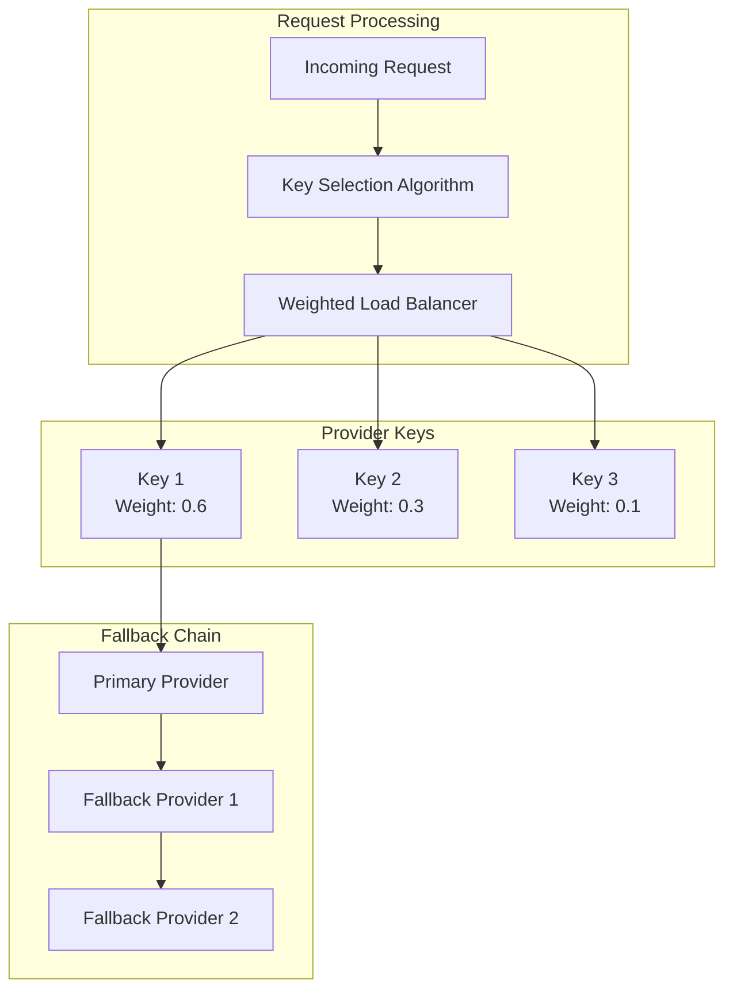

# 🔌 Bifrost Provider System

Bifrost supports multiple AI model providers with unified configuration, automatic failover, and intelligent load balancing. Configure once, use anywhere - seamlessly switch between providers without changing your application code.

## 📑 Supported Providers

| Provider                          | Status        | Models                  | Features                         |
| --------------------------------- | ------------- | ----------------------- | -------------------------------- |
| **[OpenAI](openai.md)**           | ✅ Production | GPT-4, GPT-3.5, DALL-E  | Chat, Completions, Vision, Tools |
| **[Anthropic](anthropic.md)**     | ✅ Production | Claude 3, Claude 2      | Chat, Completions, Tools         |
| **[Azure OpenAI](azure.md)**      | ✅ Production | GPT-4, GPT-3.5          | Enterprise deployment            |
| **[AWS Bedrock](bedrock.md)**     | ✅ Production | Claude, Titan, Jurassic | AWS native integration           |
| **[Google Vertex AI](vertex.md)** | ✅ Production | Gemini, PaLM            | GCP native integration           |
| **[Cohere](cohere.md)**           | ✅ Production | Command, Generate       | Text generation                  |
| **[Mistral](mistral.md)**         | ✅ Production | Mistral 7B, Mixtral     | Open-source models               |
| **[Ollama](ollama.md)**           | ✅ Production | Local models            | Self-hosted deployment           |

---

## 🚀 Quick Start

<details>
<summary><strong>🔧 Go Package Usage</strong></summary>

### Basic Provider Configuration

```go
import "github.com/maximhq/bifrost/core/schemas"

// Single provider setup
account := &schemas.Account{
    Providers: map[string]schemas.ProviderConfig{
        "openai": {
            Keys: []schemas.Key{
                {
                    Value:  "sk-your-openai-key",
                    Models: []string{"gpt-4o-mini", "gpt-4o"},
                    Weight: 1.0,
                },
            },
        },
    },
}

// Multi-provider setup with fallbacks
account := &schemas.Account{
    Providers: map[string]schemas.ProviderConfig{
        "openai": {
            Keys: []schemas.Key{
                {Value: "sk-openai-key", Models: []string{"gpt-4o"}, Weight: 1.0},
            },
        },
        "anthropic": {
            Keys: []schemas.Key{
                {Value: "sk-ant-key", Models: []string{"claude-3-sonnet-20240229"}, Weight: 1.0},
            },
        },
    },
}
```

### Making Requests with Fallbacks

```go
import "github.com/maximhq/bifrost/core"

client := bifrost.NewBifrostClient(account)

// Request with automatic fallback
request := &schemas.ChatCompletionRequest{
    Provider: "openai",
    Model:    "gpt-4o",
    Messages: []schemas.Message{
        {Role: "user", Content: "Hello, world!"},
    },
    Fallbacks: []schemas.FallbackConfig{
        {Provider: "anthropic", Model: "claude-3-sonnet-20240229"},
        {Provider: "bedrock", Model: "anthropic.claude-3-sonnet-20240229-v1:0"},
    },
}

response, err := client.CreateChatCompletion(request)
```

</details>

<details>
<summary><strong>🌐 HTTP Transport Usage</strong></summary>

### Configuration File

```json
{
  "providers": {
    "openai": {
      "keys": [
        {
          "value": "env.OPENAI_API_KEY",
          "models": ["gpt-4o", "gpt-4o-mini"],
          "weight": 1.0
        }
      ]
    },
    "anthropic": {
      "keys": [
        {
          "value": "env.ANTHROPIC_API_KEY",
          "models": ["claude-3-sonnet-20240229"],
          "weight": 1.0
        }
      ]
    }
  }
}
```

### Making Requests

```bash
# Primary provider request
curl -X POST http://localhost:8080/v1/chat/completions \
  -H "Content-Type: application/json" \
  -d '{
    "provider": "openai",
    "model": "gpt-4o",
    "messages": [{"role": "user", "content": "Hello!"}],
    "fallbacks": [
      {"provider": "anthropic", "model": "claude-3-sonnet-20240229"}
    ]
  }'
```

</details>

---

## 🏗️ Provider Architecture

### Load Balancing & Key Management

Bifrost implements intelligent request distribution across multiple API keys with weighted load balancing:



### Key Selection Logic

1. **Model Filtering**: Only keys supporting the requested model are considered
2. **Weight Normalization**: Weights are normalized to sum to 1.0
3. **Weighted Random Selection**: Keys are selected based on their weight distribution
4. **Fallback on Failure**: Automatic fallback to next available key/provider

---

## ⚙️ Advanced Configuration

### Network & Proxy Settings

<details>
<summary><strong>🔧 Go Package Configuration</strong></summary>

```go
providerConfig := schemas.ProviderConfig{
    NetworkConfig: schemas.NetworkConfig{
        BaseURL: "https://api.custom-deployment.com",
        ExtraHeaders: map[string]string{
            "X-Organization-ID": "org-123",
            "User-Agent":        "MyApp/1.0",
        },
        DefaultRequestTimeoutInSeconds: 30,
        MaxRetries:                     3,
        RetryBackoffInitial:           100 * time.Millisecond,
        RetryBackoffMax:               2 * time.Second,
    },
    ConcurrencyAndBufferSize: schemas.ConcurrencyAndBufferSize{
        Concurrency: 10,  // Concurrent requests
        BufferSize:  100, // Request queue size
    },
    ProxyConfig: &schemas.ProxyConfig{
        Type: schemas.HttpProxy,
        URL:  "http://proxy.company.com:8080",
    },
}
```

</details>

<details>
<summary><strong>🌐 HTTP Transport Configuration</strong></summary>

```json
{
  "providers": {
    "openai": {
      "keys": [...],
      "network_config": {
        "base_url": "https://api.custom-deployment.com",
        "extra_headers": {
          "X-Organization-ID": "org-123"
        },
        "default_request_timeout_in_seconds": 30,
        "max_retries": 3
      },
      "concurrency_and_buffer_size": {
        "concurrency": 10,
        "buffer_size": 100
      },
      "proxy_config": {
        "type": "http",
        "url": "http://proxy.company.com:8080"
      }
    }
  }
}
```

</details>

---

## 🔐 Security Best Practices

### API Key Management

- **Environment Variables**: Use `env.` prefix for sensitive values
- **Key Rotation**: Regularly rotate API keys across providers
- **Weight Distribution**: Distribute load across multiple keys
- **Access Control**: Limit key permissions to required models only

### Network Security

- **HTTPS Only**: Always use secure connections
- **Proxy Support**: Route through corporate proxies when required
- **Timeout Configuration**: Set appropriate timeouts to prevent hanging requests
- **Retry Policies**: Configure exponential backoff for failed requests

---

## 📊 Monitoring & Observability

### Key Metrics to Track

- **Request Distribution**: Monitor key usage patterns
- **Provider Health**: Track success/failure rates per provider
- **Response Times**: Monitor latency across providers
- **Fallback Frequency**: Track how often fallbacks are triggered

### Debugging Tools

- **Request Tracing**: Enable detailed request/response logging
- **Health Checks**: Monitor provider endpoint availability
- **Error Analysis**: Categorize and track provider-specific errors

---

## 🔗 Provider-Specific Guides

Ready to configure a specific provider? Check out our detailed guides:

- **[OpenAI Configuration](openai.md)** - GPT models and enterprise features
- **[Anthropic Configuration](anthropic.md)** - Claude models and safety features
- **[Azure OpenAI Configuration](azure.md)** - Enterprise deployment patterns
- **[AWS Bedrock Configuration](bedrock.md)** - AWS native integration
- **[Google Vertex AI Configuration](vertex.md)** - GCP native integration
- **[Adding New Providers](adding-providers.md)** - Extend Bifrost with custom providers

---

**⚡ Need help with a specific provider?** Jump to the relevant configuration guide or check our [troubleshooting guide](../../guides/troubleshooting.md) for common issues.
