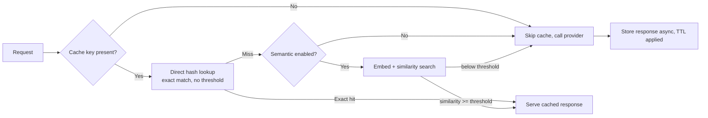
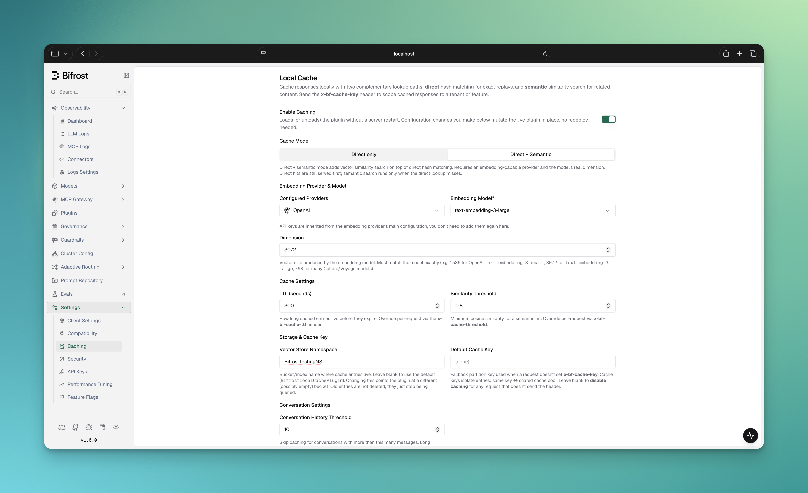
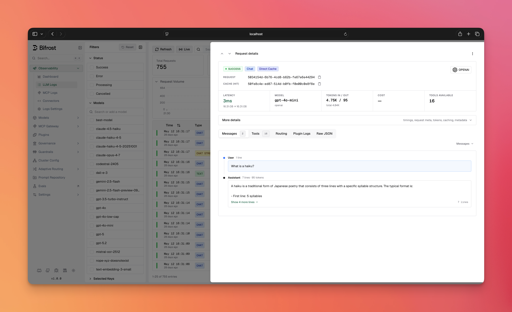

## Overview

Bifrost can cache LLM responses and replay them for repeated requests, avoiding a round-trip to the provider. It offers two complementary lookup paths:

- **Direct (hash) matching** — deterministic, exact-match replay. The request is normalized and hashed; an identical request is served instantly. No embeddings required.
- **Semantic (similarity) matching** — embedding-based lookup that serves a cached answer when a *new* request is close enough to a previous one, even if the wording differs.

Both paths can run together (direct first, semantic on miss), or you can run direct-only with no embedding provider at all.

<Note>
In the Web UI this feature is labeled **Local Cache** (under **Settings → Caching**). "Semantic caching" refers to the embedding-based mode; "direct" mode is the embedding-free path. They are the same plugin (`semantic_cache`).
</Note>

**Key benefits:**
- **Cost reduction** — skip paid LLM calls for repeated or similar prompts.
- **Lower latency** — sub-millisecond cache reads vs. multi-second provider calls.
- **Two modes** — exact-match deduplication (direct) or fuzzy similarity (semantic).
- **Streaming support** — streamed responses are cached and replayed chunk-by-chunk.

---

## How it works



A few things that trip up first-time users — read these before configuring:

1. **A cache key is mandatory.** Caching only engages when a request carries a cache key (the `x-bf-cache-key` header, or the `CacheKey` context value in the Go SDK). Without one — and without a configured `default_cache_key` — the request bypasses the cache entirely. This is the single most common reason "nothing is being cached."
2. **Direct runs before semantic.** When both paths are enabled, a direct hash hit is served first; the semantic search only runs on a direct miss. You can narrow a request to one path with the `x-bf-cache-type` header.
3. **Writes are asynchronous.** On a cache miss, Bifrost returns the provider's response immediately and stores it in the background, so the *first* request never blocks on a cache write.
4. **Entries persist across restarts.** Cache entries live in your vector store with a per-entry expiry (`expires_at`). They are **not** purged when Bifrost shuts down — a restart keeps serving warm cache (see [Cache lifecycle](#lifecycle--cleanup)).

**What gets cached:** chat completions, text completions, the Responses API (including WebSocket), embeddings, transcriptions, speech, and image generation — including their streaming variants.

<Warning>
**Latency overhead.** The cache lookup itself adds latency to every cache-enabled request, and the cost differs per path:

- **Direct lookup** — one vector store round-trip per request, hit or miss. Sub-millisecond to a few milliseconds with a local Redis/Valkey; higher with remote or managed stores. (Computing the request hash itself is in-process and takes microseconds — the round-trip is the only real cost.)
- **Semantic lookup** — runs on every direct miss, and must embed the incoming request *before* it can search. That means one embedding API call to your provider (typically tens to a few hundred milliseconds) plus a vector similarity search, paid upfront regardless of the outcome. A semantic **hit** therefore costs roughly an embedding round-trip — not the near-instant replay of a direct hit — and a semantic **miss** pays the embedding call *on top of* the full LLM call, making it slower than running without the cache.
- **Cache writes** — asynchronous; they add no latency to the response.
</Warning>

---

## Prerequisites

1. **A vector store** is required as the storage backend for *both* modes — even direct-only mode stores its entries there. Bifrost supports:

<CardGroup cols={2}>
  <Card title="Redis / Valkey" icon="database" href="/integrations/vector-databases/redis">
    In-memory, RediSearch-compatible. Recommended for direct-only mode.
  </Card>
  <Card title="Weaviate" icon="database" href="/integrations/vector-databases/weaviate">
    Production-ready vector database with gRPC support.
  </Card>
  <Card title="Qdrant" icon="database" href="/integrations/vector-databases/qdrant">
    Rust-based vector search engine with advanced filtering.
  </Card>
  <Card title="Pinecone" icon="database" href="/integrations/vector-databases/pinecone">
    Managed, serverless vector database service.
  </Card>
</CardGroup>

2. **An embedding-capable provider** — only if you want semantic mode. Direct-only mode needs no provider.

<Info>
See the [Vector Store documentation](/architecture/framework/vector-store) for per-store setup. The vector store must be enabled in `config.json` before the **Enable Caching** toggle becomes available in the UI.
</Info>

**Minimal vector store config (Redis/Valkey):**

```json
{
  "vector_store": {
    "enabled": true,
    "type": "redis",
    "config": {
      "addr": "localhost:6379"
    }
  }
}
```

<Info>
For Valkey, keep `vector_store.type` as `"redis"` and point `config.addr` at your Valkey endpoint.
</Info>

---

## Configuration

<Tabs group="config-method">

<Tab title="Web UI">



1. Configure and enable a **vector store** in `config.json` (see [Prerequisites](#prerequisites)). Without it, the toggle stays disabled.
2. In the Bifrost UI, go to **Settings → Caching**. You'll see the **Local Cache** panel.
3. Flip **Enable Caching** on. The plugin loads live — no server restart needed.
4. Pick a **Cache Mode** using the tabs at the top of the panel:
   - **Direct only** — exact-match caching. No provider or embeddings. Cheapest path; ideal for stable, repeated prompts.
   - **Direct + Semantic** — adds vector similarity on top of direct matching. Requires an embedding-capable provider. (This tab is disabled until at least one embedding-capable provider is configured.)

5. **For semantic mode**, fill in the embedding provider, model, and dimension that appear below the tabs:
   - **Configured Providers** — an embedding-capable provider already set up in Bifrost. Its API keys are inherited automatically.
   - **Embedding Model** — e.g. `text-embedding-3-small`.
   - **Dimension** — the vector size the model produces. **Must match the model exactly** (e.g. `1536` for `text-embedding-3-small`, `3072` for `text-embedding-3-large`, `768` for many Cohere/Voyage models).

6. Tune **Cache Settings**, **Storage & Cache Key**, **Conversation Settings**, and **Cache Key Composition** (all explained in the [field reference](#field-reference) below).
7. Click **Save Changes**. Config changes mutate the live plugin in place.
8. Send a request with an `x-bf-cache-key` header to start caching (see [Triggering the cache](#triggering-the-cache)).

</Tab>

<Tab title="API">

The cache is the `semantic_cache` plugin, managed through the plugins API. The `config` object takes the same fields as the [field reference](#field-reference) below.

**Create (enable) the plugin:**

```bash
curl -X POST http://localhost:8080/api/plugins \
  -H "Content-Type: application/json" \
  -d '{
    "name": "semantic_cache",
    "enabled": true,
    "path": "",
    "config": {
      "provider": "openai",
      "embedding_model": "text-embedding-3-small",
      "dimension": 1536,
      "ttl": "5m",
      "threshold": 0.8,
      "conversation_history_threshold": 3,
      "exclude_system_prompt": false,
      "cache_by_model": true,
      "cache_by_provider": true,
      "vector_store_namespace": "BifrostSemanticCachePlugin",
      "default_cache_key": ""
    }
  }'
```

**Update config or toggle on/off** (changes apply to the live plugin, no restart):

```bash
curl -X PUT http://localhost:8080/api/plugins/semantic_cache \
  -H "Content-Type: application/json" \
  -d '{
    "enabled": true,
    "path": "",
    "config": { "ttl": "10m", "threshold": 0.85, "dimension": 1536, "provider": "openai", "embedding_model": "text-embedding-3-small" }
  }'
```

**Read current config / disable:**

```bash
# Inspect the current plugin config and status
curl http://localhost:8080/api/plugins/semantic_cache

# Disable without deleting the saved config
curl -X PUT http://localhost:8080/api/plugins/semantic_cache \
  -H "Content-Type: application/json" \
  -d '{ "enabled": false, "path": "", "config": { "dimension": 1 } }'
```

<Note>
A vector store must be enabled in `config.json` first — the plugin has nowhere to store entries otherwise. For **direct-only mode**, send `"dimension": 1` and omit `provider`/`embedding_model`.
</Note>

</Tab>

<Tab title="config.json">

```json
{ 
  "vector_store": {...},
  "plugins": [
    {
      "enabled": true,
      "name": "semantic_cache",
      "config": {
        "provider": "openai",
        "embedding_model": "text-embedding-3-small",
        "dimension": 1536,

        "ttl": "5m",
        "threshold": 0.8,

        "conversation_history_threshold": 3,
        "exclude_system_prompt": false,

        "cache_by_model": true,
        "cache_by_provider": true,

        "vector_store_namespace": "BifrostSemanticCachePlugin",
        "default_cache_key": ""
      }
    }
  ]
}
```

> **Note:** Provider API keys are inherited automatically from the global provider configuration. You do not need to (and cannot) specify keys inside the plugin config.

**TTL format options:**
- Duration strings: `"30s"`, `"5m"`, `"1h"`, `"24h"`
- Numeric seconds: `300` (5 minutes), `3600` (1 hour)

</Tab>

<Tab title="Go SDK">

```go
import (
    "time"

    bifrost "github.com/maximhq/bifrost/core"
    "github.com/maximhq/bifrost/core/schemas"
    "github.com/maximhq/bifrost/plugins/semanticcache"
)

cacheConfig := &semanticcache.Config{
    // Embedding settings (semantic mode only)
    Provider:       schemas.OpenAI,
    EmbeddingModel: "text-embedding-3-small",
    Dimension:      1536, // use 1 for direct-only mode

    // Cache behavior
    TTL:       5 * time.Minute, // default: 5m
    Threshold: 0.8,             // default: 0.8

    // Conversation behavior
    ConversationHistoryThreshold: 3, // default: 3
    ExcludeSystemPrompt:          bifrost.Ptr(false),

    // Cache key composition
    CacheByModel:    bifrost.Ptr(true),
    CacheByProvider: bifrost.Ptr(true),

    // Storage & default key (optional)
    VectorStoreNamespace: "BifrostSemanticCachePlugin",
    DefaultCacheKey:      "",
}

plugin, err := semanticcache.Init(context.Background(), cacheConfig, logger, vectorStore)
if err != nil {
    log.Fatal("Failed to create semantic cache plugin:", err)
}

bifrostConfig := schemas.BifrostConfig{
    LLMPlugins: []schemas.LLMPlugin{plugin},
    // ... other config
}
```

</Tab>

</Tabs>

### Field reference

| Field | Type | Default | Description |
|-------|------|---------|-------------|
| `provider` | string | — | Embedding provider. **Required for semantic mode**; omit for direct-only. |
| `embedding_model` | string | — | Embedding model name. Required when `provider` is set. |
| `dimension` | integer | — | Vector size. Use `1` for direct-only mode; the embedding model's real dimension (`> 1`) for semantic mode. **Required.** |
| `ttl` | duration / seconds | `5m` (300s) | How long entries live before they expire. Accepts a duration string (`"5m"`) or numeric seconds (`300`). |
| `threshold` | number (0–1) | `0.8` | Minimum cosine similarity for a semantic hit. Semantic mode only. |
| `conversation_history_threshold` | integer | `3` | Skip caching when a conversation has **more than** this many messages. UI range: 1–50. |
| `exclude_system_prompt` | boolean | `false` | Exclude system messages from cache-key generation. |
| `cache_by_model` | boolean | `true` | Include the model name in the cache key (different models won't share entries). |
| `cache_by_provider` | boolean | `true` | Include the provider name in the cache key (different providers won't share entries). |
| `vector_store_namespace` | string | `BifrostSemanticCachePlugin` | Bucket/index where entries live. Changing it points the plugin at a different (possibly empty) bucket; old entries aren't deleted, just no longer queried. |
| `default_cache_key` | string | `""` (empty) | Fallback cache key used when a request doesn't send `x-bf-cache-key`. **Left empty, caching is disabled for any request without the header.** |

---

## Direct vs. semantic mode

| | Direct only | Direct + Semantic |
|---|---|---|
| **Matches** | Exact (normalized) request | Exact **and** semantically similar |
| **Embedding provider** | Not needed | Required |
| **Cost per miss** | Zero embedding cost | One embedding call per miss |
| **Added latency** | One vector store round-trip per request | Store round-trip, plus an embedding call + similarity search on every direct miss |
| **Best for** | Stable, repeated prompts; strict dedup | Paraphrased / varied user queries |
| **`dimension`** | `1` | The model's real vector size (`> 1`) |

### Direct-only setup

Direct mode hashes each request deterministically from its normalized input, parameters, and stream flag. Identical requests hit; any difference is a miss. The deterministic cache ID keeps repeated lookups consistent across retries, streaming, and restarts.

To enable direct-only mode, set `dimension: 1` and **omit** `provider` and `embedding_model`. In the UI, pick the **Direct only** tab.

<Warning>
If you set `dimension: 1` **and** also provide a `provider`, Bifrost treats the config as semantic mode, not direct-only. To use direct-only mode, omit `provider` entirely.
</Warning>

<Tabs group="direct-hash-setup">

<Tab title="config.json">

```json
{
  "plugins": [
    {
      "enabled": true,
      "name": "semantic_cache",
      "config": {
        "dimension": 1,
        "ttl": "5m",
        "cache_by_model": true,
        "cache_by_provider": true
      }
    }
  ]
}
```

</Tab>

<Tab title="Go SDK">

```go
cacheConfig := &semanticcache.Config{
    // No Provider or EmbeddingModel -- direct hash mode only.
    Dimension: 1, // entries are stored as metadata-only (no embedding vectors).

    TTL:             5 * time.Minute,
    CacheByModel:    bifrost.Ptr(true),
    CacheByProvider: bifrost.Ptr(true),
}

plugin, err := semanticcache.Init(ctx, cacheConfig, logger, store)
```

</Tab>

<Tab title="Helm">

```yaml
bifrost:
  plugins:
    semanticCache:
      enabled: true
      config:
        dimension: 1
        ttl: "5m"
        cache_by_model: true
        cache_by_provider: true
```

</Tab>

</Tabs>

In direct-only mode, all requests use hash matching regardless of the `x-bf-cache-type` header — no embeddings are generated and no embedding credentials are needed.

### Recommended vector store for direct-only mode

**Redis/Valkey-compatible stores** are recommended for direct-only mode. They don't require a vector for metadata-only entries, and all cache fields are indexed as TAG fields for fast exact-match lookups.

<Warning>
**Qdrant, Pinecone, and Weaviate are not suitable for direct-only mode.** They require a vector for every entry; the plugin's zero-vector placeholder codepath needs an initialized embedding client, so storage fails when no provider is configured. Use Redis/Valkey for direct-only.
</Warning>

---

## Triggering the cache

<Warning>
**A cache key is mandatory.** Caching only activates when a request carries a cache key. Without one (and without a configured `default_cache_key`), the request bypasses caching entirely.
</Warning>

The cache key is the **partition** every lookup and write is scoped to — it's part of the cache entry's identity alongside the model and provider. It exists for two reasons:

- **Isolation (no cross-talk).** Entries are only ever matched within the same key. A request under `tenant-A` can never be served a response cached under `tenant-B`, even if the prompts are identical. This prevents one user, tenant, or feature from leaking cached answers to another — the key is how you draw that boundary (per user, per session, per feature, per tenant, etc.).
- **Explicit opt-in.** Caching changes behavior — a response can be replayed instead of freshly generated. Requiring a key makes that a deliberate choice per request (or per deployment via `default_cache_key`), so you never accidentally serve a cached answer where you wanted a live one.

Pick a key granularity that matches how much you want to share: a coarse key (e.g. a feature name) maximizes hit rate across users; a fine key (e.g. a per-user or per-session ID) keeps caches private at the cost of fewer hits.

<Tabs group="cache-triggering">

<Tab title="HTTP API">

Set the cache key in the `x-bf-cache-key` header:

```bash
# This request WILL be cached
curl -H "x-bf-cache-key: session-123" ...

# This request will NOT be cached (no header, no default_cache_key)
curl ...
```

</Tab>

<Tab title="Go SDK">

Set the cache key in the request context:

```go
// This request WILL be cached
ctx = context.WithValue(ctx, semanticcache.CacheKey, "session-123")
response, err := client.ChatCompletionRequest(schemas.NewBifrostContext(ctx, schemas.NoDeadline), request)

// This request will NOT be cached (no context value)
response, err := client.ChatCompletionRequest(schemas.NewBifrostContext(context.Background(), schemas.NoDeadline), request)
```

</Tab>

</Tabs>

---

## Per-request overrides

Every plugin default can be overridden per request via headers (HTTP) or context keys (Go SDK).

| Header | Context key (Go) | Value | Effect |
|--------|------------------|-------|--------|
| `x-bf-cache-key` | `CacheKey` | string | Scope this request to a cache partition. Required (or `default_cache_key`) for caching to engage. |
| `x-bf-cache-ttl` | `CacheTTLKey` | duration string or seconds | Override TTL for this request. Invalid values are ignored. |
| `x-bf-cache-threshold` | `CacheThresholdKey` | float (0–1) | Override the semantic similarity threshold. Clamped to `[0,1]`. |
| `x-bf-cache-type` | `CacheTypeKey` | `direct` or `semantic` | Limit lookup to a single path. |
| `x-bf-cache-no-store` | `CacheNoStoreKey` | `true` | Skip writing the response (still serves cached hits). |

<Tabs group="per-request-overrides">

<Tab title="HTTP API">

```bash
# Custom TTL and threshold
curl -H "x-bf-cache-key: session-123" \
     -H "x-bf-cache-ttl: 30s" \
     -H "x-bf-cache-threshold: 0.9" ...

# Force direct-only matching
curl -H "x-bf-cache-key: session-123" \
     -H "x-bf-cache-type: direct" ...

# Read from cache but don't store the response
curl -H "x-bf-cache-key: session-123" \
     -H "x-bf-cache-no-store: true" ...
```

</Tab>

<Tab title="Go SDK">

```go
ctx = context.WithValue(ctx, semanticcache.CacheKey, "session-123")
ctx = context.WithValue(ctx, semanticcache.CacheTTLKey, 30*time.Second)
ctx = context.WithValue(ctx, semanticcache.CacheThresholdKey, 0.9)

// Force a single lookup path
ctx = context.WithValue(ctx, semanticcache.CacheTypeKey, semanticcache.CacheTypeDirect)
// or semanticcache.CacheTypeSemantic

// Read-only: serve from cache but don't write this response
ctx = context.WithValue(ctx, semanticcache.CacheNoStoreKey, true)
```

</Tab>

</Tabs>

<Note>
In direct-only mode (no embedding provider), `x-bf-cache-type` and `x-bf-cache-threshold` have no effect — every request uses direct matching.
</Note>

---

## Cache management

Every cached or cache-checked response carries debug metadata so you can confirm caching is working and capture the entry's ID for management.

**Location:** `response.ExtraFields.CacheDebug`

| Field | When present | Description |
|-------|--------------|-------------|
| `cache_hit` | always | `true` if served from cache, `false` otherwise. |
| `cache_id` | always | Storage ID of the entry — use it to invalidate later. |
| `hit_type` | on hit | `"direct"` or `"semantic"`. |
| `threshold` | on semantic hit | Similarity threshold used. |
| `similarity` | on semantic hit | Actual cosine similarity score. |
| `provider_used` | when semantic search ran | Embedding provider used. |
| `model_used` | when semantic search ran | Embedding model used. |
| `input_tokens` | when semantic search ran | Tokens consumed computing the embedding. |

**Examples:**

```json
// Direct hit
{
  "extra_fields": {
    "cache_debug": {
      "cache_hit": true,
      "hit_type": "direct",
      "cache_id": "550e8500-e29b-41d4-a725-446655440001"
    }
  }
}

// Semantic hit
{
  "extra_fields": {
    "cache_debug": {
      "cache_hit": true,
      "hit_type": "semantic",
      "cache_id": "550e8500-e29b-41d4-a725-446655440001",
      "threshold": 0.8,
      "similarity": 0.95,
      "provider_used": "openai",
      "model_used": "text-embedding-3-small",
      "input_tokens": 100
    }
  }
}

// Miss (semantic search ran but found nothing close enough)
{
  "extra_fields": {
    "cache_debug": {
      "cache_hit": false,
      "cache_id": "550e8500-e29b-41d4-a725-446655440001",
      "provider_used": "openai",
      "model_used": "text-embedding-3-small",
      "input_tokens": 20
    }
  }
}
```

<Note>
On a streamed response, only the **final** chunk carries the full `cache_debug` payload.
</Note>

Cache outcomes also surface in **Logs** without inspecting the raw response:



- **Hit-type badge** — a cache hit is tagged with a **Direct Cache** or **Semantic Cache** badge on the log entry.
- **Cache row** — each cached request shows a `Cache (hit)` / `Cache (miss)` row with the copyable `cache_id`.
- **Caching Details block** — expands to the `cache_debug` fields: cache type, and for semantic hits the embedding provider, embedding model, threshold, similarity score, and embedding input tokens.
- **Local Caching filter** — the logs filter sidebar lets you filter requests by hit type (**Direct cache** / **Semantic cache**).

---

### Invalidation

Use the `cache_id` from `cache_debug` to invalidate entries.

<Tabs group="cache-clear">

<Tab title="HTTP API">

```bash
# Clear a specific cached entry by cache ID
curl -X DELETE http://localhost:8080/api/cache/clear/550e8500-e29b-41d4-a725-446655440001

# Clear all entries for a cache key
curl -X DELETE http://localhost:8080/api/cache/clear-by-key/support-session-456
```

</Tab>

<Tab title="Go SDK">

```go
// Clear a specific entry by cache ID
err := plugin.ClearCacheForCacheID("550e8500-e29b-41d4-a725-446655440001")

// Clear all entries for a cache key
err := plugin.ClearCacheForKey("support-session-456")
```

</Tab>

</Tabs>

### Lifecycle & Cleanup

- **TTL expiration** — every entry is stored with an `expires_at` timestamp. Expired entries are no longer served and are swept out over time.
- **Entries persist across restarts** — cache data lives in your vector store and is **not** purged when Bifrost shuts down. A restart resumes serving the existing (unexpired) cache. To wipe entries, use the [cache-clear APIs](#cache-management) or clear the namespace in your vector store directly.
- **Namespace isolation** — each `vector_store_namespace` is an independent cache pool. Use distinct namespaces to keep separate caches from colliding.

<Warning>
**Changing `dimension`, `provider`, or `embedding_model`:** a vector store namespace can hold vectors of **one** dimension only. The namespace is **not** recreated automatically — `CreateNamespace` is a no-op when the class/collection already exists. If the new embedding model produces a different vector size, subsequent writes fail (size mismatch) and reads silently miss. Before saving such a change, either:

- point `vector_store_namespace` at a fresh name, **or**
- drop the existing class/index in your vector store.
</Warning>

---

## Troubleshooting

<AccordionGroup>

<Accordion title="Nothing is being cached">
**Most common cause:** no cache key. Caching only engages when a request sends `x-bf-cache-key` (or you've set a `default_cache_key`). Confirm the header is present, then check `cache_debug` on the response.
</Accordion>

<Accordion title="The first request is always a miss">
Expected. The cache is populated *after* the first response is returned (writes are asynchronous). Send the same request again to see a hit.
</Accordion>

<Accordion title="Semantic mode never hits">
- Verify `dimension` exactly matches your embedding model's output size.
- Lower the `threshold` (e.g. `0.8` → `0.75`) if genuinely-similar prompts aren't matching.
- Check `cache_debug.similarity` on a miss to see how close you got.
</Accordion>

<Accordion title="Writes fail / reads silently miss after changing the model">
You changed `dimension`/`provider`/`embedding_model` against an existing namespace. See the [dimension-change warning](#lifecycle--cleanup) — use a fresh namespace or drop the old class/index.
</Accordion>

<Accordion title='The "Direct + Semantic" tab is disabled in the UI'>
No embedding-capable provider is configured. Add one under **Providers** first; its keys are inherited automatically.
</Accordion>

<Accordion title='The "Enable Caching" toggle is disabled'>
No vector store is enabled. Configure and enable one in `config.json` (see [Prerequisites](#prerequisites)).
</Accordion>

<Accordion title="Direct-only mode fails to store entries">
You're likely using Qdrant, Pinecone, or Weaviate, which require a vector per entry. Switch to Redis/Valkey for direct-only mode.
</Accordion>

</AccordionGroup>

---

## Next steps

- **[Vector Store setup](/architecture/framework/vector-store)** — configure Weaviate, Redis/Valkey, Qdrant, or Pinecone.
- **[Plugins overview](/features/plugins)** — how Bifrost's plugin pipeline works.
- **[Providers](/providers)** — configure the embedding provider used for semantic mode.
