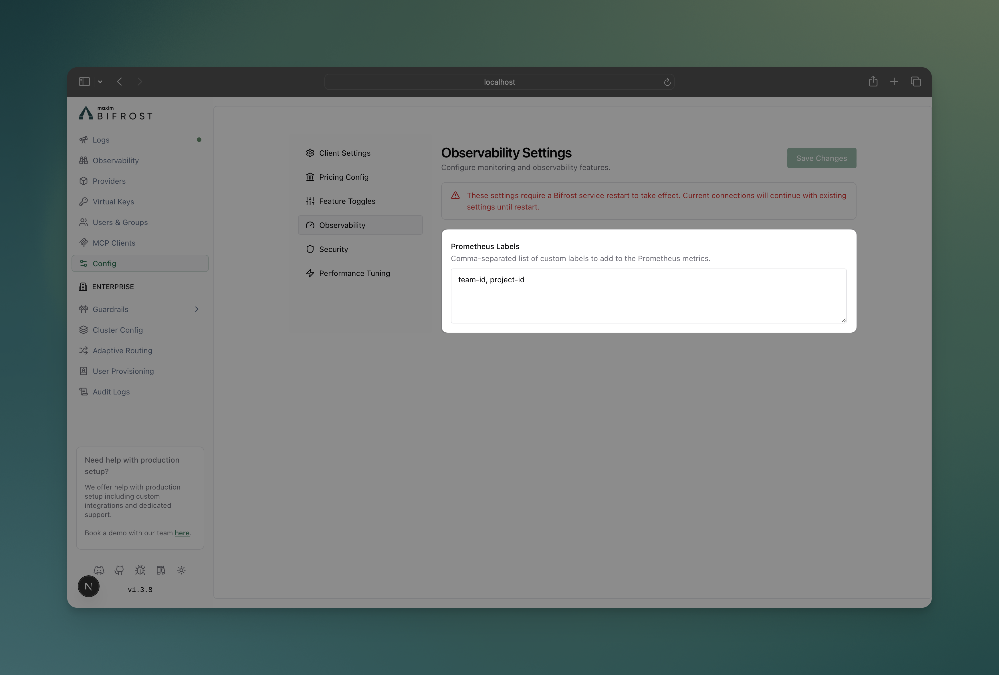

## Overview

Bifrost provides built-in telemetry and monitoring capabilities through Prometheus metrics collection. The telemetry system tracks both HTTP-level performance metrics and upstream provider interactions, giving you complete visibility into your AI gateway's performance and usage patterns.

**Key Features:**

- **Prometheus Integration** - Native metrics collection at `/metrics` endpoint
- **Comprehensive Tracking** - Success/error rates, token usage, costs, and cache performance
- **Custom Labels** - Configurable dimensions for detailed analysis
- **Dynamic Headers** - Runtime label injection via `x-bf-dim-*` headers
- **Cost Monitoring** - Real-time tracking of AI provider costs in USD
- **Cache Analytics** - Direct and semantic cache hit tracking
- **Async Collection** - Zero-latency impact on request processing
- **Multi-Level Tracking** - HTTP transport + upstream provider metrics

The telemetry plugin operates asynchronously to ensure metrics collection doesn't impact request latency or connection performance.

---

## Default Metrics

### HTTP Transport Metrics

These metrics track all incoming HTTP requests to Bifrost:

| Metric                          | Type      | Description                     |
| ------------------------------- | --------- | ------------------------------- |
| `http_requests_total`           | Counter   | Total number of HTTP requests   |
| `http_request_duration_seconds` | Histogram | Duration of HTTP requests       |
| `http_request_size_bytes`       | Histogram | Size of incoming HTTP requests  |
| `http_response_size_bytes`      | Histogram | Size of outgoing HTTP responses |

Labels:

- `path`: HTTP endpoint path
- `method`: HTTP verb (e.g., `GET`, `POST`, `PUT`, `DELETE`)
- `status`: HTTP status code
- custom labels: Custom labels configured in the Bifrost configuration

### Upstream Provider Metrics

These metrics track requests forwarded to AI providers:

| Metric                             | Type      | Description                                                       | Labels                                                |
| ---------------------------------- | --------- | ----------------------------------------------------------------- | ----------------------------------------------------- |
| `bifrost_upstream_requests_total`  | Counter   | Total requests forwarded to upstream providers                    | Base Labels, custom labels                            |
| `bifrost_success_requests_total`   | Counter   | Total successful requests to upstream providers                   | Base Labels, custom labels                            |
| `bifrost_error_requests_total`     | Counter   | Total failed requests to upstream providers                       | Base Labels, `status_code`, custom labels             |
| `bifrost_upstream_latency_seconds` | Histogram | Latency of upstream provider requests                             | Base Labels, `is_success`, custom labels              |
| `bifrost_input_tokens_total`       | Counter   | Total input tokens sent to upstream providers                     | Base Labels, custom labels                            |
| `bifrost_output_tokens_total`      | Counter   | Total output tokens received from upstream providers              | Base Labels, custom labels                            |
| `bifrost_cache_hits_total`         | Counter   | Total cache hits by type (direct/semantic)                        | Base Labels, `cache_type`, custom labels              |
| `bifrost_cost_total`               | Counter   | Total cost in USD for upstream provider requests                  | Base Labels, custom labels                            |
| `bifrost_active_requests`          | Gauge     | LLM requests currently in-flight                                  | `method`                                              |
| `bifrost_provider_key_up`          | Gauge     | Per-key health: `1` after a successful attempt, `0` after a failure | `provider`, `key_id`, `key_name`                    |
| `bifrost_key_rotation_events_total`| Counter   | Key rotations triggered by per-key failures — rate-limit (429), auth (401/403), or billing (402) — one increment per actual swap | `provider`, `requested_model`, `key_id`, `key_name`, `fail_reason` |
| `bifrost_request_retries`          | Histogram | Number of retries used per request (observed once per request; buckets `0,1,2,3,5,10`). | Base Labels |

Base Labels:

- `provider`: AI provider name (e.g., `openai`, `anthropic`, `azure`)
- `model`: Model name (e.g., `gpt-4o-mini`, `claude-3-sonnet`)
- `alias`: Alias resolved to this model (empty if none)
- `method`: Request type (`chat`, `text`, `embedding`, `speech`, `transcription`)
- `virtual_key_id`: Virtual key ID
- `virtual_key_name`: Virtual key name
- `routing_engine_used`: Comma-separated routing engines used (`routing-rule`, `governance`, `loadbalancing`, `model-catalog`, `core`). `core` is emitted when the Bifrost orchestrator itself makes a routing decision — i.e. a fallback transition or a retry transition.
- `routing_rule_id`: Routing rule ID that matched the request
- `routing_rule_name`: Routing rule name that matched the request
- `complexity_tier`: Complexity tier used for routing (`SIMPLE` / `MEDIUM` / `COMPLEX`); empty when no routing rule referenced `complexity_tier`
- `complexity_mechanism`: How the complexity tier was classified (`lexical`, or `skipped` when classification was demanded but produced no tier). The raw complexity score is deliberately not a label — unbounded cardinality; it lives only in the request logs
- `selected_key_id`: ID of the key that successfully served the request (empty string `""` on final errors)
- `selected_key_name`: Name of the key that successfully served the request (empty string `""` on final errors)
- `fallback_index`: Fallback index (0 for first attempt, 1 for second attempt, etc.)
- `team_id` / `team_name`: Team identifiers (empty when governance is not used)
- `customer_id` / `customer_name`: Customer identifiers (empty when governance is not used)
- custom labels: Custom labels configured in the Bifrost configuration

### Streaming Metrics

These metrics capture latency characteristics specific to streaming responses:

| Metric                                       | Type      | Description                                     | Labels      |
| -------------------------------------------- | --------- | ----------------------------------------------- | ----------- |
| `bifrost_stream_first_token_latency_seconds` | Histogram | Time from request start to first streamed token | Base Labels |
| `bifrost_stream_inter_token_latency_seconds` | Histogram | Latency between subsequent streamed tokens      | Base Labels |

### MCP Metrics

These metrics track MCP (Model Context Protocol) tool calls executed through Bifrost:

| Metric                                          | Type      | Description                                                                                                                         | Labels                                                                             |
| ----------------------------------------------- | --------- | --------------------------------------------------------------------------------------------------------------------------------- | ---------------------------------------------------------------------------------- |
| `bifrost_mcp_client_operation_duration_seconds` | Histogram | Duration of an MCP tool call, as observed by Bifrost (the MCP client). `_count` gives call volume; a non-empty `error_type` marks failures. | `mcp_client`, `mcp_tool_name`, `mcp_method`, `error_type`, MCP governance labels, custom labels |

MCP Labels:

- `mcp_client`: MCP server label (client name) the tool belongs to
- `mcp_tool_name`: Tool name invoked
- `mcp_method`: MCP method — `tools/call`
- `error_type`: `auth_required` or `_OTHER` on failure; empty on success
- MCP governance labels: `virtual_key_id` / `virtual_key_name`, `team_id` / `team_name`, `customer_id` / `customer_name`, `business_unit_id` / `business_unit_name`

<Note>
  Only tool executions are recorded — lifecycle operations (`ping` / `list_tools`) and codemode tools are skipped. Unlike the LLM metrics, MCP metrics do **not** carry `provider` / `model` or a `network_transport` label.
</Note>

---

## Monitoring Examples

### Success Rate Monitoring

Track the success rate of requests to different providers:

```promql
# Success rate by provider
rate(bifrost_success_requests_total[5m]) /
rate(bifrost_upstream_requests_total[5m]) * 100
```

### Token Usage Analysis

Monitor token consumption across different models:

```promql
# Input tokens per minute by model
increase(bifrost_input_tokens_total[1m])

# Output tokens per minute by model
increase(bifrost_output_tokens_total[1m])

# Token efficiency (output/input ratio)
rate(bifrost_output_tokens_total[5m]) /
rate(bifrost_input_tokens_total[5m])
```

### Cost Tracking

Monitor spending across providers and models:

```promql
# Cost per second by provider
sum by (provider) (rate(bifrost_cost_total[1m]))

# Daily cost estimate
sum by (provider) (increase(bifrost_cost_total[1d]))

# Cost per request by provider and model
sum by (provider, model) (rate(bifrost_cost_total[5m])) /
sum by (provider, model) (rate(bifrost_upstream_requests_total[5m]))
```

### Cache Performance

Track cache effectiveness:

```promql
# Cache hit rate by type
rate(bifrost_cache_hits_total[5m]) /
rate(bifrost_upstream_requests_total[5m]) * 100

# Direct vs semantic cache hits
sum by (cache_type) (rate(bifrost_cache_hits_total[5m]))
```

### Error Rate Analysis

Monitor error patterns:

```promql
# Error rate by provider
rate(bifrost_error_requests_total[5m]) /
rate(bifrost_upstream_requests_total[5m]) * 100

# Errors by model
sum by (model) (rate(bifrost_error_requests_total[5m]))
```

---

## Configuration

Configure custom Prometheus labels to add dimensions for filtering and analysis:

<Tabs group="config-method">
<Tab title="Web UI">



1. **Navigate to Configuration**
   - Open Bifrost UI at `http://localhost:8080`
   - Go to **Config** tab

2. **Prometheus Labels**
   ```
   Custom Labels: team, environment, organization, project
   ```

</Tab>
<Tab title="API">

```bash
# Update prometheus labels via API
curl -X PATCH http://localhost:8080/config \
  -H "Content-Type: application/json" \
  -d '{
    "client": {
      "prometheus_labels": ["team", "environment", "organization", "project"]
    }
  }'
```

</Tab>
<Tab title="config.json">

```json
{
  "client": {
    "prometheus_labels": ["team", "environment", "organization", "project"],
    "drop_excess_requests": false,
    "initial_pool_size": 300
  }
}
```

</Tab>
</Tabs>

### Dynamic Label Injection

Add custom label values at runtime using `x-bf-dim-*` headers:

```bash
# Add custom labels to specific requests
curl -X POST http://localhost:8080/v1/chat/completions \
  -H "Content-Type: application/json" \
  -H "x-bf-dim-team: engineering" \
  -H "x-bf-dim-environment: production" \
  -H "x-bf-dim-organization: my-org" \
  -H "x-bf-dim-project: my-project" \
  -d '{
    "model": "gpt-4o-mini",
    "messages": [{"role": "user", "content": "Hello!"}]
  }'
```

**Header Format:**
- Prefix: `x-bf-dim-`
- Label name: Any string after the prefix, except reserved metric labels like `path` and `method`
- Value: String value for the label

These runtime dimensions are also forwarded to the other observability backends. The same `x-bf-dim-*` values appear in internal logs, OpenTelemetry span attributes, and Maxim tags.

<Note>
Legacy `x-bf-prom-*` headers still work for Prometheus-only behavior, but they are deprecated. When both prefixes provide the same label, `x-bf-dim-*` wins.
</Note>

---

## Infrastructure Setup

### Development & Testing

For local development and testing, use the provided Docker Compose setup:

```bash
# Navigate to telemetry plugin directory
cd plugins/telemetry

# Start Prometheus and Grafana
docker-compose up -d

# Access endpoints
# Prometheus: http://localhost:9090
# Grafana: http://localhost:3000 (admin/admin)
# Bifrost metrics: http://localhost:8080/metrics
```

<Warning>
  **Development Only**: The provided Docker Compose setup is for testing
  purposes only. Do not use in production without proper security, scaling, and
  persistence configuration.
</Warning>

You can use the Prometheus scraping endpoint to create your own Grafana dashboards. Given below are few examples created using the Docker Compose setup.


### Production Deployment

For production environments:

1. **Deploy Prometheus** with proper persistence, retention, and security
2. **Configure scraping** to target your Bifrost instances at `/metrics`
3. **Set up Grafana** with authentication and dashboards
4. **Configure alerts** based on your SLA requirements

**Prometheus Scrape Configuration:**

```yaml
scrape_configs:
  - job_name: "bifrost-gateway"
    static_configs:
      - targets: ["bifrost-instance-1:8080", "bifrost-instance-2:8080"]
    scrape_interval: 30s
    metrics_path: /metrics
    # If Bifrost auth is enabled, add:
    # basic_auth:
    #   username: '<admin_username>'
    #   password: '<admin_password>'
```

<Info>
  If you have Bifrost authentication enabled (`auth_config`), you must include
  `basic_auth` in the scrape config with your `admin_username` and
  `admin_password`. See the [Prometheus
  docs](/features/observability/prometheus#pull-based-scraping) for details.
</Info>

### Production Alerting Examples

Configure alerts for critical scenarios using the new metrics:

**High Error Rate Alert:**

```yaml
- alert: BifrostHighErrorRate
  expr: sum by (provider) (rate(bifrost_error_requests_total[5m])) / sum by (provider) (rate(bifrost_upstream_requests_total[5m])) > 0.05
  for: 2m
  labels:
    severity: warning
  annotations:
    summary: "High error rate detected for provider {{ $labels.provider }} ({{ $value | humanizePercentage }})"
```

**High Cost Alert:**

```yaml
- alert: BifrostHighCosts
  expr: sum by (provider) (increase(bifrost_cost_total[1d])) > 100 # $100/day threshold
  for: 10m
  labels:
    severity: warning
  annotations:
    summary: 'Daily cost for provider {{ $labels.provider }} exceeds $100 ({{ $value | printf "%.2f" }})'
```

**Cache Performance Alert:**

```yaml
- alert: BifrostLowCacheHitRate
  expr: sum by (provider) (rate(bifrost_cache_hits_total[15m])) / sum by (provider) (rate(bifrost_upstream_requests_total[15m])) < 0.1
  for: 5m
  labels:
    severity: info
  annotations:
    summary: "Cache hit rate for provider {{ $labels.provider }} below 10% ({{ $value | humanizePercentage }})"
```

---

## Next Steps

- **[Prometheus Documentation](https://prometheus.io/docs/)** - Official Prometheus guides
- **[Grafana Setup](https://grafana.com/docs/)** - Dashboard creation and management
- **[Tracing](./observability/default)** - Request/response logging for detailed analysis
