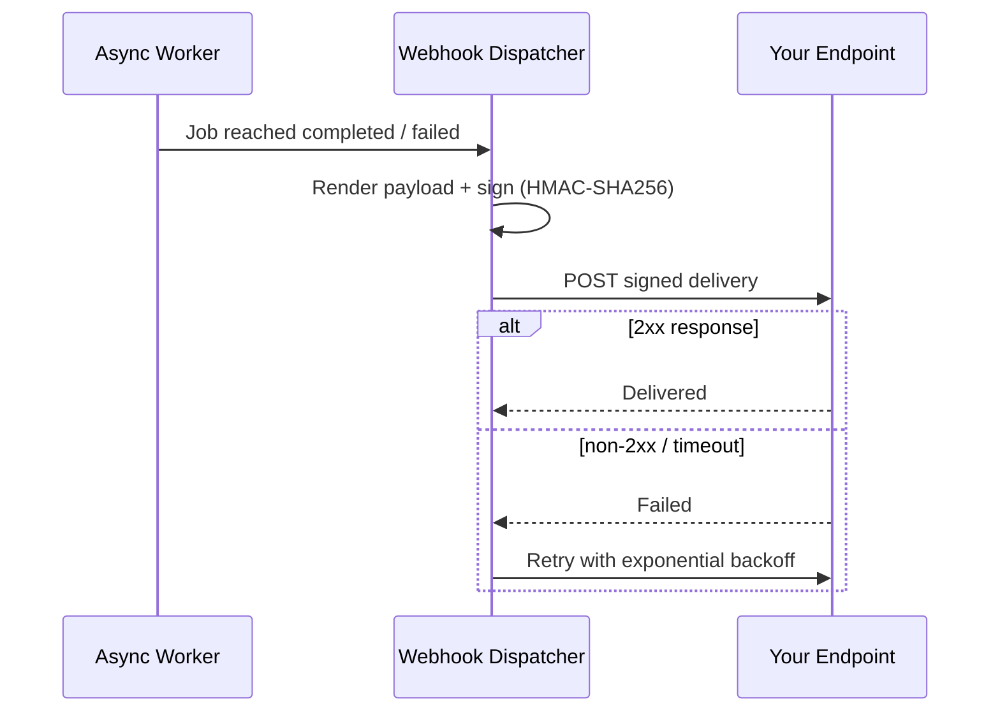

## Overview

Webhooks are the push half of [Async Inference](/features/async-inference). Instead of polling `GET /v1/async/.../{job_id}` until a job reaches a terminal state, register an endpoint once and Bifrost delivers a signed HTTP `POST` the moment the job completes or fails.

Every delivery is signed in the [Standard Webhooks](https://www.standardwebhooks.com/) format so your receiver can verify it came from your Bifrost instance and was not altered in transit.

<Note>
Webhooks fire only for async inference jobs. Like Async Inference, this is a gateway-only feature and requires a Logs Store to be configured.
</Note>

**Events:**

| Event | Fires when |
|---|---|
| `async_job.completed` | An async job finishes successfully. |
| `async_job.failed` | An async job finishes with an error. |

---

## How It Works



Delivery is **at-least-once**: a failed attempt is retried with exponential backoff, and every attempt for the same event reuses the same `webhook-id`. Your receiver must be idempotent — dedupe on `webhook-id`.

---

## The Delivery Payload

Each delivery is a `POST` with a JSON body and three signing headers:

| Header | Meaning |
|---|---|
| `webhook-id` | Unique id for this delivery, and the dedupe key across retries. |
| `webhook-timestamp` | Unix seconds the payload was signed at. |
| `webhook-signature` | Space-separated list of `v1,<base64>` signatures. |

The body:

```json
{
  "event": "async_job.completed",
  "created_at": "2026-02-19T08:10:19.412Z",
  "data": {
    "job_id": "1e89b165-d4fe-49e8-beb2-3e157f2df02f",
    "request_type": "chat_completion",
    "status": "completed",
    "status_code": 200,
    "result_url": "/v1/async/chat/completions/1e89b165-d4fe-49e8-beb2-3e157f2df02f",
    "result_expires_at": "2026-02-19T09:10:19.412Z"
  }
}
```

| Field | Meaning |
|---|---|
| `event` | `async_job.completed` or `async_job.failed`. |
| `data.job_id` | The async job id. |
| `data.status` | `completed` or `failed`. |
| `data.result_url` | Relative path to fetch the full result. `GET` it through Bifrost with your usual auth, before `result_expires_at`. |
| `data.response` | The full job response, inlined only when the endpoint sets `include_response` and the response fits `max_response_payload_kbs`. |
| `data.response_omitted` | `true` when a response was too large to inline; fetch it via `result_url` instead. |
| `data.result_expired` | `true` when the job's result was already gone at delivery time — the outcome is known, but there is nothing left to fetch. |

---

## Verifying Deliveries

Always verify the signature before trusting a delivery. The signature is `HMAC-SHA256` over the exact bytes `{webhook-id}.{webhook-timestamp}.{body}`, keyed with your endpoint's signing secret, encoded as `v1,<base64>`.

To verify a delivery:

1. **Recompute and compare.** Recompute the HMAC from the secret and the received `webhook-id`, `webhook-timestamp`, and raw body, then compare it (in constant time) against every candidate in the `webhook-signature` header. Accept if **any** matches — the header can carry more than one signature during secret rotation.
2. **Check the timestamp.** Reject deliveries whose `webhook-timestamp` is outside a tolerance window (5 minutes is a good default) to blunt replay attacks.
3. **Dedupe on `webhook-id`.** Retries reuse the id, so process each id at most once.

The signing secret (`whsec_...`) is shown **once** when you create the endpoint. Store it where your receiver can read it, and never hard-code it.

<Tip>
The [`examples/webhooks`](https://github.com/maximhq/bifrost/tree/main/examples/webhooks) receiver is a complete, dependency-free Go implementation of this verification you can copy from — its tests pin the same reference vector Bifrost signs with.
</Tip>

---

## Managing Endpoints

<Tabs group="config-method">
<Tab title="Web UI">

Open **Webhooks** in the sidebar to see your endpoints and their status.

<Frame>
  
</Frame>

1. Select **Add Endpoint**.
2. Enter a unique **Name** and the delivery **URL** (HTTPS unless the endpoint allows private networks).
3. Choose the **events** to subscribe to (`async_job.completed`, `async_job.failed`).
4. Optionally add custom **headers** (for example an `Authorization` value your receiver requires) and toggle **Include response** to inline job responses.

<Frame>
  
</Frame>

5. Save. The **signing secret is shown once** in a dialog — copy it now; you cannot retrieve it again.

<Frame>
  
</Frame>

6. Open an endpoint to view its **delivery history**, send a **Test** delivery, or **Rotate secret** if a secret is ever exposed. Rotation takes effect immediately with no grace window, so update your receiver in the same change.

<Frame>
  
</Frame>

</Tab>
<Tab title="API">

Create an endpoint. The signing secret is **server-generated** and returned once in the create response — it is never accepted as input.

```bash
curl -X POST http://localhost:8080/api/webhooks \
  -H "Content-Type: application/json" \
  -d '{
    "name": "order-events",
    "url": "https://example.com/webhook",
    "events": ["async_job.completed", "async_job.failed"],
    "include_response": false
  }'
```

Other operations:

| Method | Path | Purpose |
|---|---|---|
| `GET` | `/api/webhooks` | List endpoints (supports search, event, and status filters). |
| `POST` | `/api/webhooks` | Create an endpoint; returns the signing secret once. |
| `GET` | `/api/webhooks/{id}` | Get one endpoint. |
| `PUT` | `/api/webhooks/{id}` | Update an endpoint. The secret is immutable here. |
| `DELETE` | `/api/webhooks/{id}` | Delete an endpoint. |
| `POST` | `/api/webhooks/{id}/rotate-secret` | Rotate the signing secret; returns the new secret once. |
| `POST` | `/api/webhooks/{id}/test` | Send a test delivery for a chosen event. |
| `GET` | `/api/webhooks/{id}/deliveries` | List delivery history for the endpoint. |
| `POST` | `/api/webhooks/deliveries/{id}/redeliver` | Re-queue a past delivery. |

<Note>
The secret is never returned again after creation or rotation, and cannot be set or changed through the create/update body. Rotating is the only way to change it.
</Note>

</Tab>
<Tab title="config.json">

Declare endpoints under the top-level `webhooks` array. They are synced into the database at startup and reconciled by `name`.

```json
{
  "webhooks": [
    {
      "name": "order-events",
      "url": "https://example.com/webhook",
      "events": ["async_job.completed", "async_job.failed"],
      "secret": "env.WEBHOOK_SIGNING_SECRET",
      "include_response": false
    }
  ]
}
```

| Field | Type | Required | Description |
|---|---|---|---|
| `name` | string | Yes | Unique endpoint name; the reconcile key. |
| `url` | string | Yes | Delivery URL. HTTPS required unless `allow_private_network` is set. |
| `events` | array | Yes | Subscribed events: `async_job.completed`, `async_job.failed`. |
| `secret` | string | No | Signing secret in `whsec_` format. Best supplied as an env reference (`env.MY_VAR`); generated when omitted. |
| `headers` | object | No | Custom headers sent with every delivery. Values support `env.VAR` syntax and are encrypted at rest when `encryption_key` is configured. Reserved delivery headers cannot be overridden. |
| `include_response` | boolean | No | Inline the job response into payloads (default `false`). |
| `allow_private_network` | boolean | No | Permit private-network receivers and plain `http` (default `false`). |
| `disabled` | boolean | No | Register the endpoint without delivering to it (default `false`). |

<Note>
`config.json` is the only place you can supply your own signing secret, and an `env.` reference is the recommended form. Prefer creating endpoints through the UI or API so the secret is generated for you.
</Note>

The global retention setting lives under `client`:

```json
{
  "client": {
    "webhook_config": {
      "delivery_history_retention_days": 30
    }
  }
}
```

</Tab>
</Tabs>

---

## Tuning Deliveries

Each endpoint exposes per-endpoint controls. All are optional and fall back to the defaults below.

| Field | Default | Description |
|---|---|---|
| `max_retries` | `4` | Retries after the first failed attempt. |
| `retry_backoff_initial_seconds` | `30` | Delay before the first retry; each further retry doubles it. |
| `retry_backoff_max_seconds` | `1800` | Cap on the per-retry delay. |
| `attempt_timeout_seconds` | `10` | End-to-end bound for a single delivery attempt. |
| `max_response_payload_kbs` | `256` | Cap for inlined responses when `include_response` is set. Oversized responses are omitted and flagged with `response_omitted`. |
| `max_concurrent_deliveries` | `10` | Concurrent in-flight deliveries to this endpoint, per node. |

---

## Next Steps

- **[Async Inference](/features/async-inference)** — submit jobs and poll for results; webhooks notify you when those jobs finish.
- **[Keys Management](/features/keys-management)** — manage the virtual keys used to submit async jobs and fetch results.
