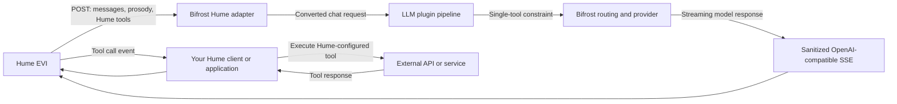

## Overview

Bifrost can serve as the [custom language model](https://dev.hume.ai/docs/speech-to-speech-evi/guides/custom-language-model) for Hume's Empathic Voice Interface (EVI). Hume handles the real-time voice experience and sends the conversation to Bifrost. Bifrost routes each request to a configured language-model provider and streams an OpenAI-compatible response back to Hume.

The integration keeps the normal Bifrost inference pipeline: provider routing, fallbacks, virtual keys, governance, LLM plugins, logging, and observability all remain available.

Use this endpoint in Hume:

```text
https://<YOUR-BIFROST-HOST>/hume/v1/chat/completions
```

<Note>
The endpoint must be reachable from Hume over public HTTPS. Bifrost supports Hume's recommended Server-Sent Events (SSE) interface; the legacy custom-language-model WebSocket interface is not supported.
</Note>

## How the integration works



For Hume streaming requests, Bifrost preserves tools sent by Hume but deliberately does not inject Bifrost MCP tools. Hume streams do not enter Bifrost's non-streaming MCP agent executor, so advertising an MCP tool would leave its call without a Bifrost execution path. See [Function tools and MCP](#function-tools-and-mcp).

## Prerequisites

Before configuring Hume, make sure you have:

- A running Bifrost HTTP gateway.
- At least one [configured provider and API key](/quickstart/gateway/provider-configuration).
- A public hostname with a valid TLS certificate. A secure tunnel is suitable for local development, but use a stable deployment URL in production.
- A Hume account with an EVI configuration you can edit.
- A Bifrost virtual key if [authentication is enforced on inference routes](/quickstart/gateway/setting-up-auth).

## Quick setup

<Steps>
  <Step title="Configure a model in Bifrost">
    Add the provider and provider key that should serve Hume requests. Test the model through Bifrost's ordinary `/v1/chat/completions` endpoint before adding Hume.
  </Step>
  <Step title="Choose the model-selection strategy">
    Either set a Bifrost `hume.default_model`, set Hume's **Custom language model identifier**, or do both. When both are set, Hume's identifier wins.
  </Step>
  <Step title="Expose Bifrost over public HTTPS">
    Confirm that `https://<YOUR-BIFROST-HOST>/hume/v1/chat/completions` is reachable from outside your network and that your reverse proxy does not buffer SSE responses.
  </Step>
  <Step title="Create or edit the Hume EVI configuration">
    In the Hume Platform, select **Custom language model**, enter the Bifrost endpoint URL, and optionally enter a model identifier such as `openai/gpt-4o-mini`.
  </Step>
  <Step title="Provide the Bifrost credential">
    If Bifrost requires inference authentication, have your Hume client send a `session_settings` message containing a Bifrost virtual key in `language_model_api_key`.
  </Step>
  <Step title="Verify text and tool streaming">
    Test the endpoint directly, then start a session in the EVI Playground or your application. Confirm that text arrives incrementally and that every tool-enabled turn produces at most one tool call.
  </Step>
</Steps>

## Configure Bifrost

### Configure the provider

Hume does not supply an upstream provider credential. Configure provider keys in Bifrost as you would for any other inference route. The Hume adapter can then use any provider/model combination that supports the request.

For voice conversations, prefer a model with reliable streaming, low time-to-first-token, and good instruction-following. If you use Hume tools, the model must also support function calling and a provider wire format that can enforce one tool call at a time.

### Configure the Hume adapter

The Hume routes are always registered. If Hume always supplies a custom language model identifier, you can omit the top-level `hume` object entirely.

Add a `hume` object when you want a default model or prosody-aware prompt injection:

```json
{
  "$schema": "https://www.getbifrost.ai/schema",
  "hume": {
    "default_model": "openai/gpt-4o-mini",
    "prosody_prompt": {
      "enabled": false,
      "scope": "latest_user",
      "max_emotions": 3
    }
  }
}
```

`default_model` is optional, so a prosody-only `hume` object is valid when Hume always supplies its model identifier. When set, it must contain a non-whitespace value. Restart Bifrost after changing these settings.

| Field | Default | Behavior |
| --- | --- | --- |
| `hume.default_model` | None | Provider/model string, such as `openai/gpt-4o-mini`, or a model-catalog-resolvable name. Used only when Hume omits its custom language model identifier. |
| `hume.prosody_prompt.enabled` | `false` | Converts selected Hume expression scores into deterministic prompt text. Typed metadata remains available to Go LLM plugins when disabled. |
| `hume.prosody_prompt.scope` | `latest_user` | Accepts `latest_user` or `all_user_messages`. |
| `hume.prosody_prompt.max_emotions` | `3` | Maximum number of highest-confidence expressions included per selected message. Set to `0` to include all scores. |

### Model selection precedence

Bifrost resolves the provider and model in this order:

1. Hume's **Custom language model identifier**, sent in the request's `model` field.
2. `hume.default_model` from Bifrost configuration.
3. HTTP 400 if neither value exists.

Use a `provider/model` identifier when you want deterministic provider selection. An unprefixed model name can be resolved through Bifrost's model catalog and routing behavior.

### Available routes

| Method | Route | Status |
| --- | --- | --- |
| `POST` | `/hume/v1/chat/completions` | Recommended |
| `POST` | `/hume/chat/completions` | Compatibility alias |

Both routes use the same middleware and adapter behavior. New Hume configurations should use the versioned route.

## Configure Hume

Hume recommends an OpenAI-compatible `POST /chat/completions` endpoint that streams SSE. The Bifrost route implements this contract directly.

In the Hume Platform:

1. Open an existing EVI configuration or create a new one.
2. In the language-model setup step, select **Custom language model**.
3. Set the custom language model URL to:

   ```text
   https://<YOUR-BIFROST-HOST>/hume/v1/chat/completions
   ```

4. Set **Custom language model identifier** to the Bifrost model you want, for example `anthropic/claude-sonnet-4-5` or `openai/gpt-4o-mini`.
5. If `hume.default_model` is configured in Bifrost, you may leave the identifier empty.
6. Attach any Hume function tools required by the conversation.
7. Save the configuration and use its configuration ID when starting an EVI session.

<Tip>
Keep the provider prefix in the model identifier while testing. It makes routing failures easier to diagnose and avoids ambiguity when multiple providers expose the same model name.
</Tip>

## Authentication and governance

Hume can forward one custom-language-model secret as a bearer token. This is a good fit for a Bifrost virtual key.

### Require authentication in Bifrost

For production, require authentication on inference endpoints:

```json
{
  "client": {
    "enforce_auth_on_inference": true
  }
}
```

Create a [virtual key](/features/governance/virtual-keys) that permits the provider and model selected for Hume. You can attach budgets, rate limits, model allow-lists, and routing policies to that key.

### Send the key from the Hume client

When the EVI session begins, send a `session_settings` message containing the Bifrost virtual key:

```json
{
  "type": "session_settings",
  "language_model_api_key": "<YOUR-BIFROST-VIRTUAL-KEY>"
}
```

Hume forwards the value to Bifrost as:

```http
Authorization: Bearer <YOUR-BIFROST-VIRTUAL-KEY>
```

`language_model_api_key` is the credential for the custom language model endpoint. It is separate from the Hume API key used by your application to connect to Hume.

If inference authentication is disabled in Bifrost, the Hume session can omit `language_model_api_key`. Do not expose an unauthenticated production gateway unless that is an intentional deployment policy.

## Function tools and MCP

Hume custom language models use the OpenAI function-calling format. Bifrost preserves all of the following across request conversion:

- Hume's tool definitions.
- `tool_choice`.
- Assistant tool-call history.
- Tool-result history.
- Streaming tool-call deltas returned by the model.

LLM plugins still run normally and may intentionally add, modify, or remove Hume tools before the provider request is made.

### Tool execution ownership

Hume or the application connected to Hume is responsible for executing Hume-configured tools and returning tool results to the EVI session. Bifrost only routes the model request and preserves the function-calling data.

<Warning>
Bifrost does not automatically inject configured MCP tools into Hume streaming requests. The `x-bf-mcp-include-*` headers do not override this policy. Use Hume-configured tools for Hume sessions, or build an application-level bridge that exposes the desired operation as a Hume tool.
</Warning>

Other routes retain their existing MCP behavior: eligible non-Hume streams can still receive injected tools, while non-streaming chat requests can enter Bifrost's MCP agent loop.

### One tool call at a time

[Hume does not support parallel function calling](https://dev.hume.ai/docs/speech-to-speech-evi/features/tool-use). Bifrost applies the single-call constraint after LLM plugins finish, so it covers both Hume-origin and plugin-added tools.

Provider handling is intentionally strict:

- Anthropic-family request formats use their native serial-tool setting.
- OpenAI-compatible request formats send `parallel_tool_calls: false` unless the model's catalog entry explicitly lacks that parameter. Models absent from the catalog (self-hosted and custom OpenAI-compatible deployments) are assumed to accept it. Key aliases are checked against the model they resolve to, not only the alias name.
- If the provider wire format cannot express a single-call constraint (for example Vertex Gemini and Gemma models, including all-digit fine-tuned endpoint IDs), or a catalog entry explicitly lacks support, Bifrost returns HTTP 400 instead of risking a parallel tool response that Hume cannot process.
- The response adapter also rejects a response containing more than one tool call.

If a model works for ordinary Hume conversations but fails only when tools are attached, choose a model/provider combination with verified serial function-calling support.

## Prosody-aware prompting

Hume adds per-message timing and vocal-expression confidence scores to the conversation history. By default, Bifrost keeps this metadata out of the provider request so the original message text remains unchanged.

You can consume the data in one of two ways:

1. Enable Bifrost's built-in prompt transformation.
2. Read typed metadata in a Go LLM plugin and apply your own policy.

### Built-in prompt transformation

Enable it in `config.json`:

```json
{
  "hume": {
    "default_model": "openai/gpt-4o-mini",
    "prosody_prompt": {
      "enabled": true,
      "scope": "latest_user",
      "max_emotions": 3
    }
  }
}
```

When at least one selected user message has scores, Bifrost:

- Adds a stable system instruction after any leading system or developer messages.
- Appends a `<hume_vocal_expression>` JSON tag to selected user messages.
- Sorts expressions by confidence, with labels used as deterministic tie-breakers.
- Rounds confidence scores to three decimal places.
- Keeps at most `max_emotions` expressions unless it is `0`.

Choose the scope based on token usage and provider prompt caching:

| Scope | Selection | Trade-off |
| --- | --- | --- |
| `latest_user` | The latest user message only, and only when that message has scores. | Lowest token cost. Because the newest transformed message changes each turn, prefix-cache reuse may decrease. |
| `all_user_messages` | Every user message that has expression scores. | Higher token cost, but older transformed history stays deterministic when Hume resends unchanged scores. |

The instruction tells the model that scores represent perceived vocal expression—not verified internal feelings—and should influence the response subtly.

### Read typed metadata in a plugin

The adapter stores request-only metadata in `BifrostChatRequest.IntegrationMetadata`. It is never serialized directly to the provider. A Go LLM plugin can retrieve it with:

```go
metadata, ok := schemas.GetChatIntegrationMetadata[*schemas.HumeChatRequestMetadata](request.ChatRequest)
if ok {
    sessionID := metadata.CustomSessionID
    messageMetadata := metadata.Messages // keyed by provider-bound message index
    _ = sessionID
    _ = messageMetadata
}
```

Each `HumeMessageMetadata` entry can contain `Time.Begin`, `Time.End`, and a map of prosody scores. Times are expressed in milliseconds. When built-in prompt injection inserts its system instruction, Bifrost shifts the metadata indexes so they continue to match the provider-bound message list.

## Session continuity

Hume sends `custom_session_id` as a query parameter to SSE custom-language-model endpoints:

```text
POST /hume/v1/chat/completions?custom_session_id=<SESSION-ID>
```

Bifrost validates the supplied ID as UTF-8 and limits it to 255 bytes. If Hume omits it, Bifrost generates a UUID.

Every response chunk carries the resolved ID in `system_fingerprint`. Bifrost replaces any upstream provider fingerprint with this session ID so provider-specific values cannot break Hume session continuity. The adapter does not persist session state itself; conversation history continues to come from Hume.

## Request and response contract

### Request behavior

| Input | Bifrost behavior |
| --- | --- |
| `stream` omitted | Sets it to `true`. |
| `stream: true` | Accepted. |
| `stream: false` | Rejected; Hume routes are streaming-only. |
| `n` omitted | Sets it to `1`. |
| `n: 1` | Accepted. |
| Any other `n` | Rejected; Hume consumes one conversational branch. |
| `model` | Used as the custom language model identifier and takes precedence over `hume.default_model`. |
| `messages` | Converts OpenAI-compatible conversation history while separately retaining Hume timing and prosody metadata. |
| `tools` and `tool_choice` | Preserved by the adapter; plugins may intentionally mutate them, but Bifrost MCP tools are not added. |
| `custom_session_id` query parameter | Validated and echoed through `system_fingerprint`. |

### Response behavior

Successful responses use `Content-Type: text/event-stream`. Bifrost emits OpenAI-compatible `data:` events incrementally and finishes the stream with:

```text
data: [DONE]
```

The Hume adapter returns only the chat-stream fields Hume needs: response ID, choices, creation time, model, object type, the session fingerprint, and optional token usage. Bifrost-only fields and raw provider payloads are not exposed through the Hume response.

Request-time errors returned before streaming begins use a JSON envelope with an `error` object and the relevant HTTP status code.

## Verify the endpoint

Test Bifrost before connecting it to Hume. This separates endpoint, authentication, provider, and SSE issues from EVI configuration issues.

### Test with curl

`-N` disables curl's output buffering so you can see chunks arrive:

```bash
curl -N \
  -X POST \
  "https://<YOUR-BIFROST-HOST>/hume/v1/chat/completions?custom_session_id=hume-test-123" \
  -H "Authorization: Bearer <YOUR-BIFROST-VIRTUAL-KEY>" \
  -H "Content-Type: application/json" \
  -d '{
    "model": "openai/gpt-4o-mini",
    "stream": true,
    "messages": [
      {
        "role": "user",
        "content": "Reply with one short greeting.",
        "time": {"begin": 0, "end": 1000},
        "models": {
          "prosody": {
            "scores": {"Interest": 0.82, "Joy": 0.41}
          }
        }
      }
    ]
  }'
```

If inference authentication is disabled, remove the `Authorization` header.

Verify that:

- The status is HTTP 200.
- `Content-Type` is `text/event-stream`.
- Multiple `data:` events arrive before the request completes.
- Each JSON chunk contains `"system_fingerprint":"hume-test-123"`.
- The final event is `data: [DONE]`.

### Test with the OpenAI Python SDK

The versioned Hume route is compatible with an OpenAI SDK base URL ending in `/hume/v1`:

```python
import asyncio
from openai import AsyncOpenAI

client = AsyncOpenAI(
    base_url="https://<YOUR-BIFROST-HOST>/hume/v1",
    api_key="<YOUR-BIFROST-VIRTUAL-KEY>",
    default_query={"custom_session_id": "hume-test-123"},
)

async def main():
    stream = await client.chat.completions.create(
        model="openai/gpt-4o-mini",
        messages=[
            {"role": "user", "content": "Reply with one short greeting."}
        ],
        stream=True,
    )

    async for chunk in stream:
        print(chunk.system_fingerprint, chunk.choices)

asyncio.run(main())
```

For a gateway without inference authentication, the OpenAI SDK still requires a non-empty client-side `api_key`; use a placeholder value and ensure your deployment intentionally ignores the resulting bearer header.

### Verify in Hume

After the direct endpoint test passes:

1. Start a session in the EVI Playground or your application using the updated Hume configuration.
2. Confirm speech begins without waiting for the entire model response.
3. Confirm Bifrost logs show the intended provider/model and virtual key.
4. Continue for several turns and confirm the same custom session ID is reused.
5. If tools are configured, trigger one and confirm your Hume client receives, executes, and answers exactly one tool call.

## Production recommendations

- Use a stable public hostname and valid TLS certificate.
- Disable response buffering for this route in reverse proxies, load balancers, and CDNs.
- Require inference authentication and use a dedicated virtual key for Hume.
- Apply provider/model allow-lists, rate limits, and budgets to the Hume virtual key.
- Choose a low-latency streaming model and verify function calling separately if tools are enabled.
- Configure Bifrost fallbacks only to models that satisfy the same streaming and tool constraints.
- Monitor time-to-first-token, provider errors, stream interruptions, and tool-call failures.
- Keep prosody prompt injection disabled until you have evaluated its conversational behavior and token cost for your application.

## Limitations

- Hume routes support SSE only, not the legacy WebSocket custom-language-model protocol.
- Requests are streaming-only and limited to one completion.
- Hume can process only one function call at a time.
- Hume requests carry a reserved skip-MCP-injection flag that LLM plugins cannot unset, so Bifrost MCP tools are never added to them.
- The Hume adapter does not execute Hume tools or persist conversation state.
- Changes to the top-level Bifrost `hume` configuration require a restart.

## Troubleshooting

| Symptom | Likely cause | Resolution |
| --- | --- | --- |
| HTTP 400 says the custom language model identifier is missing | Neither Hume's identifier nor `hume.default_model` is set. | Set **Custom language model identifier** in Hume or configure `hume.default_model`. |
| HTTP 400 says Hume requests must use streaming | A caller explicitly sent `stream: false`. | Send `stream: true` or omit the field. |
| HTTP 400 says exactly one completion is required | The request explicitly sets `n` to any value other than `1`, including `0` or a negative value. | Set `n: 1` or omit it. |
| HTTP 400 says the provider/model cannot guarantee serial tool execution | Tools are present, but the selected provider wire format cannot express serial tool calling, or a catalog entry explicitly lacks support. | Choose a supported tool-calling model/provider or remove tools for that configuration. |
| HTTP 401 or 403 | The Bifrost virtual key is missing, invalid, disabled, or not allowed to use the selected provider/model. | Send it through `language_model_api_key` and inspect the key's governance policy. |
| Hume cannot connect, but local curl works | The URL is not publicly reachable, TLS is invalid, or a firewall blocks Hume. | Test from outside your network and use a public HTTPS endpoint. |
| Text arrives only after the full response | A reverse proxy or CDN is buffering SSE. | Disable proxy buffering and verify chunks with `curl -N`. |
| A Hume tool is advertised but never executed | Tool execution was not implemented in the Hume-connected application. | Handle Hume tool-call events, execute the operation, and send the tool response back to Hume. |
| A Bifrost MCP tool is missing | MCP auto-injection is intentionally disabled for Hume streams. | Define the operation as a Hume tool or implement an application-level bridge. |
| Prosody has no effect | Prompt injection is disabled, the selected message has no scores, or a plugin ignores the metadata. | Enable `hume.prosody_prompt.enabled` or inspect typed metadata in an LLM plugin. |
| The stream fails when a model returns tools | The model emitted parallel calls or an unsupported tool-call shape. | Use a model with verified serial function calling and ensure the prompt does not request parallel work. |

## Related documentation

- [Hume: Custom language model](https://dev.hume.ai/docs/speech-to-speech-evi/guides/custom-language-model)
- [Hume: Tool use](https://dev.hume.ai/docs/speech-to-speech-evi/features/tool-use)
- [Configure Bifrost providers](/quickstart/gateway/provider-configuration)
- [Bifrost authentication](/quickstart/gateway/setting-up-auth)
- [Bifrost virtual keys](/features/governance/virtual-keys)
- [Bifrost streaming](/quickstart/gateway/streaming)
