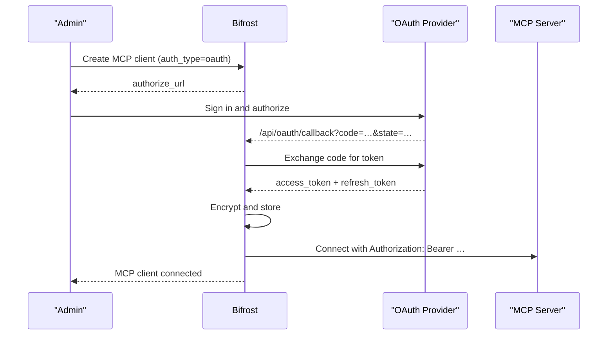

## Overview

`auth_type: "oauth"` covers **server-level OAuth**: the admin authenticates once during MCP client setup, Bifrost stores the resulting token, and every subsequent request to that MCP server uses the same token regardless of which caller hit Bifrost.

If you need each end-user to authenticate themselves (personal Notion workspace, personal GitHub repos, etc.), use [Per-User OAuth](./per-user-oauth) instead.

This auth type is only valid for **HTTP** and **SSE** connections.

What Bifrost handles for you:

- **Automatic token refresh** before expiration
- **PKCE** for public clients (no client secret)
- **Dynamic Client Registration** (RFC 7591)
- **OAuth discovery** from server URLs (`.well-known/oauth-authorization-server`, `.well-known/openid-configuration`)
- **Secure token storage** (encrypted at rest)

---

## OAuth flow

Bifrost implements the **Authorization Code** flow:



---

## Configuration

<Tabs>
<Tab title="Web UI">

1. Navigate to **MCP Gateway** and click **New MCP Server**
2. Pick **HTTP** or **SSE** as the connection type, fill in the **Connection URL**
3. Set **Auth Type** to **OAuth 2.0**
4. Fill in the OAuth fields:
   - **Client ID** (optional — leave blank for Dynamic Client Registration)
   - **Client Secret** (optional — omit for PKCE public clients)
   - **Authorize URL** (optional — leave blank to use OAuth discovery)
   - **Token URL** (optional — same)
   - **Scopes** (comma-separated)
5. Click **Create** — Bifrost runs the OAuth dance in a popup
6. Sign in and authorize on the upstream provider
7. The popup closes and the MCP client is persisted with the token

<Frame>
  
</Frame>

</Tab>
<Tab title="API">

```bash
curl -X POST http://localhost:8080/api/mcp/client \
  -H "Content-Type: application/json" \
  -d '{
    "name": "authenticated-service",
    "connection_type": "http",
    "connection_string": "https://api.example.com/mcp",
    "auth_type": "oauth",
    "oauth_config": {
      "client_id": "your-client-id",
      "client_secret": "your-client-secret",
      "authorize_url": "https://auth.example.com/oauth/authorize",
      "token_url": "https://auth.example.com/oauth/token",
      "scopes": ["mcp:read", "mcp:write"]
    },
    "tools_to_execute": ["*"]
  }'
```

Response:

```json
{
  "status": "pending_oauth",
  "message": "OAuth authorization required",
  "oauth_config_id": "oauth_cfg_abc123",
  "authorize_url": "https://auth.example.com/oauth/authorize?client_id=…&state=…",
  "expires_at": "2026-05-30T12:30:00Z",
  "mcp_client_id": "mcp_client_abc123",
  "complete_url": "/api/mcp/client/oauth_cfg_abc123/complete-oauth",
  "status_url": "/api/oauth/config/oauth_cfg_abc123/status",
  "next_steps": [
    "1. Open authorize_url in a browser to approve access",
    "2. Poll status_url to check when status becomes 'authorized'",
    "3. POST complete_url to activate the MCP client"
  ]
}
```

Redirect the admin to `authorize_url`. After they authorize, the upstream redirects to `/api/oauth/callback`, Bifrost exchanges the code for tokens, and you finalize the client by POSTing `complete_url`:

```bash
curl -X POST http://localhost:8080/api/mcp/client/oauth_cfg_abc123/complete-oauth
```

<Note>
The path parameter of `complete-oauth` is the **`oauth_config_id`** from the response above — not the MCP client ID. Poll `status_url` until it reports `"authorized"` before calling it.
</Note>

</Tab>
<Tab title="config.json">

Declare the client with an inline `oauth_config` block:

```json
{
  "mcp": {
    "client_configs": [
      {
        "name": "authenticated-service",
        "connection_type": "http",
        "connection_string": "https://api.example.com/mcp",
        "auth_type": "oauth",
        "oauth_config": {
          "client_id": "your-client-id",
          "client_secret": "your-client-secret",
          "scopes": ["mcp:read"]
        },
        "tools_to_execute": ["*"]
      }
    ]
  }
}
```

The `oauth_config` block itself is optional, and every inner field is optional. `authorize_url` / `token_url` come from RFC 8414 discovery off `connection_string` when the upstream supports it, and `client_id` / `client_secret` can be obtained via RFC 7591 Dynamic Client Registration. The minimum viable declaration is `{ "auth_type": "oauth", "connection_string": "..." }`.

<Note>
`client_id` and `client_secret` support `env.VAR_NAME` and `vault.path` references — `"client_secret": "env.GITHUB_SECRET"` resolves from the environment at runtime, and the reference (not the resolved secret) is what gets stored. Plain values also work (encrypted at rest, redacted in API responses). The other fields (`authorize_url`, `token_url`, `registration_url`, `scopes`) take literal values only.
</Note>

At boot the client lands in **`pending_verification`** state because the OAuth flow still needs a live admin browser session to complete. From the MCP Gateway UI, open the client and click **Authorize** — the same browser popup the Web UI Create flow uses. On success the OAuth tokens are stored, the tool list is discovered, and the client transitions to `connected`.

The same flow is scriptable: `POST /api/mcp/client/{id}/initiate-verification` (this time `{id}` *is* the MCP client ID) returns the same `authorize_url` / `status_url` / `complete_url` payload as the create flow above — open `authorize_url` in a browser, poll `status_url`, then POST `complete_url`. Safe to call again if a previous attempt expired or was abandoned.

Once authorized, the OAuth credentials live in the encrypted `oauth_configs` table and the `pending_oauth_config_json` stash is cleared from the row; see [Token management](#token-management).

**Lifecycle across restarts and config edits:** the authorized state is server-side and survives restarts and config.json re-syncs. Mutable fields (tool lists, headers, pricing, etc.) can be edited freely in config.json. Immutable fields — `auth_type`, `connection_type`, `connection_string`, `stdio_config`, and the `oauth_config` block — cannot be changed after creation: file edits to them are **ignored**, matching the update API (which does not accept them), and Bifrost logs a warning naming the ignored fields at the next boot. To change any of them, delete the client, update the file entry, and restart (see [Rotation](#token-management)).

</Tab>
</Tabs>

---

## PKCE for public clients

For applications without a client secret, omit `client_secret` and Bifrost will automatically generate PKCE code verifiers:

```json
{
  "oauth_config": {
    "client_id": "your-public-client-id",
    "authorize_url": "https://auth.example.com/oauth/authorize",
    "token_url": "https://auth.example.com/oauth/token",
    "scopes": ["mcp:read"]
  }
}
```

---

## Dynamic Client Registration (RFC 7591)

If your OAuth provider supports DCR, omit `client_id` and `client_secret` and provide a `registration_url` (or just a `server_url` for discovery):

```json
{
  "oauth_config": {
    "registration_url": "https://auth.example.com/oauth/register",
    "server_url":       "https://api.example.com",
    "resource":         "https://api.example.com",
    "scopes": ["mcp:read", "mcp:write"]
  }
}
```

Bifrost will:

1. Discover OAuth endpoints from `server_url` (if needed)
2. Send the OAuth `resource` indicator during authorization and token exchange only when `resource` is provided.
3. Register a new client via `registration_url`
4. Continue with the standard authorize / token exchange flow

<Warning>
The `redirect_uri` Bifrost registers with the upstream provider is locked to Bifrost's current public URL (`mcp_external_client_url`, or the request `Host` header if unset). If you change Bifrost's public URL later, the upstream provider will reject the next authorize call with **"Invalid redirect URI"**. To recover, clear the stored client credentials for the affected MCP server so Bifrost re-runs DCR with the new URL.
</Warning>

---

## OAuth discovery

If only `client_id` and `server_url` are provided, Bifrost will probe in order:

1. `<server_url>/.well-known/oauth-authorization-server` (RFC 8414)
2. `<server_url>/.well-known/openid-configuration`
3. MCP server metadata returned by the server itself

```json
{
  "oauth_config": {
    "client_id":  "your-client-id",
    "server_url": "https://api.example.com",
    "scopes":     ["mcp:read"]
  }
}
```

---

## Token management

### Status

```bash
curl http://localhost:8080/api/oauth/config/oauth_cfg_abc123/status
```

```json
{
  "id": "oauth_cfg_abc123",
  "status": "authorized",
  "created_at": "2026-05-20T10:00:00Z",
  "expires_at": "2026-05-27T10:00:00Z",
  "token_id": "oauth_token_xyz",
  "token_expires_at": "2026-05-22T10:00:00Z",
  "token_scopes": ["mcp:read", "mcp:write"]
}
```

Status values:
- `pending` — admin hasn't authorized yet
- `authorized` — token is valid and active
- `failed` — authorization failed or token is invalid
- `revoked` — the token was revoked (via DELETE); the config row is retained with no live token

### Automatic refresh

Bifrost refreshes access tokens automatically using the stored refresh token, in two layers:

- **In the background** — a worker periodically refreshes tokens that are about to expire, so active clients always have a valid token ready.
- **On use** — if a token is already expired when a request needs it, Bifrost refreshes it inline before forwarding the request.

Background refresh only runs while the MCP client is enabled. Disabling a client pauses it; on re-enable, the token is refreshed on first use. If a client stays disabled long enough for the provider to expire the idle refresh token, re-authorization is required.

### Rotation

Editing `oauth_config` after setup is not currently supported — the edit flow rejects it (`connection_type`, `auth_type`, and `connection_string` are likewise immutable after creation). To change OAuth credentials, scopes, or endpoints: delete the client and recreate it (UI or API). For a config.json-declared client, delete it from the dashboard, update the `oauth_config` block in the file, and restart — the client re-enters `pending_verification` and can be authorized with the new options.

### Revoke

```bash
curl -X DELETE http://localhost:8080/api/oauth/config/oauth_cfg_abc123
```

This deletes the stored token from Bifrost and marks the OAuth configuration `revoked` (the config row is kept, not deleted). Bifrost does **not** call the upstream provider's revocation endpoint — revoke at the provider's dashboard if you need the upstream token invalidated there.

---

## Provider snippets

### GitHub

<Tabs>
<Tab title="Configuration">

```json
{
  "oauth_config": {
    "client_id":     "your-github-app-id",
    "client_secret": "your-github-app-secret",
    "authorize_url": "https://github.com/login/oauth/authorize",
    "token_url":     "https://github.com/login/oauth/access_token",
    "scopes":        ["repo", "user"]
  }
}
```

</Tab>
<Tab title="Provider setup">

1. GitHub → **Settings → Developer settings → OAuth Apps → New OAuth App**
2. **Homepage URL**: `https://your-bifrost-domain.com`
3. **Authorization callback URL**: `https://your-bifrost-domain.com/api/oauth/callback`
4. Copy **Client ID** and generate a **Client Secret**
5. Paste into the Bifrost config above

</Tab>
</Tabs>

### Google

<Tabs>
<Tab title="Configuration">

```json
{
  "oauth_config": {
    "client_id":     "your-google-client-id.apps.googleusercontent.com",
    "client_secret": "your-google-client-secret",
    "authorize_url": "https://accounts.google.com/o/oauth2/v2/auth",
    "token_url":     "https://oauth2.googleapis.com/token",
    "scopes":        ["openid", "email", "profile"]
  }
}
```

</Tab>
<Tab title="Provider setup">

1. [Google Cloud Console](https://console.cloud.google.com) → create a project
2. Configure the OAuth consent screen
3. Create an **OAuth 2.0 Client ID** (Web application)
4. Add `https://your-bifrost-domain.com/api/oauth/callback` to **Authorized redirect URIs**
5. Copy Client ID + Client Secret into the Bifrost config above

</Tab>
</Tabs>

---

## Public URL configuration

The `redirect_uri` Bifrost registers and the consent URLs it builds are derived from the request `Host` header by default. Behind a reverse proxy, override them with:

- `mcp_external_client_url` — public base URL Bifrost uses both for the consent pages it surfaces and as the `redirect_uri` registered with upstream providers

See [Reverse Proxy configuration →](../../deployment-guides/config-json/client#reverse-proxy) for the full reference.

<Warning>
**Changing `mcp_external_client_url` after an upstream provider has been registered breaks already-authorized clients.** Upstream providers lock the `redirect_uri` to whatever was registered during DCR. To recover, clear the stored OAuth client credentials so Bifrost re-registers with the new URL.
</Warning>

---

## Troubleshooting

<AccordionGroup>
<Accordion title="`authorize_url` not returned on create">

- Ensure `auth_type` is exactly `"oauth"`
- Confirm `oauth_config` is on the request body
- Provide `authorize_url` or a `server_url` Bifrost can discover from
</Accordion>

<Accordion title="Token refresh fails / tools say `oauth token expired`">

- Check that the refresh token is still valid (some providers expire refresh tokens after long idle)
- If the client was disabled for a long stretch, background refresh was paused for it — the refresh token may have expired at the provider in the meantime
- Verify scopes are still sufficient
- Re-authorize: `DELETE /api/oauth/config/{id}` then create a new client
</Accordion>

<Accordion title="Callback hangs at `/api/oauth/callback`">

- Confirm Bifrost is reachable at the registered redirect URI (DNS, firewall, reverse-proxy headers)
- Check `mcp_external_client_url` matches what was registered upstream
- Look at Bifrost logs for `oauth` errors
</Accordion>

<Accordion title="`Invalid redirect URI` from the upstream provider">

You changed Bifrost's public URL after the upstream client was registered. Clear the stored credentials so Bifrost re-runs DCR with the new URL.
</Accordion>
</AccordionGroup>

---

## API reference

| Endpoint                                         | Method | Purpose                                                                |
| ------------------------------------------------ | ------ | ---------------------------------------------------------------------- |
| `/api/mcp/client`                                | POST   | Create MCP client; returns `pending_oauth` + `authorize_url`           |
| `/api/mcp/client/{id}/initiate-verification`     | POST   | Start authorization for a `pending_verification` client declared in config.json (`{id}` = MCP client ID); returns `authorize_url` + `status_url` + `complete_url` |
| `/api/mcp/client/{id}/complete-oauth`            | POST   | Finalize after upstream redirect lands on `/api/oauth/callback` (`{id}` = `oauth_config_id`) |
| `/api/oauth/callback`                            | GET    | Upstream provider redirects here; handled internally                   |
| `/api/oauth/config/{oauth_config_id}/status`     | GET    | Current OAuth config status + token metadata                           |
| `/api/oauth/config/{oauth_config_id}`            | DELETE | Revoke token + remove OAuth config                                     |

---

## Security notes

- Tokens are stored encrypted at rest (set `BIFROST_ENCRYPTION_KEY`)
- PKCE is enforced automatically for public clients
- The OAuth `state` parameter is verified server-side for CSRF protection
- Use HTTPS — most upstream providers refuse HTTP redirect URIs in production
- Request only the scopes your tools need

---

## Next Steps

- [Per-User OAuth](./per-user-oauth) — when each user should authenticate themselves
- [Headers](./headers) — when there's no OAuth, just a static key
- [MCP Sessions](../sessions) — per-user credential lifecycle (does not surface server-level OAuth)
