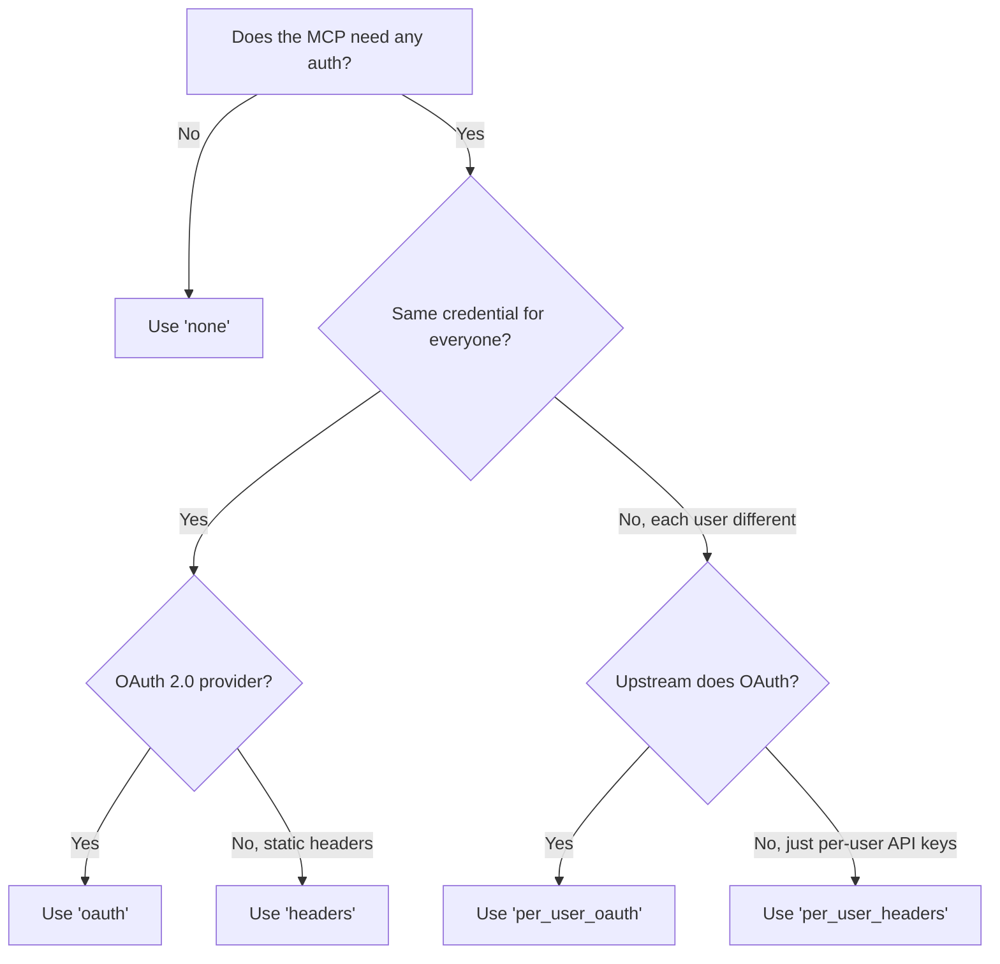

## Overview

Authentication on MCP servers comes in two flavors:

- **Server-level auth** — a single shared credential the admin configures once. Every caller hits the upstream MCP server under the same identity.
- **Per-user auth** — each end-user supplies their own credential. Bifrost stores the credential against the caller's identity (Virtual Key, signed-in user, or asserted session ID) and reuses it on every later call.

Per-user auth applies to the **HTTP** and **SSE** connection types. STDIO connections inherit their environment from the spawned subprocess and don't have a per-call auth model.

---

## Auth types at a glance

| `auth_type`          | Who authenticates           | Credential shape         | When to use                                                       |
| -------------------- | --------------------------- | ------------------------ | ----------------------------------------------------------------- |
| `none`               | —                           | None                     | Public MCP servers, local STDIO tools that don't need a key       |
| `headers`            | Admin, once                 | Static HTTP headers      | Shared API keys, bearer tokens, custom headers                    |
| `per_user_headers`   | Each end-user, lazily       | HTTP headers (per-user)  | Per-user API keys, signed tokens, anything keyed to a person      |
| `oauth`              | Admin, once                 | OAuth 2.0 access token   | Shared third-party service the whole team uses                    |
| `per_user_oauth`     | Each end-user, lazily       | OAuth 2.0 access token   | Per-user services like Notion, GitHub, Sentry                     |

[→ Pick your auth type](#pick-your-auth-type) for the decision flow, or jump straight to a type:

- [None](./none) — no upstream auth
- [Headers](./headers) — static admin headers
- [Per-User Headers](./per-user-headers) — each user submits their own header values
- [OAuth 2.0](./oauth) — admin OAuth with token refresh
- [Per-User OAuth](./per-user-oauth) — each user authenticates themselves

---

## Server-level vs per-user

|                    | Server-level (`headers`, `oauth`)         | Per-user (`per_user_oauth`, `per_user_headers`) |
| ------------------ | ----------------------------------------- | ----------------------------------------------- |
| Who authenticates  | Admin, once at setup                      | Each end-user, lazily on first tool call        |
| Token / key scope  | Shared across all requests                | Per-identity, per-MCP-server                    |
| Identity required  | No                                        | Yes — Virtual Key, signed-in user, or session ID |
| Where it lives     | MCP client config (encrypted at rest)     | A separate per-credential row keyed by identity |
| Cross-gateway      | Yes                                       | Yes — credential follows the identity            |
| Sessions UI        | Not surfaced                              | One row per (identity, MCP) on [MCP Sessions](../sessions) |
| Revoke             | Edit / delete the MCP client              | Per-row revoke or "edit values" from the sessions page |

Per-user auth requires every request to carry an identity. See [Identity modes](#identity-modes) below.

---

## Pick your auth type

A few common patterns:

- "We have one company GitHub App and everyone uses it" → `oauth`
- "We use a custom internal MCP with a bearer token" → `headers`
- "Each user connects to their own Notion workspace" → `per_user_oauth`
- "Each user has their own API key for an LLM provider's MCP wrapper" → `per_user_headers`

---

## Identity modes

Per-user auth keys every credential against an **identity**. The mode is derived from request context at lookup time, in priority order:

| Mode      | How it's set                                                                                            | Notes                                              |
| --------- | ------------------------------------------------------------------------------------------------------- | -------------------------------------------------- |
| `user`    | Bifrost's auth middleware populates `BifrostContextKeyUserID` (signed-in user via SSO)                 | Enterprise SSO only                                |
| `vk`      | Caller sends `x-bf-vk` (or `Authorization: Bearer …` / `x-api-key`) and the VK resolves                | Typical non-enterprise pattern                     |
| `session` | Caller sends `x-bf-mcp-session-id: <any-opaque-value>` and re-sends the same value on later calls      | Useful when there is no VK and no SSO              |

Priority: `user` > `vk` > `session`. If multiple are present, Bifrost picks the highest-priority and ignores the rest for credential lookup.

A per-user request **without any identity** is rejected — Bifrost returns an `mcp_auth_required` payload explaining that the caller must send a VK, sign in, or set `x-bf-mcp-session-id`.

---

## How per-user auth works (lazy auth)

The same lazy-auth pattern applies to both `per_user_oauth` and `per_user_headers`, on both the **MCP Gateway** (`/mcp`) and the **LLM Gateway** (`/v1/chat/completions`):

1. The caller sends a request carrying an identity (header or SSO).
2. The LLM (or MCP client) asks to invoke a tool on a per-user MCP server.
3. Bifrost looks up an existing credential for `(identity, mcp_client)`:
   - **Found and `active`** → upstream call goes out transparently, result comes back.
   - **Missing or non-`active`** → Bifrost returns an `mcp_auth_required` payload with an inline URL. The tool is **not** executed.
4. The user opens the URL:
   - For `per_user_oauth`, it points at the upstream provider's authorize page (via a Bifrost consent screen).
   - For `per_user_headers`, it points at a Bifrost form where the user enters their header values.
5. On completion, Bifrost stores the credential against the caller's identity.
6. The next request executes the tool normally — no re-auth, no special handling.

<Frame>
  
</Frame>

The auth URL surfaces in two places:

- **LLM Gateway** — in the response's `extra_fields.mcp_auth_required` block, and embedded in the natural-language message so plain-text clients (curl, basic SDK wrappers) see it too.
- **MCP Gateway** — as a tool result message, so OAuth-capable MCP clients like Claude Code and Cursor see the URL inline in chat.

The `mcp_auth_required` payload carries a `kind` discriminator (`"oauth"` or `"headers"`) so SDKs can branch. Plain-text clients can just open the URL.

---

## Sessions and lifecycle

Every per-user credential — OAuth tokens and submitted headers — shows up on the **MCP Sessions** page. From there callers can:

- See the credential's status (`active`, `orphaned`, `needs_reauth`, `needs_update`)
- **Re-authenticate** an OAuth row whose upstream token went stale
- **Edit values** on a header row when their key changes
- **Revoke** a credential outright

Bifrost also keeps credentials in sync with the VK ↔ MCP allowlist automatically: when an admin removes a VK's access to an MCP, the matching credentials flip to `orphaned` (invisible to runtime). When access is restored, the same rows reactivate. See [MCP Sessions](../sessions) for the full lifecycle.

---

## Next Steps

- [None](./none) — no upstream auth
- [Headers](./headers) — static admin headers
- [Per-User Headers](./per-user-headers)
- [OAuth 2.0](./oauth) — admin OAuth
- [Per-User OAuth](./per-user-oauth)
- [MCP Sessions](../sessions) — per-user credential lifecycle
