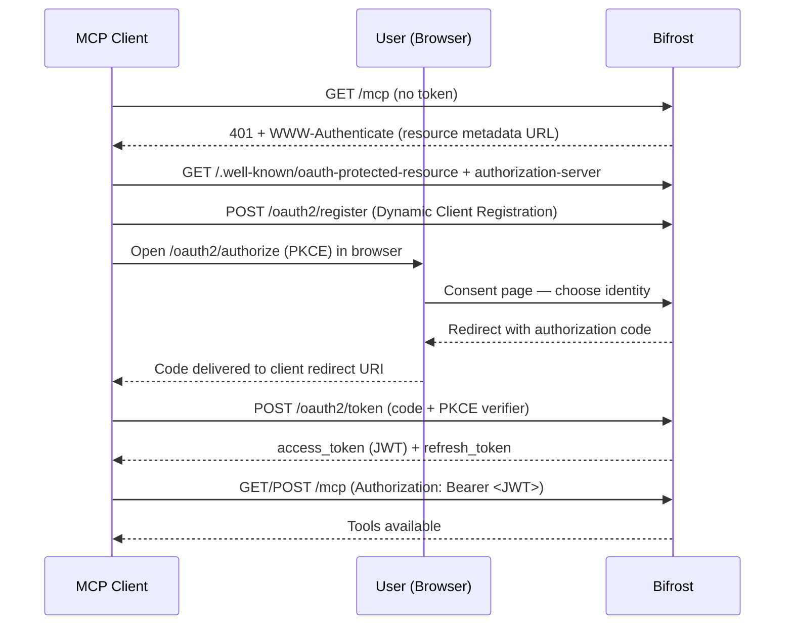

## Overview

When Bifrost acts as an [MCP Gateway](./gateway), external MCP clients connect to its `/mcp` endpoint. This page covers how those **inbound clients authenticate to Bifrost**.

There are two ways a client can present itself:

- **Header credentials** — a virtual key, API key, or session token sent as a request header. Simple to script, ideal for backend and machine-to-machine use.
- **OAuth 2.1** — Bifrost acts as an OAuth authorization server, and the client connects through a browser consent flow, receiving a short-lived JWT. Ideal for interactive clients like Claude Desktop, Claude Code, or Cursor, where pasting a raw key into client config is awkward.

<Note>
This page is about authenticating clients **to** Bifrost. For how Bifrost authenticates **to upstream MCP servers** it connects to, see the outbound [Authentication](./auth/overview) guides instead — that's the opposite direction.
</Note>

---

## Authentication Modes

A single setting, `mcp_server_auth_mode`, controls which credential types `/mcp` accepts:

| Mode | Header credentials (VK / api-key / session) | Bifrost-issued JWT | Discovery endpoints |
|---|---|---|---|
| `headers` (default) | Accepted | — | Disabled |
| `both` | Accepted | Accepted | Enabled |
| `oauth` | Rejected | Accepted | Enabled |

- **`headers`** — `/mcp` accepts header credentials only. The OAuth surface and `.well-known` discovery endpoints are not served.
- **`both`** — `/mcp` accepts header credentials **and** Bifrost-issued JWTs. Discovery is served so OAuth clients can connect.
- **`oauth`** — `/mcp` accepts Bifrost-issued JWTs only; header credentials are rejected.

A request must carry **exactly one** credential type. If an OAuth access token and a header credential (`x-bf-vk`, `X-Api-Key`, or a Bearer VK) arrive on the same request, Bifrost rejects it with a `conflicting credentials` error — even in `both` mode. `both` means either credential is accepted, not both at once.

<Warning>
In `oauth` mode, clients that authenticate with a virtual key or API key header can no longer reach `/mcp`. Use `both` if you need header and OAuth clients to coexist.
</Warning>

---

## How the OAuth Connect Flow Works

When `mcp_server_auth_mode` is `both` or `oauth`, Bifrost is a full OAuth 2.1 authorization server for the `/mcp` resource. A client that doesn't yet have a token discovers the server, registers itself, and walks the user through a browser consent step.



The flow follows current OAuth standards so off-the-shelf MCP clients work without custom code:

- **Protected resource metadata** (RFC 9728) — the `401` response points clients at the discovery documents.
- **Dynamic Client Registration** (RFC 7591) — clients self-register; no manual client setup.
- **PKCE** (S256) — public clients authenticate without a shared secret.
- **Resource indicators** (RFC 8707) — tokens are bound to the `/mcp` resource via the `aud` claim.

---

## Identity Modes at Consent

During the consent step, Bifrost shows the user how they can identify themselves. The page header names the connecting client — for example **"Claude Code wants to connect"** — and offers the modes available for your deployment:


| Mode | Binds the grant to | Availability |
|---|---|---|
| **Virtual key** | A virtual key you paste on the consent page | Always available |
| **Session** | A server-minted, anonymous session identity | Only when `enforce_auth_on_inference` is `false` |
| **User** | Your signed-in dashboard user | Requires SSO / SCIM |

- **Virtual key** carries the same governance (budgets, rate limits, tool scoping) the key already has — the JWT simply represents that key.
- **Session** is an anonymous identity for development and open deployments. It is unavailable once `enforce_auth_on_inference` is on.
- **User** binds the grant to the authenticated person, so per-user upstream tool authorizations unify under one identity.

<Info>
**User mode requires SSO/SCIM** (enterprise). When no identity provider is configured, the consent page offers only virtual key and session modes.
</Info>

---

## Configuration

<Tabs group="config-method">
<Tab title="Web UI">

1. Open **Config** and go to the **MCP** settings.
2. Set **MCP Server Auth Mode** to `headers`, `both`, or `oauth`.
3. When using `both` or `oauth`, optionally set the **OAuth Server** settings: an **Issuer URL** (required for multi-host deployments), and the **Authorization Code** and **Access Token** lifetimes.
4. Click **Save**.


</Tab>
<Tab title="API">

```bash
curl -X PUT http://localhost:8080/api/config \
  -H "Content-Type: application/json" \
  -d '{
    "client_config": {
      "mcp_server_auth_mode": "both",
      "oauth2_server_config": {
        "issuer_url": "https://bifrost.example.com",
        "auth_code_ttl": 300,
        "access_token_ttl": 600
      }
    }
  }'
```

</Tab>
<Tab title="config.json">

```json
{
  "client": {
    "mcp_server_auth_mode": "both",
    "oauth2_server_config": {
      "issuer_url": "https://bifrost.example.com",
      "auth_code_ttl": 300,
      "access_token_ttl": 600
    }
  }
}
```

| Field | Type | Required | Description |
|-------|------|----------|-------------|
| `mcp_server_auth_mode` | string | No | `headers` (default), `both`, or `oauth`. |
| `oauth2_server_config.issuer_url` | string | No | Stable public URL advertised as the issuer in discovery docs and the JWT `iss` claim. Required for multi-host deployments; single-host can omit it (falls back to the request `Host`). Supports `env.MY_VAR` syntax. |
| `oauth2_server_config.auth_code_ttl` | integer | No | Authorization code lifetime in seconds (default `300`, max `900` = 15 minutes). |
| `oauth2_server_config.access_token_ttl` | integer | No | Issued JWT lifetime in seconds (default `600`). |

</Tab>
</Tabs>

<Note>
`oauth2_server_config` only applies when `mcp_server_auth_mode` is `both` or `oauth`. The RSA signing key used for JWTs is generated automatically the first time it's needed — no setup required. It is persisted to the database, so it survives restarts and is shared across all replicas; previously issued tokens stay valid after a restart.
</Note>

---

## Connecting a Client

With `both` or `oauth` enabled, point the MCP client at Bifrost's `/mcp` URL — for example `https://bifrost.example.com/mcp`. No key needs to be pasted into the client config.

1. The client hits `/mcp`, gets a `401`, and discovers the authorization server.
2. It registers itself and opens a browser to the consent page.
3. The user chooses an identity (virtual key, session, or user).
4. The client receives a token and connects; aggregated tools become available.

When the access token expires, the client uses its refresh token to obtain a new one silently — the browser step happens only once.

---

## Managing Grants

Each completed OAuth connection is a **grant** — a refresh-token lineage Bifrost issued to a client. The **OAuth Grants** page lists them: the client, the bound identity, when the grant was created, and when it was last used, with a **Revoke** action.


Revoking a grant stops its refresh token from rotating immediately, so the client can no longer renew access.

<Note>
A revoked grant's current access token is a short-lived JWT that keeps working on `/mcp` until it expires (up to `access_token_ttl`, default `600` seconds). After that the client is fully cut off and must reconnect through the consent flow.

This is deliberate: a holder of the virtual key or user credentials can always start a new authorized session, so invalidating the access token mid-flight adds little security while costing a per-request lookup. Lower `access_token_ttl` for a tighter window.
</Note>

<Info>
The **OAuth Grants** page lists credentials Bifrost **issued to clients** for inbound `/mcp` access. This is distinct from [MCP Sessions](./sessions), which tracks per-user credentials Bifrost holds for **upstream** MCP servers.
</Info>

---

## Token Lifetime & Revocation

- **Access tokens** are JWTs valid for `access_token_ttl` (default 600s). On every `/mcp` request Bifrost validates the JWT — signature, expiry, issuer, and audience — and confirms the bound identity (the virtual key or user) still exists and is active. The identity check reads an in-memory cache, so in the common case it adds no database round-trip (vk-mode falls back to a single store lookup only on a cache miss).
- **Refresh tokens** rotate on each use and have no fixed expiry. A token is invalidated by rotation, by the bound virtual key or user becoming inactive or deleted, or by an explicit revoke.
- An explicit revoke marks the grant's refresh-token row revoked, so renewals stop immediately — but it does **not** remove the bound identity, so the identity check still passes and the already-issued access token keeps working until it expires. Lower `access_token_ttl` to shorten that window.
- **Deleting** the bound virtual key or user is stronger than revoking a grant: it revokes the grant immediately *and* the identity check rejects the grant's already-issued access token on its next `/mcp` request, instead of letting it live out its TTL.
- Enabling `disable_vk_identity` (require identity-provider login) cuts off all **virtual-key**–mode grants immediately — they are rejected at `/mcp` and denied on refresh — so those clients must re-authenticate as a user. Only applies in `oauth` mode with an identity provider configured.
- Enabling `enforce_auth_on_inference` blocks session-mode (anonymous) tokens at `/mcp`, but does **not** delete or invalidate their grants — the grants remain in the database and become valid again if enforcement is later disabled. To remove a session-mode grant permanently, revoke it on the **OAuth Grants** page.

---

## Discovery Endpoints

When discovery is enabled (`both` or `oauth`), Bifrost serves the standard documents MCP clients fetch automatically:

| Endpoint | Purpose |
|---|---|
| `GET /.well-known/oauth-protected-resource` | Protected resource metadata (RFC 9728) |
| `GET /.well-known/oauth-authorization-server` | Authorization server metadata (RFC 8414) |
| `GET /.well-known/jwks.json` | Public signing keys for JWT verification (RFC 7517) |

In `headers` mode these endpoints return `404`.

---

## Troubleshooting

### Discovery returns 404
**Symptom:** A client can't discover the authorization server; `.well-known` endpoints return `404`.
**Cause:** `mcp_server_auth_mode` is `headers`, so the OAuth surface is disabled.
**Fix:** Set the mode to `both` or `oauth`.

### Header credential rejected on /mcp
**Symptom:** A virtual key or API key that worked before now gets a `401`.
**Cause:** `mcp_server_auth_mode` is `oauth`, which accepts JWTs only.
**Fix:** Use `both` to accept header credentials alongside OAuth.

### Conflicting credentials on /mcp
**Symptom:** `conflicting credentials: an OAuth token and a virtual key header were both provided`.
**Cause:** The client completed an OAuth flow but is also configured with a VK header, so both arrive on one request. Claude Code does this in `both` mode when the VK is set under `x-bf-vk` / `X-Api-Key` instead of `Authorization`.
**Fix:** Send only one credential — remove the VK header, or configure it as `Authorization: Bearer <vk>` so the client uses header auth and skips OAuth.

### Client keeps re-opening the browser
**Symptom:** The consent flow runs on every connection.
**Cause:** The client isn't persisting its tokens, or its refresh token was revoked.
**Fix:** Confirm the client stores its credentials; check the **OAuth Grants** page to see whether the grant was revoked.

### Token rejected after issuer change
**Symptom:** Previously issued tokens fail validation after changing `issuer_url`.
**Cause:** The `iss` claim in existing tokens no longer matches the configured issuer.
**Fix:** Clients reconnect to obtain tokens with the new issuer; set a stable `issuer_url` up front in multi-host deployments.

---

## Next Steps

- **[Bifrost as an MCP Gateway](./gateway)** — Expose aggregated tools to external MCP clients.
- **[MCP Sessions](./sessions)** — Inspect and manage per-user credentials for upstream servers.
- **[Virtual Keys](../features/governance/virtual-keys)** — Govern budgets, rate limits, and tool scope for the identities behind grants.
