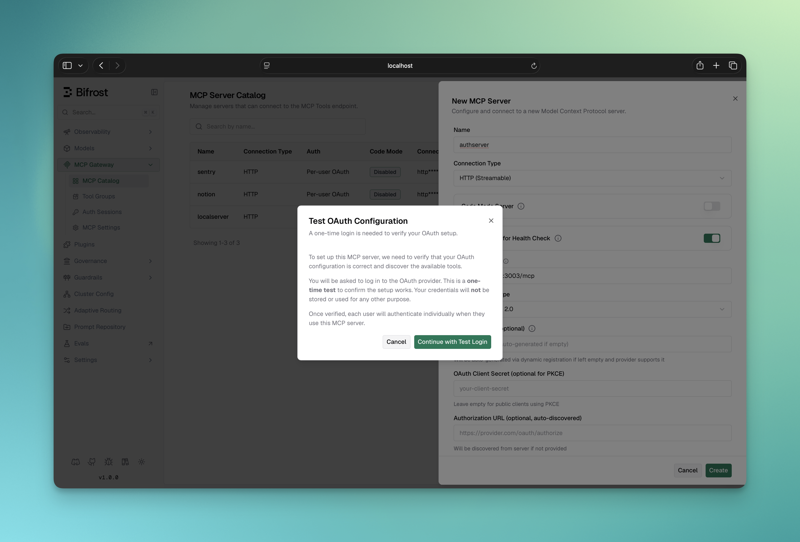
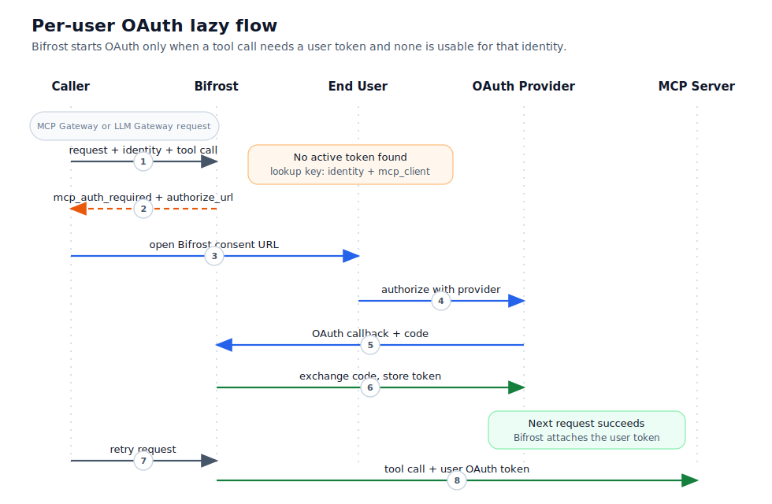
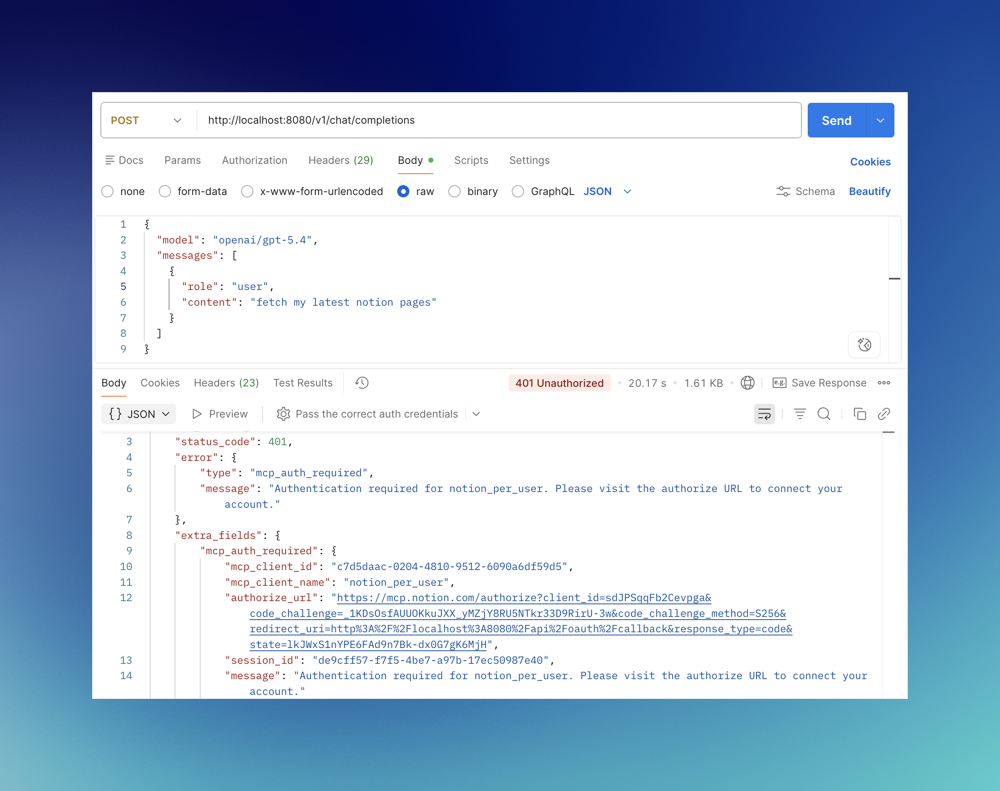
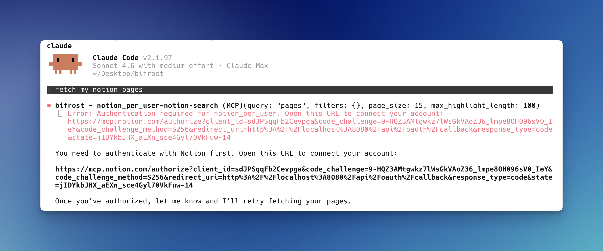

## Overview

<Info>Per-user OAuth is available in **Bifrost v1.5.0-prerelease2 and above**.</Info>

**Per-user OAuth** lets each end-user connect to upstream MCP services (Notion, GitHub, Sentry, etc.) using their own credentials. Instead of a single shared admin token, every user gets their own access — scoped to their account, their data.

This is different from [server-level OAuth](./oauth), where an admin authenticates once and every request uses the same shared token:

|                    | Server-level OAuth          | Per-user OAuth                          |
| ------------------ | --------------------------- | --------------------------------------- |
| Who authenticates  | Admin, once                 | Each end-user individually              |
| Token scope        | Shared across all requests  | Per-identity, per-MCP-server            |
| Identity required  | No                          | Yes (Virtual Key, signed-in user, or client-asserted session) |
| Cross-gateway      | Yes                         | Yes — token follows the identity        |

<Note>
Bifrost is **not** an OAuth 2.1 Authorization Server. The MCP Gateway (`/mcp`) does not advertise its own `.well-known` endpoints or run a consent screen for inbound MCP clients. Identity is asserted by the caller via headers (or upstream SSO), and auth happens **lazily** — on the first tool call that needs an upstream token.
</Note>

---

## Setup

Per-user OAuth is configured through the Web UI only. During setup, Bifrost runs a test OAuth flow and pre-fetches the tool list from the upstream service — this is why file-based config is not supported for this auth type.

<Tabs>
<Tab title="Web UI">

1. Navigate to **MCP Gateway** and click **New MCP Server**
2. Select **HTTP** or **SSE** as the connection type and enter the server URL
3. Set **Auth Type** to **Per-User OAuth**
4. Fill in the OAuth application credentials:
   - **Client ID** — your upstream OAuth app's client ID
   - **Client Secret** — optional for PKCE flows
   - **Authorize URL** — upstream authorization endpoint (leave blank for auto-discovery)
   - **Token URL** — upstream token endpoint (leave blank for auto-discovery)
   - **Scopes** — comma-separated list of requested scopes
5. Click **Create** — Bifrost runs a test OAuth flow to validate the config and pre-fetches the tool list
6. Complete the authorization in your browser
7. Save the MCP client



</Tab>
</Tabs>

<Info>
If your upstream server supports OAuth Discovery (RFC 8414), you can leave the authorize and token URLs blank and provide only the **Server URL**. Bifrost will discover the endpoints automatically.
</Info>

---

## How it works

The same lazy-auth pattern is used on both the **MCP Gateway** (`/mcp`) and the **LLM Gateway** (`/v1/chat/completions`):

1. The caller sends a request with an identity (header or SSO).
2. The LLM (or MCP client) asks to invoke a tool on a per-user OAuth service.
3. Bifrost looks up an existing token for `(identity, mcp_client)`:
   - **Token found and active** → Bifrost calls the upstream tool transparently and returns the result.
   - **No token, or token in a non-active state** → Bifrost returns an `mcp_auth_required` payload with an inline `authorize_url`. The tool is **not** executed.
4. The user opens the URL, completes the upstream OAuth flow, and Bifrost stores the resulting token against their identity.
5. The next request executes the tool normally — no re-auth, no special handling.



<Info>
**Placeholder:** the older diagram split MCP-Gateway and LLM-Gateway flows into separate images. Replace with a single unified lazy-auth diagram when re-shooting screenshots.
</Info>

### What the auth URL looks like in practice

**LLM Gateway** — the `authorize_url` comes back in the response's `extra_fields.mcp_auth_required` block, and is also embedded in the natural-language message so plain-text clients (curl, basic SDK wrappers) see it too:

```text
Authentication required for Notion. Visit https://your-bifrost-domain.com/workspace/mcp-sessions/auth?flow=<flow-id>#t=<temp-token> to connect your account.
```



**MCP Gateway** — the same string surfaces as a tool result message, so OAuth-capable MCP clients like Claude Code and Cursor see the URL inline in chat:



### The consent page

The URL points at a Bifrost dashboard page. The page shows:

- Which **MCP server** is asking for authentication
- Which **identity** the resulting token will be bound to (VK name, signed-in user, or session ID)
- An **Authenticate** button that redirects to the upstream provider

After completing the upstream OAuth, the user is redirected back to Bifrost's `/api/oauth/callback`, the code is exchanged for tokens server-side, and the token is stored against the identity.

<Info>
**Placeholder:** screenshot of the `/workspace/mcp-sessions/auth?flow=<id>` consent page — `ui-mcp-per-user-oauth-consent-flow.png`. Re-shoot.
</Info>

### Multi-server auth

If a single request triggers tool calls against multiple unauthenticated per-user MCP servers, the LLM only ever sees one `mcp_auth_required` at a time (the first un-authed service Bifrost hits). The user authenticates that one, retries, and the LLM is then prompted for the next un-authed service — until everything required for the turn is authenticated. There is no upfront "connect all your services" screen.

---

## Identity modes

Every per-user OAuth row is bound to **exactly one** identity column. The mode is derived from request context at token-lookup time, with this priority:

| Mode      | How it's set                                                 | Cross-gateway portable | Persists across processes |
| --------- | ------------------------------------------------------------ | ---------------------- | ------------------------- |
| `user`    | Enterprise auth middleware populates `BifrostContextKeyUserID` (signed-in user) | Yes                    | Yes                       |
| `vk`      | Caller sends `x-bf-vk` (or `Authorization: Bearer …` / `x-api-key`) and the VK resolves | Yes                    | Yes                       |
| `session` | Caller sends `x-bf-mcp-session-id: <opaque-string>` and re-sends the same value on later calls | Yes (same session ID re-sent) | Yes (until the session ID stops being sent) |
| `none`    | No identity present                                          | —                      | Refused: per-user OAuth needs an identity to key on |

Priority order is `user` > `vk` > `session`. If multiple are present, Bifrost picks the highest-priority one and ignores the rest for token lookup.

### `user` mode (enterprise only)

Requires Bifrost's enterprise auth/SSO middleware to be configured. The signed-in user's ID is attached to the request automatically. There is no equivalent self-declared header — `X-Bf-User-Id` does **not** exist as a public input.

When enterprise SSO is the source of identity, the same user can hit both gateways and reuse their token without sending any extra headers.

### `vk` mode

Pass the Virtual Key on every request via one of:

```bash
-H "x-bf-vk: vk_your_key"
-H "Authorization: Bearer vk_your_key"
-H "x-api-key: vk_your_key"
```

This is the typical pattern for non-enterprise deployments. Tokens are bound to the resolved VK row ID, so a VK rename does not break them, but deleting/rotating the VK does (the resulting token row becomes orphaned — see [MCP Sessions](./sessions)).

### `session` mode

Pass any opaque string (≤255 chars) on every request:

```bash
-H "x-bf-mcp-session-id: <any-opaque-value>"
```

Bifrost binds the token row to that exact string. Future calls that send the same value reuse the same token; calls without it or with a different value get treated as a different identity. This mode is useful when there is no VK and no SSO — e.g. an embedded MCP client that mints its own per-installation ID.

The session ID is treated as a secret by Bifrost (length-only in logs, never echoed).

---

## Cross-gateway token sharing

Tokens are stored against an **identity**, not against a gateway. As long as the same identity reaches the gateway, the token is reused.

- Authenticate via the **LLM Gateway** with `vk_xyz` → that token is immediately usable on the **MCP Gateway** as long as the inbound request also carries `vk_xyz`.
- Authenticate via the **MCP Gateway** with `x-bf-mcp-session-id=abc` → the **LLM Gateway** can reuse it by sending the same `x-bf-mcp-session-id` header.
- Authenticate via enterprise SSO as user `u_123` on either gateway → the other gateway also reuses the token automatically (no header to set).

The portability matrix is just "did the same identity show up?" — there is no per-gateway scoping.

---

## Configuration reference

Per-user OAuth is configured on the MCP client via `auth_type`. When `auth_type` is `per_user_oauth`, an `oauth_config_id` linking to the OAuth credentials is required (set automatically during UI setup):

```json
{
  "mcp": {
    "mcp_clients": [
      {
        "name": "notion",
        "connection_type": "http",
        "connection_string": "https://mcp.notion.so/sse",
        "auth_type": "per_user_oauth",
        "oauth_config_id": "oauth_cfg_abc123",
        "tools_to_execute": ["*"]
      }
    ]
  }
}
```

| Field             | Type   | Description                                       |
| ----------------- | ------ | ------------------------------------------------- |
| `auth_type`       | string | Set to `"per_user_oauth"`                         |
| `oauth_config_id` | string | ID of the OAuth config created during UI setup    |

<Note>
MCP client names cannot contain hyphens — Bifrost prefixes tools as `<client>-<tool>` and uses the hyphen to split the two halves at execution time.
</Note>

---

## Managing user tokens

Every per-user OAuth token is visible on the **MCP Sessions** page. Tokens have three runtime states — `active`, `orphaned`, `needs_reauth` — each with different recovery behavior. See [MCP Sessions](./sessions) for the full lifecycle, revoke flow, and the difference between orphaned and needs-reauth rows.

---

## Public URL configuration

The consent page URL Bifrost builds (`/workspace/mcp-sessions/auth?flow=…`) and the `redirect_uri` Bifrost registers with upstream OAuth providers are both derived from the request's `Host` header by default. Behind a reverse proxy, override them with:

- `mcp_external_server_url` — what Bifrost uses for the consent URL and any discovery surface
- `mcp_external_client_url` — what Bifrost registers as the `redirect_uri` with upstream providers

See [Reverse Proxy configuration →](../deployment-guides/config-json/client#reverse-proxy) for the full reference.

<Warning>
**Changing `mcp_external_client_url` after an upstream provider has been registered breaks already-authorized clients.** Upstream providers lock the `redirect_uri` to whatever was registered during Dynamic Client Registration (RFC 7591). To recover, clear the stored OAuth client credentials for the affected MCP server so Bifrost re-registers with the new URL.
</Warning>

---

## Next Steps

- [MCP Sessions →](./sessions) — token states, reauth, revoke
- [Server-level OAuth →](./oauth) — admin authenticates once, shared token for all requests
- [MCP Gateway URL →](./gateway-url) — expose Bifrost as an MCP server for Claude Code and Cursor
- [Tool Filtering →](./filtering) — control which per-user tools are available per Virtual Key
