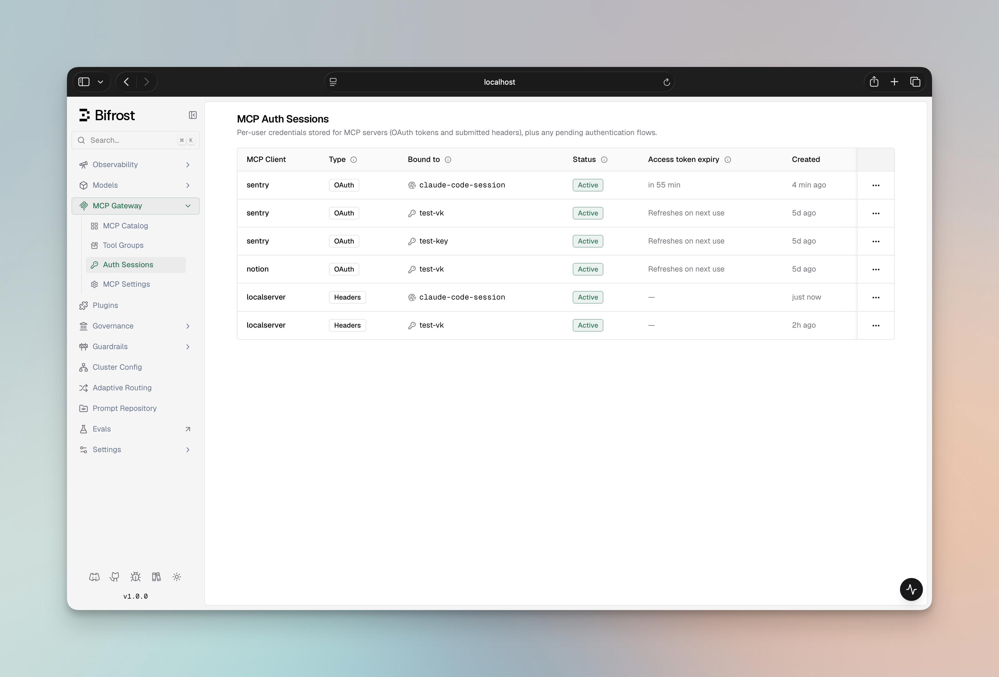

## Overview

<Info>The MCP Sessions UI is available in **Bifrost v1.5.0-prerelease2 and above**, alongside [Per-User OAuth](./per-user-oauth).</Info>

The **MCP Sessions** page lists every per-user OAuth artifact known to Bifrost — both **token rows** (successfully completed authentications) and **flow rows** (in-progress consent flows). Each row's status drives the available actions.

<Info>
**Placeholder:** capture the MCP Sessions table showing one row of each status (active, pending, needs re-auth, orphaned) — `ui-mcp-sessions-table.png`.
</Info>

---

## Token states

Each token row carries a `status` field with one of three values. **Only `active` satisfies a runtime tool call** — the other two surface in the UI with distinct copy and actions.

| State          | Badge          | What it means                                                                                                                | What unblocks it                                                                  |
| -------------- | -------------- | ---------------------------------------------------------------------------------------------------------------------------- | --------------------------------------------------------------------------------- |
| `active`       | Active         | Credential is valid and usable. Bifrost auto-refreshes via the refresh token at use time.                                    | —                                                                                 |
| `needs_reauth` | Needs re-auth  | The upstream credential is dead — refresh failed, or the user revoked the app at the provider. Tool calls fail until fixed. | Click **Re-authenticate** on the row, complete the upstream flow.                |
| `orphaned`     | Orphaned       | The user lost access to this MCP (e.g. their granting VK was deleted or their access profile changed). The upstream credential itself is still alive on disk. | **Nothing** — automatic. If access is restored, the row flips back to `active` on the next reconcile. Re-auth would not help. |

In addition, **flow rows** (in-progress authentications that have not yet produced a token) show:

| State     | Badge   | What it means                                                                |
| --------- | ------- | ---------------------------------------------------------------------------- |
| `pending` | Pending | A user has been handed an `authorize_url` but has not completed upstream OAuth. |

Pending rows expire on their own after a short window (currently 15 minutes); expired flow rows are deleted by Bifrost's sweep worker, not surfaced as failed rows.

### Why orphaned and needs_reauth are different

It's tempting to lump them together as "broken — make the user re-auth." Bifrost intentionally splits them because the remediation is different:

- **`needs_reauth`** is an upstream-side problem. The user revoked Bifrost at Notion / GitHub / etc., or the refresh token rotated out from under us. The only fix is a fresh upstream OAuth flow — which the **Re-authenticate** action runs in place.
- **`orphaned`** is a Bifrost-side access problem. The credential upstream is fine; what's missing is the user's *right to use it through Bifrost*. Running a fresh OAuth flow would mint a duplicate token and not address the access issue. Restoring the user's access (re-adding the VK assignment, fixing the access profile) auto-reactivates the existing row.

The UI hides the **Re-authenticate** action on orphaned rows for exactly this reason.

---

## Actions

### Re-authenticate

Available on `needs_reauth` token rows and on any pending flow row whose original consent link has gone stale. Clicking it:

1. Opens a fresh consent flow against the same MCP client and identity.
2. Hands you a new `authorize_url`.
3. On completion, replaces the dead credential in place — same row ID, status flips to `active`.

The original identity (VK ID, user ID, or session ID) is preserved — re-auth does not let you re-bind the token to a different identity.

### Revoke

Deletes the token row outright. The corresponding flow row (if any) is removed first to avoid a half-deleted state, then the token row is dropped.

<Note>
Bifrost does **not** call the upstream provider's `/revoke` endpoint when you click Revoke. Per-user OAuth never stores a per-server revocation endpoint, so revocation is local to Bifrost only. If you want the upstream provider to invalidate the token as well, revoke it from the provider's dashboard (GitHub Settings → Authorized OAuth Apps, etc.).
</Note>

---

## What appears in the table

The table is **scoped to the caller's identity**:

- A signed-in admin sees rows visible under their VK / user ID — not every row in the system.
- A user authenticated only via a `vk` header sees rows for that VK.
- A caller asserting only `x-bf-mcp-session-id` sees rows for that session ID.

This is the same identity scoping that gates which `authorize_url` a caller can complete. A teammate cannot finish someone else's flow, and conversely cannot revoke a token they did not originate.

Flow rows where the identity has not yet been stamped (user-mode flows whose `user_id` is filled at completion time) are filtered out of the list — they would otherwise show up as "unbound" rows nobody can claim.

---

## Troubleshooting

### A tool call fails with `mcp_auth_required` even though the user just authenticated

Check the row status:

- **Active** but tool still failing → look at the access-token expiry. If it's past, Bifrost will refresh on the next call automatically; if the refresh itself is failing, the row will flip to `needs_reauth` after a couple of retries.
- **Orphaned** → the caller's identity has lost access to this MCP client. Restore the VK assignment or the access profile; the row will auto-reactivate on the next reconcile.
- **Needs re-auth** → click **Re-authenticate** and complete the upstream flow.

### "This authentication flow isn't yours"

The link points to a flow row whose identity differs from the caller's. Ask the teammate whose VK / user identity triggered the original request to complete the flow, or trigger a new request yourself.

### "This authentication flow has expired or been completed"

Pending flows have a 15-minute TTL. If the user took too long, the row is gone — trigger the action again to mint a fresh flow.

### A re-auth attempt on an orphaned row does nothing useful

That's by design — the Re-authenticate action is hidden on orphaned rows, but if you got there via a stale URL, the new token would still be orphaned because the access constraint isn't on the upstream side. Restore access (re-assign the VK, fix the access profile) and the row reactivates automatically.

---

## Related

- [Per-User OAuth →](./per-user-oauth) — how tokens get into this table in the first place
- [Server-level OAuth →](./oauth) — for shared (admin) tokens; not surfaced here
- [Tool Filtering →](./filtering) — control which per-user tools a VK can call
