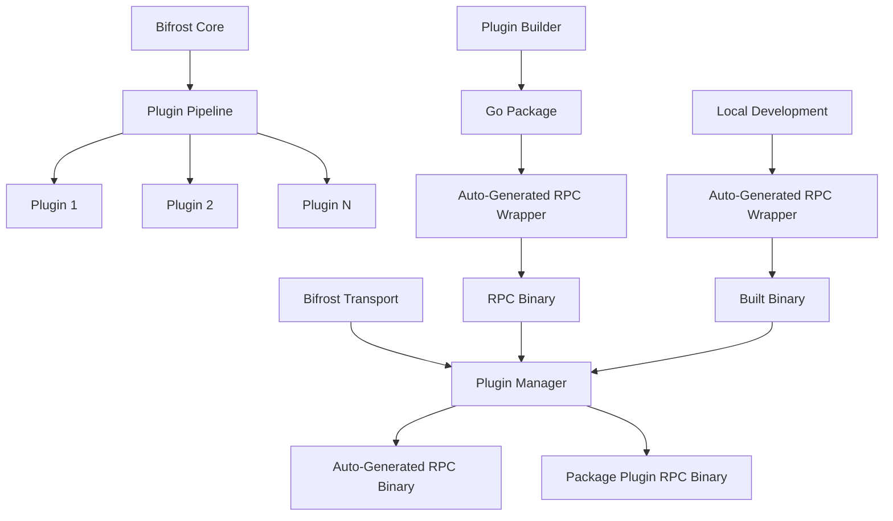
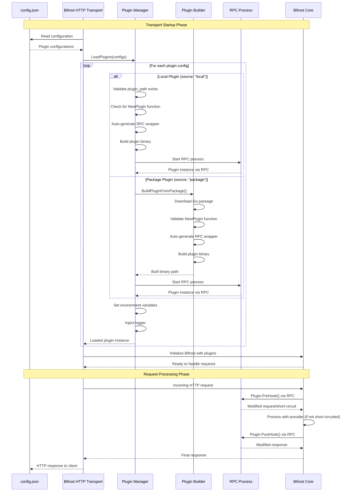
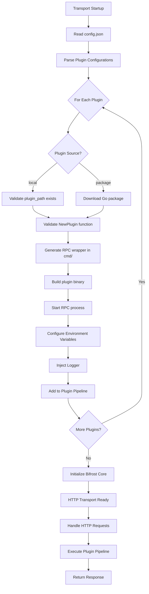

# Complete Plugin System Guide

This comprehensive guide covers Bifrost's simplified plugin system from all perspectives: core users, transport users, and plugin developers.

## Table of Contents

1. [Overview](#overview)
2. [For Core Users (Go Package)](#for-core-users-go-package)
3. [For Transport Users (HTTP Service)](#for-transport-users-http-service)
4. [For Plugin Developers](#for-plugin-developers)
5. [Plugin Distribution](#plugin-distribution)
6. [Advanced Topics](#advanced-topics)
7. [Migration Guide](#migration-guide)
8. [Troubleshooting](#troubleshooting)

## Overview

Bifrost supports a simplified plugin system that allows extending functionality without modifying core code. The transports system supports **two plugin types**:

1. **Local Builds** (for development) - Build and test plugins locally
2. **Go Packages** (for production) - Distribute plugins as Go modules

### Key Features

- **Process Isolation**: Plugins run as separate processes via RPC
- **Standardized Interface**: All plugins must implement the standardized `NewPlugin(json.RawMessage)` constructor
- **Auto-Generated RPC Wrappers**: No boilerplate code required - RPC wrappers are generated automatically
- **Configuration-Driven**: All plugins configured via JSON
- **Zero Development Friction**: Plugin developers only write business logic

### Plugin Architecture



## For Core Users (Go Package)

### Direct Plugin Usage

When using Bifrost as a Go package, you can use plugins directly:

```go
package main

import (
    "context"
    "encoding/json"

    bifrost "github.com/maximhq/bifrost/core"
    "github.com/maximhq/bifrost/core/schemas"
    "github.com/maximhq/bifrost/plugins/maxim"
)

func main() {
    // Configure plugin using standardized constructor
    maximConfig := json.RawMessage(`{
        "api_key": "your_api_key",
        "log_repo_id": "your_repo_id"
    }`)

    maximPlugin, err := maxim.NewPlugin(maximConfig)
    if err != nil {
        panic(err)
    }

    // Create account (your implementation)
    account := &YourAccount{}

    // Initialize Bifrost with plugins
    client, err := bifrost.Init(schemas.BifrostConfig{
        Account: account,
        Plugins: []schemas.Plugin{maximPlugin},
        InitialPoolSize: 100,
    })
    if err != nil {
        panic(err)
    }

    // Use Bifrost
    response, err := client.ChatCompletionRequest(
        schemas.OpenAI,
        &schemas.BifrostRequest{
            Model: "gpt-4",
            Input: schemas.RequestInput{
                ChatCompletionInput: &[]schemas.BifrostMessage{
                    {Role: "user", Content: "Hello!"},
                },
            },
        },
        context.Background(),
    )
}
```

## For Transport Users (HTTP Service)

### Runtime Setup of HTTP Transport with Plugins



### Plugin Loading Flow Details



### Configuration-Based Plugin System

All plugins are configured in your `config.json` using only two types:

```json
{
  "providers": {
    "openAI": {
      "keys": [
        { "value": "env.OPENAI_API_KEY", "models": ["gpt-4"], "weight": 1.0 }
      ]
    }
  },
  "plugins": [
    {
      "name": "maxim",
      "source": "local",
      "plugin_path": "./plugins/maxim",
      "enabled": true,
      "config": {
        "api_key": "your_api_key",
        "log_repo_id": "your_repo_id"
      },
      "env_vars": {
        "MAXIM_API_KEY": "env.MAXIM_API_KEY",
        "MAXIM_LOG_REPO_ID": "env.MAXIM_LOG_REPO_ID"
      }
    },
    {
      "name": "custom-plugin",
      "source": "package",
      "package": "github.com/company/custom-bifrost-plugin",
      "version": "v1.0.0",
      "enabled": true,
      "config": {
        "custom_setting": "value"
      }
    }
  ]
}
```

### Plugin Types

#### 1. Local Plugins (Development)

For development and testing:

```json
{
  "name": "my-plugin",
  "source": "local",
  "plugin_path": "./plugins/my-plugin",
  "enabled": true,
  "config": {
    "setting": "value"
  }
}
```

Requirements:

- `plugin_path` must point to a valid plugin directory
- Plugin directory must contain Go files with `NewPlugin` function
- RPC wrapper is automatically generated during build

> **⚠️ Docker Limitation**: Local plugins **cannot** be used when running transports via Docker containers. Local plugins require access to the host filesystem for building, which is not available inside Docker containers. If you need to use local plugins, run the transport directly with Go:
>
> ```bash
> # ✅ Works with local plugins
> go run ./transports/bifrost-http -config config.json
>
> # ❌ Local plugins won't work with Docker
> docker run -v $(pwd)/config.json:/app/config.json your-image
> ```
>
> For production deployments with Docker, use **package plugins** instead.

#### 2. Package Plugins (Production)

For production deployments:

```json
{
  "name": "production-plugin",
  "source": "package",
  "package": "github.com/company/bifrost-plugin",
  "version": "v1.2.0",
  "enabled": true,
  "config": {
    "api_key": "production_key"
  }
}
```

Requirements:

- `package` must be a valid Go module path
- Package must implement the standardized `NewPlugin` constructor
- RPC wrapper is automatically generated during build

### Running the Transport

```bash
# Simple usage
./bifrost-http -config config.json

# With additional options
./bifrost-http \
  -config config.json \
  -port 8080 \
  -pool-size 300
```

## For Plugin Developers

### Mandatory Requirements

**ALL plugins MUST implement ONLY:**

1. **Standardized Constructor Pattern:**

```go
func NewPlugin(configJSON json.RawMessage) (schemas.Plugin, error)
```

**That's it!** No boilerplate code, no RPC wrappers required.

### Simplified Plugin Directory Structure

Your plugin only needs this minimal structure:

```
your-plugin/
├── plugin.go              # Plugin logic and NewPlugin constructor
├── go.mod                 # Go module definition
├── go.sum                 # Go module checksums (generated)
└── README.md             # Plugin documentation (optional)
```

**Note:** The RPC wrapper is automatically generated by the Bifrost plugin system.

### Plugin Interface Requirements

All plugins must implement the `schemas.Plugin` interface:

```go
type Plugin interface {
    GetName() string
    PreHook(ctx *context.Context, req *BifrostRequest) (*BifrostRequest, *PluginShortCircuit, error)
    PostHook(ctx *context.Context, result *BifrostResponse, err *BifrostError) (*BifrostResponse, *BifrostError, error)
    Cleanup() error
    SetLogger(logger Logger)
}
```

### Complete Plugin Implementation Example

```go
package myplugin

import (
    "context"
    "encoding/json"
    "fmt"
    "net/http"
    "github.com/maximhq/bifrost/core/schemas"
)

// Configuration struct
type PluginConfig struct {
    APIKey   string `json:"api_key"`
    Endpoint string `json:"endpoint"`
    Timeout  string `json:"timeout"`
}

// MANDATORY: Standardized constructor - ONLY thing you need to implement!
func NewPlugin(configJSON json.RawMessage) (schemas.Plugin, error) {
    var config PluginConfig
    if err := json.Unmarshal(configJSON, &config); err != nil {
        return nil, fmt.Errorf("invalid config: %w", err)
    }

    // Validate configuration
    if config.APIKey == "" {
        return nil, fmt.Errorf("api_key is required")
    }

    return &MyPlugin{
        config: config,
        client: &http.Client{},
    }, nil
}

// Plugin implementation
type MyPlugin struct {
    config PluginConfig
    client *http.Client
    logger schemas.Logger
}

func (p *MyPlugin) GetName() string {
    return "my-plugin"
}

func (p *MyPlugin) SetLogger(logger schemas.Logger) {
    p.logger = logger
}

func (p *MyPlugin) PreHook(ctx *context.Context, req *schemas.BifrostRequest) (*schemas.BifrostRequest, *schemas.PluginShortCircuit, error) {
    // Your pre-processing logic here
    p.logger.Info("Processing request in my-plugin")
    return req, nil, nil
}

func (p *MyPlugin) PostHook(ctx *context.Context, result *schemas.BifrostResponse, err *schemas.BifrostError) (*schemas.BifrostResponse, *schemas.BifrostError, error) {
    // Your post-processing logic here
    p.logger.Info("Processing response in my-plugin")
    return result, err, nil
}

func (p *MyPlugin) Cleanup() error {
    // Cleanup resources
    return nil
}
```

### Plugin Testing

```go
package myplugin

import (
    "context"
    "encoding/json"
    "testing"
    "github.com/maximhq/bifrost/core/schemas"
)

func TestNewPlugin(t *testing.T) {
    // Test plugin creation with valid config
    config := PluginConfig{
        APIKey: "test-key",
        Endpoint: "https://api.example.com",
    }
    configJSON, _ := json.Marshal(config)

    plugin, err := NewPlugin(configJSON)
    if err != nil {
        t.Fatalf("Failed to create plugin: %v", err)
    }

    if plugin.GetName() == "" {
        t.Error("Plugin name should not be empty")
    }
}

func TestNewPluginInvalidConfig(t *testing.T) {
    // Test with invalid config
    invalidConfig := json.RawMessage(`{"invalid": "config"}`)

    _, err := NewPlugin(invalidConfig)
    if err == nil {
        t.Error("Expected error for invalid config")
    }
}
```

### Development Workflow

#### 1. Create Plugin

```bash
# Create plugin directory
mkdir my-bifrost-plugin
cd my-bifrost-plugin

# Initialize Go module
go mod init github.com/company/my-bifrost-plugin

# Create plugin.go with NewPlugin function
# (See example above)
```

#### 2. Test Locally

```bash
# Test with local configuration
# The system will auto-generate RPC wrapper and build for you
```

#### 3. Distribute

```bash
# Push to repository and tag version
git add .
git commit -m "Initial plugin implementation"
git tag v1.0.0
git push origin main
git push origin v1.0.0
```

## Plugin Distribution

### 1. Go Package Distribution (Recommended)

**Create Go Module:**

```bash
mkdir my-bifrost-plugin
cd my-bifrost-plugin
go mod init github.com/company/my-bifrost-plugin

# Implement plugin with NewPlugin constructor...
# NO RPC wrapper needed - it's auto-generated!

git add .
git commit -m "Initial plugin implementation"
git tag v1.0.0
git push origin main
git push origin v1.0.0
```

**Use in Production:**

```json
{
  "plugins": [
    {
      "name": "my-plugin",
      "source": "package",
      "package": "github.com/company/my-bifrost-plugin",
      "version": "v1.0.0",
      "enabled": true,
      "config": {
        "api_key": "production_key"
      }
    }
  ]
}
```

**The system automatically:**

- Downloads the Go package
- Generates the RPC wrapper
- Builds the plugin binary
- Loads it into the transport

### 2. Local Development

**Develop Locally:**

```bash
# Create plugin in local directory
mkdir ./plugins/my-plugin
cd ./plugins/my-plugin

# Implement plugin with NewPlugin function
# NO RPC wrapper needed!
```

**Use in Config:**

```json
{
  "plugins": [
    {
      "name": "my-plugin",
      "source": "local",
      "plugin_path": "./plugins/my-plugin",
      "enabled": true,
      "config": {
        "api_key": "dev_key"
      }
    }
  ]
}
```

**The system automatically:**

- Generates the RPC wrapper
- Builds the plugin binary
- Loads it into the transport

## Advanced Topics

### Plugin Communication

```go
// Share data between plugins using context
func (p *Plugin1) PreHook(ctx *context.Context, req *schemas.BifrostRequest) (*schemas.BifrostRequest, *schemas.PluginShortCircuit, error) {
    // Store data in context
    *ctx = context.WithValue(*ctx, "plugin1-data", "some-value")
    return req, nil, nil
}

func (p *Plugin2) PreHook(ctx *context.Context, req *schemas.BifrostRequest) (*schemas.BifrostRequest, *schemas.PluginShortCircuit, error) {
    // Read data from context
    if data := (*ctx).Value("plugin1-data"); data != nil {
        // Use data from Plugin1
    }
    return req, nil, nil
}
```

### Configuration Best Practices

```go
// Support both config file and environment variables
func NewPlugin(configJSON json.RawMessage) (schemas.Plugin, error) {
    var config PluginConfig
    if err := json.Unmarshal(configJSON, &config); err != nil {
        return nil, fmt.Errorf("invalid config: %w", err)
    }

    // Allow environment variable fallback
    if config.APIKey == "" {
        config.APIKey = os.Getenv("PLUGIN_API_KEY")
    }

    if config.APIKey == "" {
        return nil, fmt.Errorf("api_key is required")
    }

    return &MyPlugin{config: config}, nil
}
```

## Migration Guide

### From Legacy System

**Before (Legacy):**

```bash
./bifrost-http -config config.json -plugins maxim
```

**After (New):**

```json
{
  "plugins": [
    {
      "name": "maxim",
      "source": "local",
      "plugin_path": "./plugins/maxim",
      "enabled": true,
      "config": {
        "api_key": "your_key",
        "log_repo_id": "your_repo_id"
      }
    }
  ]
}
```

### Migration Checklist

- [ ] Remove `-plugins` command line flags
- [ ] Add plugin configuration to config.json
- [ ] Ensure all plugins implement standardized `NewPlugin` constructor
- [ ] Update configuration to use `plugin_path` for local plugins
- [ ] Test plugin functionality

## Troubleshooting

### Common Issues

**Plugin Not Loading:**

```
warning: failed to load plugin: plugin_path is required
```

_Solution: Ensure plugin_path points to valid plugin directory for local source_

**Missing NewPlugin Constructor:**

```
plugin validation failed: plugin must implement 'func NewPlugin(json.RawMessage) (schemas.Plugin, error)'
```

_Solution: Ensure plugin implements the mandatory NewPlugin constructor function_

**Package Plugin Download Failed:**

```
failed to build plugin from package: failed to get package github.com/company/plugin
```

_Solution: Ensure package path is correct and accessible. Check network connectivity and Go module proxy settings._

**Auto-Generation Failed:**

```
failed to generate RPC wrapper: failed to parse package info
```

_Solution: Ensure plugin directory contains valid Go files with proper package declaration_

### Debugging

```bash
# Enable debug logging
export BIFROST_LOG_LEVEL=debug

# The system will show auto-generation steps:
# "Auto-generating RPC wrapper for plugin my-plugin"
# "Successfully built plugin my-plugin from ./plugins/my-plugin"
```

### What's Automated

**✅ Automatically Handled:**

- RPC wrapper generation (`cmd/main.go`)
- Plugin binary building
- Package downloading and building
- Interface validation

**❌ Still Required:**

- Implementing `NewPlugin(json.RawMessage) (schemas.Plugin, error)`
- Plugin business logic
- Configuration validation

### Supported Plugin Sources

**✅ Supported:**

- `local` - Local plugin directories (for development)
- `package` - Go modules with standardized constructor (for production)

**❌ Not Supported:**

- Base64 encoded plugins

This simplified guide covers the new streamlined Bifrost plugin system with auto-generated RPC wrappers. Plugin developers only need to implement the `NewPlugin` constructor - everything else is handled automatically!
