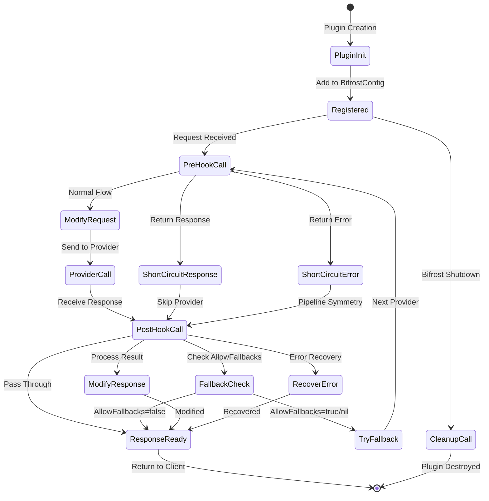
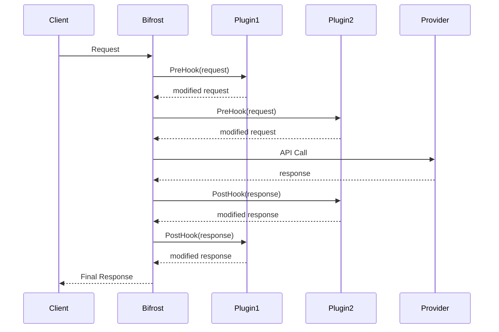
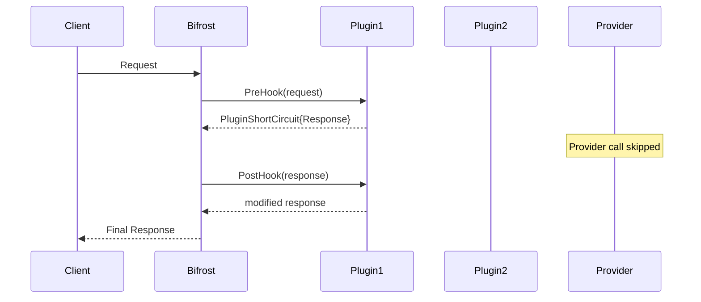
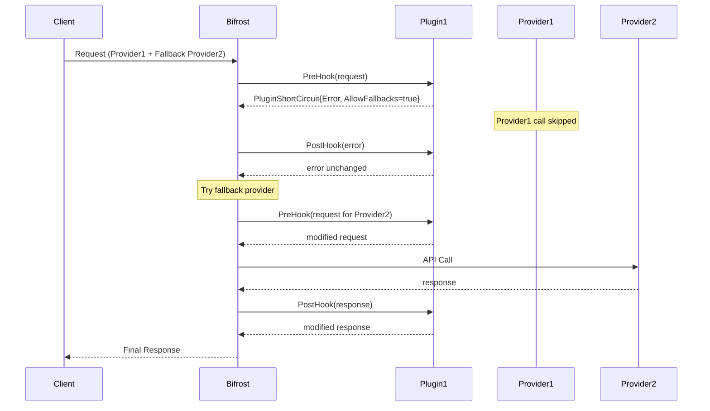
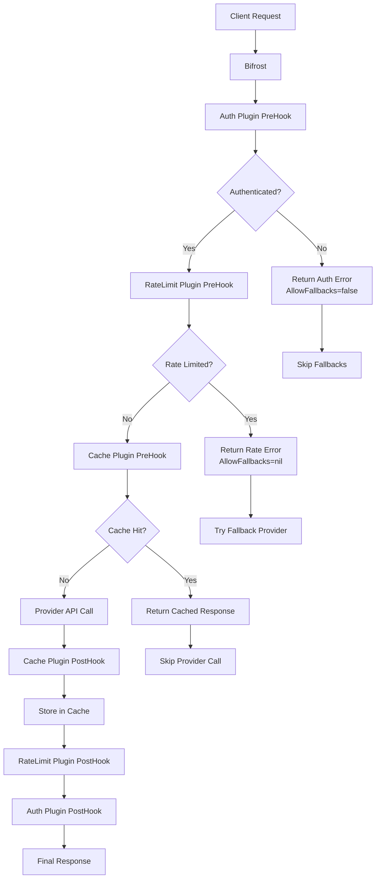

# Bifrost Plugin System

Bifrost provides a powerful plugin system that allows you to extend and customize the request/response pipeline. Plugins can implement rate limiting, caching, authentication, logging, monitoring, and more.

## Table of Contents

1. [Plugin Loading & Configuration](#1-plugin-loading--configuration)
2. [Transport Integration](#2-transport-integration)
3. [Plugin Architecture Overview](#3-plugin-architecture-overview)
4. [Plugin Interface](#4-plugin-interface)
5. [Plugin Lifecycle](#5-plugin-lifecycle)
6. [Plugin Execution Flow](#6-plugin-execution-flow)
7. [Short-Circuit Behavior](#7-short-circuit-behavior)
8. [Error Handling & Fallbacks](#8-error-handling--fallbacks)
9. [Building Custom Plugins](#9-building-custom-plugins)
10. [Plugin Examples](#10-plugin-examples)
11. [Best Practices](#11-best-practices)
12. [Plugin Development Guidelines](#12-plugin-development-guidelines)
13. [Troubleshooting Guide](#13-troubleshooting-guide)
14. [Performance Optimization](#14-performance-optimization)

## 1. Plugin Loading & Configuration

Bifrost supports **Dynamic Configuration-Based Loading** for plugins

### Dynamic Plugin Loading

Configure plugins in your `config.json` file for automatic Just-In-Time (JIT) compilation and loading:

```json
{
  "providers": {
    "openai": {
      "keys": [
        {
          "value": "env.OPENAI_API_KEY",
          "models": ["gpt-4o-mini"],
          "weight": 1.0
        }
      ]
    }
  },
  "plugins": [
    {
      "name": "maxim",
      "source": "github.com/maximhq/bifrost/plugins/maxim",
      "type": "remote",
      "config": {
        "api_key": "env.MAXIM_API_KEY",
        "log_repo_id": "env.MAXIM_LOG_REPO_ID"
      }
    },
    {
      "name": "custom-plugin",
      "source": "./local-plugins/custom",
      "type": "local",
      "config": {
        "setting": "value"
      }
    }
  ]
}
```

#### Plugin Configuration Fields

- **name**: Unique identifier for the plugin
- **source**: Go module path (for remote) or local directory path (for local)
- **type**: Either `"remote"` or `"local"`
- **config**: Plugin-specific configuration (supports `env.VARIABLE_NAME` substitution)

#### Plugin Types

**Remote Plugins**: Go modules hosted on public repositories

```json
{
  "name": "maxim",
  "source": "github.com/maximhq/bifrost/plugins/maxim",
  "type": "remote",
  "config": { ... }
}
```

**Local Plugins**: Directories containing Go plugin source code

```json
{
  "name": "custom-plugin",
  "source": "./plugins/custom",
  "type": "local",
  "config": { ... }
}
```

### Environment Variable Support

Plugin configurations support environment variable substitution using the `env.` prefix:

```json
{
  "config": {
    "api_key": "env.MY_API_KEY",
    "endpoint": "env.MY_ENDPOINT"
  }
}
```

### System Requirements

- **Go 1.21+**: Required for JIT compilation
- **CGO**: Must be enabled for plugin compilation
- **Platform**: Linux or macOS (Windows not supported due to Go plugin limitations)

**Windows Users**: Direct Go binary plugin support is not available on Windows due to Go's plugin system limitations. However, Windows users can run Bifrost with full plugin functionality using Docker.

### Docker Usage with Plugins

The Bifrost Docker image fully supports dynamic plugin loading. Here are common usage patterns:

#### Basic Configuration-Based Loading

```bash
# Run with config file containing plugin definitions
docker run -d \
  -v /path/to/config.json:/app/config/config.json \
  -p 8080:8080 \
  maximhq/bifrost
```

#### With Environment Variables

```bash
# Plugin configs can use environment variables
docker run -d \
  -v /path/to/config.json:/app/config/config.json \
  -e MAXIM_API_KEY=your-api-key \
  -e MAXIM_LOG_REPO_ID=your-repo-id \
  -e CUSTOM_PLUGIN_SETTING=value \
  -p 8080:8080 \
  maximhq/bifrost
```

#### Local Plugin Volumes

For local plugins, mount your plugin directories:

```bash
# Mount local plugins directory
docker run -d \
  --name bifrost \
  -v /path/to/config.json:/app/config/config.json \
  -v /path/to/your/plugins:/app/plugins:ro \
  -p 8080:8080 \
 maximhq/bifrost
```

**Config for local plugins in Docker:**

```json
{
  "plugins": [
    {
      "name": "my-local-plugin",
      "source": "/app/plugins/my-plugin",
      "type": "local",
      "config": {
        "setting": "env.MY_PLUGIN_SETTING"
      }
    }
  ]
}
```

#### Version Compatibility

Bifrost uses a hybrid dependency resolution approach:

1. **Development/Local**: Reads local `go.mod` files to determine dependency versions
2. **Binary/Docker**: Uses `go list` to query runtime dependencies

This ensures plugins are compiled with the same dependency versions as the main Bifrost binary, preventing version conflicts during plugin loading.

## 2. Transport Integration

### HTTP Transport Configuration

The HTTP transport (`bifrost-http`) automatically loads plugins from the configuration file and provides additional transport-specific features:

#### Configuration Options

- **-config**: Path to configuration file (required)
- **-port**: Server port (default: 8080)
- **-pool-size**: Initial connection pool size (default: 300)
- **-drop-excess-requests**: Drop excess requests when pool is full
- **-prometheus-labels**: Labels to add to Prometheus metrics

#### Built-in Transport Plugins

The HTTP transport includes these built-in plugins:

1. **Prometheus Plugin**: Automatically enabled for metrics collection
   - Exposes `/metrics` endpoint
   - Tracks request counts, latencies, and error rates
   - Configurable via `-prometheus-labels` flag

#### Plugin Loading Process

1. Configuration-based plugins are loaded first
2. Built-in transport plugins are added automatically
3. All plugins are initialized with their respective configurations

### Plugin Interface for Dynamic Loading

All plugins must implement the standard interface and provide an `Init` function for dynamic loading:

```go
package package_name

import (
    "encoding/json"
    "github.com/maximhq/bifrost/core/schemas"
)

// Plugin configuration struct
type MyPluginConfig struct {
    Setting1 string `json:"setting1"`
    Setting2 int    `json:"setting2"`
}

// Required Init function for dynamic loading
func Init(configData json.RawMessage) (schemas.Plugin, error) {
    var config MyPluginConfig
    if err := json.Unmarshal(configData, &config); err != nil {
        return nil, err
    }

    // Initialize and return your plugin
    return NewMyPlugin(config)
}

// Your plugin implementation
type MyPlugin struct {
    config MyPluginConfig
}

func NewMyPlugin(config MyPluginConfig) *MyPlugin {
    return &MyPlugin{config: config}
}

func (p *MyPlugin) GetName() string {
    return "my-plugin"
}

func (p *MyPlugin) PreHook(ctx *context.Context, req *schemas.BifrostRequest) (*schemas.BifrostRequest, *schemas.PluginShortCircuit, error) {
    // Your pre-hook logic
    return req, nil, nil
}

func (p *MyPlugin) PostHook(ctx *context.Context, result *schemas.BifrostResponse, err *schemas.BifrostError) (*schemas.BifrostResponse, *schemas.BifrostError, error) {
    // Your post-hook logic
    return result, err, nil
}

func (p *MyPlugin) Cleanup() error {
    // Cleanup logic
    return nil
}
```

## 3. Plugin Architecture Overview

Bifrost plugins follow a **PreHook → Provider → PostHook** pattern with support for short-circuiting and fallback control.

### Key Concepts

- **PreHook**: Executed before provider call - can modify requests or short-circuit
- **PostHook**: Executed after provider response - can modify responses or recover from errors
- **Short-Circuit**: Plugin can skip provider call and return response/error directly
- **Fallback Control**: Plugins can control whether fallback providers should be tried
- **Pipeline Symmetry**: Every PreHook execution gets a corresponding PostHook call

## 4. Plugin Interface

```go
type Plugin interface {
    // GetName returns the name of the plugin
    GetName() string

    // PreHook is called before a request is processed by a provider
    // Can modify request, short-circuit with response, or short-circuit with error
    PreHook(ctx *context.Context, req *BifrostRequest) (*BifrostRequest, *PluginShortCircuit, error)

    // PostHook is called after a response or after PreHook short-circuit
    // Can modify response/error or recover from errors
    PostHook(ctx *context.Context, result *BifrostResponse, err *BifrostError) (*BifrostResponse, *BifrostError, error)

    // Cleanup is called on bifrost shutdown
    Cleanup() error
}

type PluginShortCircuit struct {
    Response *BifrostResponse // If set, skip provider and return this response
    Error    *BifrostError    // If set, skip provider and return this error
}
```

## 5. Plugin Lifecycle



## 6. Plugin Execution Flow

### Normal Flow (No Short-Circuit)



### With Short-Circuit Response



### With Short-Circuit Error (Allow Fallbacks)



### Complex Plugin Decision Flow



## 7. Short-Circuit Behavior

Plugins can short-circuit the normal flow in two ways:

### 1. Short-Circuit with Response (Success)

```go
func (p *CachePlugin) PreHook(ctx *context.Context, req *BifrostRequest) (*BifrostRequest, *PluginShortCircuit, error) {
    if cachedResponse := p.getFromCache(req); cachedResponse != nil {
        // Return cached response, skip provider call
        return req, &PluginShortCircuit{
            Response: cachedResponse,
        }, nil
    }
    return req, nil, nil
}
```

### 2. Short-Circuit with Error

```go
func (p *AuthPlugin) PreHook(ctx *context.Context, req *BifrostRequest) (*BifrostRequest, *PluginShortCircuit, error) {
    if !p.isAuthenticated(req) {
        // Return error, skip provider call
        return req, &PluginShortCircuit{
            Error: &BifrostError{
                Error: ErrorField{Message: "authentication failed"},
                AllowFallbacks: &false, // Don't try other providers
            },
        }, nil
    }
    return req, nil, nil
}
```

## 8. Error Handling & Fallbacks

When plugins return errors, they control whether Bifrost should try fallback providers:

### AllowFallbacks Control

```go
// Allow fallbacks (default behavior)
&BifrostError{
    Error: ErrorField{Message: "rate limit exceeded"},
    AllowFallbacks: nil, // nil = true by default
}

// Explicitly allow fallbacks
&BifrostError{
    Error: ErrorField{Message: "temporary failure"},
    AllowFallbacks: &true,
}

// Prevent fallbacks
&BifrostError{
    Error: ErrorField{Message: "authentication failed"},
    AllowFallbacks: &false,
}
```

### Fallback Decision Matrix

| Error Type         | AllowFallbacks  | Behavior                                                   |
| ------------------ | --------------- | ---------------------------------------------------------- |
| Rate Limiting      | `nil` or `true` | ✅ Try fallbacks (other providers may not be rate limited) |
| Temporary Failure  | `nil` or `true` | ✅ Try fallbacks (may succeed with different provider)     |
| Authentication     | `false`         | ❌ No fallbacks (fundamental failure)                      |
| Validation Error   | `false`         | ❌ No fallbacks (request is invalid)                       |
| Security Violation | `false`         | ❌ No fallbacks (security concern)                         |

### PostHook Error Recovery

Plugins can recover from errors in PostHook:

```go
func (p *RetryPlugin) PostHook(ctx *context.Context, result *BifrostResponse, err *BifrostError) (*BifrostResponse, *BifrostError, error) {
    if err != nil && p.shouldRetry(err) {
        // Recover by calling provider again
        if retryResponse := p.retry(ctx); retryResponse != nil {
            return retryResponse, nil, nil // Recovered successfully
        }
    }
    return result, err, nil
}
```

## 9. Building Custom Plugins

### Basic Plugin Structure

**For Dynamic Loading (Required)**

All plugins must provide an `Init` function for dynamic loading:

```go
package plugin_name

import (
    "encoding/json"
    "github.com/maximhq/bifrost/core/schemas"
)

type CustomPluginConfig struct {
    Setting1 string `json:"setting1"`
    Setting2 int    `json:"setting2"`
}

// Required Init function for dynamic loading
// Signature: Init(config json.RawMessage) (schemas.Plugin, error)
func Init(configData json.RawMessage) (schemas.Plugin, error) {
    var config CustomPluginConfig
    if err := json.Unmarshal(configData, &config); err != nil {
        return nil, err
    }

    return NewCustomPlugin(config), nil
}

type CustomPlugin struct {
    config CustomPluginConfig
    // Add your fields here
}

func NewCustomPlugin(config CustomPluginConfig) *CustomPlugin {
    return &CustomPlugin{config: config}
}

func (p *CustomPlugin) GetName() string {
    return "custom-plugin"
}

func (p *CustomPlugin) PreHook(ctx *context.Context, req *BifrostRequest) (*BifrostRequest, *PluginShortCircuit, error) {
    // Modify request or short-circuit
    return req, nil, nil
}

func (p *CustomPlugin) PostHook(ctx *context.Context, result *BifrostResponse, err *BifrostError) (*BifrostResponse, *BifrostError, error) {
    // Modify response/error or recover from errors
    return result, err, nil
}

func (p *CustomPlugin) Cleanup() error {
    // Clean up resources
    return nil
}
```

**For Direct Instantiation (Legacy)**

```go
// Traditional constructor for direct usage
func NewCustomPlugin(config CustomPluginConfig) *CustomPlugin {
    return &CustomPlugin{config: config}
}
```

### Plugin Development Checklist

- [ ] **Implement required Init function** with signature: `Init(config json.RawMessage) (schemas.Plugin, error)`
- [ ] **Use proper package name** (not `package main`)
- [ ] Handle nil response and error in PostHook
- [ ] Set appropriate AllowFallbacks for errors
- [ ] Implement proper cleanup in Cleanup()
- [ ] Add configuration validation and JSON tags
- [ ] Write comprehensive tests including Init function
- [ ] Document behavior and configuration

## 10. Plugin Examples

### Rate Limiting Plugin

```go
type RateLimitPlugin struct {
    limiters map[ModelProvider]*rate.Limiter
    mu       sync.RWMutex
}

func NewRateLimitPlugin(limits map[ModelProvider]float64) *RateLimitPlugin {
    limiters := make(map[ModelProvider]*rate.Limiter)
    for provider, limit := range limits {
        limiters[provider] = rate.NewLimiter(rate.Limit(limit), 1)
    }
    return &RateLimitPlugin{limiters: limiters}
}

func (p *RateLimitPlugin) GetName() string {
    return "RateLimitPlugin"
}

func (p *RateLimitPlugin) PreHook(ctx *context.Context, req *BifrostRequest) (*BifrostRequest, *PluginShortCircuit, error) {
    p.mu.RLock()
    limiter, exists := p.limiters[req.Provider]
    p.mu.RUnlock()

    if exists && !limiter.Allow() {
        // Rate limited - allow fallbacks to other providers
        return req, &PluginShortCircuit{
            Error: &BifrostError{
                Error: ErrorField{
                    Message: fmt.Sprintf("rate limit exceeded for %s", req.Provider),
                },
                AllowFallbacks: nil, // Allow fallbacks by default
            },
        }, nil
    }

    return req, nil, nil
}

func (p *RateLimitPlugin) PostHook(ctx *context.Context, result *BifrostResponse, err *BifrostError) (*BifrostResponse, *BifrostError, error) {
    return result, err, nil
}

func (p *RateLimitPlugin) Cleanup() error {
    return nil
}
```

### Authentication Plugin

```go
type AuthPlugin struct {
    validator TokenValidator
}

func NewAuthPlugin(validator TokenValidator) *AuthPlugin {
    return &AuthPlugin{validator: validator}
}

func (p *AuthPlugin) GetName() string {
    return "AuthPlugin"
}

func (p *AuthPlugin) PreHook(ctx *context.Context, req *BifrostRequest) (*BifrostRequest, *PluginShortCircuit, error) {
    if !p.validator.IsValid(*ctx, req) {
        // Authentication failed - don't try fallbacks
        return req, &PluginShortCircuit{
            Error: &BifrostError{
                Error: ErrorField{
                    Message: "authentication failed",
                    Type:    &authErrorType,
                },
                AllowFallbacks: &false, // Don't try other providers
            },
        }, nil
    }

    return req, nil, nil
}

func (p *AuthPlugin) PostHook(ctx *context.Context, result *BifrostResponse, err *BifrostError) (*BifrostResponse, *BifrostError, error) {
    return result, err, nil
}

func (p *AuthPlugin) Cleanup() error {
    return p.validator.Cleanup()
}
```

### Caching Plugin with Recovery

```go
type CachePlugin struct {
    cache Cache
    ttl   time.Duration
}

func (p *CachePlugin) PreHook(ctx *context.Context, req *BifrostRequest) (*BifrostRequest, *PluginShortCircuit, error) {
    key := p.generateKey(req)
    if cachedResponse := p.cache.Get(key); cachedResponse != nil {
        // Return cached response, skip provider
        return req, &PluginShortCircuit{
            Response: cachedResponse,
        }, nil
    }

    return req, nil, nil
}

func (p *CachePlugin) PostHook(ctx *context.Context, result *BifrostResponse, err *BifrostError) (*BifrostResponse, *BifrostError, error) {
    if result != nil {
        // Cache successful response
        key := p.generateKeyFromResponse(result)
        p.cache.Set(key, result, p.ttl)
    }

    return result, err, nil
}
```

## 11. Best Practices

### Plugin Design

1. **Keep plugins focused** - Each plugin should have a single responsibility
2. **Make plugins configurable** - Use configuration structs for flexibility
3. **Handle edge cases** - Always check for nil values and error conditions
4. **Be mindful of performance** - Plugins add latency to every request

### Error Handling

1. **Default to allowing fallbacks** - Unless the error is fundamental
2. **Use appropriate error types** - Help categorize different failure modes
3. **Provide clear error messages** - Include context about what failed
4. **Consider error recovery** - PostHooks can recover from certain errors

### Resource Management

1. **Implement proper cleanup** - Release resources in Cleanup()
2. **Use context for cancellation** - Respect request timeouts
3. **Avoid memory leaks** - Clean up goroutines and connections
4. **Handle concurrent access** - Use proper synchronization

### Testing

1. **Test all code paths** - Including error conditions and edge cases
2. **Test short-circuit behavior** - Verify responses and error handling
3. **Test fallback control** - Ensure AllowFallbacks works correctly
4. **Test plugin interactions** - Verify behavior with multiple plugins

## 12. Plugin Development Guidelines

### Plugin Structure Requirements

Each plugin should be organized as follows:

```text
plugins/
└── your-plugin-name/
    ├── main.go           # Plugin implementation with Init function
    ├── plugin_test.go    # Comprehensive tests including Init
    ├── README.md         # Documentation with examples
    └── go.mod            # Module definition
```

### Required Components

**1. Init Function (Mandatory)**

Every plugin must implement the standardized Init function:

```go
// Signature defined in schemas.Init
func Init(config json.RawMessage) (schemas.Plugin, error)
```

**2. Configuration Struct**

Define a configuration struct with JSON tags:

```go
type YourPluginConfig struct {
    APIKey    string `json:"api_key"`
    Timeout   int    `json:"timeout"`
    EnableX   bool   `json:"enable_x"`
}
```

**3. Plugin Implementation**

Implement the schemas.Plugin interface:

```go
func (p *YourPlugin) GetName() string
func (p *YourPlugin) PreHook(...) (...)
func (p *YourPlugin) PostHook(...) (...)
func (p *YourPlugin) Cleanup() error
```

### Using Plugins

```go
import (
    "github.com/maximhq/bifrost/core"
    "github.com/your-org/your-plugin"
)

client, err := bifrost.Init(schemas.BifrostConfig{
    Account: &yourAccount,
    Plugins: []schemas.Plugin{
        your_plugin.NewYourPlugin(config),
        // Add more plugins as needed
    },
})
```

### Plugin Execution Order

Plugins execute in the order they are registered:

```go
Plugins: []schemas.Plugin{
    authPlugin,      // PreHook: 1st, PostHook: 3rd
    rateLimitPlugin, // PreHook: 2nd, PostHook: 2nd
    loggingPlugin,   // PreHook: 3rd, PostHook: 1st
}
```

**PreHook Order**: Auth → RateLimit → Logging → Provider  
**PostHook Order**: Provider → Logging → RateLimit → Auth

### Contribution Guidelines

1. **Design Discussion**

   - Open an issue to discuss your plugin idea
   - Explain the use case and design approach
   - Get feedback before implementation

2. **Implementation Standards**

   - Follow Go best practices and conventions
   - Include comprehensive error handling
   - Ensure thread safety where needed
   - Add extensive test coverage (>80%)

3. **Testing Requirements**

   - Unit tests for all functionality
   - Integration tests with Bifrost
   - Test error scenarios and edge cases
   - Test short-circuit behavior
   - Test fallback control

4. **Documentation Standards**
   - Clear, comprehensive README
   - Code comments for complex logic
   - Usage examples
   - Performance characteristics

### Plugin Testing Best Practices

```go
func TestYourPlugin_PreHook(t *testing.T) {
    tests := []struct {
        name           string
        config         YourPluginConfig
        request        *schemas.BifrostRequest
        expectShortCircuit bool
        expectError    bool
        expectFallbacks bool
    }{
        {
            name: "valid request passes through",
            config: YourPluginConfig{EnableFeature: true},
            request: &schemas.BifrostRequest{/* valid request */},
            expectShortCircuit: false,
        },
        {
            name: "invalid request short-circuits with error",
            config: YourPluginConfig{EnableFeature: true},
            request: &schemas.BifrostRequest{/* invalid request */},
            expectShortCircuit: true,
            expectError: true,
            expectFallbacks: false,
        },
        // Add more test cases
    }

    for _, tt := range tests {
        t.Run(tt.name, func(t *testing.T) {
            plugin := NewYourPlugin(tt.config)
            ctx := context.Background()

            req, shortCircuit, err := plugin.PreHook(&ctx, tt.request)

            // Assertions
            if tt.expectError {
                assert.NotNil(t, err)
            } else {
                assert.Nil(t, err)
            }

            if tt.expectShortCircuit {
                assert.NotNil(t, shortCircuit)
                if shortCircuit.Error != nil && shortCircuit.Error.AllowFallbacks != nil {
                    assert.Equal(t, tt.expectFallbacks, *shortCircuit.Error.AllowFallbacks)
                }
            } else {
                assert.Nil(t, shortCircuit)
            }
        })
    }
}
```

## 13. Troubleshooting Guide

### Common Issues

#### 1. Dynamic Plugin Loading Failures

**Symptoms**: Plugin fails to compile or load dynamically  
**Solutions**:

```bash
# Check Go toolchain availability
go version
go env CGO_ENABLED

# Verify plugin source exists
ls -la /path/to/plugin  # for local plugins
go get github.com/user/plugin  # test remote plugin access

# Debug plugin compilation
export BIFROST_LOG_LEVEL=debug
./bifrost-http -config config.json
```

**Common dynamic loading errors**:

- `plugin was built with a different version`: Version mismatch between main app and plugin dependencies
- `plugin initialization failed`: Plugin's `Init` function returned an error (check configuration)
- `go: module not found`: Remote plugin source is inaccessible or doesn't exist
- `plugin: symbol Init not found`: Plugin missing required `Init` function with correct signature
- `plugin: Init function signature mismatch`: Init function doesn't match required signature `func(json.RawMessage) (schemas.Plugin, error)`

#### 2. Plugin Not Being Called

**Symptoms**: Plugin hooks are never executed  
**Solutions**:

```go
// Ensure plugin is properly registered
client, err := bifrost.Init(schemas.BifrostConfig{
    Account: &account,
    Plugins: []schemas.Plugin{
        yourPlugin, // Make sure it's in the list
    },
})

// Check plugin implements interface correctly
var _ schemas.Plugin = (*YourPlugin)(nil)
```

#### 3. Short-Circuit Not Working

**Symptoms**: Provider is still called despite returning PluginShortCircuit  
**Solutions**:

```go
// Correct: Either Response OR Error, not both
return req, &schemas.PluginShortCircuit{
    Response: cachedResponse, // OR Error, not both
}, nil

// Incorrect: Don't return error with PluginShortCircuit
return req, &schemas.PluginShortCircuit{...}, fmt.Errorf("error")
```

#### 4. Fallback Behavior Not Working

**Symptoms**: Fallbacks not tried when expected, or tried when they shouldn't be  
**Solutions**:

```go
// For PreHook short-circuits, use PluginShortCircuit
return req, &schemas.PluginShortCircuit{
    Error: &schemas.BifrostError{
        Error: schemas.ErrorField{Message: "error"},
        AllowFallbacks: &false, // Explicitly control fallbacks
    },
}, nil
```

#### 5. Memory Leaks

**Solutions**:

```go
func (p *YourPlugin) Cleanup() error {
    // Close channels
    close(p.stopChan)

    // Cancel contexts
    p.cancel()

    // Close connections
    if p.conn != nil {
        p.conn.Close()
    }

    // Wait for goroutines
    p.wg.Wait()

    return nil
}
```

#### 6. Race Conditions

**Solutions**:

```go
type ThreadSafePlugin struct {
    mu    sync.RWMutex
    state map[string]interface{}
}

func (p *ThreadSafePlugin) PreHook(ctx *context.Context, req *schemas.BifrostRequest) (*schemas.BifrostRequest, *schemas.PluginShortCircuit, error) {
    p.mu.Lock()
    defer p.mu.Unlock()

    // Safe access to shared state
    p.state[req.ID] = "processing"
    return req, nil, nil
}
```

## 14. Performance Optimization

1. **Minimize Hook Latency**

   - Avoid blocking operations in hooks
   - Use goroutines for background work
   - Cache expensive computations

2. **Efficient Resource Usage**

   - Pool connections and resources
   - Use sync.Pool for frequently allocated objects
   - Implement proper cleanup

3. **Monitor Memory Usage**
   - Profile your plugin under load
   - Watch for memory leaks
   - Use appropriate data structures

## Summary

This documentation provides complete coverage for Bifrost plugin development:

- **Architecture & Lifecycle** - Understanding the plugin system and execution flow
- **Interface & Behavior** - Exact method signatures and short-circuit capabilities
- **Error Handling** - Complete control over fallback behavior with AllowFallbacks
- **Practical Examples** - Real-world plugins for rate limiting, auth, and caching
- **Development Guidelines** - Best practices, testing, and contribution standards
- **Troubleshooting** - Solutions for common issues and performance optimization
