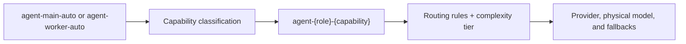

## Overview

The `agent-capability-router` is an opt-in built-in plugin for agentic clients that reuse one logical model alias while moving between planning, implementation, debugging, tool execution, exploration, and summarization.

It performs one deterministic decision during `PreRequestHook`:



The plugin rewrites only the logical model lane. It never selects a provider, API key, physical model, or fallback chain. Those decisions remain owned by the native routing plugin.

## Supported capabilities

| Capability | Typical signals | Example lane |
|---|---|---|
| `orchestrate` | architecture, planning, trade-offs, rollout design | `agent-main-orchestrate` |
| `implement` | edits, patches, refactors, code generation | `agent-worker-implement` |
| `debug` | failures, stack traces, regressions, root-cause work | `agent-main-debug` |
| `tool-loop` | successful command and tool execution | `agent-worker-tool-loop` |
| `explore` | repository search, inspection, code-flow discovery | `agent-worker-explore` |
| `summarize` | reports, recaps, release notes, status updates | `agent-main-summarize` |
| `general` | ambiguous or low-confidence requests | `agent-main-general` |

Classification uses recent normalized Chat Completions or Responses API history. Unsupported request families, unrelated model names, and disabled roles bypass the plugin unchanged.

## Configuration

The plugin is disabled unless it appears as enabled in the `plugins` array. Shadow mode defaults to `true` even after the plugin is enabled.

```json
{
  "plugins": [
    {
      "name": "agent-capability-router",
      "enabled": true,
      "config": {
        "shadow_mode": true,
        "confidence_threshold": 0.7,
        "history_messages": 8,
        "aliases": {
          "main": "agent-main-auto",
          "worker": "agent-worker-auto"
        },
        "active_roles": {
          "main": true,
          "worker": true
        }
      }
    }
  ]
}
```

| Setting | Default | Description |
|---|---:|---|
| `shadow_mode` | `true` | Log the selected lane without rewriting the request model. |
| `confidence_threshold` | `0.7` | Use the `general` lane when classifier confidence is below this value. |
| `history_messages` | `8` | Number of recent normalized messages inspected; accepted range is 1-32. |
| `aliases.main` | `agent-main-auto` | Dynamic alias managed as the main-agent role. |
| `aliases.worker` | `agent-worker-auto` | Dynamic alias managed as the worker-agent role. |
| `active_roles.main` | `true` | Enable classification for the main-agent alias. |
| `active_roles.worker` | `true` | Enable classification for the worker-agent alias. |
| `keywords` | built-in groups | Optional per-capability keyword overrides. Unspecified groups retain their defaults. |

Main and worker aliases must be different. Deterministic aliases such as `agent-main-max`, `agent-main-cheap`, provider-prefixed models, and every unrelated model name are not intercepted.

## Routing sequence

The built-in request-routing order is:

1. `governance` resolves the Virtual Key and stamps its scope.
2. `agent-capability-router` optionally rewrites a configured dynamic alias to a capability lane.
3. `routing` evaluates CEL rules and computes `complexity_tier` only when referenced.
4. `model-catalog-resolver` remains the final provider-resolution fallback.

This lets routing rules combine a lane such as `agent-main-debug` with the request's complexity tier without adding a second model call for classification.

## Safe rollout

1. Enable the plugin with `shadow_mode: true`.
2. Send representative planning, coding, debugging, tool, search, and summary requests.
3. Inspect plugin and routing-engine logs for the detected capability, confidence, signals, and proposed lane.
4. Adjust aliases, thresholds, history depth, or keyword groups from observed traffic.
5. Set `shadow_mode` to `false` only after the routing rules for every emitted lane are in place.

<Warning>
A live capability lane still needs a deterministic routing-rule or alias path. The plugin deliberately does not choose a provider or physical model when no downstream route matches.
</Warning>

## Keyword overrides

Keyword groups can be replaced independently. The supported keys are `orchestrate`, `implement`, `debug`, `tool-loop`, `explore`, `summarize`, and `general`.

```json
{
  "keywords": {
    "explore": ["inventory", "trace the flow", "locate"],
    "debug": ["incident", "regression", "root cause"]
  }
}
```

Tool-call and tool-result structure remains a strong signal even when keyword lists are customized. Binary data URLs, file payloads, and oversized strings are excluded from text extraction.
