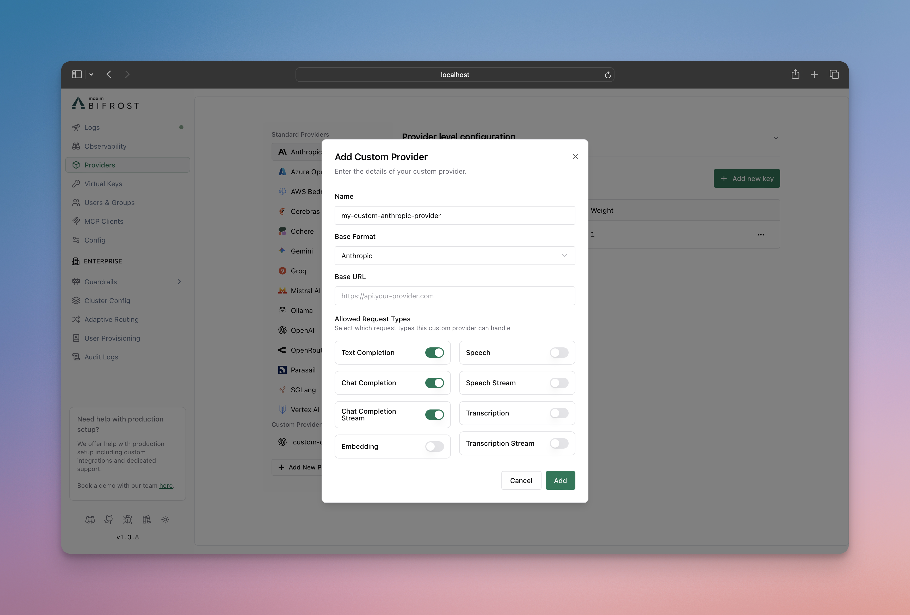

## What Are Custom Providers?

Custom providers allow you to create multiple instances of the same base provider, each with different configurations and access patterns. The key feature is request type control, which enables you to restrict what operations each custom provider instance can perform.

Think of custom providers as "multiple views" of the same underlying provider - you can create several custom configurations for OpenAI, Anthropic, or any other provider, each optimized for different use cases while sharing the same API keys and base infrastructure.

## Key Benefits

- **Multiple Provider Instances**: Create several configurations of the same base provider (e.g., multiple OpenAI configurations)
- **Request Type Control**: Restrict which operations (chat, embeddings, speech, etc.) each custom provider can perform
- **Custom Naming**: Use descriptive names like "openai-production" or "openai-staging"
- **Provider Reuse**: Maximize the value of your existing provider accounts

## How to Configure

Custom providers are configured using the `custom_provider_config` field, which extends the standard provider configuration. The main purpose is to create multiple instances of the same base provider, each with different request type restrictions.

**Important**: The `allowed_requests` field follows a specific behavior:
- **Omitted entirely**: All operations are allowed (default behavior)
- **Partially specified**: Only explicitly set fields are allowed, others default to `false`
- **Fully specified**: Only the operations you explicitly enable are allowed
- **Present but empty object (`{}`)**: All fields are set to false

<Tabs group="custom-provider-config">

<Tab title="Using Web UI">



1. Go to **http://localhost:8080**
2. Navigate to **"Providers"** in the sidebar
3. Click **"Add New Provider"**
4. Choose a unique provider name (e.g., "openai-custom")
5. Select the base provider type (e.g., "openai")
6. Configure which request types are allowed
7. Save configuration

</Tab>

<Tab title="Using API">

```bash
# Create a chat-only custom provider
curl --location 'http://localhost:8080/api/providers' \
--header 'Content-Type: application/json' \
--data '{
    "provider": "openai-custom",
    "keys": [
        {
            "name": "openai-custom-key-1",
            "value": "env.OPENAI_API_KEY",
            "models": ["*"],
            "weight": 1.0
        }
    ],
    "custom_provider_config": {
        "base_provider_type": "openai",
        "allowed_requests": {
            "list_models": false,
            "text_completion": false,
            "text_completion_stream": false,
            "chat_completion": true,
            "chat_completion_stream": true,
            "responses": false,
            "responses_stream": false,
            "embedding": false,
            "speech": false,
            "speech_stream": false,
            "transcription": false,
            "transcription_stream": false
        },
        "request_path_overrides": {
            "chat_completion": "/v1/chat/completions"
        }
    }
}'
```

</Tab>

<Tab title="Using config.json">

```json
{
    "providers": {
        "openai-custom": {
            "keys": [
                {
                    "name": "openai-custom-key-1",
                    "value": "env.OPENAI_API_KEY",
                    "models": ["*"],
                    "weight": 1.0
                }
            ],
            "custom_provider_config": {
                "base_provider_type": "openai",
                "allowed_requests": {
                    "list_models": false,
                    "text_completion": false,
                    "text_completion_stream": false,
                    "chat_completion": true,
                    "chat_completion_stream": true,
                    "responses": false,
                    "responses_stream": false,
                    "embedding": false,
                    "speech": false,
                    "speech_stream": false,
                    "transcription": false,
                    "transcription_stream": false
                },
                "request_path_overrides": {
                    "chat_completion": "/v1/chat/completions"
                }
            }
        }
    }
}
```

</Tab>

<Tab title="Go SDK">

Create a custom provider using the Go SDK by implementing the Account interface with custom provider configuration:

```go
package main

import (
    "context"
    "fmt"
    "os"
    "time"

    "github.com/maximhq/bifrost/core/schemas"
)

// Define custom provider name
const ProviderOpenAICustom = schemas.ModelProvider("openai-custom")

type MyAccount struct{}

func (a *MyAccount) GetConfiguredProviders() ([]schemas.ModelProvider, error) {
    return []schemas.ModelProvider{
        schemas.OpenAI,
        ProviderOpenAICustom, // Include your custom provider
    }, nil
}

func (a *MyAccount) GetKeysForProvider(ctx context.Context, provider schemas.ModelProvider) ([]schemas.Key, error) {
    switch provider {
    case schemas.OpenAI:
        return []schemas.Key{{
            Value:  os.Getenv("OPENAI_API_KEY"),
            Models: []string{},
            Weight: 1.0,
        }}, nil
    case ProviderOpenAICustom:
        return []schemas.Key{{
            Value:  os.Getenv("OPENAI_CUSTOM_API_KEY"), // API key for OpenAI-compatible endpoint
            Models: []string{},
            Weight: 1.0,
        }}, nil
    }
    return nil, fmt.Errorf("provider %s not supported", provider)
}

func (a *MyAccount) GetConfigForProvider(provider schemas.ModelProvider) (*schemas.ProviderConfig, error) {
    switch provider {
    case schemas.OpenAI:
        return &schemas.ProviderConfig{
            NetworkConfig:            schemas.DefaultNetworkConfig,
            ConcurrencyAndBufferSize: schemas.DefaultConcurrencyAndBufferSize,
        }, nil
    case ProviderOpenAICustom:
        return &schemas.ProviderConfig{
            NetworkConfig: schemas.NetworkConfig{
                BaseURL:                        "https://your-openai-compatible-endpoint.com", // Custom base URL
                DefaultRequestTimeoutInSeconds: 60,
                MaxRetries:                     1,
                RetryBackoffInitial:            100 * time.Millisecond,
                RetryBackoffMax:                2 * time.Second,
            },
            ConcurrencyAndBufferSize: schemas.ConcurrencyAndBufferSize{
                Concurrency: 3,
                BufferSize:  10,
            },
            CustomProviderConfig: &schemas.CustomProviderConfig{
                BaseProviderType: schemas.OpenAI, // Use OpenAI protocol
                AllowedRequests: &schemas.AllowedRequests{
                    TextCompletion:       false,
                    TextCompletionStream: false,
                    ChatCompletion:       true,  // Enable chat completion
                    ChatCompletionStream: true,  // Enable streaming
                    Responses:            false,
                    ResponsesStream:      false,
                    Embedding:            false,
                    Speech:               false,
                    SpeechStream:         false,
                    Transcription:        false,
                    TranscriptionStream:  false,
                },
                RequestPathOverrides: map[schemas.RequestType]string{
                    schemas.ChatCompletionRequest:       "/v1/chat/completions",
                    schemas.ChatCompletionStreamRequest: "/v1/chat/completions",
                },
            },
        }, nil
    }
    return nil, fmt.Errorf("provider %s not supported", provider)
}

```

</Tab>

</Tabs>

## Configuration Options

### Allowed Request Types

Control which operations your custom provider can perform. The behavior is:

- **If `allowed_requests` is not specified**: All operations are allowed by default
- **If `allowed_requests` is specified**: Only the fields set to `true` are allowed, all others default to `false`

Available operations:

- **`text_completion`**: Legacy text completion requests
- **`text_completion_stream`**: Streaming text completion requests
- **`chat_completion`**: Standard chat completion requests
- **`chat_completion_stream`**: Streaming chat responses
- **`responses`**: Standard responses requests
- **`responses_stream`**: Streaming responses requests
- **`embedding`**: Text embedding generation
- **`speech`**: Text-to-speech conversion
- **`speech_stream`**: Streaming text-to-speech
- **`transcription`**: Speech-to-text conversion
- **`transcription_stream`**: Streaming speech-to-text
- **`rerank`**: Document reranking via `/v1/rerank` (OpenAI-compatible base only)
- **`decisions`**: Decision requests via `/v1/decisions`. A `typesafe` base serves them natively, and so does an `openai` base for the models the datasheet marks `supports_decisions` (such as `gpt-6-luna`); other models and bases emulate them through the Responses API

### Base Provider Types

Custom providers can be built on these supported providers:

- `openai` - OpenAI API
- `anthropic` - Anthropic Claude
- `bedrock` - AWS Bedrock
- `cohere` - Cohere
- `gemini` - Gemini
- `replicate` - Replicate
- `typesafe` - TypeSafe (decisions and model listing only; see [TypeSafe](/providers/supported-providers/typesafe#custom-typesafe-providers))

### Authentication (OAuth-minted keys)

A custom provider on the `openai` base normally carries a static API key in each key's `value`. Upstreams that sit behind an identity provider and issue short-lived access tokens can instead be given an `oauth_key_config` on the key: leave `value` empty and Bifrost obtains the token from the token endpoint, sends it as the bearer, caches it per credential, collapses concurrent requests onto one mint, and refreshes it a minute before it expires. A rejected credential is backed off rather than retried on every request. The same machinery serves Databricks OAuth M2M; it applies to the standard `openai` provider too.

Two grants are supported:

- **`client_credentials`** (RFC 6749 §4.4): a client ID and secret, sent as HTTP Basic auth by default or as form fields with `auth_style: "body"`.
- **`jwt_bearer`** (RFC 7523): Bifrost signs a JWT assertion (`iss`, `sub`, `aud`, `iat`, `nbf`, `exp`, `jti`) with your RSA or EC private key and exchanges it for a token.

A non-empty `value` always wins, so a key can carry both while you migrate. `oauth_key_config` is only accepted on `openai` and on custom providers whose base is `openai`; elsewhere it is refused at configuration time rather than silently ignored.

<Tabs group="custom-provider-oauth">

<Tab title="Using Web UI">

1. Open the custom provider under **Providers** and click **Add Key**
2. Under **Authentication Method** choose **OAuth (minted token)**
3. Pick the grant, enter the **Token URL**, then the client ID and secret (client credentials) or the private key, issuer and audience (JWT bearer)
4. Add scopes if the identity provider needs them, then save

The stored key shows the token URL in plain text and masks the client secret and private key, like every other credential.

</Tab>

<Tab title="Using API">

```bash
# Client credentials
curl --location 'http://localhost:8080/api/providers/acme-llm/keys' \
--header 'Content-Type: application/json' \
--data '{
    "name": "acme-oauth",
    "models": ["*"],
    "weight": 1.0,
    "oauth_key_config": {
        "grant_type": "client_credentials",
        "token_url": "https://idp.acme.example/oauth2/token",
        "client_id": "env.ACME_CLIENT_ID",
        "client_secret": "env.ACME_CLIENT_SECRET",
        "scopes": ["inference"]
    }
}'

# JWT bearer
curl --location 'http://localhost:8080/api/providers/acme-llm/keys' \
--header 'Content-Type: application/json' \
--data '{
    "name": "acme-jwt",
    "models": ["*"],
    "weight": 1.0,
    "oauth_key_config": {
        "grant_type": "jwt_bearer",
        "token_url": "https://idp.acme.example/oauth2/token",
        "private_key": "env.ACME_PRIVATE_KEY",
        "issuer": "svc-bifrost",
        "audience": "https://idp.acme.example/oauth2/token",
        "signing_algorithm": "ES256"
    }
}'
```

</Tab>

<Tab title="Using config.json">

```json
{
  "providers": {
    "acme-llm": {
      "custom_provider_config": {
        "base_provider_type": "openai"
      },
      "network_config": {
        "base_url": "https://llm.acme.example/v1"
      },
      "keys": [
        {
          "name": "acme-oauth",
          "models": ["*"],
          "weight": 1.0,
          "oauth_key_config": {
            "grant_type": "client_credentials",
            "token_url": "https://idp.acme.example/oauth2/token",
            "client_id": "env.ACME_CLIENT_ID",
            "client_secret": "env.ACME_CLIENT_SECRET",
            "scopes": ["inference"],
            "audience": "api://acme-llm"
          }
        }
      ]
    }
  }
}
```

</Tab>

</Tabs>

#### `oauth_key_config` reference

| Field | Required | Description |
|-------|----------|-------------|
| `grant_type` | ✅ | `client_credentials` or `jwt_bearer`. |
| `token_url` | ✅ | The token endpoint. Must be `https` (plain `http` is accepted for loopback hosts only) and must not carry userinfo, a query or a fragment, since the URL is shown in plain text when the key is read back. Supports `env.` references. |
| `client_id` | client credentials | Client ID. |
| `client_secret` | client credentials | Client secret. |
| `auth_style` | | `header` (HTTP Basic, default) or `body` (form fields) for the client credentials. |
| `private_key` | JWT bearer | RSA or EC private key in PEM form. PKCS#1, SEC 1 and PKCS#8 all work; a PEM pasted with literal `\n` is repaired. |
| `issuer` | JWT bearer | The `iss` claim, usually the client or service account ID. |
| `subject` | | The `sub` claim. Defaults to `issuer`. |
| `audience` | JWT bearer | The `aud` claim, usually the token endpoint. For client credentials it is sent as the optional `audience` form parameter. |
| `key_id` | | The `kid` header, when the identity provider selects keys by ID. |
| `signing_algorithm` | | `RS256` (default), `RS384`, `RS512`, `PS256`, `PS384`, `PS512`, `ES256`, `ES384`, `ES512`. Symmetric algorithms are refused. |
| `assertion_lifetime_seconds` | | Seconds from issue until the assertion expires (`exp` = now + value). Default `300`, maximum `3600`. Bifrost backdates `iat` and `nbf` by 30 seconds for clock skew, so the assertion's `exp - iat` span is this value plus 30; pick a value 30 seconds under any span limit your identity provider enforces. |
| `scopes` | | Scopes requested, sent space-joined. |
| `extra_params` | | Extra form parameters sent on every token request. Values are masked when the key is read back, and the column is encrypted at rest only when encryption is enabled (`encryption_key` or `BIFROST_ENCRYPTION_KEY`, see [config.json](/deployment-guides/config-json)), like every other credential column. This map is not the place for a credential: use `client_secret` or `private_key`. |

**Token lifetime.** Bifrost normally refreshes a token one minute before the expiry the endpoint reported. If the token already has one minute or less left when it is minted, Bifrost refreshes it halfway through its remaining lifetime (a 30-second token is re-minted after about 15 seconds). A token endpoint that returns no `expires_in` is assumed to live five minutes, so such a token is re-minted roughly every four minutes.

**Failures.** A rejected mint is cached and retried with a backoff: 2 s doubling to 60 s for a credential or configuration fault (any 4xx other than 429), 0.5 s doubling to 10 s for a rate limit, a 5xx or an unreachable endpoint; a `Retry-After` from the endpoint extends the window. Separately from the backoff, fallbacks are gated by the kind of failure: a 4xx other than 429 blocks them, since another provider cannot repair a bad credential, while a 429, a 5xx or an unreachable endpoint leaves the configured fallbacks available.

### Streaming Termination

Most OpenAI-compatible providers end a stream with a `data: [DONE]` marker, and Bifrost reads until it arrives so that a trailing usage-only chunk — which many providers send after `finish_reason` — is not lost.

Bifrost also ends the stream on its own, with no configuration, when an upstream omits `[DONE]` after `finish_reason`:

- the upstream closes the connection: the stream ends immediately
- the upstream keeps the connection open and sends SSE heartbeat comments: the stream ends on the second consecutive comment after `finish_reason`, so a trailing usage chunk is still collected
- the upstream keeps the connection open and sends nothing: the stream ends cleanly once `stream_idle_timeout_in_seconds` elapses, with the buffered `finish_reason`. Usage is unavailable for that request if it never arrived

Set `does_not_send_done_marker` to `true` when your upstream instead ends streams on `finish_reason` and never sends `[DONE]`. Bifrost then stops reading as soon as `finish_reason` arrives:

```json
{
    "custom_provider_config": {
        "base_provider_type": "openai",
        "does_not_send_done_marker": true
    }
}
```

<Warning>
On its own, `does_not_send_done_marker` **discards a trailing usage-only chunk**, because that chunk arrives *after* the `finish_reason` the stream stopped on. The request is then recorded with zero tokens and zero cost, which affects logging, pricing, virtual-key usage, budgets and cost attribution. Add `wait_for_usage` if your upstream sends one.
</Warning>

Add `wait_for_usage` when your upstream ends on `finish_reason` but still sends that trailing usage chunk. Bifrost requests it on every stream via `stream_options.include_usage`, so this keeps the read loop open just long enough to collect it:

```json
{
    "custom_provider_config": {
        "base_provider_type": "openai",
        "does_not_send_done_marker": true,
        "wait_for_usage": true
    }
}
```

With `wait_for_usage` the stream ends on whichever comes first: the usage chunk, two consecutive heartbeat comments, the upstream closing the connection, or `stream_idle_timeout_in_seconds`. If your upstream may go silent without ever sending usage, set `network_config.stream_idle_timeout_in_seconds` low (`5`, say) on that provider so the last case does not hold the request for the default 120 seconds.


### Request Path Overrides

The `request_path_overrides` field allows you to override the default API endpoint paths for specific request types. This is useful when:

- Connecting to custom or self-hosted model providers
- Integrating with proxies that expect specific URL patterns
- Using provider forks with modified API paths

<Warning>
**Not Supported:** `request_path_overrides` is not supported for `gemini` and `bedrock` base provider types due to their specialized API implementations.
</Warning>

The field accepts a mapping of request types to either custom **paths** or **full URLs**:

**Using Paths (relative to `base_url`):**
```json
{
    "request_path_overrides": {
        "chat_completion": "/v1/chat/completions",
        "chat_completion_stream": "/v1/chat/completions",
        "embedding": "/v1/embeddings",
        "text_completion": "/v1/completions"
    }
}
```

**Using Full URLs (bypasses `base_url`):**
```json
{
    "request_path_overrides": {
        "chat_completion": "https://specific-endpoint.com/chat",
        "embedding": "http://another-service:8080/embeddings"
    }
}
```

<Info>
When a full URL (with scheme and host) is provided in `request_path_overrides`, Bifrost will use that URL directly and ignore the `base_url` from `network_config` for that specific request type. This allows you to route different request types to completely different endpoints.
</Info>

**Example: OpenAI-Compatible Endpoint with Custom Paths**

```json
{
    "custom-llm": {
        "keys": [{ "name": "custom-llm-key-1", "value": "env.PROVIDER_API_KEY", "models": ["*"], "weight": 1.0 }],
        "network_config": {
            "base_url": "https://your-openai-compatible-endpoint.com"
        },
        "custom_provider_config": {
            "base_provider_type": "openai",
            "allowed_requests": {
                "chat_completion": true,
                "chat_completion_stream": true
            },
            "request_path_overrides": {
                "chat_completion": "/api/v2/chat",
                "chat_completion_stream": "/api/v2/chat"
            }
        }
    }
}
```

In this example, instead of using OpenAI's default `/v1/chat/completions` path, requests will be sent to `https://custom-endpoint.example.com/api/v2/chat`.

### TLS for Self-Signed or Internal Certificates

When connecting to providers with HTTPS endpoints that use self-signed certificates or internal CAs (e.g., air-gapped environments, internal services), you can configure TLS in `network_config`:

| Field | Type | Description |
|-------|------|-------------|
| `insecure_skip_verify` | boolean | Disable TLS certificate verification. Use only for trusted internal environments. **Not recommended for production.** |
| `ca_cert_pem` | string | PEM-encoded CA certificate to trust for provider connections. Use when the endpoint uses a custom CA. |

These options are mutually exclusive. Do not set `insecure_skip_verify: true` together with `ca_cert_pem`; provider config validation rejects that combination.

**Option 1: Skip verification (air-gapped / self-signed)**

```json
{
    "my-air-gapped-provider": {
        "keys": [{ "name": "key-1", "value": "env.API_KEY", "models": ["*"], "weight": 1.0 }],
        "network_config": {
            "base_url": "https://internal-llm.example.com",
            "insecure_skip_verify": true
        },
        "custom_provider_config": {
            "base_provider_type": "openai",
            "allowed_requests": {
                "chat_completion": true,
                "chat_completion_stream": true
            }
        }
    }
}
```

**Option 2: Custom CA certificate (preferred when you have the CA)**

```json
{
    "my-internal-provider": {
        "keys": [{ "name": "key-1", "value": "env.API_KEY", "models": ["*"], "weight": 1.0 }],
        "network_config": {
            "base_url": "https://internal-llm.example.com",
            "ca_cert_pem": "-----BEGIN CERTIFICATE-----\n...\n-----END CERTIFICATE-----"
        },
        "custom_provider_config": {
            "base_provider_type": "openai",
            "allowed_requests": {
                "chat_completion": true,
                "chat_completion_stream": true
            }
        }
    }
}
```

<Warning>
Using `insecure_skip_verify` disables all certificate verification and is insecure. Prefer `ca_cert_pem` when you have the CA certificate. Only use `insecure_skip_verify` in trusted, isolated environments (e.g., air-gapped networks).
</Warning>

## Use Cases

### 1. Environment-Specific Configurations

Create different configurations for production, staging, and development environments:

```json
{
    "openai-production": {
        "keys": [{ "name": "openai-prod-key-1", "value": "env.PROVIDER_API_KEY", "models": ["*"], "weight": 1.0 }],
        "custom_provider_config": {
            "base_provider_type": "openai",
            "allowed_requests": {
                "chat_completion": true,
                "chat_completion_stream": true,
                "embedding": true,
                "speech": true,
                "speech_stream": true
            }
        }
    },
    "openai-staging": {
        "keys": [{ "name": "openai-stage-key-1", "value": "env.PROVIDER_API_KEY", "models": ["*"], "weight": 1.0 }],
        "custom_provider_config": {
            "base_provider_type": "openai",
            "allowed_requests": {
                "chat_completion": true,
                "chat_completion_stream": true,
                "embedding": true,
                "speech": false,
                "speech_stream": false
            }
        }
    },
    "openai-dev": {
        "keys": [{ "name": "openai-dev-key-1", "value": "env.PROVIDER_API_KEY", "models": ["*"], "weight": 1.0 }],
        "custom_provider_config": {
            "base_provider_type": "openai",
            "allowed_requests": {
                "chat_completion": true,
                "chat_completion_stream": false,
                "embedding": false,
                "speech": false,
                "speech_stream": false
            }
        }
    }
}
```

### 2. Role-Based Access Control

Restrict capabilities based on user roles or team permissions. You can then create virtual keys for better management of who can access which providers, providing granular control over team permissions and resource usage. This integrates seamlessly with Bifrost's **[governance](../features/governance/virtual-keys)** features for comprehensive access control and monitoring:

```json
{
    "openai-developers": {
        "keys": [{ "name": "openai-developers-key-1", "value": "env.PROVIDER_API_KEY", "models": ["*"], "weight": 1.0 }],
        "custom_provider_config": {
            "base_provider_type": "openai",
            "allowed_requests": {
                "chat_completion": true,
                "chat_completion_stream": true,
                "embedding": true,
                "text_completion": true
            }
        }
    },
    "openai-analysts": {
        "keys": [{ "name": "openai-analysts-key-1", "value": "env.PROVIDER_API_KEY", "models": ["*"], "weight": 1.0 }],
        "custom_provider_config": {
            "base_provider_type": "openai",
            "allowed_requests": {
                "chat_completion": true,
                "embedding": true
            }
        }
    },
    "openai-support": {
        "keys": [{ "name": "openai-support-key-1", "value": "env.PROVIDER_API_KEY", "models": ["*"], "weight": 1.0 }],
        "custom_provider_config": {
            "base_provider_type": "openai",
            "allowed_requests": {
                "chat_completion": true,
                "chat_completion_stream": false
            }
        }
    }
}
```

### 3. Feature Testing and Rollouts

Test new features with limited user groups:

```json
{
    "openai-beta-streaming": {
        "keys": [{ "name": "openai-streaming-key-1", "value": "env.PROVIDER_API_KEY", "models": ["*"], "weight": 1.0 }],
        "custom_provider_config": {
            "base_provider_type": "openai",
            "allowed_requests": {
                "chat_completion": true,
                "chat_completion_stream": true,
                "embedding": false
            }
        }
    },
    "openai-stable": {
        "keys": [{ "name": "openai-stable-key-1", "value": "env.PROVIDER_API_KEY", "models": ["*"], "weight": 1.0 }],
        "custom_provider_config": {
            "base_provider_type": "openai",
            "allowed_requests": {
                "chat_completion": true,
                "chat_completion_stream": false,
                "embedding": true
            }
        }
    }
}
```

## Making Requests

Use your custom provider name in requests:

```bash
# Request to custom provider
curl --location 'http://localhost:8080/v1/chat/completions' \
--header 'Content-Type: application/json' \
--data '{
    "model": "openai-custom/gpt-4o-mini",
    "messages": [
        {"role": "user", "content": "Hello!"}
    ]
}'
```

## Relationship to Provider Configuration

Custom providers extend the standard provider configuration system. They inherit all the capabilities of their base provider while adding request type restrictions.

**Learn more about provider configuration:**
- **[Gateway Provider Configuration](../quickstart/gateway/provider-configuration)**
- **[Go SDK Provider Configuration](../quickstart/go-sdk/provider-configuration)**

## Next Steps

- **[Fallbacks](../features/fallbacks)** - Automatic failover between providers
- **[Load Balancing](../features/keys-management)** - Intelligent API key management with weighted load balancing
- **[Governance](../features/governance/virtual-keys)** - Advanced access control and monitoring
