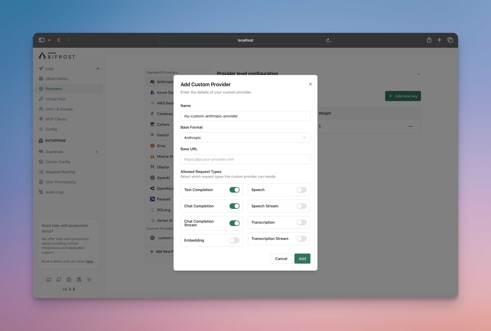

## Overview

Azure model router is an Azure OpenAI deployment family that automatically picks the best underlying model for a request. Bifrost's native Azure provider supports model-router deployments for Chat Completions today.

The Responses API is not yet exposed for model-router deployments through the native Azure provider. Until that lands, you can reach model-router's Responses endpoint directly through your Azure AI Foundry project by configuring **Azure Foundry as a custom provider**, as described below.

<Note>
This page covers model-router specifically. For general endpoint setup, authentication, aliases, and deployment configuration on the native Azure provider, see the main [Azure provider guide](./azure).
</Note>

### Supported operations

| Operation | Support | Notes |
| --- | --- | --- |
| Chat Completions | ✅ | Native Azure provider or Azure Foundry custom provider |
| Chat Completions (stream) | ✅ | Native Azure provider or Azure Foundry custom provider |
| Responses API | ⚠️ | Requires adding Azure Foundry as a custom-provider |
| Responses API (stream) | ⚠️ | Requires adding Azure Foundry as a custom-provider |

---

## Adding Azure Foundry as a custom provider

Azure AI Foundry projects expose an OpenAI-Responses-API-shaped endpoint (`*.ai.azure.com/api/projects/<project>/openai/v1/responses`) that is distinct from the classic Azure OpenAI resource endpoint (`*.openai.azure.com`) used by the native Azure provider. You can reach it by creating a [custom provider](../custom-providers) named e.g. `azure-foundry` with `base_provider_type: "openai"` and a full-URL [request path override](../custom-providers#request-path-overrides) for the `responses` and `responses_stream` request types. A full URL in `request_path_overrides` bypasses `base_url` entirely, so requests go straight to your Azure AI Foundry project's Responses endpoint.

<Tabs group="config-method">
<Tab title="Web UI">



1. Go to **Providers** in the sidebar and click **Add New Provider**.
2. Name the provider `azure-foundry` (or similar).
3. Set **Base Format** to **OpenAI**.
4. Set **Base URL** to `https://<your-resource>.ai.azure.com/openai`.
5. Under **Allowed Request Types**, toggle on **Responses** and **Responses Stream**.
6. Click the settings icon next to each and enter the full Azure AI Foundry Responses URL in **Custom Path or URL**:
   `https://<your-resource>.ai.azure.com/api/projects/<your-project>/openai/v1/responses`
7. Add your Azure API key and save.

</Tab>

<Tab title="API">
Refer to the API documentation for [Provider Keys Management](https://docs.getbifrost.ai/api-reference/providers/create-a-key-for-a-provider).
</Tab>
<Tab title="config.json">

```json
{
    "providers": {
        "azure-foundry": {
            "keys": [
                {
                    "name": "azure-foundry-key-1",
                    "value": "env.AZURE_API_KEY",
                    "models": ["*"],
                    "weight": 1.0
                }
            ],
            "network_config": {
                "base_url": "https://<your-resource>.ai.azure.com/openai"
            },
            "custom_provider_config": {
                "base_provider_type": "openai",
                "allowed_requests": {
                    "responses": true,
                    "responses_stream": true
                },
                "request_path_overrides": {
                    "responses": "https://<your-resource>.ai.azure.com/api/projects/<your-project>/openai/v1/responses",
                    "responses_stream": "https://<your-resource>.ai.azure.com/api/projects/<your-project>/openai/v1/responses"
                }
            }
        }
    }
}
```

| Field | Type | Required | Description |
|-------|------|----------|-------------|
| `custom_provider_config.base_provider_type` | string | Yes | Must be `openai` so requests are shaped as OpenAI-compatible calls |
| `custom_provider_config.allowed_requests` | object | No | Restricts this provider to only the request types you enable |
| `custom_provider_config.request_path_overrides` | object | No | Full URL per request type; bypasses `network_config.base_url` |
| `network_config.base_url` | string | No | Used for any request type without a full-URL override |

</Tab>
</Tabs>

<Note>
If you also want Chat Completions routed through this same custom provider instead of the native Azure provider, enable `chat_completion` / `chat_completion_stream` in `allowed_requests` and add matching entries in `request_path_overrides`. Otherwise, keep using the native Azure provider for Chat Completions and this custom provider only for Responses.
</Note>

---

## Usage

Call the Responses endpoint using the `azure-foundry` custom provider and your model-router deployment name:

```bash
curl -X POST http://localhost:8080/v1/responses \
  -H "Content-Type: application/json" \
  -d '{
    "model": "azure-foundry/model-router",
    "input": "Write a short haiku about gateways."
  }'
```

<Note>
If you need to inspect provider-specific extra parameters, enable [Send Back Raw Response](/providers/request-options#send-back-raw-response). If you do not want those raw bytes persisted in logs, also set [Store Raw Request/Response](/providers/request-options#store-raw-request/response).
</Note>

---

## Limitations

- Chat Completions for model-router deployments works through the native Azure provider; no extra configuration is needed.
- Responses support for model-router requires the custom-provider workaround on this page until native support is added to the Azure provider.
- This page does not change Azure authentication or endpoint setup for the native Azure provider - see the [Azure provider guide](./azure) for that.

## Related docs

- [Azure](./azure)
- [Custom Providers](../custom-providers)
- [Request Options](/providers/request-options)