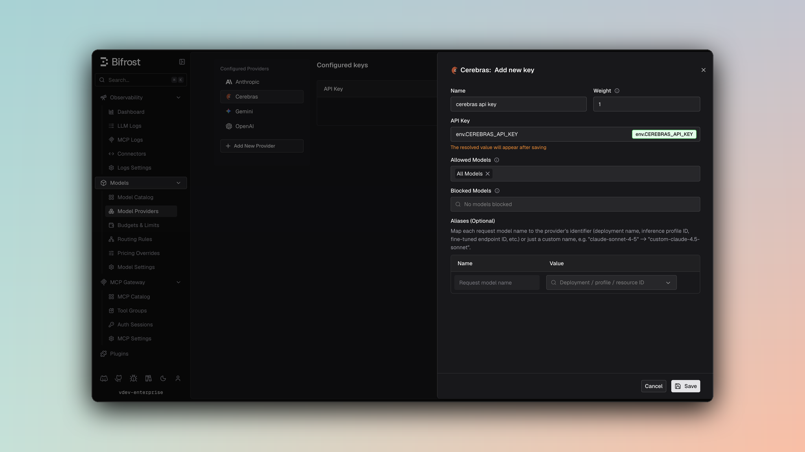

## Overview

Cerebras is a **fully OpenAI-compatible provider** leveraging the complete set of OpenAI API features. Bifrost delegates all functionality to the OpenAI provider implementation with standard parameter filtering. Key characteristics:
- **Complete OpenAI compatibility** - All chat, text, and streaming features supported
- **Full tool calling** - Function definitions and parallel tool execution
- **Streaming support** - Server-Sent Events with token usage tracking
- **Parameter preservation** - Passes through all standard OpenAI parameters
- **Responses API** - Full support with format conversion

### Supported Operations

| Operation | Non-Streaming | Streaming | Endpoint |
|-----------|---------------|-----------|----------|
| Chat Completions | ✅ | ✅ | `/v1/chat/completions` |
| Responses API | ✅ | ✅ | `/v1/chat/completions` |
| Text Completions | ✅ | ✅ | `/v1/completions` |
| List Models | ✅ | - | `/v1/models` |
| Embeddings | ❌ | ❌ | - |
| Image Generation | ❌ | ❌ | - |
| Speech (TTS) | ❌ | ❌ | - |
| Transcriptions (STT) | ❌ | ❌ | - |
| Files | ❌ | ❌ | - |
| Batch | ❌ | ❌ | - |

<Note>
**Unsupported Operations** (❌): Embeddings, Image Generation, Speech, Transcriptions, Files, and Batch are not supported by the upstream Cerebras API. These return `UnsupportedOperationError`.
</Note>

## Setup & Configuration

Configure Cerebras as a provider.

<Tabs>
<Tab title="Web UI">



1. Navigate to **Models** > **Model Providers**. Look for **Cerebras** under **Configured Providers**. If it is missing, click on **Add New Provider** and select **Cerebras**.
2. Click **Add Key** or edit an existing key.
3. Set a name for your key.
4. Paste your API key directly or use an environment variable (for example, `env.CEREBRAS_API_KEY`).
5. Set **Allowed Models** to **All Models** (default) or the specific model allowlist you want this key to serve.
6. Save the provider configuration.

</Tab>
<Tab title="config.json">

```json
{
  "providers": {
    "cerebras": {
      "keys": [
        {
          "name": "cerebras-key-1",
          "value": "env.CEREBRAS_API_KEY",
          "models": [
            "*"
          ],
          "weight": 1.0
        }
      ]
    }
  }
}
```

</Tab>
<Tab title="API">
Refer to the API documentation for [Provider Keys Management](https://docs.getbifrost.ai/api-reference/providers/create-a-key-for-a-provider).
</Tab>
<Tab title="Go SDK">

```go
case schemas.Cerebras:
    return []schemas.Key{{
        Name:   "cerebras-key-1",
        Value:  *schemas.NewSecretVar("env.CEREBRAS_API_KEY"),
        Models: []string{"*"},
        Weight: 1.0,
    }}, nil
```

</Tab>
</Tabs>

---

# 1. Chat Completions

## Request Parameters

Cerebras supports all standard OpenAI chat completion parameters. For full parameter reference and behavior, see [OpenAI Chat Completions](/providers/supported-providers/openai#1-chat-completions).

### Filtered Parameters

Removed for Cerebras compatibility:
- `prompt_cache_key` - Not supported
- `verbosity` - Anthropic-specific
- `store` - Not supported
- `service_tier` - OpenAI-specific

### Reasoning Parameter

Cerebras delegates to OpenAI via `ToOpenAIChatRequest`, so reasoning parameters are transformed: `reasoning.effort` values (e.g., `minimal` → `low`) are mapped per the OpenAI-compatible providers convention, and `reasoning.max_tokens` is cleared/omitted (removed during conversion).

Cerebras supports all standard OpenAI message types, tools, responses, and streaming formats. For details on message handling, tool conversion, responses, and streaming, refer to [OpenAI Chat Completions](/providers/supported-providers/openai#1-chat-completions).

---

# 2. Responses API

Bifrost converts Responses API format to Chat Completions internally, then converts response back:

```
BifrostResponsesRequest
  → ToChatRequest()
  → ChatCompletion
  → ToBifrostResponsesResponse()
```

Same parameter support as Chat Completions with response format differences (output items instead of message content).

---

# 3. Text Completions

Cerebras supports legacy text completion API:

| Parameter | Mapping |
|-----------|---------|
| `prompt` | Sent as-is |
| `max_tokens` | max_tokens |
| `temperature` | temperature |
| `top_p` | top_p |
| `stop` | stop sequences |

Response returns `choices[].text` with completion text.

---

# 4. Text Completions Streaming

Streaming text completions use same SSE format as chat streaming.

---

# 5. List Models

Lists available models from Cerebras with capabilities and context length information.

---

## Unsupported Features

| Feature | Reason |
|---------|--------|
| Embedding | Not offered by Cerebras API |
| Image Generation | Not offered by Cerebras API |
| Speech/TTS | Not offered by Cerebras API |
| Transcription/STT | Not offered by Cerebras API |
| Batch Operations | Not offered by Cerebras API |
| File Management | Not offered by Cerebras API |

---

## Caveats

<Accordion title="User Field Size Limit">
**Severity**: Low
**Behavior**: User field > 64 characters is silently dropped
**Impact**: Longer user identifiers are lost
**Code**: SanitizeUserField enforces 64-char max
</Accordion>
