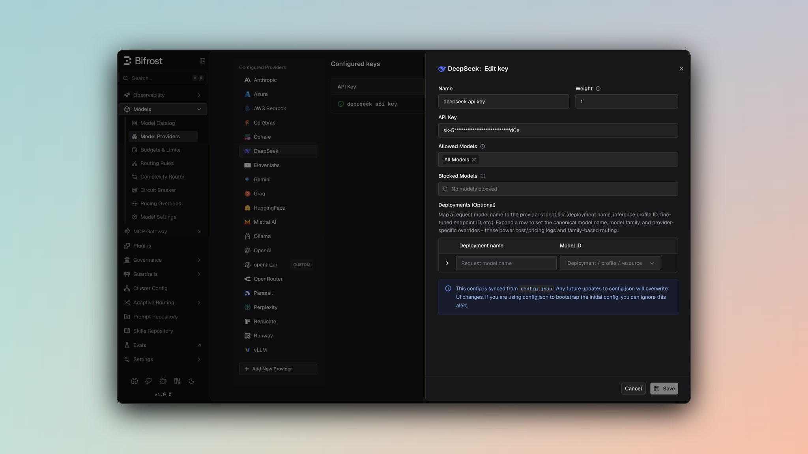

## Overview

DeepSeek is a provider with a dedicated Bifrost provider implementation. By default, Chat Completions, the Responses API, and Text Completions all use DeepSeek's **OpenAI-compatible** endpoints. Each key (or an individual alias) can opt into routing Chat Completions and the Responses API through DeepSeek's **Anthropic-compatible** endpoint instead, using the `use_anthropic_endpoints` toggle. Key characteristics:

- **OpenAI-compatible by default** - Chat Completions use `/chat/completions`, authenticated with a bearer token
- **Optional Anthropic-compatible mode** - Set `use_anthropic_endpoints` on a key (or override it per-alias) to route Chat Completions and the Responses API through `/anthropic/v1/messages`, authenticated with `x-api-key`, using the shared Anthropic request/response converters
- **Streaming support** - Server-Sent Events for chat, responses, and text completions, in both endpoint modes
- **Tool calling** - Function tools are supported on both the OpenAI-compatible and Anthropic-compatible paths
- **Reasoning support** - Reasoning parameters are mapped through the OpenAI converters by default, or the Anthropic converters when Anthropic-compatible mode is enabled
- **Beta text completions** - Text/FIM completions always use DeepSeek's OpenAI-compatible `/beta/completions` endpoint, regardless of `use_anthropic_endpoints`

### Supported Operations

| Operation | Non-Streaming | Streaming | Endpoint (default) | Endpoint (`use_anthropic_endpoints: true`) |
|-----------|---------------|-----------|---------------------|---------------------------------------------|
| Chat Completions | ✅ | ✅ | `/chat/completions` | `/anthropic/v1/messages` |
| Responses API | ✅ | ✅ | `/chat/completions` (via Chat Completions fallback) | `/anthropic/v1/messages` |
| Text Completions | ✅ | ✅ | `/beta/completions` | `/beta/completions` (unaffected) |
| List Models | ✅ | - | `/models` | `/models` (unaffected) |
| Embeddings | ❌ | ❌ | - | - |
| Image Generation | ❌ | ❌ | - | - |
| Speech (TTS) | ❌ | ❌ | - | - |
| Transcriptions (STT) | ❌ | ❌ | - | - |
| Files | ❌ | ❌ | - | - |
| Batch | ❌ | ❌ | - | - |

<Note>
**Unsupported Operations** (❌): Embeddings, Image Generation, Speech, Transcriptions, Files, Batch, cached content, containers, token counting, compaction, OCR, rerank, video, and passthrough are not supported by the upstream DeepSeek API through this provider. These return `UnsupportedOperationError`.
</Note>

## Setup & Configuration

Configure DeepSeek as a provider.

<Tabs>
<Tab title="Web UI">



1. Navigate to **Models** > **Model Providers**. Look for **DeepSeek** under **Configured Providers**. If it is missing, click on **Add New Provider** and select **DeepSeek**.
2. Click **Add Key** or edit an existing key.
3. Set a name for your key.
4. Paste your API key directly or use an environment variable (for example, `env.DEEPSEEK_API_KEY`).
5. Set **Allowed Models** to **All Models** (default) or the specific model allowlist you want this key to serve.
6. Leave **Use Anthropic Endpoints** off to use DeepSeek's OpenAI-compatible endpoints (the default), or turn it on to route Chat Completions and the Responses API through DeepSeek's Anthropic-compatible endpoint instead. See [Anthropic-Compatible Endpoints](#anthropic-compatible-endpoints-optional) below.
7. Save the provider configuration.

</Tab>
<Tab title="config.json">

```json
{
  "providers": {
    "deepseek": {
      "keys": [
        {
          "name": "deepseek-key-1",
          "value": "env.DEEPSEEK_API_KEY",
          "models": [
            "*"
          ],
          "weight": 1.0
        }
      ]
    }
  }
}
```

</Tab>
<Tab title="API">
Refer to the API documentation for [Provider Keys Management](https://docs.getbifrost.ai/api-reference/providers/create-a-key-for-a-provider).
</Tab>
<Tab title="Go SDK">

```go
case schemas.DeepSeek:
    return []schemas.Key{{
        Name:   "deepseek-key-1",
        Value:  *schemas.NewSecretVar("env.DEEPSEEK_API_KEY"),
        Models: []string{"*"},
        Weight: 1.0,
    }}, nil
```

</Tab>
</Tabs>

---

## Anthropic-Compatible Endpoints (optional)

DeepSeek exposes an Anthropic-compatible Messages endpoint (`/anthropic/v1/messages`) alongside its default OpenAI-compatible Chat Completions API. Setting `use_anthropic_endpoints` routes Chat Completions and the Responses API through that endpoint instead — Text Completions are unaffected and always use `/beta/completions`.

The setting can be configured per key, and overridden per model alias:

- **Key-level** - Sets the default endpoint mode for every request made with that key.
- **Alias-level** - Overrides the key-level default for a single alias, so one key can serve some aliases through the OpenAI-compatible endpoints and others through the Anthropic-compatible endpoint.

If neither is set, requests fall back to DeepSeek's OpenAI-compatible endpoints.

<Tabs>
<Tab title="Web UI">

On the key form, toggle **Use Anthropic Endpoints** (off by default). To override this for a specific alias, open that alias's expanded row in the deployments table and toggle **Use Anthropic endpoints** under **Deepseek overrides** — this takes priority over the key-level setting for that alias only.

</Tab>
<Tab title="API">
The `use_anthropic_endpoints` boolean is part of the same key payload used by [Provider Keys Management](https://docs.getbifrost.ai/api-reference/providers/create-a-key-for-a-provider), and the alias payload for that key's `models` entries.
</Tab>
<Tab title="config.json">

```json
{
  "providers": {
    "deepseek": {
      "keys": [
        {
          "name": "deepseek-key-1",
          "value": "env.DEEPSEEK_API_KEY",
          "models": [
            "*"
          ],
          "weight": 1.0,
          "use_anthropic_endpoints": true
        }
      ]
    }
  }
}
```

To override this per-alias (for example, on a virtual key's model config), set `use_anthropic_endpoints` alongside the alias's `model_id`:

```json
{
  "model_id": "deepseek-v4-flash",
  "use_anthropic_endpoints": false
}
```

| Field | Type | Required | Description |
|-------|------|----------|--------------|
| `use_anthropic_endpoints` | boolean | No | Routes chat completions and responses requests through Anthropic-compatible endpoints. Default: `false`. |

</Tab>
</Tabs>

---

# 1. Chat Completions

## Request Parameters

By default, DeepSeek Chat Completions use DeepSeek's OpenAI-compatible `/chat/completions` endpoint, authenticated with `Authorization: Bearer <key>`. For the full parameter reference and message conversion behavior, see [OpenAI Chat Completions](/providers/supported-providers/openai#1-chat-completions).

When `use_anthropic_endpoints` is enabled, requests are sent instead to DeepSeek's Anthropic-compatible endpoint (`/anthropic/v1/messages`), authenticated with `x-api-key: <key>`, and built using the shared Anthropic converters. For that parameter reference and message conversion behavior, see [Anthropic Chat Completions](/providers/supported-providers/anthropic#1-chat-completions).

### Authentication

| Mode | Header |
|------|--------|
| Default (OpenAI-compatible) | `Authorization: Bearer <key>` |
| `use_anthropic_endpoints: true` | `x-api-key: <key>` |

Bifrost sets the correct header automatically based on the resolved endpoint mode for the request.

### Reasoning Parameter

- **Default (OpenAI-compatible):** Reasoning parameters follow the same conventions as the [OpenAI provider](/providers/supported-providers/openai#1-chat-completions) (for example, `reasoning.effort`).
- **`use_anthropic_endpoints: true`:** Reasoning/thinking parameters are mapped through the Anthropic converters (`reasoning` → `thinking`), the same as the [Anthropic provider](/providers/supported-providers/anthropic#1-chat-completions). Reasoning effort is sent as `output_config.effort` (Anthropic's own field placement), not nested under `thinking.reasoning_effort` as DeepSeek's native API documents it.

### Forced Tool Choice

DeepSeek models run with thinking enabled by default, even when no `reasoning` parameter is set, and reject certain forced `tool_choice` combinations while thinking is on. Bifrost automatically disables thinking (`thinking: {"type": "disabled"}`) to avoid this, but which combination triggers the fix depends on the endpoint mode:

- **Default (OpenAI-compatible):** Thinking is disabled when `tool_choice` is the generic `"required"` string (forcing some tool call, without pinning a specific one).
- **`use_anthropic_endpoints: true`:** Thinking is disabled when `tool_choice` pins a specific named function, for both Chat Completions and the Responses API. `tool_choice: "required"`/`"any"` is left untouched in this mode, since DeepSeek's Anthropic-compatible endpoint accepts that combination with thinking on.

### Extra Parameters

DeepSeek enables passthrough extra parameters for Chat Completions and Text Completions when using the default OpenAI-compatible endpoints. Extra parameters are **not** passed through by default when `use_anthropic_endpoints` is enabled.

---

# 2. Responses API

- **Default (OpenAI-compatible):** Responses requests fall back to Chat Completions, the same conversion pattern used by other OpenAI-compatible-only providers:

  ```
  ResponsesRequest → ChatRequest → Response conversion
  ```

- **`use_anthropic_endpoints: true`:** Responses requests are sent natively to DeepSeek's Anthropic-compatible endpoint at `/anthropic/v1/messages` — there is no internal conversion to Chat Completions. Both non-streaming and streaming Responses requests build an Anthropic-format request body directly from the `BifrostResponsesRequest` and convert the response back to Bifrost's Responses format.

Same parameter support as Chat Completions in either mode, with response format differences (output items instead of message content).

---

# 3. Text Completions

DeepSeek supports beta text/FIM (Fill-In-Middle) completions through `/beta/completions`, regardless of `use_anthropic_endpoints`:

| Parameter | Mapping |
|-----------|---------|
| `prompt` | Sent as-is |
| `suffix` | Enables FIM mode — text that should follow the completion; sent as-is |
| `max_tokens` | max_tokens |
| `temperature` | temperature |
| `top_p` | top_p |
| `stop` | stop sequences |
| `echo` | echo |
| `logprobs` | logprobs |
| `extra_params` | Passed through to DeepSeek (e.g. `thinking` control) |

Setting `suffix` alongside `prompt` puts the request in FIM mode: DeepSeek generates the text that belongs between `prompt` and `suffix` rather than a plain continuation of `prompt`.

Response returns `choices[].text` with completion text.

---

# 4. Text Completions Streaming

Streaming text completions use DeepSeek's OpenAI-compatible SSE format on `/beta/completions`.

---

# 5. List Models

Lists available models from DeepSeek through `/models`.

---

## Unsupported Features

| Feature | Reason |
|---------|--------|
| Embedding | Not offered by DeepSeek API through this provider |
| Image Generation | Not offered by DeepSeek API through this provider |
| Speech/TTS | Not offered by DeepSeek API through this provider |
| Transcription/STT | Not offered by DeepSeek API through this provider |
| Batch Operations | Not offered by DeepSeek API through this provider |
| File Management | Not offered by DeepSeek API through this provider |
| Cached Content | Only Gemini and Vertex AI support cached content in Bifrost |
| Container Management | Not offered by DeepSeek API through this provider |
| Token Counting | Not offered by DeepSeek API through this provider |
| Rerank/OCR/Video | Not offered by DeepSeek API through this provider |

---

## Caveats

<Accordion title="Default Base URL">
**Severity**: Low
**Behavior**: DeepSeek defaults to `https://api.deepseek.com`
**Impact**: Custom DeepSeek-compatible deployments must override `network_config.base_url`
**Code**: `NewDeepSeekProvider` sets the default base URL when no provider-level base URL is configured
</Accordion>

<Accordion title="Beta Text Completion Endpoint">
**Severity**: Medium
**Behavior**: Text completions are routed to `/beta/completions`
**Impact**: FIM/text completion behavior follows DeepSeek's beta API contract and may differ from standard OpenAI `/completions`
**Code**: `TextCompletion` and `TextCompletionStream` use `/beta/completions`
</Accordion>

<Accordion title="User Field Size Limit (Text Completions)">
**Severity**: Low
**Behavior**: User field > 64 characters is silently dropped
**Impact**: Longer user identifiers are lost
**Code**: `SanitizeUserField` enforces 64-char max in the shared OpenAI converter, still used for Text Completions
</Accordion>

<Accordion title="use_anthropic_endpoints Resolution Order">
**Severity**: Low
**Behavior**: An alias-level `use_anthropic_endpoints` override always wins over the key-level setting for that alias; if neither is set, requests default to the OpenAI-compatible endpoints
**Impact**: A single key can serve some aliases through OpenAI-compatible endpoints and others through the Anthropic-compatible endpoint
**Code**: `anthropic.ResolveUseAnthropicEndpoints` in `core/providers/anthropic/utils.go`, used by `ChatCompletion`, `ChatCompletionStream`, `Responses`, and `ResponsesStream` in `core/providers/deepseek/deepseek.go`
</Accordion>

<Accordion title="Forced Tool Choice Disables Thinking (Mode-Dependent)">
**Severity**: Medium
**Behavior**: When thinking is on (the default), Bifrost forces `thinking: {"type": "disabled"}` in the outbound request — for the generic `tool_choice: "required"` on the default OpenAI-compatible endpoint, or for a `tool_choice` pinning a specific named function on the Anthropic-compatible endpoint
**Impact**: Prevents DeepSeek's `"Thinking mode does not support this tool_choice"` error for the combination each endpoint mode actually rejects; the other combination is left untouched on each path
**Code**: `disableThinkingForForcedToolChoice` in `core/providers/deepseek/deepseek.go` (OpenAI-compatible path); `core/providers/anthropic/chat.go` and `core/providers/anthropic/responses.go`, gated on `Provider == DeepSeek` (Anthropic-compatible path)
</Accordion>

<Accordion title="Extra Parameters Not Passed Through in Anthropic-Compatible Mode">
**Severity**: Low
**Behavior**: Extra parameters are merged into the outbound request body by default on the OpenAI-compatible path (Chat and Text Completions), but not on the Anthropic-compatible path
**Impact**: Provider-specific `extra_params` set on a request may be silently dropped when `use_anthropic_endpoints` is enabled
**Code**: `BifrostContextKeyPassthroughExtraParams` is set in the OpenAI-compatible branches of `ChatCompletion`/`ChatCompletionStream` (and in `TextCompletion`/`TextCompletionStream`), but not in the Anthropic-compatible branches, in `core/providers/deepseek/deepseek.go`
</Accordion>

<Accordion title="Mixed Endpoint Compatibility">
**Severity**: Medium
**Behavior**: Text Completions always use DeepSeek's OpenAI-compatible beta endpoint (`/beta/completions`, bearer token auth) regardless of `use_anthropic_endpoints`. Chat Completions and the Responses API use DeepSeek's OpenAI-compatible endpoints by default, or its Anthropic-compatible endpoint (`/anthropic/v1/messages`, `x-api-key` auth) when `use_anthropic_endpoints` is enabled
**Impact**: When Anthropic-compatible mode is enabled, parameters and behavior documented for the [OpenAI provider](/providers/supported-providers/openai) no longer apply to DeepSeek Chat Completions or Responses — refer to the [Anthropic provider](/providers/supported-providers/anthropic) docs for those instead
**Code**: `ChatCompletion`, `ChatCompletionStream`, `Responses`, and `ResponsesStream` in `core/providers/deepseek/deepseek.go` branch on `anthropic.ResolveUseAnthropicEndpoints`; `TextCompletion` and `TextCompletionStream` always delegate to the `openai` package
</Accordion>
