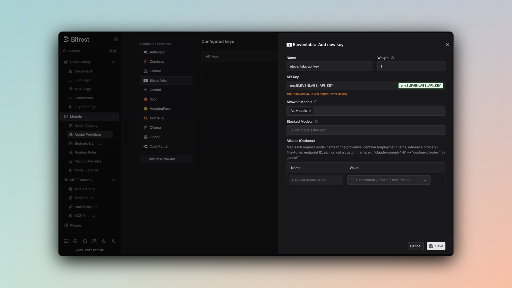

## Overview

ElevenLabs is a specialized audio provider for text-to-speech and speech-to-text operations. Bifrost performs conversions including:
- **Model ID mapping** - Uses provider model identifier directly
- **Voice configuration** - Maps voice settings (stability, similarity, boost, speed, style)
- **Response format conversion** - Speech format handling (MP3, Opus, PCM/WAV)
- **Timestamp support** - Character-level timing alignment for TTS
- **Transcription with alignment** - Word and character-level timing, diarization, and additional formats
- **Pronunciation dictionaries** - Support for custom pronunciation rules
- **Voice quality parameters** - Stability, similarity boost, and speaker boost controls

### Supported Operations

| Operation | Non-Streaming | Streaming | Endpoint |
|-----------|---------------|-----------|----------|
| Speech (TTS) | ✅ | ✅ | `/v1/text-to-speech/{voice_id}` |
| Sound Effects (Text-to-Sound) | ✅ | - | `/v1/sound-generation` |
| Transcriptions (STT) | ✅ | - | `/v1/speech-to-text` |
| List Models | ✅ | - | `/v1/models` |
| Chat Completions | ❌ | ❌ | - |
| Responses API | ❌ | ❌ | - |
| Text Completions | ❌ | ❌ | - |
| Embeddings | ❌ | ❌ | - |
| Image Generation | ❌ | ❌ | - |

<Note>
**Unsupported Operations** (❌): Chat Completions, Responses API, Text Completions, and Embeddings are not supported by ElevenLabs (audio-focused provider). These return `UnsupportedOperationError`.

**Note**: ElevenLabs also supports a "Speech with Timestamps" endpoint at `/v1/text-to-speech/{voice_id}/with-timestamps` (non-streaming only) for enhanced timestamp information.
</Note>

## Setup & Configuration

Configure ElevenLabs as a provider.

<Tabs>
<Tab title="Web UI">



1. Navigate to **Models** > **Model Providers**. Look for **ElevenLabs** under **Configured Providers**. If it is missing, click on **Add New Provider** and select **ElevenLabs**.
2. Click **Add Key** or edit an existing key.
3. Set a name for your key.
4. Paste your API key directly or use an environment variable (for example, `env.ELEVENLABS_API_KEY`).
5. Set **Allowed Models** to **All Models** (default) or the specific model allowlist you want this key to serve.
6. Save the provider configuration.

</Tab>
<Tab title="config.json">

```json
{
  "providers": {
    "elevenlabs": {
      "keys": [
        {
          "name": "elevenlabs-key-1",
          "value": "env.ELEVENLABS_API_KEY",
          "models": [
            "*"
          ],
          "weight": 1.0
        }
      ]
    }
  }
}
```

</Tab>
<Tab title="API">
Refer to the API documentation for [Provider Keys Management](https://docs.getbifrost.ai/api-reference/providers/create-a-key-for-a-provider).
</Tab>
<Tab title="Go SDK">

```go
case schemas.Elevenlabs:
    return []schemas.Key{{
        Name:   "elevenlabs-key-1",
        Value:  *schemas.NewSecretVar("env.ELEVENLABS_API_KEY"),
        Models: []string{"*"},
        Weight: 1.0,
    }}, nil
```

</Tab>
</Tabs>

For text-to-speech calls, the Bifrost `model` is the ElevenLabs voice ID unless you pass a provider-specific voice override in the request.

---

# 1. Speech (Text-to-Speech)

## Request Parameters

### Core Parameters

| Parameter | Mapping | Notes |
|-----------|---------|-------|
| `input.input` | `text` | The text to convert to speech (required) |
| `model` | `model_id` | Model identifier (e.g., `"eleven_multilingual_v2"`) |
| `response_format` | Query param `output_format` | Speech format (see [Response Format](#response-format)) |

### Voice Configuration

Voice settings are optional and controlled via `params`:

| Parameter | ElevenLabs Mapping | Default | Range |
|-----------|-------------------|---------|-------|
| `speed` | `voice_settings.speed` | 1.0 | 0.5-2.0 |
| `extra_params.stability` | `voice_settings.stability` | 0.5 | 0-1.0 |
| `extra_params.similarity_boost` | `voice_settings.similarity_boost` | 0.75 | 0-1.0 |
| `extra_params.use_speaker_boost` | `voice_settings.use_speaker_boost` | true | boolean |
| `extra_params.style` | `voice_settings.style` | 0 | 0-1.0 |

### Advanced Parameters

Use `extra_params` for ElevenLabs-specific TTS features:

<Tabs>
<Tab title="Gateway">

```bash
curl -X POST http://localhost:8080/v1/audio/speech \
  -H "Content-Type: application/json" \
  -d '{
    "model": "eleven_multilingual_v2",
    "input": {"input": "Hello, how are you?"},
    "voice": "21m00Tcm4TlvDq8ikWAM",
    "response_format": "mp3",
    "stability": 0.5,
    "similarity_boost": 0.75,
    "use_speaker_boost": true,
    "style": 0,
    "speed": 1.0,
    "language_code": "en",
    "seed": 42,
    "previous_text": "Context text",
    "next_text": "Future context",
    "apply_text_normalization": "auto"
  }'
```

</Tab>
<Tab title="Go SDK">

```go
resp, err := client.SpeechRequest(schemas.NewBifrostContext(ctx, schemas.NoDeadline), &schemas.BifrostSpeechRequest{
    Provider: schemas.Elevenlabs,
    Model:    "eleven_multilingual_v2",
    Input: &schemas.SpeechInput{
        Input: "Hello, how are you?",
    },
    Params: &schemas.SpeechParameters{
        VoiceConfig: &schemas.VoiceConfig{
            Voice: schemas.Ptr("21m00Tcm4TlvDq8ikWAM"),
        },
        Speed: schemas.Ptr(1.0),
        ResponseFormat: schemas.Ptr("mp3"),
        ExtraParams: map[string]interface{}{
            "stability": 0.5,
            "similarity_boost": 0.75,
            "use_speaker_boost": true,
            "style": 0.0,
            "language_code": "en",
            "seed": 42,
            "previous_text": "Context text",
            "next_text": "Future context",
            "apply_text_normalization": "auto",
        },
    },
})
```

</Tab>
</Tabs>

#### Advanced TTS Parameters

| Parameter | Type | Description |
|-----------|------|-------------|
| `language_code` | string | Language code (e.g., "en", "es") |
| `seed` | integer | Reproducible output (0-4294967295) |
| `previous_text` | string | Previous text context for consistency |
| `next_text` | string | Next text context for consistency |
| `previous_request_ids` | string[] | Previous request IDs for continuity |
| `next_request_ids` | string[] | Next request IDs for continuity |
| `apply_text_normalization` | string | Text normalization mode: `"auto"`, `"on"`, `"off"` |
| `apply_language_text_normalization` | boolean | Apply language-specific text normalization |

### Response Format

| Format | Output | Quality | Bitrate |
|--------|--------|---------|---------|
| `mp3` | MP3 | High | 128 kbps @ 44100 Hz |
| `opus` | Opus | High | 128 kbps @ 48000 Hz |
| `wav` / `pcm` | PCM WAV | Lossless | 16-bit @ 44100 Hz |

<Note>
Defaults to MP3 format if not specified. Format is passed via query parameter `output_format`.
</Note>

### Timestamps Support

To get character-level timing alignment, enable `with_timestamps`:

```json
{
  "with_timestamps": true
}
```

When enabled, the endpoint `/v1/text-to-speech/{voice_id}/with-timestamps` is used and the response includes:
- `audio_base64` - Audio data as base64-encoded string
- `alignment.char_start_times_ms` - Character start times in milliseconds
- `alignment.char_end_times_ms` - Character end times in milliseconds
- `alignment.characters` - Array of characters
- `normalized_alignment` - Same as alignment but for normalized text

## Response Conversion

### Non-Timestamp Response

```json
{
  "audio": "<binary audio data>"
}
```

### Timestamp Response

```json
{
  "audio_base64": "<base64 encoded audio>",
  "alignment": {
    "char_start_times_ms": [0, 150, 280, ...],
    "char_end_times_ms": [150, 280, 420, ...],
    "characters": ["H", "e", "l", "l", "o", ...]
  },
  "normalized_alignment": {
    "char_start_times_ms": [...],
    "char_end_times_ms": [...],
    "characters": [...]
  }
}
```

## Streaming

Streaming speech returns audio in chunks as they are generated:

```json
{
  "type": "audio.delta",
  "audio": "<binary audio chunk>"
}
```

Final chunk:
```json
{
  "type": "audio.done"
}
```

---

# 2. Sound Effects (Text-to-Sound)

ElevenLabs sound-effects models (e.g. `eleven_text_to_sound_v2`) generate sound
effects from a text prompt via the upstream `POST /v1/sound-generation` API. This
is a different endpoint from text-to-speech and **does not use a voice**.

Call `POST /v1/audio/speech` with a sound model — the provider detects a sound
model by its id and routes internally to sound generation, so no separate endpoint
is needed (SDK and transport APIs stay at parity). Because it stays a speech
request, virtual-key governance (provider/model allowlists, budgets, rate limits)
applies to `eleven_text_to_sound_v2` like any other model.

## Request Parameters

| Parameter | Mapping | Notes |
|-----------|---------|-------|
| `input.input` | `text` | The sound-effect description / prompt (required) |
| `model` | `model_id` | A sound model, e.g. `"eleven_text_to_sound_v2"` |
| `response_format` | Query param `output_format` | e.g. `mp3_22050_32` (raw ElevenLabs formats pass through) |
| `extra_params.duration_seconds` | `duration_seconds` | Optional. Clamped to `[0.5, 30]`. Omit to let the model choose the length |
| `extra_params.loop` | `loop` | Optional. Seamless looping (sound models only) |
| `extra_params.prompt_influence` | `prompt_influence` | Optional, default `0.3`. Clamped to `[0, 1]` |

<Tabs>
<Tab title="Gateway">

```bash
curl -X POST http://localhost:8080/v1/audio/speech \
  -H "Content-Type: application/json" \
  --output sound-effects.mp3 \
  -d '{
    "model": "elevenlabs/eleven_text_to_sound_v2",
    "input": "glass shattering on concrete",
    "response_format": "mp3_44100_128",
    "duration_seconds": 2,
    "loop": false,
    "prompt_influence": 0.3
  }'
```

> `input` is a top-level string here (not a nested object). `duration_seconds`,
> `loop`, and `prompt_influence` are sent as top-level fields and forwarded as
> sound-generation parameters. No voice is sent — the provider detects the sound
> model and skips the voice requirement.

</Tab>
<Tab title="Go SDK">

```go
resp, err := client.SpeechRequest(schemas.NewBifrostContext(ctx, schemas.NoDeadline), &schemas.BifrostSpeechRequest{
    Provider: schemas.Elevenlabs,
    Model:    "eleven_text_to_sound_v2",
    Input: &schemas.SpeechInput{
        Input: "glass shattering on concrete",
    },
    Params: &schemas.SpeechParameters{
        ResponseFormat: schemas.Ptr("mp3_44100_128"),
        ExtraParams: map[string]interface{}{
            "duration_seconds": 2,
            "loop":             false,
            "prompt_influence": 0.3,
        },
    },
})
```

</Tab>
</Tabs>

## Response

Returns binary audio (same delivery as text-to-speech). When `duration_seconds` is
provided, the response usage carries `audio_seconds` (the requested duration) for
observability and future duration-based pricing.

## Notes

| Behavior | Detail |
|----------|--------|
| No voice | Sound models ignore voice; the gateway does not require one for them |
| No streaming | The upstream sound-generation API has no streaming variant |
| Governance | As a speech request, virtual-key allowlists, budgets, and rate limits apply to `eleven_text_to_sound_v2` like any other model |

### Billing

ElevenLabs itself bills sound effects **per generated second**. In Bifrost the
dollar cost is only computed when the model catalog has a pricing entry for it:

- The default pricing datasheet (`getbifrost.ai/datasheet`) does **not** currently
  include `eleven_text_to_sound_v2`, so without extra configuration the request is
  recorded with `cost = 0`.
- To bill it today, add a **pricing override** for the model (works with any
  config store, e.g. SQLite — no Postgres required). The speech cost path
  currently bills on input characters, so an override that sets
  `input_cost_per_character` takes effect immediately, e.g.
  `{"input_cost_per_character":0.00018}`.
- `output_cost_per_second` is the field that will reflect ElevenLabs' real
  per-second pricing, but it only takes effect once the `audio_seconds` wiring
  lands; until then it is recorded but not applied.

---

# 3. Transcription (Speech-to-Text)

## Request Parameters

### Input Source

Choose one of the following (mutually exclusive):

| Parameter | Type | Description |
|-----------|------|-------------|
| `input.file` | bytes | Audio file content (WAV, MP3, etc.) |
| `extra_params.cloud_storage_url` | string | URL to cloud-hosted audio file |

**Error**: Providing both or neither will result in error.

### Core Parameters

| Parameter | Mapping | Description |
|-----------|---------|-------------|
| `model` | `model_id` | Model identifier (required) |
| `params.language` | `language_code` | Language code (ISO 639-1, e.g., "en") |

### Advanced Parameters

Use `extra_params` for transcription-specific features:

<Tabs>
<Tab title="Gateway">

```bash
curl -X POST http://localhost:8080/v1/audio/transcriptions \
  -F "file=@audio.wav" \
  -F "model=eleven_latest" \
  -F "language_code=en" \
  -F "tag_audio_events=true" \
  -F "num_speakers=2" \
  -F "timestamps_granularity=word" \
  -F "diarize=true" \
  -F "diarization_threshold=0.5" \
  -F "temperature=0.1" \
  -F "seed=42" \
  -F "use_multi_channel=true" \
  -F "webhook=true" \
  -F "webhook_id=webhook-123"
```

</Tab>
<Tab title="Go SDK">

```go
resp, err := client.TranscriptionRequest(schemas.NewBifrostContext(ctx, schemas.NoDeadline), &schemas.BifrostTranscriptionRequest{
    Provider: schemas.Elevenlabs,
    Model:    "eleven_latest",
    Input: &schemas.TranscriptionInput{
        File: audioBytes,
    },
    Params: &schemas.TranscriptionParameters{
        Language: schemas.Ptr("en"),
        ExtraParams: map[string]interface{}{
            "tag_audio_events": true,
            "num_speakers": 2,
            "timestamps_granularity": "word",
            "diarize": true,
            "diarization_threshold": 0.5,
            "temperature": 0.1,
            "seed": 42,
            "use_multi_channel": true,
            "webhook": true,
            "webhook_id": "webhook-123",
        },
    },
})
```

</Tab>
</Tabs>

#### Transcription Options

| Parameter | Type | Description |
|-----------|------|-------------|
| `tag_audio_events` | boolean | Tag audio events (background noise, music, etc.) |
| `num_speakers` | integer | Expected number of speakers (for diarization) |
| `timestamps_granularity` | string | Timestamp level: `"none"`, `"word"`, `"character"` |
| `diarize` | boolean | Identify different speakers |
| `diarization_threshold` | float | Speaker diarization sensitivity (0.0-1.0) |
| `file_format` | string | Input format: `"pcm_s16le_16"`, `"other"` |
| `temperature` | float | Transcription temperature (0.0-1.0) |
| `seed` | integer | Reproducible transcription |
| `use_multi_channel` | boolean | Process multi-channel audio separately |
| `webhook` | boolean | Enable webhook for async processing |
| `webhook_id` | string | Webhook endpoint ID |
| `webhook_metadata` | object/string | Additional webhook metadata |
| `cloud_storage_url` | string | URL to cloud-hosted audio (alternative to file) |

#### Additional Formats

Request multiple output formats simultaneously:

```json
{
  "additional_formats": [
    {
      "format": "segmented_json",
      "include_speakers": true,
      "include_timestamps": true,
      "segment_on_silence_longer_than_s": 1.0,
      "max_segment_duration_s": 30.0
    },
    {
      "format": "srt",
      "max_segment_duration_s": 30.0
    }
  ]
}
```

**Supported formats**: `segmented_json`, `docx`, `pdf`, `txt`, `html`, `srt`

## Response Conversion

### Basic Transcription

```json
{
  "transcript": {
    "language_code": "en",
    "language_probability": 0.95,
    "text": "Full transcribed text...",
    "words": [
      {
        "text": "Hello",
        "start": 0.0,
        "end": 0.5,
        "type": "word",
        "speaker_id": "speaker_1",
        "logprob": -0.05
      }
    ]
  }
}
```

### With Diarization

When `diarize: true`, the response includes speaker identification:

```json
{
  "transcript": {
    "text": "Hello how are you?",
    "words": [
      {
        "text": "Hello",
        "speaker_id": "speaker_1"
      },
      {
        "text": "how",
        "speaker_id": "speaker_2"
      }
    ]
  }
}
```

### With Timestamps

Character-level timing when `timestamps_granularity: "character"`:

```json
{
  "words": [
    {
      "text": "Hello",
      "characters": [
        {"text": "H", "start": 0.0, "end": 0.1},
        {"text": "e", "start": 0.1, "end": 0.2}
      ]
    }
  ]
}
```

### With Additional Formats

```json
{
  "transcript": { ... },
  "additional_formats": [
    {
      "requested_format": "srt",
      "file_extension": "srt",
      "content_type": "text/plain",
      "is_base64_encoded": false,
      "content": "1\n00:00:00,000 --> 00:00:01,000\nHello\n\n2\n..."
    }
  ]
}
```

---

## Caveats

<Accordion title="Voice ID Required">
**Severity**: High
**Behavior**: Voice ID must be provided for TTS requests
**Impact**: Request fails without voice configuration
**Code**: `elevenlabs.go:198-208`
</Accordion>

<Accordion title="File or URL Required for Transcription">
**Severity**: High
**Behavior**: Either `file` or `cloud_storage_url` must be provided (not both)
**Impact**: Request fails with ambiguous input
**Code**: `elevenlabs.go:471-478`
</Accordion>

<Accordion title="Audio Format Conversion">
**Severity**: Low
**Behavior**: Response formats (MP3, Opus, WAV) mapped via format string
**Impact**: Format parameter passed as query string to endpoint
**Code**: `elevenlabs.go:712-715`, `utils.go:5-35`
</Accordion>

<Accordion title="Timestamps as Separate Endpoint">
**Severity**: Low
**Behavior**: Timestamp requests use `/with-timestamps` endpoint variant
**Impact**: Switches endpoint based on `with_timestamps` flag
**Code**: `elevenlabs.go:195-205`
</Accordion>

<Accordion title="Multipart Form Data for Transcription">
**Severity**: Low
**Behavior**: Transcription uses multipart/form-data, not JSON
**Impact**: File and parameters sent as form fields
**Code**: `elevenlabs.go:480-690`
</Accordion>

---

# 4. List Models

## Request Parameters

| Parameter | Type | Description |
|-----------|------|-------------|
| (none) | - | No parameters required |

Returns available models with their capabilities and language support.

## Response Conversion

```json
{
  "models": [
    {
      "model_id": "eleven_multilingual_v2",
      "name": "Eleven Multilingual v2",
      "description": "Multilingual speech synthesis",
      "serves_pro_voices": true,
      "token_cost_factor": 1.0,
      "can_do_text_to_speech": true,
      "can_do_voice_conversion": true,
      "can_use_style": true,
      "can_use_speaker_boost": true,
      "languages": [
        {"language_id": "en", "name": "English"},
        {"language_id": "es", "name": "Spanish"}
      ],
      "requires_alpha_access": false,
      "max_characters_request_free_user": 1000,
      "max_characters_request_subscribed_user": 100000,
      "maximum_text_length_per_request": 5000,
      "model_rates": {
        "character_cost_multiplier": 1.0
      }
    }
  ]
}
```
