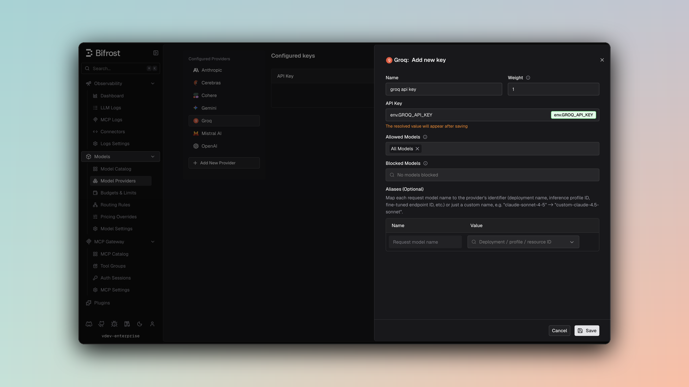

## Overview

Groq is an **OpenAI-compatible provider** offering the same API interface with identical parameter handling. Bifrost delegates most functionality to the OpenAI provider implementation with minimal modifications. Key features:
- **Full OpenAI compatibility** - Identical request/response format
- **Streaming support** - Server-Sent Events with delta-based updates
- **Tool calling** - Complete function definition and execution support
- **Text completion fallback** - Via litellm compatibility mode when enabled
- **Parameter filtering** - Removes unsupported OpenAI-specific fields

### Supported Operations

| Operation | Non-Streaming | Streaming | Endpoint |
|-----------|---------------|-----------|----------|
| Chat Completions | ✅ | ✅ | `/v1/chat/completions` |
| Responses API | ✅ | ✅ | `/v1/chat/completions` |
| Text Completions | ⚠️ | ⚠️ | Via internal conversion |
| List Models | ✅ | - | `/v1/models` |
| Embeddings | ❌ | ❌ | - |
| Image Generation | ❌ | ❌ | - |
| Speech (TTS) | ❌ | ❌ | - |
| Transcriptions (STT) | ❌ | ❌ | - |
| Files | ❌ | ❌ | - |
| Batch | ❌ | ❌ | - |

<Note>
**Text Completions (⚠️)**: Not supported natively by Groq. When enabled via `x-litellm-fallback` context, Bifrost internally converts text completion requests to chat completion requests, processes them through Chat Completions, and converts the response back to text completion format.

**Unsupported Operations** (❌): Embeddings, Image Generation, Speech, Transcriptions, Files, and Batch are not supported by the upstream Groq API. These return `UnsupportedOperationError`.
</Note>

## Setup & Configuration

Configure Groq as a provider.

<Tabs>
<Tab title="Web UI">



1. Navigate to **Models** > **Model Providers**. Look for **Groq** under **Configured Providers**. If it is missing, click on **Add New Provider** and select **Groq**.
2. Click **Add Key** or edit an existing key.
3. Set a name for your key.
4. Paste your API key directly or use an environment variable (for example, `env.GROQ_API_KEY`).
5. Set **Allowed Models** to **All Models** (default) or the specific model allowlist you want this key to serve.
6. Save the provider configuration.

</Tab>
<Tab title="config.json">

```json
{
  "providers": {
    "groq": {
      "keys": [
        {
          "name": "groq-key-1",
          "value": "env.GROQ_API_KEY",
          "models": [
            "*"
          ],
          "weight": 1.0
        }
      ]
    }
  }
}
```

</Tab>
<Tab title="API">
Refer to the API documentation for [Provider Keys Management](https://docs.getbifrost.ai/api-reference/providers/create-a-key-for-a-provider).
</Tab>
<Tab title="Go SDK">

```go
case schemas.Groq:
    return []schemas.Key{{
        Name:   "groq-key-1",
        Value:  *schemas.NewEnvVar("env.GROQ_API_KEY"),
        Models: []string{"*"},
        Weight: 1.0,
    }}, nil
```

</Tab>
</Tabs>

---

# 1. Chat Completions

## Request Parameters

Groq supports all standard OpenAI chat completion parameters. For full parameter reference and behavior, see [OpenAI Chat Completions](/providers/supported-providers/openai#1-chat-completions).

### Dropped Parameters

These parameters are silently removed before sending to Groq:
- `prompt_cache_key` - Not supported
- `verbosity` - Anthropic-specific
- `store` - Not supported
- `service_tier` - Not supported

### Reasoning Parameter

Groq supports reasoning via the standard `reasoning_effort` field:

```json
// Request with reasoning
{
  "model": "llama-3.3-70b-versatile",
  "messages": [...],
  "reasoning_effort": "high"
}
```

Bifrost converts from the internal `Reasoning` structure to `reasoning_effort` string.

## Message Conversion

Groq uses OpenAI message format with the following content type limitations:

**Content Types Supported:**
- ✅ Text content (strings)
- ❌ Images (neither URL nor base64)
- ❌ Audio input
- ❌ Files

For all other message handling, tools, responses, and streaming formats, refer to [OpenAI Chat Completions](/providers/supported-providers/openai#1-chat-completions).

---

# 2. Responses API

The Responses API is converted internally to Chat Completions:

```go
// Responses request → Chat request conversion
request.ToChatRequest() → ChatCompletion → ToBifrostResponsesResponse()
```

Same parameter mapping and message conversion as Chat Completions. Response format differs slightly with `output` items instead of `message` content.

---

# 3. Text Completions (Litellm Fallback)

<Warning>
Text Completions are **not natively supported** by Groq. Support is only available when the `x-litellm-fallback` context flag is set.
</Warning>

When enabled, text completion requests are converted to chat completions:

```go
// Text completion → Chat completion conversion
1. Wrap prompt in chat message
2. Call ChatCompletion
3. Extract text from response
4. Format as TextCompletionResponse
```

**Limitations:**
- Uses chat API (different from native text completion)
- Single choice only (n=1)
- Streaming not available

---

# 4. List Models

Groq's model listing endpoint returns available models with their context lengths and capabilities.

---

## Unsupported Features

| Feature | Reason |
|---------|--------|
| Image URLs | Groq doesn't support image inputs |
| Image Base64 | Groq doesn't support image inputs |
| Multiple Images | Groq doesn't support image inputs |
| Embedding | Not offered by Groq API |
| Speech/TTS | Not offered by Groq API |
| Transcription/STT | Not offered by Groq API |
| Batch Operations | Not offered by Groq API |
| File Management | Not offered by Groq API |

---

## Caveats

<Accordion title="User Field Size Limit">
**Severity**: Low
**Behavior**: User field > 64 characters is silently dropped
**Impact**: Longer user identifiers are lost
**Code**: SanitizeUserField enforces 64-char max
</Accordion>
