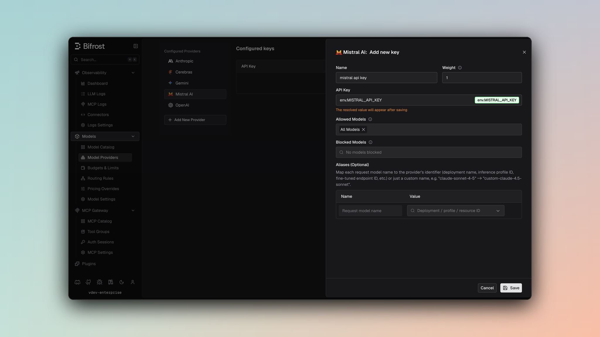

## Overview

Mistral is an **OpenAI-compatible provider** with custom compatibility handling for specific features. Bifrost converts requests to Mistral's expected format while supporting their unique API endpoints. Key characteristics:

- **OpenAI-compatible format** - Chat and streaming endpoints
- **Transcription API** - Native audio transcription support
- **OCR API** - Native document and image OCR support
- **Tool calling support** - Function definitions with string-based tool choice
- **Streaming support** - Server-Sent Events for chat and transcription
- **Parameter compatibility** - max_completion_tokens → max_tokens conversion

### Supported Operations

| Operation            | Non-Streaming | Streaming | Endpoint                   |
| -------------------- | ------------- | --------- | -------------------------- |
| Chat Completions     | ✅            | ✅        | `/v1/chat/completions`     |
| Responses API        | ✅            | ✅        | `/v1/chat/completions`     |
| Transcriptions (STT) | ✅            | ✅        | `/v1/audio/transcriptions` |
| OCR                  | ✅            | -         | `/v1/ocr`                  |
| Embeddings           | ✅            | -         | `/v1/embeddings`           |
| List Models          | ✅            | -         | `/v1/models`               |
| Image Generation     | ❌            | ❌        | -                          |
| Text Completions     | ❌            | ❌        | -                          |
| Speech (TTS)         | ❌            | ❌        | -                          |
| Files                | ❌            | ❌        | -                          |
| Batch                | ❌            | ❌        | -                          |

<Note>
  **Unsupported Operations** (❌): Text Completions, Speech (TTS), Files, and
  Batch are not supported by the upstream Mistral API. Image Generation is not
  currently supported by Bifrost's Mistral integration (Mistral API supports
  image generation, but Bifrost has not yet implemented this feature). These
  return `UnsupportedOperationError`.
</Note>

## Setup & Configuration

Configure Mistral as a provider.

<Tabs>
<Tab title="Web UI">



1. Navigate to **Models** > **Model Providers**. Look for **Mistral** under **Configured Providers**. If it is missing, click on **Add New Provider** and select **Mistral**.
2. Click **Add Key** or edit an existing key.
3. Set a name for your key.
4. Paste your API key directly or use an environment variable (for example, `env.MISTRAL_API_KEY`).
5. Set **Allowed Models** to **All Models** (default) or the specific model allowlist you want this key to serve.
6. Save the provider configuration.

</Tab>
<Tab title="config.json">

```json
{
  "providers": {
    "mistral": {
      "keys": [
        {
          "name": "mistral-key-1",
          "value": "env.MISTRAL_API_KEY",
          "models": [
            "*"
          ],
          "weight": 1.0
        }
      ]
    }
  }
}
```

</Tab>
<Tab title="API">
Refer to the API documentation for [Provider Keys Management](https://docs.getbifrost.ai/api-reference/providers/create-a-key-for-a-provider).
</Tab>
<Tab title="Go SDK">

```go
case schemas.Mistral:
    return []schemas.Key{{
        Name:   "mistral-key-1",
        Value:  *schemas.NewSecretVar("env.MISTRAL_API_KEY"),
        Models: []string{"*"},
        Weight: 1.0,
    }}, nil
```

</Tab>
</Tabs>

---

# 1. Chat Completions

## Request Parameters

Mistral supports most OpenAI chat completion parameters with some conversions. For standard OpenAI parameter reference, see [OpenAI Chat Completions](/providers/supported-providers/openai#1-chat-completions).

### Parameter Mapping & Conversions

| Parameter                               | OpenAI      | Mistral      | Notes                   |
| --------------------------------------- | ----------- | ------------ | ----------------------- |
| `max_completion_tokens`                 | ✅          | `max_tokens` | **Conversion required** |
| `temperature`                           | ✅          | ✅           | Direct pass-through     |
| `top_p`                                 | ✅          | ✅           | Direct pass-through     |
| `stop`                                  | ✅          | ✅           | Stop sequences          |
| `tools`                                 | ✅          | ✅           | Function definitions    |
| `tool_choice`                           | String only | String only  | **Limitations apply**   |
| `user`                                  | ✅          | ✅           | Max 64 characters       |
| `frequency_penalty`, `presence_penalty` | ✅          | ✅           | Direct pass-through     |

### Critical Conversions

**max_completion_tokens → max_tokens:**

```json
// Bifrost request
{"max_completion_tokens": 4096}

// Mistral API
{"max_tokens": 4096}
```

**Tool Choice Simplification:**
Mistral only supports simple string tool choice, not structured constraints:

```json
// OpenAI supports specific tool forcing
{"tool_choice": {"type": "function", "function": {"name": "specific_tool"}}}

// Mistral only supports
{"tool_choice": "any"}  // or "none", "auto"
```

### Filtered Parameters

Removed for Mistral compatibility:

- `prompt_cache_key` - Not supported
- `cache_control` - Stripped from content blocks
- `verbosity` - Anthropic-specific
- `store` - Not supported
- `service_tier` - Not supported

## Message Conversion

Full OpenAI message support:

- All roles: user, assistant, system, tool, developer
- Content types: text, images, audio, files

## Tool Conversion

Tool definitions supported with constraints:

| Aspect                | Support | Notes                               |
| --------------------- | ------- | ----------------------------------- |
| Function definitions  | ✅      | Full parameter schema support       |
| Tool choice "auto"    | ✅      | Default mode                        |
| Tool choice "any"     | ✅      | Requires any tool                   |
| Tool choice "none"    | ✅      | No tools                            |
| Specific tool forcing | ❌      | Not supported - simplified to "any" |
| Parallel tools        | ✅      | Multiple tools in one turn          |

**Limitation Caveat:**

```go
// Bifrost allows specifying a specific tool
{
  "tool_choice": {
    "type": "function",
    "function": {"name": "get_weather"}  // ❌ Not supported
  }
}

// Mistral compatibility - converted to generic "any"
{
  "tool_choice": "any"
}
```

## Response Conversion

Standard OpenAI-compatible response:

- `choices[].message.content` - Response text
- `choices[].message.tool_calls` - Function calls
- `usage` - Token counts (prompt_tokens, completion_tokens)
- `finish_reason` - stop, tool_calls, length

---

# 2. Responses API

Converted internally to Chat Completions with format transformation:

```
ResponsesRequest → ChatRequest → ChatCompletion → ResponsesResponse
```

Same parameter support and tool handling as Chat Completions.

---

# 3. Transcription

Mistral provides native audio transcription with streaming support.

## Request Parameters

### Parameter Mapping

| Parameter                 | Bifrost      | Mistral         | Notes                   |
| ------------------------- | ------------ | --------------- | ----------------------- |
| `file`                    | Binary audio | Multipart form  | Converted to multipart  |
| `model`                   | Model name   | model           |                         |
| `language`                | ISO-639-1    | language        | Optional language hint  |
| `prompt`                  | Optional     | prompt          | Context for recognition |
| `response_format`         | Format type  | response_format | json, text, etc.        |
| `temperature`             | float        | temperature     | Sampling temperature    |
| `timestamp_granularities` | Array        | Array field     | Segment/word timestamps |

### Multipart Form Structure

Transcription requests are sent as multipart/form-data:

```
--boundary
Content-Disposition: form-data; name="file"; filename="audio.mp3"
[binary audio data]
--boundary
Content-Disposition: form-data; name="model"
voxtral-mini-latest
--boundary
Content-Disposition: form-data; name="language"
en
--boundary--
```

## Transcription Response

```json
{
  "text": "transcribed text",
  "language": "en",
  "duration": 3.5,
  "segments": [
    {
      "id": 0,
      "start": 0.0,
      "end": 1.5,
      "text": "transcribed segment",
      "temperature": 0.0,
      "avg_logprob": -0.45,
      "compression_ratio": 1.2,
      "no_speech_prob": 0.001
    }
  ],
  "words": [
    {
      "word": "transcribed",
      "start": 0.0,
      "end": 0.8
    }
  ]
}
```

## Transcription Streaming

Mistral supports SSE streaming for transcription with custom event types:

| Event Type                 | Content       | Notes                  |
| -------------------------- | ------------- | ---------------------- |
| `transcription.language`   | Language code | Language detected      |
| `transcription.text.delta` | Text delta    | Incremental text       |
| `transcription.segment`    | Full segment  | Complete segment data  |
| `transcription.done`       | Final usage   | Completion with tokens |

---

# 4. Embeddings

Mistral supports text embeddings:

| Parameter         | Notes                               |
| ----------------- | ----------------------------------- |
| `input`           | Text or array of texts              |
| `model`           | Embedding model name                |
| `dimensions`      | Custom output dimensions (optional) |
| `encoding_format` | "float" or "base64"                 |

Response returns embedding vectors with token usage.

---

# 5. OCR

Mistral provides native OCR support for extracting text and content from documents and images via the `mistral-ocr-latest` model.

## Request Parameters

| Parameter                    | Notes                                                      |
| ---------------------------- | ---------------------------------------------------------- |
| `model`                      | OCR model name (e.g., `mistral/mistral-ocr-latest`)        |
| `document`                   | Document input - see document types below                  |
| `include_image_base64`       | Return extracted images as base64                          |
| `pages`                      | Specific page indices to process (0-based)                 |
| `image_limit`                | Max images to extract per page                             |
| `image_min_size`             | Minimum image size in pixels to extract                    |
| `table_format`               | Format for extracted tables (e.g., `"markdown"`, `"html"`) |
| `extract_header`             | Extract page headers                                       |
| `extract_footer`             | Extract page footers                                       |
| `confidence_scores_granularity` | Confidence detail level: `page`, `block`, `word`, or `document` |
| `bbox_annotation_format`     | Format for bounding box annotations                        |
| `document_annotation_format` | Format for document-level annotations                      |
| `document_annotation_prompt` | Custom prompt for document annotation                      |

### Document Types

| `type`         | Required field | Use case                   |
| -------------- | -------------- | -------------------------- |
| `document_url` | `document_url` | PDF URL or base64 data URL |
| `image_url`    | `image_url`    | Image URL                  |

---

# 6. List Models

Lists available Mistral models with context length and capabilities.

---

## Unsupported Features

| Feature          | Reason                                                                 |
| ---------------- | ---------------------------------------------------------------------- |
| Text Completions | Not offered by Mistral API                                             |
| Image Generation | Not yet implemented in Bifrost integration (Mistral API supports this) |
| Speech/TTS       | Not offered by Mistral API                                             |
| File Management  | Not offered by Mistral API                                             |
| Batch Operations | Not offered by Mistral API                                             |

---

## Caveats

<Accordion title="Cache Control Stripped">
  **Severity**: Medium **Behavior**: Cache control directives removed from
  messages **Impact**: Prompt caching features unavailable **Code**: Stripped
  during JSON marshaling
</Accordion>

<Accordion title="Parameter Filtering">
  **Severity**: Low **Behavior**: OpenAI-specific parameters filtered
  **Impact**: prompt_cache_key, verbosity, store removed **Code**:
  filterOpenAISpecificParameters
</Accordion>

<Accordion title="User Field Size Limit">
**Severity**: Low
**Behavior**: User field > 64 characters silently dropped
**Impact**: Longer user identifiers are lost
**Code**: SanitizeUserField enforces 64-char max
</Accordion>
